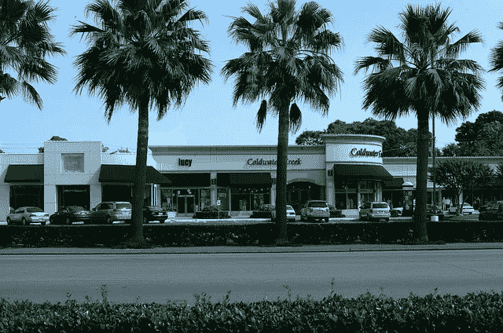

# 为你的特许经营事业寻找一个位置，位置，位置

> 原文：<https://medium.com/hackernoon/finding-a-location-location-location-for-your-franchise-business-df5dd037a3c7>

比方说，你刚刚签署了特许经营合同，你准备好让你的新的零售特许经营权或食品特许经营权启动和运行。你已经在你的车上跑了数百英里，为那个完美的[特许经营地点](https://www.sba.gov/blogs/opening-second-franchise-location)做了一些初步检查……你心里已经有几个地方了。现在怎么办？

## **位置，位置…**

你(在某处)听说过“*位置、位置、位置*”对你的特许经营业务的成功有多重要。

当然，你也听说过类似于“特许经营是交钥匙生意；你所要做的就是每天早上‘转动钥匙’打开特许经营店的大门。

以上两种说法只有一种是正确的。是关于你的位置的。

如果你打算[成为需要商业空间的特许经营](https://www.thefranchiseking.com/the-franchise-king-website-and-blog-start-here)的所有者，比如零售特许经营或食品特许经营，你选择的位置*至关重要。你的成功(*或失败*)真的取决于它。*

这是一件好事，许多特许经营者有机会接触到你所在地区的商业房地产专业人士…或者他们会在你签署特许经营合同后不久。

## **特许人在获得位置方面的作用**

在大多数情况下，特许人会帮你找到新企业的位置，甚至会帮你进行租赁谈判。特许人可能已经经历过几次了，所以他们知道你应该在租约中寻找什么，应该能够帮助你做一些微调。

商业租赁是非常复杂的文件。你用来检查 FDD 的特许律师也许能帮助你完成租赁。很多租赁条款都是可以商量的，但是你要知道哪些是可以商量的。这也是你身边有一个称职律师的原因之一。

摘自美国运通的[公开论坛*:](https://www.openforum.com/articles/tips-for-negotiating-with-a-potential-landlord-1/)

“从表面上看，租用办公场所似乎没有太多商量的余地。你在自己的价格范围内寻找租金，与房东或经理一起参观房产，并签订一份广告金额的租约。

这位作家接着说:

然而，事实是，即使你在和一家不能就价格进行谈判的管理公司谈判，也有很多机会让你的租约成为一份更公平的合同。从你的房租到底涵盖了多少费用，到房东愿意为你准备多远的房子，你都有机会就租约的每一步进行协商。

## **谁决定**

特许经营商根据车辆流量、该地区的客流量和人口统计数据等因素来推荐店铺位置。他们可以获得报告，帮助他们决定你选择的地点，或者他们建议的地点，是否有潜力成为一个好地点。

几乎在每种情况下，双方都必须就地点的选择达成一致。例如，如果特许人不认为你心目中的位置会是一个好的，他们会告诉你。另一方面，如果他们认为你的新特许经营的地点不合适，你可以反对。

有时候，归结到成本上；我的客户拒绝了特许经营商建议的地点，因为在他们看来，租金“太高了”。在这种情况下，我的客户回到绘图板，并提出了替代位置。受许人和特许人之间可能会有一个真正的来回过程，但这是必要的。

因为在一天结束时，双方都希望确保该位置将是一个成功的位置。寻找一个好的特许经营地点的过程可能会比你预期的时间长一点，但这是值得的。

与你的特许人密切合作；他们真的希望你赢。

*非美国政府链接

(*我是* [*专营权王*](https://www.thefranchiseking.com) *，乔尔·利巴瓦。我是《成为特许经营者》一书的作者我教人们用* ***聪明的*** *方式去选择、研究和购买特许经营权*。我最初是为美国小企业管理局写的这篇文章。[*https://www . SBA . gov/blogs/finding-location-your-franchise-business*](https://www.sba.gov/blogs/finding-location-your-franchise-business)*。经许可使用。)*