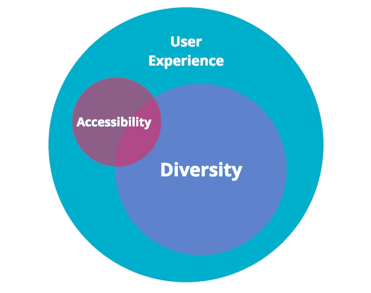

# 在科技会议中为网站的可访问性找到一个位置

> 原文：<https://medium.com/hackernoon/finding-a-place-for-website-accessibility-in-tech-conferences-4b1d2d4e2371>

## 无障碍会谈属于哪里？发展，多样性，还是 UX 轨道？靠自己？这么多曲目选择，这么少的时间。

An endless sea of red chairs in a conference room. Credit: [Christian Fregnan](https://unsplash.com/photos/WTWvcuIpm1c?utm_source=unsplash&utm_medium=referral&utm_content=creditCopyText) on [Unsplash](https://unsplash.com/search/photos/conference?utm_source=unsplash&utm_medium=referral&utm_content=creditCopyText).

现在寒假结束了，雪开始融化，我们发现自己正处于一个新季节的开始。不，不是春天，而是科技大会季。每年的这个时候，我通常会向一些会议提交一些演讲，耐心地等待决定的回音，这样我就可以想出如何神奇地扩展我有限的预算。

在协调工作和家庭、旅行日程以及实际撰写/练习演讲之间，提交演讲这个简单的行为应该是容易的部分。但每次我向科技会议提交报告时，我都会停顿一下。这个网站易访问性的话题适合放在什么轨道下？发展？[用户体验](https://hackernoon.com/tagged/user-experience)？多样性？离岛(又名杂)？我选择“软科学”类别是因为这个演讲可能更容易被接受，还是我选择更专业的东西来接触更广泛的听众？有时候答案是显而易见的，但往往不是。

This user of your website has no mouse and is in a low-light environment. Can he still use your website? Credit: [Avi Richards](https://unsplash.com/photos/Z3ownETsdNQ?utm_source=unsplash&utm_medium=referral&utm_content=creditCopyText) on [Unsplash](https://unsplash.com/search/photos/computer?utm_source=unsplash&utm_medium=referral&utm_content=creditCopyText).

## 可访问性 vs 多样性 vs 用户体验

因此，让我们稍微后退一步，回顾一下术语*可访问性*、*多样性*和*用户体验*。在科技会议上，这些话题有时会被混为一谈，但研究人员将它们视为三个独立但同等重要的研究领域。

根据维基百科，[可访问性](https://en.wikipedia.org/wiki/Accessibility):

> 指为残障人士设计的产品、设备、服务或环境。可访问性与通用设计密切相关，通用设计是一种创造产品的过程，这种产品可供具有尽可能多的能力的人在尽可能多的情况下使用。这是关于让所有人(无论他们是否有残疾)都能使用的东西。

而[用户体验](https://en.wikipedia.org/wiki/User_experience)广义定义为:

> 一个人对使用特定产品、系统或服务的情绪和态度。此外，它还包括一个人对系统方面的看法，如实用性、易用性和效率。用户体验是动态的，因为随着时间的推移，用户体验会因使用环境的变化、单个系统的变化以及更广泛的使用环境而不断变化。最终用户体验是关于用户如何与产品互动和体验产品。

查找术语[多样性](https://en.wikipedia.org/wiki/Diversity)是一项复杂得多的工作。维基百科给了你大约 50 个不同的子类别供你选择！如果我们看看我们能对*一词*多样性的最广泛的定义，我们可以从[韦氏词典](https://www.merriam-webster.com/dictionary/diversity)得到这个定义:

> 具有不同元素或由不同元素组成的状态:多样性；尤其是:一个团体或组织中不同类型的人(如不同种族或文化的人)的融合。

我意识到，仅仅阅读这三个复杂主题的有限定义，就好比向一个两岁的孩子解释阿尔伯特·爱因斯坦的相对论。但我想说的简单一点是，在所有三个研究领域中——可访问性、多样性、用户体验，它们之间的共同点是人。

One way to image the three concepts of Accessibility, Diversity, and UX working symbiotically together.

从广义上来说，我倾向于将*可访问性*视为*多样性*的重叠子集，都在*用户体验*的保护伞下。有许多理论和更聪明的人可能会有不同的说法，但无论你怎么看，它都归结于用户。

如果我们具体谈论技术，这种共性可以被重新定义为:人们如何创造技术……人们如何使用技术……人们如何因技术而互动、成长和改变。最终，如果你必须限制可以使用它的人，那这项技术真的有什么用？

The universe is nebulous and so is the topic of website accessibility. Credit: [NASA](https://unsplash.com/photos/vltMzn0jqsA?utm_source=unsplash&utm_medium=referral&utm_content=creditCopyText) on [Unsplash](https://unsplash.com/search/photos/universe?utm_source=unsplash&utm_medium=referral&utm_content=creditCopyText).

## 对许多人来说，网站的可访问性是模糊的

在这个时候，*多样性*和*用户体验*已经被广泛接受(尽管并不总是付诸实践),并且是我们许多技术社区的人都熟悉的主题，至少在非学术意义上。即使在小型科技会议上，他们也经常有自己的曲目。但是我仍然觉得对于会议组织者和参与者来说，网站的可访问性有点模糊，他们不知道该怎么做。

不相信我？以下是我在通用技术会议上经常听到的一段典型对话:

> 嗨，凯莉，很高兴见到你！你是做什么的？
> **我**:也很高兴见到你 PersonX！我主要是一名前端开发人员，专注于可访问性。哦，你是说像盲人用的屏幕阅读器。
> **Me** :嗯，还不止这些……【PersonX 中断】
> **PersonX** :哦，对了，我也知道聋人视频字幕。
> **我**:嗯，有很多…【PersonX 再次打断】
> **PersonX** :是啊，有一次我去参加一个讲座，他们提到了检查网站颜色，但是我不是设计师所以没怎么注意。我也不是设计师，但这确实是让你的网站更易访问的重要一步。我们都必须共同努力实现这一目标。
> 【停顿，眨眼，尴尬】
> **PersonX** :嘿，聊天很愉快。晚会后见。
> **我**:当然…【插入:哭丧脸】

新闻快讯 PersonX:无障碍不仅仅是为残疾人服务的！

我一直使用视频字幕，但我不是聋人社区的一员。我认识一些拒绝使用鼠标的人，但是他们没有任何行动不便的问题。我的一个程序员朋友喜欢用 VoiceOver 快速[阅读文档](https://www.apple.com/voiceover/info/guide/_1128.html)，虽然他不是盲人。

这三项技术——视频字幕、键盘导航、屏幕阅读器——显然可以让残疾人受益，但它们也可以让许多没有被识别为有残疾的人受益。那么，为什么当我们谈论和思考无障碍技术时，我们是用这么狭隘的视角来做的呢？为什么技术中的可访问性被看作是“他们”而不是“我们”——我们不是都从技术进步中受益吗？

I love this thought/thread. [Sara Tabor](https://twitter.com/OneHotProcessor) calling it like it should be.

部分解决方案是重新思考我们对待设计和开发的方式，以及如何在会议上讨论这些话题。网站的可访问性应该是让一些东西变得有价值，而不仅仅是让尽可能多的人可以访问。

当我们像对待*多样性*和*用户体验*一样，认为*网站可访问性*是开发过程中必不可少的组成部分时，向技术会议提交报告将会容易得多。与此同时，你可以发现我尝试了所有不同的轨道，直到无障碍有自己的一个。

*❤如果你喜欢这篇文章，请点击“鼓掌”图标(次数不限)，在社交媒体上分享这个故事，并关注我的* [*Medium*](/@cariefisher/) *或*[*Twitter*](https://twitter.com/cariefisher)*。谢谢大家！❤*