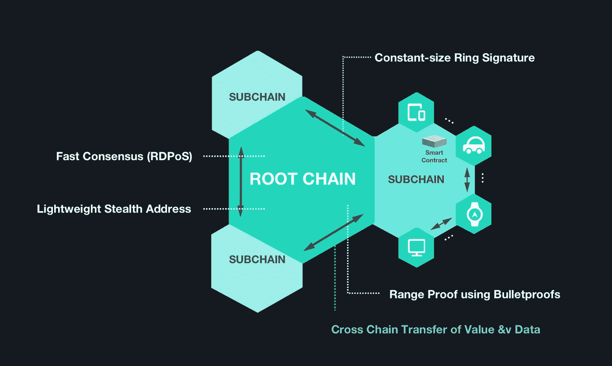

# 在熊市中寻找蜂蜜:为什么我在 IoTeX 上押下重注，IoTeX 是物联网区块链的终极解决方案

> 原文：<https://medium.com/hackernoon/finding-honey-in-a-bear-market-why-im-betting-big-on-iotex-the-ultimate-iot-blockchain-solution-205c5e9c5697>

如果你从年初就开始关注我，你会知道我现在很开心。我还没有真正感受到熊市，我的投资组合比年初时大了很多。在牛市和熊市中赚钱的关键是知道把钱投到哪里(并注意以前的文章，如[这篇](https://hackernoon.com/looking-back-looking-forward-looking-laterally-a-3-part-crypto-industry-overview-part-one-c67b5b4c3350)文章)。自去年 12 月以来，我一直在间接“做空”BTC，但我是通过投资具有良好短期和长期潜力的鲜为人知的项目来做的，而不是在 BitMEX 上冒险进行短期交易或投资于任何炒作的 ICO。有问题的剧目有《黑客帝国》、《火币》和《融合》,它们都表现很好。这就引出了我的下一个话题……IoTeX。

在评估一个项目时，我喜欢称之为**“完美区块链的五大支柱”。**我只投资平台，不投资 dApps，而且我只投资那些在遇到以下问题时表现良好的项目:

1.  *它是否适合去中心化？*
2.  *是否快速、可扩展、可伸缩？*
3.  *它有竞争对手吗？与他们相比如何？*
4.  *团队有足够的能力开发他们提议的东西吗？*
5.  *团队是否有足够的能力来促进大规模采用？*

**IoTeX 在各方面的得分都很高。**

# 什么是 IoTeX？

IoTeX 自称是面向物联网的下一代区块链平台。孵化物联网应用和生态系统具有巨大的**可扩展性、隐私性、互操作性**和开发便利性，简单的总结方法是将 Monero、IOTA(没有错误的纠结)和以太坊结合起来。

当我在 2 月份第一次评估这个项目时，我的第一个想法是“为什么物联网解决方案需要隐私？”——我相信这也是许多读者的第一个问题，因为最近隐私已经成为一个时髦词汇。经过一番思考，我意识到，实际上，在物联网环境中，一些隐私是绝对必要的——一切都被连接并不意味着所有人都必须知道一切。个人、机器和企业都想利用网络，但与此同时，出于个人和职业原因，他们都拥有保持隐私所需的数据。

IoTeX 和类似平台的主要区别之一是，除了核心链(他们称之为“根链”)之外，它还利用了“侧链”。该团队聪明地认识到，对于像物联网这样大的东西，所有的应用程序都不能在单个区块链上运行，因为每个应用程序都有不同的需求。例如，在某些情况下，完全开放是理想的，因此这样的侧链可以存在于隐私不重要的地方，一个只在两个链之间中继事务的链不需要图灵完全性，等等。下面可以看到根链和侧链之间的区别。

就可伸缩性而言，该平台与我跟踪的另一个项目 MATRIX 有相似的想法。IoTeX 设计了一个 RDPoS 系统，在该系统中，21-50 名代表被投票选举产生一定时间长度或“时期”的区块。这使得**的可伸缩性和速度**类似于类似 **EOS** 的**，但是**允许**近乎完美的**去中心化**类似于**以太坊**。**

这个平台需要解决的问题太多了，我不想因为深入研究技术而让这篇文章太长——请参考白皮书了解更多信息。

# IoTeX 团队

A list of some of the companies the IoTeX team has worked for

IoTeX 团队是全球最好的团队之一。我自信地说。他们不仅在技术上很聪明，而且在商业上也很聪明，从他们迄今为止的运作方式可以清楚地看出这一点。由于需求非常高，他们选择只进行不含 ICO 的私人销售，但他们举办了慈善活动，允许普通投资者通过捐赠给慈善机构，以私人销售价格获得一些 IoTeX 这真是一个经典之举。

他们由拥有多年 S 级公司工作经验的工程师组成，如脸书、谷歌、优步、英特尔、麻省理工学院、斯坦福大学等等。

# 谁投资了 IoTeX？

正如我提到的，由于机构的巨大兴趣，IoTeX 只举行了一次私人销售，没有 ICO。投资 IoTeX 的两个最著名的机构是 **NEO Capital** 和**Draper Capital**——这两个名字是不言自明的。他们也得到了来自硅谷的巨头和更多传统公司的投资，如 ZMT 资本、策源资本和浩帆资本。

# **路线图**

在撰写本文时，IoTeX 已经按时完成了路线图的所有里程碑。他们最近发布了一个测试网预览，可以在这里观看，因为它是由一个开发者用简单的术语解释的。在接下来的一个月中，他们将增加更多的功能，包括他们改进的环签名实现，一个创新的 RDPoS 系统黄皮书，以及一个面向公众的完整测试网版本。

10 月，mainnet 发布了子链互操作性，第一个 dApp 最早将于 11 月推出。

# 令牌度量

令牌指标非常出色。24%的代币在私人销售期间售出，但为了防止倾销，它们将在 12 个月内逐步释放——每个季度将释放 6%。

这意味着，目前的流通资金有 6%来自私人销售，2%来自慈善和奖金计划，这是一个 **800，000，000 的流通供应量**，在撰写**2500 万美元的市值**时，我个人认为这对这个项目来说是非常低的，**个人认为它在 5 亿美元到 12 亿美元**之间，我毫不怀疑一旦币安上市，这个数字将会很快达到*。*

# *去哪里买*

*到目前为止，如果你觉得 FOMO 是文章的中间部分，你会注意到这个项目还没有上线。这就是我向你们展示这个项目的时间。可以在 idex、Gate.io、Kucoin 上购买 IOTX。IoTeX 还赢得了 HADAX 上的“超级节点投票”,因此现在随时都会在那里上市，这使它可以直接通往 Huobi Pro。*

*对我来说，这既是一个短期游戏，也是一个长期游戏。从短期来看，一些知名的有影响力的人已经向我表达了类似的情绪，并且正在积累；从长期来看，随着开发的继续，合作伙伴的签署，以及消息的进一步传出，这种情况将会持续下去。好的物联网项目可以走多远没有限制。*

**我的推特粉丝总是第一个知道我的最新选择，所以* [*关注我的推特*](http://twitter.com/cryptweeter) *保持领先。**