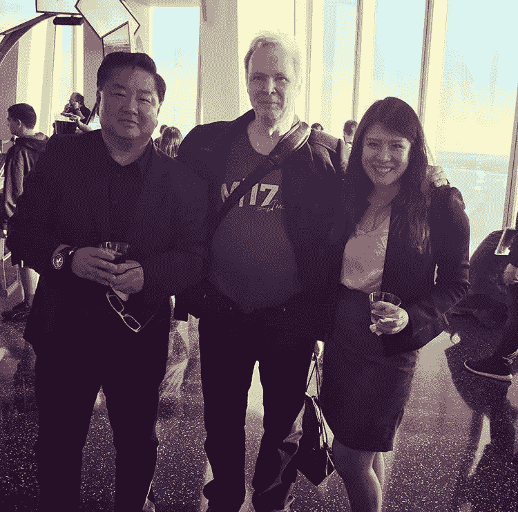

# 寻找我的道路:模糊 PM 和 VC 之间的界限

> 原文：<https://medium.com/hackernoon/finding-my-path-blurring-the-lines-between-pm-and-vc-73e11c2add0e>

这篇文章与我通常为 [AWIP](http://www.advancingwomeninproduct.org) 撰写的关于产品管理的技能型文章略有不同，更多的是关于我的职业哲学——我们不能再把人放在整洁的盒子里。没有人*只是*一个项目经理，或者*只是*一个工程师……我们是艺术家、企业家、活动家……同理，我既是项目经理也是风投。

# 非常规的职业生涯开端

与我指导的产品管理领域的 AWIP 成员相比，我在产品管理领域的起步在很大程度上是没有计划的。事实上，我在华盛顿特区政府开始了我的科技职业生涯，并有了千载难逢的机会参加白宫的医疗保健战略会议，参与 healthdata.gov 这样的酷项目，并与传奇医疗保健企业家一起工作，如[托德·帕克](https://www.linkedin.com/in/todd-park-3232573/)(时任 HHS 首席技术官)，帮助建立第一批 [HHS 创新研究员](https://www.hhs.gov/idealab/2012/09/06/new-innovation-opportunity-announced-hhs-innovation-fellows-program/)项目。

直到一次偶然的对话，通过一位宾夕法尼亚大学的同学，我才第一次了解到产品管理，她作为 APM 加入了谷歌。此时，我已经离开政府部门，进入管理咨询行业，在那里我领导情报机构的系统集成/实施工作。

> 我真的很喜欢我作为一名技术顾问所做的工作(例如，需求收集、与客户一起制定流程图，以及向客户展示路线图)，并且希望有机会全职从事这项工作(而不是局限于一个利用率模型— *其他顾问，你知道该怎么做)。*

# **产品@谷歌**

我的第一份真正的产品工作是在谷歌，当时我是谷歌光纤网络基础设施团队的项目经理。我们的团队负责确保 ISP 网络的健康，包括所有网络盒和电视盒，它们是向消费者和企业提供光纤互联网和电视服务的关键组件。我喜欢研究在各种光纤城域网(包括堪萨斯城、亚特兰大、盐湖城、奥斯汀)中自动部署光纤环的方法，以及设计不同的策略来确保积极的客户体验(例如根据网络中断发生的位置跟踪和安排技术人员，以及主动网络监控和故障排除)。

他们对谷歌的评价非常正确——与我共事的团队中的每个人都非常优秀，包括我自己的经理和主管(他是最初谷歌文件系统团队的成员)。(*边注:如果你在谷歌找工作，请查看我专门写的关于他们面试过程的* [*博客*](/@nancyzwang/cracking-the-google-pm-interview-a0f6077c7389) *。*)我很幸运在谷歌开始了我的项目经理职业生涯(在我看来，它仍然是我迄今为止见过的最好的项目经理入职培训之一)，我仍然利用我在谷歌学到的许多产品设计和客户至上的原则。

当我在谷歌的第二年到来的时候，我决定更仔细地观察一下创业的世界，并做出了我职业生涯中最艰难的决定之一——离开谷歌。

# 走向未知

面对父母善意的惊讶，我决定离开谷歌，去追求创业和投资。虽然谷歌无疑是我科技生涯的发射台，但我已经做出了机不可失的决定(在额外简历的诱惑让我更难做出决定之前)。因此，我离开了谷歌，加入了风险投资界，在加州科技风险投资公司(California Technology Ventures)领导 B2B 企业软件投资，这是一家总部位于阳光明媚的南加州的 2 . 5 亿美元基金。

我花了一生的时间每个月会见数百名创始人，用所有前沿技术中最优秀和最聪明的知识填充我的大脑(例如，区块链、GPU 数据库、不同垂直行业的机器学习应用等等)，并参加投资组合董事会会议，在会上我能够带来我以前的产品经验并影响关键的执行决策。

在我做全职风投的时候，我有幸为我的投资组合公司 [MariaDB](https://mariadb.org/) (流行的 MySQL 的开源版本和分支)执行了 C 轮融资，并在 [GameVice](https://gamevice.com/) (由 Occulus 的早期团队创建)中执行了 A 轮融资，并带着对创始人的更多尊重离开了——他们不仅致力于改变世界，还做着让团队在所有挑战中保持动力的不可能的工作。

Meeting my ultimate nerd crush (center), **@**[**Michael (“Monty”) Widenius**](https://en.wikipedia.org/wiki/Michael_Widenius), the founder of MySQL and my portfolio company, MariaDB. *Fun fact: did you know that MySQL, MariaDB, and MaxDB are all named after his children?*

# 开始我的激情

我遇到的一个一致的主题，无论是作为谷歌或 Rubrik 的项目经理，还是作为专注于企业软件初创公司的风投，都是一个一致的问题，即缺乏女性榜样供我参考。尽管我毫不犹豫地加入了深入基础设施领域的 Rubrik，成为其第一位女性项目经理，但我清楚地知道，我想改变现状——成为一名技术项目经理/风险投资家是女性擅长的事情，应该给予她们更多的机会来超越自己。

The Advancing Women in Product (AWIP) logo in honor of Pride.

因此,“在产品中提升女性地位”( AWIP)诞生了……直到今天，我为我建立的团队和我们作为一个团队能够完成的计划感到无比自豪。从数量上来看，我们的社区已经发展到 3000 多个(成员远在 APAC 和法国)，迄今为止已经与超过 25 家初创公司合作举办我们的活动。成千上万的人参加了我们的集体简历研讨会、针对现任/高级项目经理的技能研讨会以及高管项目经理辅导课程——我们迫不及待地期待接下来会发生什么:西雅图、DC 和波士顿的分会，以及与风投和商学院的新合作关系，如旧金山的沃顿商学院。没有我们出色的志愿者团队，没有我们宝贵的产品负责人作为我们宝贵的顾问，AWIP 就不可能实现。

# 找到我的最佳状态

尽管我作为一名全职风险投资人过得很开心，但我真的很怀念在一家公司工作的忙碌和执行节奏。因此，当我在 Rubrik(领导我们的核心产品线和我们新的隐形 SaaS 产品的组合部分)遇到项目经理的机会时，我毫不犹豫地抓住了这个机会。自去年作为第一位女性项目经理加入 Rubrik 以来，我获得了职业生涯中的教育和领导经验——一方面，与 Rubrik 的全明星联合创始团队一起制定关键产品战略，另一方面，推销我们的产品，并从财富 500 强高管那里收集用户洞察。

对我来说，回到产品并不意味着离开 VC；我喜欢在两者之间保持良好的平衡:我继续指导初创公司，要么是通过我在风险投资界的朋友推荐，要么是通过[炼金术士加速器](https://alchemistaccelerator.com/)正式指导，我正在积极寻求扩大我的天使投资组合。此外，AWIP 将于今年秋天推出一项围绕女性创始人的绝密但超级令人兴奋的计划。简而言之，我发现，从组合产品——VC 镜头看问题，给了我更全面、360 度的视角。

# 最后

我绝对不是说你应该在这之后塑造你的职业生涯，因为从我的许多职业转换中，我知道在这一点上没有正确的职业道路——每个人都以自己的速度找到自己的方式。然而，以下是我一路走来发现的一些职业碎屑:

## 克拉姆#1:冒险&永远不要拒绝你感兴趣的机会

## 克拉姆#2:沿途寻找赞助商和导师

## 第三点:当你年轻的时候，不要为了金钱或报酬而优化

## 克拉姆#4:永远不要停止学习:你的价值来自你的智力资本

展望未来，我希望我的产品和风险投资事业能够并行发展，我也对 2018 年和 2019 年将为 AWIP 带来的东西感到非常兴奋。因为我没有强大的女性产品或风险投资导师，我想创建一个组织，培养下一代成功的女性榜样。

如果你正在阅读这篇文章，并且正在考虑向产品转型(也许是从风投那里？)或如何增强您的产品，请访问我们的:[www.advancingwomeninproduct.org](http://www.advancingwomeninproduct.org)或我们的[脸书页面](https://www.facebook.com/groups/awipInfo/about/)了解即将举办的活动的信息。