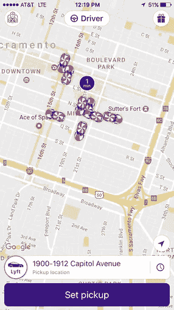

# 寻找拼车乘客:去别人不去的地方

> 原文：<https://medium.com/hackernoon/finding-rideshare-passengers-go-where-others-arent-714aea71effb>

根据你所在的拼车市场，成为一名优步或 T2 的 Lyft 司机似乎是显而易见的。

> **“我住在一个大城市/半大城市，找乘客没问题！”—** 各地的每一位新优步和 Lyft 司机

当你第一次成为优步或 Lyft 的司机时，你可能会禁不住诱惑，在城市里跑来跑去，尽可能多地搭车。虽然这种方法在某些市场可能行得通，但从长远来看，它肯定不是最聪明或最有效的策略。如下图所示，每个人都有这种好色的方式。

通过这种拼车驾驶策略，你可以减少每加仑的行驶里程，显著增加车辆的磨损，而且在萨克拉门托这样的城市，你的支出不会那么大。

**未开发和未得到充分服务的领域**
少开车赚更多钱的第一步是认识到你在经营一家企业，你需要具体的目标和目的。你必须强迫自己超越竞争对手，利用他们的缺点。

对于拼车司机来说，这意味着寻找尚未开发和服务不足的领域，研究你的市场并制定战略性的驾驶业务计划，减少对票价的担心，专注于高质量的旅行。

# 这里列出了 10 个通常没有优步或 Lyft 司机出没的地方，它们可以增加你找到的优质旅行和乘客的数量。

**美国国家铁路客运公司&灰狗车站**

大多数大城市都有美国国家铁路客运公司和灰狗站，或者至少附近有一个。除了机场乘车之外，这些都是下一个最好的票价，往往会带来有利可图的进出城市的旅行。

你应该查看一下美国国家铁路客运公司和灰狗的时刻表，找出到达当地车站的主要列车的列表，并把它藏在某个地方。会有另一个帖子与此相关，但现在，记下到达的人，当你发现自己对优步和 Lyft 度过了一个缓慢的夜晚时，拿出来，看看是否值得前往车站。

**县监狱**

这可能是一个有争议或危险的建议，但我袖手旁观它。毕竟，每个人都会犯错。此外，同一个人可以赶上和优步和 Lyft 骑在街上，很多时候，司机会不知道他们刚刚出狱。

因为你面对的是一个县监狱，你的潜在客户群呈指数级增长。例如，在阿拉米达县(湾区——人口 160 万)，2016 年有 [543 起酒后驾车](https://data.acgov.org/Public-Safety/Alameda-County-Sheriff-Crime-Reports/8khs-56kk/data)。阿拉米达县有 821 平方英里，所以您可以享受优惠票价。游览这些地方的最佳时间是周六和周日早上，因为大多数人会在周五和周六晚上聚会。

**商场或大型购物区**

购物中心总是寻找优步和 Lyft 乘客的好地方。位于加利福尼亚州普莱森顿的[斯通里奇购物中心](http://www.simon.com/mall/stoneridge-shopping-center)，在 10 英里范围内有超过 [575，000 人](http://www.spgroup.com/MarketingPkg.aspx?BLDGID=7851)，坐落在受欢迎的 580/680 交汇处。距离利弗莫尔仅 5 英里的地方是[旧金山名品折扣店](http://www.premiumoutlets.com/outlet/san-francisco)，这是加州最大的折扣店[和美国第九大折扣店](http://icsc.org/vrn/uploads/2015_VRN_State_of_the_Outlet_Industry_story.pdf)，总租赁面积(GLA)为 700，000 平方英尺，拥有 170 多家店铺。

**扩展事件**

延长活动可以是一个很大的收入来源，因为它们在一段较长的时间内为你提供稳定的票价流，而且你知道确切的时间。像马戏团、戏剧表演、节日特辑、受欢迎的博物馆展览等活动。

在萨克拉门托，加州博览会上的全球冬季仙境是美国最大的节日灯展之一，从 11 月 19 日持续到 1 月 8 日。这是优步和 Lyft 收入的一个好来源，因为它更容易预测，因为它不在市中心。虽然它有一个巨大的停车场($$)，但通常更便宜(也更快！)供人们进出优步或 Lyft。

**二级场馆**

我说的次要场馆是指那些容纳了大量观众的地方，而不是你所在城市的主要活动目的地。很多时候，这些场馆会在同一时间举行活动，如果你足够幸运，它们彼此之间足够近，你会得到一个覆盖这两个地区的激增。因此，当所有其他司机都在篮球区接人时，你却在几个街区之外接人，这些人是从会议中心活动中溢出来的。

**主要酒店**

每次你走进一家大酒店，你都会看到一排传统的出租车，这是有原因的。酒店对优步和莱夫特的司机来说很棒，因为他们经常保证让你去机场，他们在他们的会议场所举办大型活动，有些甚至有很受欢迎的酒吧，即使他们不是酒店客人，人们也可以在那里喝酒。

**“恐怖”社区**

这可能是另一个有争议的问题，但我相信，如果你有基本的情境意识，在一个大城市生活或度过任何时间，以及简单的常识，你会赚很多钱。

这个城市的大部分地区可以被认为是“坏的”，或者是你不应该去的地方，但我并不真的相信。对我来说，与其说它是一种风险，不如说它是一个帮助他人的机会。这些地区的公共交通系统往往有限或破损，使得许多人不得不长途跋涉。

您可以在这些地区帮助很多人，尤其是如果他们被定义为[食物沙漠](http://americannutritionassociation.org/newsletter/usda-defines-food-deserts)，一个不容易获得新鲜水果和蔬菜的城市地区。这些地区有许多酒类和街角商店，但没有大型连锁杂货店或超市。

美国农业部[发现](https://www.ers.usda.gov/webdocs/publications/ap036/12715_ap036_reportsummary_1_.pdf)“在美国所有的家庭中，有 230 万，即 2.2%，居住在离超市一英里以上的地方，并且没有交通工具。另有 340 万个家庭，即所有家庭的 3.2%，居住在半英里到 1 英里之间，并且没有交通工具。”

当然，如果您只是坐在这些街区等车费，您会遇到一些危险的情况。你不想让别人认为你是警察或者你在监视他们的地盘。如果您不熟悉这个地区，那就从白天收费开始，看看情况如何。在你熟悉了这片土地后，试着在傍晚或夜晚开车，看看潜水前是什么样子。

**城郊城市**

离开这个城市总是好的。如果你观察周围的郊区，你经常可以得到可观的票价，带人们进出市区。像利弗莫尔这样的城镇(如上所述)可能是金矿。它有超过 85，000 名相对富裕的居民，大部分酒吧位于一条主要街道上，使得周五或周六晚上成为金矿。更重要的是，利弗莫尔有一个名声(以及支持这个名声的统计数据)，那就是如果你喝酒，进了你的车，你很可能会酒后驾车。

**大专院校**

学院和大学是搭车的好地方，尤其是如果大学是通勤学校，比如旧金山州立大学。如果年轻、精通技术的学生急着去上班或赴约，他们会更热衷于选择优步或 Lyft。午餐和夜晚通常是寻找乘客的最佳时间，如果下雨的话也是如此。

**主要公司所在地**

在高峰时间去这些地方，你会很容易找到票价。研究大城市以外的公司，越“高科技”的公司越好。

例如，福尔松的英特尔公司位于萨克拉门托外 25 英里处。许多员工住在福斯罗姆，但也有很多人去萨克拉门托或附近的富裕城镇埃尔多拉多山。

如果你对拼车驾驶持观望态度，而这篇文章对你有所帮助，那么考虑使用这些推荐链接报名参加[优步](http://go.ridesharehacker.com/Uber) & [Lyft](http://go.ridesharehacker.com/Lyft) 的驾驶。我很乐意回答评论中的任何问题！