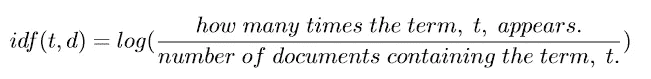

# 使用 NLP & TF-IDF 查找最重要的句子

> 原文：<https://medium.com/hackernoon/finding-the-most-important-sentences-using-nlp-tf-idf-3065028897a3>


Photo by [Pankaj Patel](https://unsplash.com/photos/yEAOfWSdzgM?utm_source=unsplash&utm_medium=referral&utm_content=creditCopyText) on [Unsplash](https://unsplash.com/search/photos/coding?utm_source=unsplash&utm_medium=referral&utm_content=creditCopyText)

我们将使用词频—逆文档频率(TF-IDF)来查找 BBC 新闻文章中最重要的句子。然后我们将把这个算法实现到一个快速简单的 Firefox 扩展中。

单击此处查看本文的更新版本:

[](https://skerritt.blog/tfidf/) [## 使用 NLP & TF-IDF 查找最重要的句子

### 我们将创建 BBC 新闻文章的摘要，并使用 Firefox 扩展将它们放在顶部。这篇文章…

skerritt.blog](https://skerritt.blog/tfidf/) 

我们将创建 BBC 新闻文章的摘要，并使用 Firefox 扩展将它们放在顶部。本文是关于正则算法词频-逆文档频(TF-IDF)的。我们将以 Firefox 扩展的形式创建一个真实世界的用法。我知道你在想什么。“TF-IDF？裂开😴“不过萧然跟我在一起，倒是挺有意思的！

当我们完成时，它会看起来像这样:


News article found [here](https://www.bbc.co.uk/news/business-45289432). Red box highlights the most important sentences. The red box is not in the final product, is only used for illustration purposes.

# 术语频率*逆文档频率

别担心，算法的名字让我每次听到它大声说出来都会睡着。这个算法是两个算法相乘。让我们看看这两者是如何工作的:

## 检索词频率

词频(TF)是一个词在文档中出现的频率，除以有多少个词。


The Term Frequency (TF) of a term, t, and a document, d.

假设你正在阅读一篇关于英国退出欧盟的新闻。“英国退出欧盟”这个词会出现很多，所以“英国退出欧盟”这个词的出现频率很高。

很多时候，我们希望在术语旁边建立一个术语频率字典(hashmap)。比如 *{word:那个词的词频}* 然后迭代这个字典，找出哪个词出现的次数最多。

现在，如果我告诉你，术语频率字典看起来有点像这样:

```
{"and": 0.87, "the": 0.73}
```

你可以看到这些普通的英语单词对我们没有用。当然，大多数英语课本中都有这些单词，但是我们称这些英语单词为*停用词*。停用词通常指一种语言中最常见的词，尽管没有单一的定义。你必须根据用法选择停用词。你必须决定用什么词。在处理一些文本之前，您通常希望删除停用词，以便更好地处理文本。

有大写字母的单词和没有大写字母的单词是不同的。在编程中，“非洲”和“非洲”是两回事。因此，我们希望将所有内容都转换成小写或大写，以便更好地处理我们的文本。我们要把所有的单词都变成小写。

给定一个字符串，我们想删除停用词并将其转换成小写。我们的扩展将给我们一个 BBC 新闻文章的所有文本的字符串。先不要担心我们从哪里得到文本，这将在稍后的 Firefox 扩展部分完成。现在，假设我们有这样的文本:

```
... These are external links and will open in a new windowA neat feature of many modern laptops is the ability to power them up through the USB port. Unlike the rectangular USB ports of old, the newer type - USB-C - can carry enough power to charge your 
machine.That’s great news: it means ...
```

为了防止读者睡着，上面的文字被缩短了。

这是将“美化”我们的文档的功能。第 3 行是我在 [StackOverflow](https://stackoverflow.com/questions/5631422/stop-word-removal-in-javascript) 上找到的一组停用词。我添加了“*共享*和“*链接这些*”，因为这些是我们不想要的新闻文章中的常用词。

第 5 行是[正则表达式](https://developer.mozilla.org/en-US/docs/Web/JavaScript/Guide/Regular_Expressions)。方括号表示或。[,.]表示*“在逗号或句号处激活”*。/g 表示全局。一旦你找到一个*、*或*。”*不要停，继续搜索字符串。空字符串就是我们要替换的。如果我们发现一个句号或一个逗号，不用任何东西代替它——删除它。这是因为“非洲”这个词。如果没有这个，“非洲”会被归类为两个不同的词。


From my Instagram, [@Brandon.codes](https://www.instagram.com/brandon.codes/)

第 4 行将文档分割成单独的单词。 *map* 函数将函数应用于数组中的每个元素。一旦字符串被分割成单词数组，我们就对每个元素应用 *toLowerCase()* 方法。它让每个单词都变成小写。


From my Instagram, [@Brandon.codes](https://www.instagram.com/brandon.codes/). The arrows are [Arrow Functions](https://developer.mozilla.org/en-US/docs/Web/JavaScript/Reference/Functions/Arrow_functions) (Lambda / Anonymous functions).

一旦我们过滤掉停用的单词，我们就返回小写的单词。 *Filter()* 创建一个新数组，其中只包含函数返回 True 的元素。如果一个单词是一个停用词，它将得到 True，这意味着我们将得到一个新的仅包含文档中停用词的**数组。我们使用否定运算符“！”得到相反的结果，这正是我们想要的。返回没有停用词的单词列表。**

现在我们要计算每个单词在文档中出现的次数。这对术语频率和反向文档频率都很有用。首先，我们希望从一个单词数组中获取所有唯一的单词。

我们将数组转换成集合，因为集合没有重复。这让我们只能得到数组中唯一的字。集合也没有顺序，所以我们不能使用数组索引来访问元素。我们需要把它直接转换回数组。关于集合论的更多内容，请看我写的这篇文章。

好了，现在来数一个单词在单词数组中出现了多少次。

这个函数遍历每一个唯一的单词，并计算这个单词在单词数组中出现的次数。频率函数这个词挺长的，我就分解一下。

第 6 行将文档分成句子。有时句子前面有空格。“布兰登。狗。”在“狗”之前有空格我们将 [trim()](https://developer.mozilla.org/en-US/docs/Web/JavaScript/Reference/Global_Objects/String/Trim) 方法应用于每一项，以消除这些尾随的空白。

关于第 7 行，第一个单词的前 146 个字符是社交媒体链接。这个词的其余部分是标题或副标题。这里，看:

```
Share this withEmailFacebookMessengerMessengerTwitterPinterestWhatsAppLinkedInCopy this linkThese are external links and will open in a new window**Ryanair is tightening the rules on what passengers pay to take luggage onto the plane, in order to "speed up boarding".**
```

这很烦人，因为标题是故事必不可少的一部分，需要考虑进去。所以我们去掉第一个单词的前 146 个字符，得到:

```
Ryanair is tightening the rules on what passengers pay to take luggage onto the plane, in order to "speed up boarding"
```

还记得这个公式吗？


The Term Frequency (TF) of a term, t, and a document, d.

变量“ *TFVals* ”正在计算这个公式。如果我们运行句子“你好，我叫布兰登。布兰登布兰登。大象跳过月亮“通过项频率函数，我们会得到类似这样的东西:


TF only returns 1 “Brandon”, so not every Brandon has a TF score. For this example, bare in mind that TF only returns 1 Brandon because we are calculating the singular term (word) frequency.

我们有词频这个术语，但是我们想计算最重要的**句子**，而不是单词。为了做到这一点，我们仔细检查每一个句子，看看这个句子中出现了哪些单词，它们在 *TFVals* 中。


Remember earlier how I said we don’t count all 3 “Brandon”’s? I’ve done that now. Also, note that we’re splitting this up into sentences. There are 3 sentences in this image.

我们只需要把它们加起来，然后除以我们有多少单词。因为我们只是把非停用词的 TF 值相加，所以如果我们除以一个句子中有多少个非停用词，而不是句子中有多少个词，这才是公平的。如果不除以单词量，长句比短句更有优势。


The sentence with the highest TF is “Brandon Brandon.”

这就是下面第 20 行的内容。我们遍历每一个句子，计算每个句子的 TF 值，就像我们上面做的一样。

New code added starts at line 20

仅此而已。但是我们有一个问题，只用术语频率。正如你之前看到的，“Brandon Brandon”是我们看的所有三个句子中得分最高的 TF。

光有人气是不够的。我们不希望句子中包含最多的关键字，因为它们可能没有意义，或者它们可能是彼此的重复。如“布兰登”中的“布兰登”句。它的 TF 值很高，但内容不多。

它包含的信息不多，也没什么用。我们想要一个既罕见又独特的句子，并且包含文章中常见的关键词。这就是逆文档频率出现的原因。

## 逆文档频率

词频是一个词有多常见，逆文档频率(IDF)是一个词有多独特或罕见。IDF 的公式为:



t is the term and d is the documents. We have multiple documents, we’re treating each sentence as its own document.

IDF 使用了许多文档，而 TF 是为一个文档而构建的。你可以决定什么是文档。在本文中，每个句子都是它自己的文档。

IDF 的前几步和 TF 一样。我们美化文档，统计文档中的单词，并获得所有唯一的单词。

第 1–6 行并不新鲜。第 17 行的 for 循环遍历文档中的每个句子。因为每个句子都是一个新的“文档”，所以我们需要单独计算每个句子的字数。我们必须美化它们，去掉停用词，把它们变成一组单词。我们将每个新句子的单词计数对象推入*单词计数句子*。


There are 3 sentences here. We don’t care how many times Brandon appears over the whole document. I tried to pick the words to give you something interesting without making the maths too large, but in the process I developed narcissism.

我们现在将检查每个单词，并计算该单词在每个句子中出现的次数，然后使用下面的公式计算 IDF 得分。


I use log 10 here. Note: all logarithms are constantly [scaled](https://www.khanacademy.org/math/algebra2/exponential-and-logarithmic-functions/logarithmic-scale/v/logarithmic-scale), so it doesn’t matter much on what logarithm you use.


A small example of how IDF is used.

现在我们对每个不停的单词都这样做。


这个的代码是:

New code starts on line 25.

现在我们想得到所有句子的 IDF 值，我们在这里使用来自 TF 的相同代码，但是替换了一些东西来使它工作。

如果我实话实说，我做了一个简单的“查找和替换”变量。我把评论里的“TF”换成了 IDF。我把“ *TFVals* ”换成了“ *IDFVals* ”。这里没有发生什么重要的事情，所以可以跳过这一部分。

New code starts on line 38.


Now that we have written code to calculate the IDF value of sentences; we have completed the formula from earlier. “is a dog” has the highest IDF value.

我们现在知道一个句子是多么独特或罕见。这没什么用，因为我们也想让句子包含丰富的信息。我们希望有某种方式将 TF 的受欢迎程度与 IDF 的独特性结合起来。这将引导我们进入下一部分…

# TF-IDF 重访

“Are we done yet? Can I wake up now?” Yes, very nearly done! Gif from [Giphy](https://gph.is/1SI2P4W).

我们现在已经实现了 TF 和 IDF 功能。剩下唯一要做的就是将它们相乘。

对象 TF 和 IDF 都来自相同的数据，所以 TF 不会包含 IDF 中没有的内容。因此，我们可以遍历一个对象并使用同一个键。我们将 TFVals 中的值乘以 IDFVals 中的值。

我们的下一步是计算 TF-IDF 对象中最重要的 3 个句子。用几个 if 语句迭代对象的*【key，value】*可以很好地工作。

你会在底部看到我们返回格式化的字符串。我们把它格式化，这样当我们把它插入网页时，它看起来很漂亮。每个
是一个[换行符，](https://developer.mozilla.org/en-US/docs/Web/HTML/Element/br)是文本中的一个空格。黑点是项目符号。我们现在要在 Firefox 扩展中实现这个算法。🔥🦊

# 获取和更改 BBC 新闻文章中的文本

转到任意一篇 [BBC](https://www.bbc.co.uk/news) 新闻文章，右键单击并按“检查元素”。你会在屏幕底部看到一个漂亮的方框。使用左上角的元素选择器工具，将鼠标悬停在文章上。我们可以看到整篇文章都包含在一个 CSS 类“story-body”中。


如果我们进一步深入，我们可以看到文章中的所有实际文本都包含在这个 CSS 类中的段落标记中。


我们将使用 [JQuery](https://jquery.com/) 选择文本。

这一行选择 story-body 类中所有的 [< p >](https://developer.mozilla.org/en-US/docs/Web/HTML/Element/p) 标签。现在我们想要得到文本，我们通过应用方法*来实现。text()* 。

我们想把我们的文字添加到文章的顶部。JQuery 有一个名为 prepend 的方法，它允许我们将数据添加到对象的顶部。

我们完事了。我们现在可以识别 BBC 新闻文章中最重要的句子，并显示在顶部。只是时间把它变成一个延伸。

# Firefox 扩展基础

Firefox 扩展有两个主要部分。你写的 Javascript 和 *manifest.json* 文件告诉 Mozilla 你的扩展是做什么的。我们现在正在检查 *manifest.json* 。

*manifest_version* 告诉 Firefox 你正在使用哪个版本的清单。 *Name* 告诉 Firefox 你的扩展名是什么。*版本*告诉 Firefox 你的扩展是什么版本号。这三个是必须的。

*描述*告诉 Firefox 你的扩展是做什么的。

T21 告诉火狐当网址匹配你输入的内容时加载什么脚本。为了运行您指定的脚本，当前 URL 必须至少与您指定的一个 URL 匹配。您可以在这里使用两个特殊字符:

1.  " ***** "匹配零个或多个字符。在这个例子中，我不知道用户将加载 HTTP 还是 HTTPS，所以我让它一步加载两者。我也不知道用户会看哪篇文章，所以我把它设置为在任何文章上激活。

2.”**？**“恰好匹配一个字符。

Mozilla 开发者网络对此有一个很好的解释:

例如:`"*na?i"`将匹配`"illuminati"`和`"annunaki"`，但不匹配`"sagnarelli"`。

因为我们将使用 jQuery，所以在脚本执行之前，我们也将 jQuery JS 文件导入到网站中。你可以从[这里](https://code.jquery.com/jquery-3.3.1.slim.js)抓取 jQuery 文件。复制粘贴到一个名为*“jquery . js”*的文件中。

在 Firefox URL 中输入“ *about:debugging* ”来加载这个页面:


从这里，点击*“加载临时附件…”*，然后点击扩展中的任何文件。一旦你这样做了，你应该看到这个:


Mozilla 有一篇关于火狐扩展基础的好文章。

现在加载任何 [BBC 新闻](https://www.bbc.co.uk/news)文章来玩吧！

# 结论

您现在已经看到了 TF-IDF 的强大功能以及它的实际应用。我有这个想法是因为我有电子邮件焦虑症。我对阅读电子邮件感到非常紧张，所以我想要一个快速的摘要来平静我的思绪。唉，这是我第一次写 Javascript。我开始做一些比较容易的东西，比如 BBC 新闻文章。

如果你愿意的话，下面是一些改进这些代码的方法:

*   动态选择你想要的摘要中的句子数量。您可以在整篇文章中找到平均 TF*IDF 值，以及可以包含在摘要中的任何超过 X 的值。这使得长文章和短文章被同等对待。
*   扩展这一工作在任何其他网站上你想。

GitHub 回购在这里是。

## 你喜欢这篇文章吗？在社交媒体上与我联系，讨论所有与计算机科学相关的事情😁

[推特](https://twitter.com/brandon_skerrit)|[insta gram](http://instagram.com/brandon.codes)|[LinkedIn](https://www.linkedin.com/in/brandonls/)

我写这篇文章没有得到报酬。如果你想支持我或喜欢这篇文章，请随时给我买杯茶或下面的东西😍✨

[](https://www.paypal.me/brandonskerritt) [## 用贝宝支付布兰登·斯凯里特。我

### 去 paypal.me/BrandonSkerritt 输入金额。既然是 PayPal，那就简单又安全。没有 PayPal…

www.paypal.me](https://www.paypal.me/brandonskerritt) [](https://monzo.me/brandonskerritt) [## 通过 Monzo.me 即时支付 Brandon

### 点击链接向布兰登付款。你不需要创建一个账户，而且完全免费。

monzo.me](https://monzo.me/brandonskerritt)