# 用阿里巴巴的迪达 AI 助手寻找完美装备

> 原文：<https://medium.com/hackernoon/finding-the-perfect-outfit-with-alibabas-dida-ai-assistant-71ba7c9e8cfa>

*阿里巴巴科技团队如何利用深度学习帮助在线市场通过创建优质服装展示来推动强劲的业务成果*

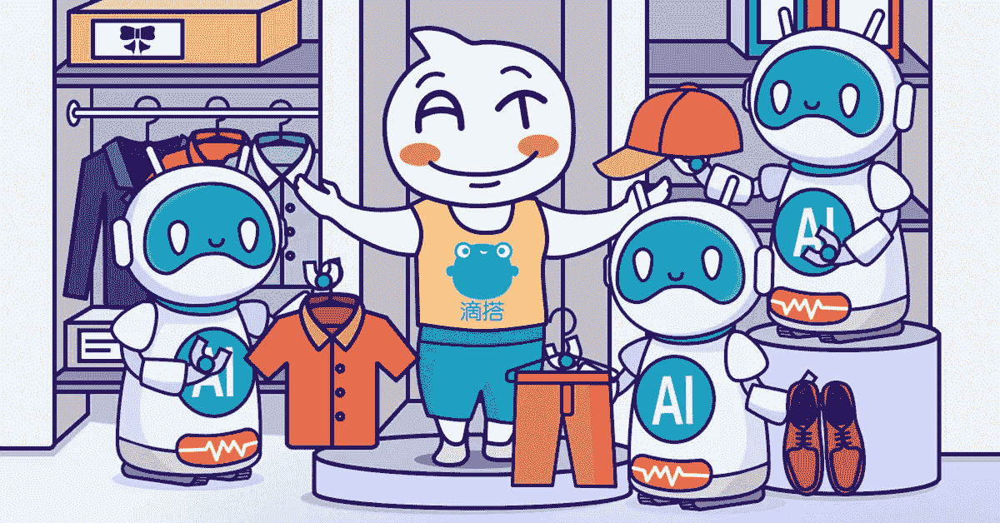

保持在线零售的成功是一场持续的斗争，需要零售商确定向客户展示产品的最佳方法。一种方法是为物品制作一张吸引人的海报，这在以前需要大量的人力。另一种方法是建议商品组合——尤其是衣服和配饰——以鼓励顾客额外购买。

阿里巴巴的迪达 AI 助手结合了这两种策略。

迪达是仿照阿里巴巴著名海报设计 AI 引擎鲁班。像鲁班一样，迪达使用图形算法来整理数据，并训练自己生成有针对性的高质量流行商品组合图像。虽然主要用于在线时尚零售的个性化服装组合，但 Dida 的用途现已扩展到其他领域，如产品描述的文案。

那么，迪达是怎么工作的呢？从技术上来说，迪达不是一个单一的实体，而是多个平台和算法的组合，包括前端操作、算法、图像拼接和个性化启动平台。首先，操作员在前端选择项目，并使用深度图像处理和组合算法指定要组合的项目。当一个或几个项目触发组合请求以创建组合时，Dida 会搜索符合特定操作规则的其他项目。接下来，基于来自触发和返回项目的信息生成描述性标题。

最后，这些项目被合成，并使用智能排版以视觉上令人愉悦的方式显示出来。然后生成商品组合的图像，进行个性化处理，并通过推荐算法推送给用户。

截至 2017 年 2 月，迪达的算法已经在阿里巴巴的各种电商平台上推出，包括淘宝和天猫。对于大型促销活动，Dida 帮助运营商为各种产品生成数百万种组合，成千上万的阿里巴巴设计专家使用它。阿里巴巴已经从其几个页面的试用中获得了积极的结果，包括 iFashion、手机淘宝 Primary Focus 和 YouHaoHuo。

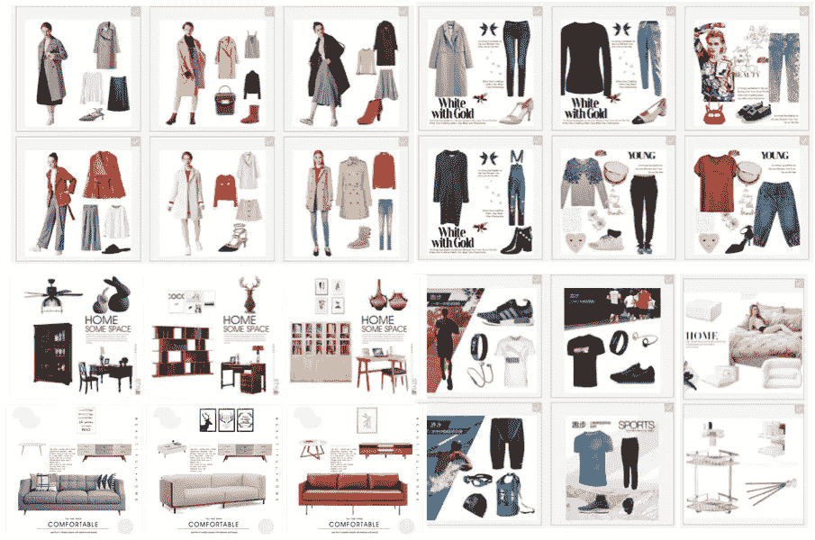

Images from a backend outfit display on Dida

下一节简要总结了使用 Dida 平台的三大好处，本文其余部分讨论了 Dida 平台的技术基础以及 iFashion、手机淘宝 Primary Focus 和 YouHaoHuo 的成功案例。

# 迪达的好处一言以蔽之

## 1.内容生产

Dida 利用深度学习网络整理来自用户、产品和运营知识的大量信息。当输入以帮助内容创建时，Dida AI 引擎的质量水平与经验丰富的设计专家相同。然后，由 Dida 生成的图形算法被应用于多个业务领域。

## 2.平台支持

Dida 将图形算法和平台建立相结合，允许操作员从 Dida 平台上选择商品，并在一站式管理流程中生成商品组合和个性化投放。

## 3.提高效率

一般的设计专家每天会制作成千上万的物品组合。Dida 平台每小时生成数百万个商品组合，这极大地提高了效率。Dida 还结合了算法，以扩大信息池的整体规模，并增强个性化。

# 迪达的技术基础

当用于在线时尚零售时，Dida 会生成服装组合和描述，这需要设计图形和文本算法框架。所有底层数据都是共享的，包括项目的图片和标题、操作输入数据以及各种其他信息。迪达利用这些信息生成服装，然后为每一件服装生成描述。

首先，图片组合算法使用卷积神经网络(CNN)来预处理图像。接下来，使用深度语义相似性模型(DSSM)运行两个组合逻辑算法:

-基于长短期记忆(LSTM)的测序装备生产。

-基于深度聚合网络(DAN)的非测序装备生产。

生成的服装被导入到上下文感知指针生成器网络(CPGN)中，以生成每个服装的文本描述。最终结果包括提供每个组合的整体描述的文本和图形。

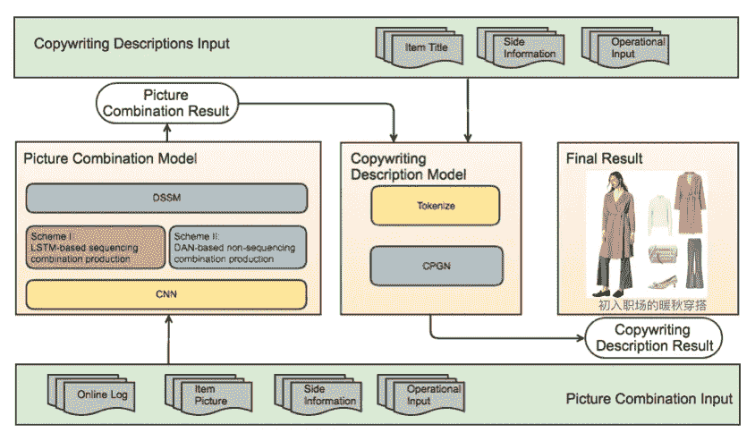

相关的图像和文本算法将在下面的章节中介绍。

# 图像算法

本节包括在此场景中使用图像算法的所有相关准备和流程。

**数据**

阿里巴巴的训练数据最初来自 Polyvore，该网站存储了大量用户提交的项目组合示例，这些示例根据用户喜欢和评论等因素进一步描述。当淘宝的内部商业实践稳固确立后，阿里巴巴利用从资深淘宝专家那里获得的数十万套高质量服装组合，创建了一个内部数据库。

**人物塑造**

首先，必须描述物品的特征。就传递信息而言，图像是最直观的。阿里巴巴使用鲁班的数百万白色背景图像库来为特定物品库中的物品生成图像特征。这是使用 CNN 的 inception v3 模型完成的。流程如下:

1.使用类别作为标签对预训练的模型进行微调，并提取倒数第二层的矢量表达式，将其用作项目的图像表示。

2.使用 K-均值聚类将具有类别约束的所有图像的矢量表达式组织成聚类。对 K-means 聚类进行了一些优化，确保了集中和平衡的分布，使它非常适合在这个场景中使用。优化的 K-means 聚类使用类别关系和组合中的差异以及各种类别的项目分布数量作为限定词。一个单独的类别可以包括各种不同的集群。这一步确保每个项目都在一个集群中结束。

3.使用 inception v3 再次微调该模型，将步骤 2 中生成的集群用作标签。还提取了高维向量表达式。这些矢量表达式被用作图像的最终特征。

## 模式一:LSTM 测序设备组合生产

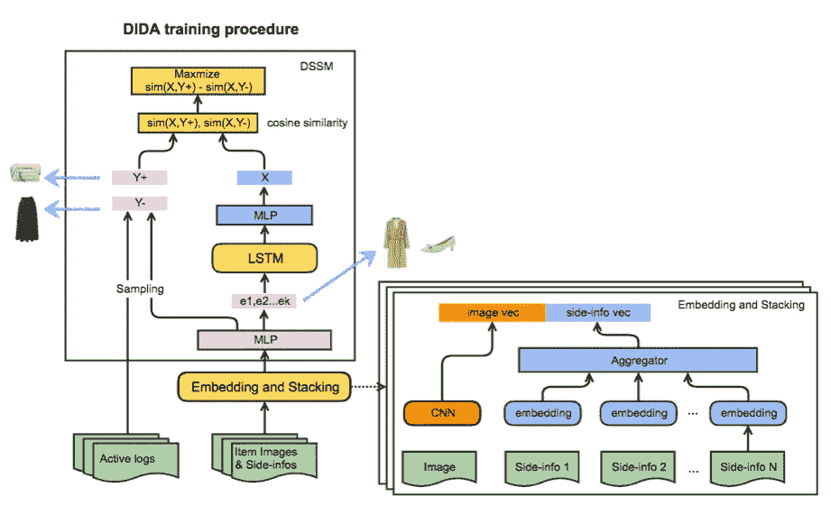

1.使用 CNN 获得高维向量，并且将边信息的向量作为模型的输入层进行嵌入和堆叠变换。

2.在第一 MLP 层之后，输入向量被分成两路。一条路径通向用于序列学习的 LSTM 网络，另一条路径通向用于向量比对的 DSSM 网络。两者的细节都在下面。

**LSTM 网**

生成组合是一个连续的过程。为一套服装生成的每个项目都被认为是一个连续的步骤。从第一个项目开始，每个新项目都必须与先前生成的项目相关联。由于 LSTM 网络的内在顺序关系，这是可能的。LSTM 是递归神经网络(RNN)的扩展，包括功能门，使其能够有效地捕捉长期依赖性。

在这个场景中，S 代表一套服装，xt 代表该物品的 CNN 特征表示，S=x1，x2，…，xN 代表一套服装序列。根据最大似然估计(MLE ),主要目标是最大化以下各项的期望值:

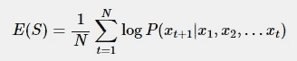

**DSSM 网**

由于期望一个服装组合中的物品在向量空间中应该具有更近的距离，所以采用了 DSSM 网络方法。积极的样本来自在线日志和质量机构。阿里巴巴资深专家提供的点击率最高、质量最好的服装都是从网上日志中收集来的，并被分成两人一组，作为 DSSM 网络的正面例子。点击率低的服装被用作反面教材。如图所示，项的向量表达式在进入 LSTM 之前会经过 MLP。当 LSTM 生成一个项目 X 时，对 X 进行 MLP 变换，并计算它与尚未进入 LSTM 的其他项目的距离。其他项目的正面例子表示为 Y+,负面例子表示为 Y-。正面例子之间的距离短，反面例子之间的距离长，是最理想的情况。因此，损失表示为:

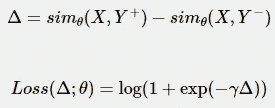

其中 sim 函数使用余弦相似度，θ代表参数，目标是最大化δ。Mini-batch SGD 用于在 GPU 上优化θ。

## 模式二:基于 DAN 的非测序装备生产

基于 LSTM 模式的第一个版本的推出证明是令人满意的。然而，随后的研究表明丹是一个更好的模型。对前述结构的唯一改变是替换了 LSTM 模块。DAN 模型实现了更低的损耗和更好的输出。

DAN 的核心功能是将服装视为一种组合模式，而不是一种排序模式。以上衣和裤子组成的套装为例。训练 LSTM 网络需要两个训练数据序列:上衣+裤子和裤子+上衣。对于 DAN 来说，上衣和裤子是作为组合输入到网络中的，没有顺序差异。

一套服装的训练数据经过 CNN 和边信息嵌入后输入到 DAN。向量首先被改变到非线性层，然后它们进入汇集层。使用总和汇集和最大汇集的这一过程的试验已经发现前者是更好的选择。下图概述了整个基于 DAN 的流程。

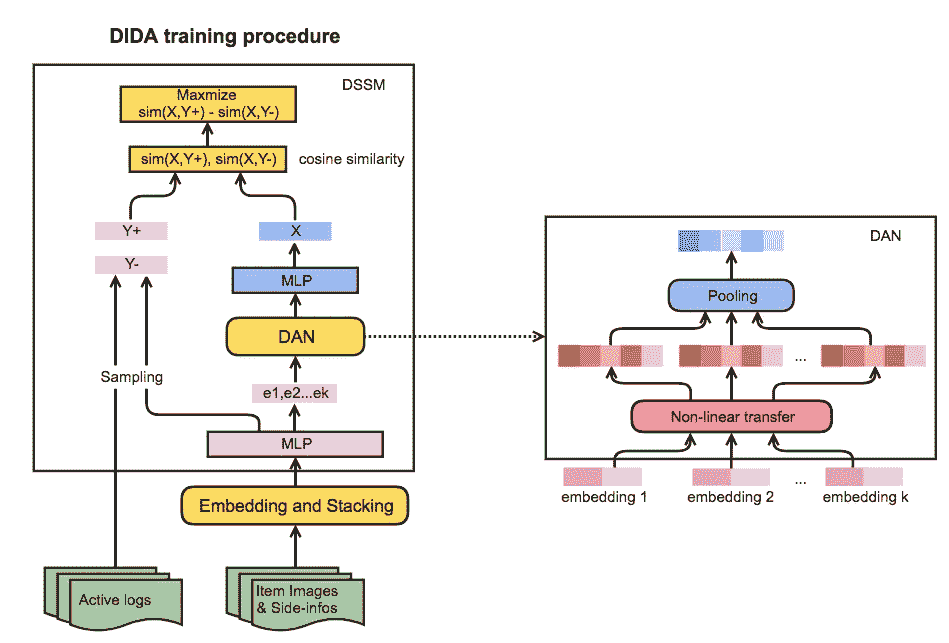

与 LSTM 相比，丹在训练中的损耗更低。DAN 的另一个优点是，它只需要组合数据，而不是全排列，来构造训练数据。较少的训练数据缩短了训练时间，使得周期性迭代模型成为可能。

**基于上下文图的预测过程**

根据运营商的不同，服装往往会有不同的定义。女装卖家往往会把上衣+下装+鞋子或者连衣裙+配饰+包包视为全套行头。连体裙和牛仔裤从不出现在同一套服装中。从家居用品销售者的角度来看，缺少床、床头柜、灯具或壁纸会使卧室组合不完整。在实践中，运营商通常会根据风格和季节考虑使用场景和附加限制。这种情况下的主要困难是创建满足操作者需求的组合算法。阿里巴巴设计了一个上下文图来解决这个问题。

上下文图是一组结构化的操作规则，包括对类别、风格、季节等的约束。在服装组合预测阶段，所有项目及其辅助信息在被存储到项目池之前经历嵌入、堆叠和完全连接。

以 DAN 为例:当一个活动发送请求时，所有被触发的项都经历 DAN。在不考虑约束的情况下，MLP 输出用于在项目池中搜索相似的项目，以获得下一个项目。根据上下文图，当约束被考虑到相似性搜索中时，结果被过滤，使得只有满足操作规则的项目最终出现在候选集中。接下来，从候选集合中挑选出 TopK。每当生成一套服装时，使用算法重新计算所有满足的组合约束，以促进下一个项目和新候选集的生成。

环境图被打包到模型中，使得装备组合预测成为完全实时的过程。它还确保了高产出率，因为每个生成的服装都符合操作员的输入条件，从而降低了人工过滤的成本。

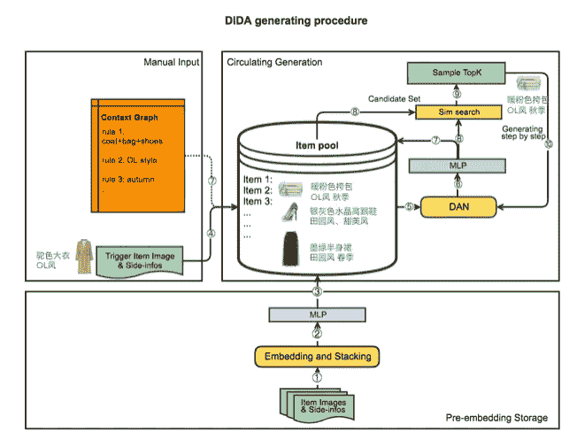

# 文本算法

本节描述了在此场景中使用文本算法的所有相关准备和过程

**数据**

经验丰富的设计专家已经创造了数十万套自主设计的服装。这些服装的描述被整理并用作训练数据。训练数据输入包括物品名称和服装标签。以词为基本单位。

**CPGN 型号**

基于 PGN 添加运营输入，以在文案、项目和运营要求之间建立强有力的联系。这种新方法被命名为 CPGN，其算法结构如下:

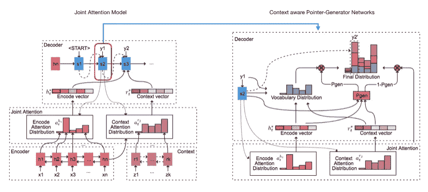

整个帧包括一个编码器-解码器结构。首先，对原始数据(x1，x2，…，xn)和操作输入(z1，z2，…，zn)进行编码。原始数据中的每个单词都经过双向 LSTM 网络的一层，隐藏状态表示为 hi。操作输入可以是一个完整的句子或关键词。在前一种情况下，仍然采用 LSTM 处理。在后一种情况下，嵌入直接应用于关键字，它们被表示为 ri。在 I 表示第 I 个输入，t 表示解码步骤数的情况下，注意力分布(at)和上下文向量(ht∫和 rt∫)表示如下:

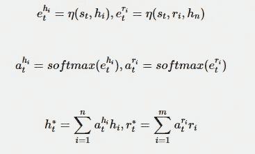

其中η是多层 MLP，tanh 是其激活函数，st 表示第 t 步的解码器状态。

注意力分布被视为每个编码源词生成解码的概率，其中 ht∫和 rt∫是注意力和从源语句获得的信息的表达式的加权和。字典中下一个单词的概率分布可以在此基础上导出:

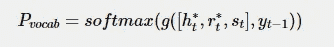

其中 g 是两层 MLP。

这样就导出了生成截面的概率。为了平衡指向和发生器，设计了参数 pgen∈[0，1]，它是一个概率软开关，与当前解码器状态 st、上下文向量 ht*、rt*、解码器输入 yt1 相关联。

pgen 允许从字典中生成下一个单词，或者从输入中复制下一个单词。假设字典中每个单词的预测概率为 Pvocab(w)，则:

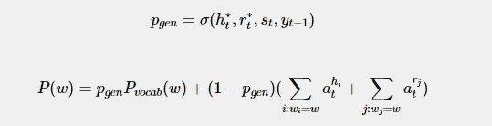

其中σ是 sigmoid 函数。

当前的 P(w)包含整个字典，包括以前不在字典中但出现在输入中的单词。这有助于解决与 OOV 的问题。在训练阶段，假设第 t 个目标单词是 wt *, loss 可以表示为:

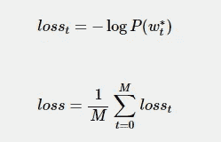

最后，引入覆盖算法来处理重复词。由于所有算法都是直接在线推出的，阿里巴巴在算法中删除重复后添加了一个正则表达式层，以消除漏洞。

# 迪达案例研究

本节介绍了迪达在 iFashion 服装、手机淘宝 Primary Focus 和友好货方面的一些成功案例。

## 时尚服装

iFashion 是一个淘宝页面，使用了以服装组合为中心的场景。iFashion 保持了对图形算法的高性能要求，无论是内容质量还是视觉效果。阿里巴巴定期使用 Dida 为 iFashion 的选择制作匹配的服装和文本描述。这代表着一个巨大的补充装备库，以前完全依赖于资深专家的贡献。通过算法生成的服装与瀑布中资深专家的服装混合在一起，然后以个性化推送的方式显示给用户。通过算法创建装备提供了显著的好处，包括降低成本、正反馈和高转换率。

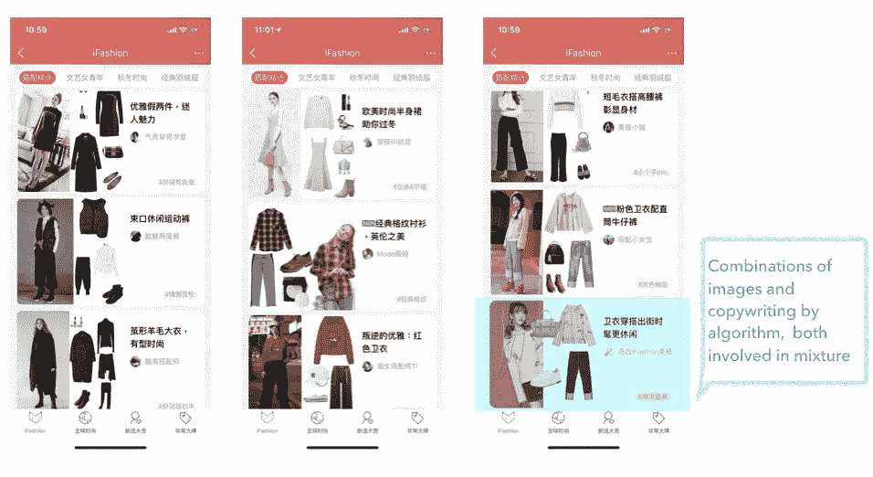

## 手机淘宝首要关注点

手机淘宝首要关注的是运营需求强烈的淘宝横幅。每个图像都链接到一个活动页面，该页面显示活动的文案和正在销售的产品的图像。在个性化发布中，阿里巴巴的推荐算法根据每个用户的行为为他们显示个性化内容。在迪达之前，所有商品组合都使用相同的文案，即使图像是个性化的。

在这个场景中，Dida 的图形算法被用于为服装行业创建多项目组合。由此产生的服装组合是高品质的，并丰富了主要重点领域的图像和演示。

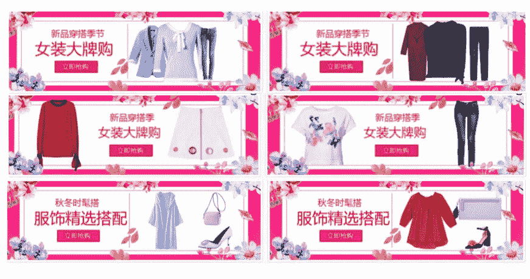

阿里巴巴还测试了在多个行业使用文本算法进行文案写作。当使用传统的方法时，操作人员通常使用一种非常温和、通用的风格。例如:

初级文案:运动党

二手文案:精选品牌，大优惠

好处:抢购大价值优惠券。

这种文案风格比较枯燥，容易被消费者忽略。

相比之下，迪达创作的文案要有趣和吸引人得多:

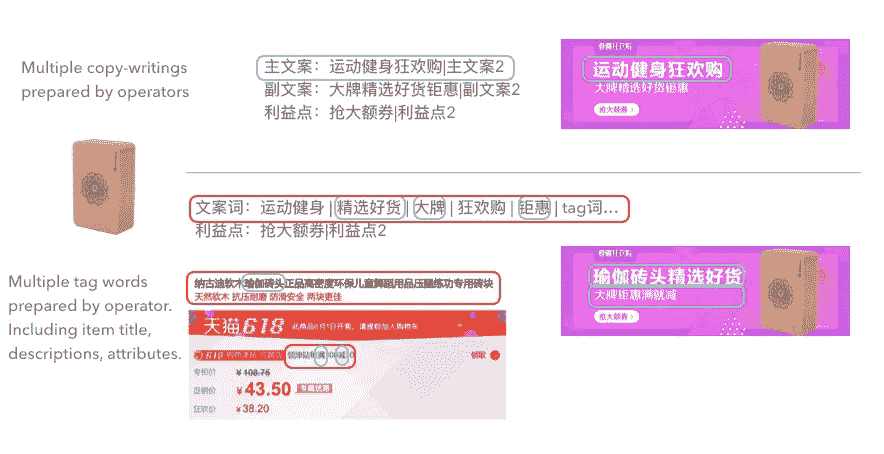

对于这个例子，阿里巴巴的模型使用项目标题、描述和属性(关于 yoga 砖的信息)作为输入数据。运营输入是个人利益关键词或标签(质量选择、大品牌、促销)。最终文案包括:

主要文案:瑜伽砖的质量选择(从项目标题和操作输入中提取的文字组合)

二次文案:大品牌、大折扣、花钱买回来(来源于运营投入中提取的词)。

相比之下，智能文案是为特定项目和事件定制的，以有趣的方式描述产品，并突出其优势和相关的销售活动。

为主要关注点生成的图表和文本组合导致点击率和 UCTR 出现两位数的百分比增长。

## YouHaoHuo(有好货)

友好货是一个淘宝页面，由于其旗舰概念“友好货”而深受消费者欢迎，友好货是指销售优质商品。许多由资深专家设计的友好货产品标题太长，无法在当前页面布局上完全显示。由此产生的截断导致不清楚的项目描述，并阻止用户查看项目的完整信息。阿里巴巴使用迪达文案算法从标题中重新提取关键信息，并限制长度，帮助用户做出更好的决策。

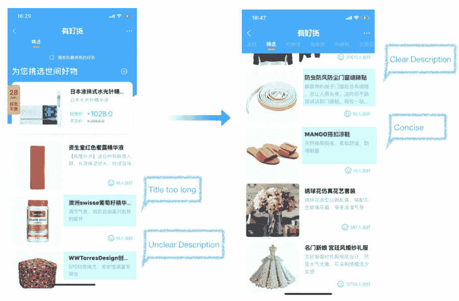

(Original article by Chen Wen 陈雯)

# 阿里巴巴科技

关于阿里巴巴最新技术的第一手深度资料→脸书: [**“阿里巴巴科技”**](http://www.facebook.com/AlibabaTechnology) 。推特: [**【阿里巴巴技术】**](https://twitter.com/AliTech2017) 。