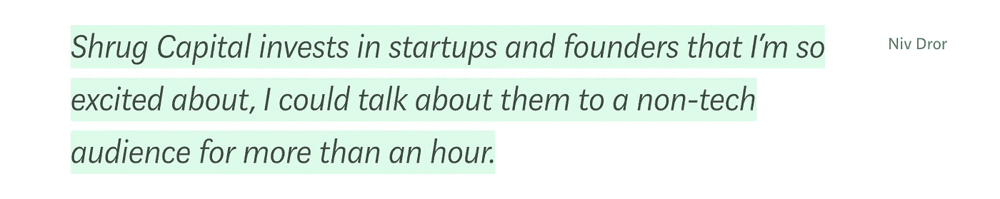

# 找到你的(投资)利基

> 原文：<https://medium.com/hackernoon/finding-your-investment-niche-183c9ba9365b>

Photo by [Ian Schneider](https://unsplash.com/photos/TamMbr4okv4?utm_source=unsplash&utm_medium=referral&utm_content=creditCopyText) on [Unsplash](https://unsplash.com/search/photos/passion?utm_source=unsplash&utm_medium=referral&utm_content=creditCopyText)

当我第一次创业时，我问我的导师，要成为一名更好的投资者，我应该做些什么？毫无疑问，第一个答案是“找到一个利基市场”，或者换句话说，找到一个领域/部门，深入挖掘并成为最聪明的人。

这是一个很好的策略，对许多著名的投资者都有效。例如，Fred Wilson 和 Chris Dixon 因其深厚的知识在区块链广为人知。同样，[布莱克·罗宾斯](https://medium.com/u/d0c6187860a2?source=post_page-----183c9ba9365b--------------------------------)已经成为电子竞技的不二人选。从他们的公开角色(推文和帖子)来看，很明显他们是各自领域最聪明的人，这使他们在相关初创公司寻找投资者时成为首选。

但是找到你的利基，或者领域专长，不仅仅是深入某个特定的领域。它是关于发现你最感兴趣的东西，花时间思考它，写它，并最终对将在其中发挥主要作用的技术下注。对某些人来说，这很容易理解。对于像我这样的其他人来说，这更具挑战性。

当我试图发现我的定位时，我想我会假装直到我成功。所以我从一份电子邮件草稿开始，列出了几个我认为感兴趣的领域。该名单上的一些部门是物流技术，房地产技术，市场和区块链。

对于每一个问题，我都花了大量时间深入研究，寻找我能找到的最优质的资源。我写了关于[物流技术的前景](https://hackernoon.com/automating-the-journey-to-your-doorstep-e8016fcef3b2)和关于[投资于区块链](https://hackernoon.com/investing-in-blockchain-technology-startups-1fcaa71d2b0f)的未来，但最终感觉并不令人满意。我意识到你不能“即兴”选择你的激情。它必须是你真正喜欢花时间在一起的事情。所以我放弃了。我退出了深潜，感觉棒极了。

几个月后，我和我的一位导师坐在一家咖啡馆里，他负责百事公司在以色列的风险和创新项目。我们讨论了像百事这样的巨头面临的创新挑战，以及需要解决的许多方面，包括购物者的洞察力和行为、自动化结账、实体零售点的未来、营销、广告等。

我被迷住了。

我意识到找到你的激情和定位其实就是找到你喜欢谈论的话题。对我来说，这意味着零售技术、CPG、营销和消费技术的交叉。人们日常使用的产品和服务比自动驾驶汽车中的传感器或最新的网络安全解决方案更让我兴奋。

其他人也谈到了这一点。NextView Ventures 将这些主题称为“[日常经济](https://nextviewventures.com/blog/everyday-economy/)”。在他的[关于耸肩资本](/@nivo0o0/announcing-shrug-capital-1bfce52fc19c)的帖子中， [Niv Dror](https://medium.com/u/6a2e7ab34bc3?source=post_page-----183c9ba9365b--------------------------------) 提到他投资的标准是基于他有多喜欢谈论公司。

[Link](/@nivo0o0/announcing-shrug-capital-1bfce52fc19c)

那么我找到自己的定位了吗？我也这么认为但我在这个过程中发现，你可以对任何事情充满热情。对一些人来说，他们的定位是一回事。对其他人来说，他们做大了，覆盖了很多领域。这一切都归结于找到你的激情并活下去。当你这样做的时候，你就会知道你是否找到了它:)

感谢阅读！

*嗨！我叫乔丹，在以色列的一家全球风投公司工作。风险投资/创业领域发生了很多事情，我想我应该在这里发表我的观察。所有观点都是我自己的。* *随时关注并在 Twitter*[*@ jordanodinsky*](https://twitter.com/jordanodinsky)*。*