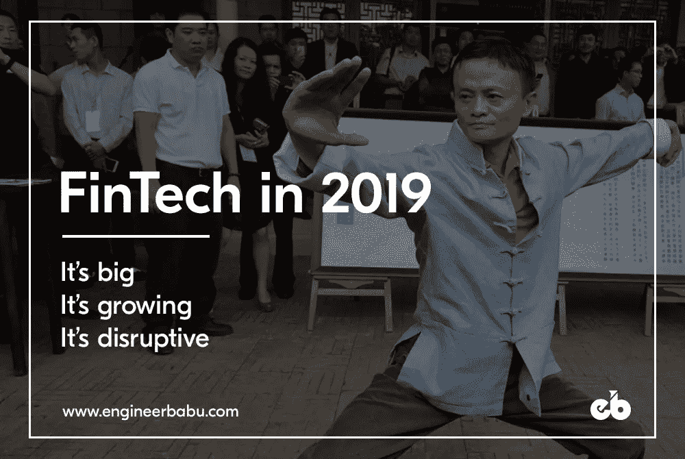
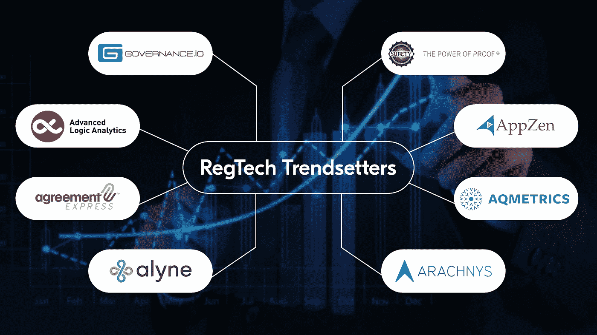
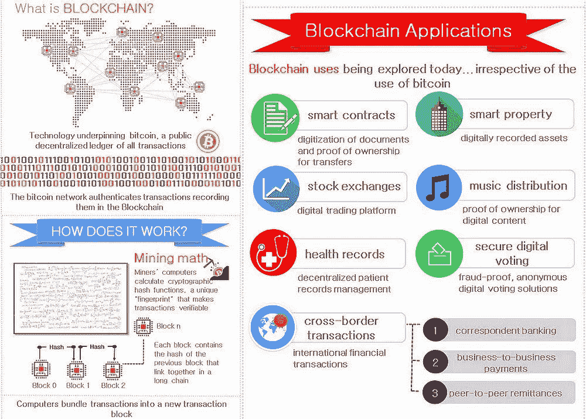

# 2019 年金融科技

> 原文：<https://medium.com/hackernoon/fintech-in-2019-54309d19bdb7>

## 下一个重要的一年，要注意的趋势！

Image Courtesy: [kisahdunia.com](http://kisahdunia.com)

**金融科技**或其组合词“**fin tech”**不再局限于后台阴暗角落，事实上，它已经成为几乎所有客户驱动流程中不可或缺的一部分。多亏了“金融科技”，任何数字交易，无论是网上购物、*、外汇兑换、股票投资还是转账*，都可以在我们的指尖实现那么，金融科技是如何在美国消费者的生活中扮演如此重要的角色的呢？

正如怀特先生说得好——“敲门的人是我”。
IT 领域的这一新的爆发无疑是每一个风投和投资者的敲门砖。可以准确地说，这是因为金融科技的整体投资*已经超过了 2017 年年中的业绩*。

让我们来看看今年金融科技领域的一些重大突破，

**收购 WorldPay** WorldPay(现为 [*WorldPay，Inc*](http://www.worldpay.com) )公开上市**支付处理平台**，该平台提供在线服务，通过信用卡、银行或直接转账等多种方式接受电子交易。它还提供一系列商户服务，并在全球范围内广泛开展业务(146 个国家的 400，000 个商户)。它被领先的金融机构支付处理服务和相关技术解决方案提供商 **Vantiv** 收购。129 亿美元的收购是两大巨头向前迈出的重要一步。收购完成后，与 VeriFone、PayPal、Stripe 和其他几家公司竞争的 WorldPay 势头强劲。

蚂蚁金服的融资当中国的蚂蚁金服在最后一轮种子融资中筹集了大约 140 亿美元时，很多人并不感到意外。毕竟，它背后的支持者是业内最大的公司之一(阿里巴巴集团控股有限公司)。).

Image Source: [www.ft.com](http://www.ft.com)

这笔资金使蚂蚁成为世界领先的金融科技公司。不可否认，这笔资金为他们的扩张提供了巨大的资源。阿里巴巴集团控股有限公司的子公司已经是中国最大的在线支付服务，甚至控制着世界上最大的货币市场基金。蚂蚁的首席执行官 Eric Jing 在给彭博的一份声明中说:“现在，在我们合作伙伴的帮助下，我们将加速我们的战略。

分析上述发展，我们可以准确预测 2019 年金融科技的发展方向。
让我们先睹为快，

# 1.RegTech 会一直存在

合规性、复杂性、成本和官僚流程一直阻碍着金融业的发展。漫长而乏味的过程已被证明是该行业的祸根。这导致了一个病态行业的轮回，自[网络泡沫](http://www.investopedia.com/terms/d/dotcom-bubble.asp)以来，这个行业从未出现过显著的推动力。因此，我们看到许多金融公司转向 ***监管技术(RegTech)*** 来弥合这些差距。
人们一定想知道-**RegTech 到底是什么？？**

本质上是在金融服务职能中使用技术来减轻金融任务，如法规遵从性。它对金融服务有重大影响。
简单来说，这是一项帮助金融服务公司更好地应对监管的技术。例如，*了解你的客户(KYC)* 。但是 RegTech 的好处远远不止 KYC。
随着*世界从* ***大数据向“智能数据”*** 转变，诸如 ***人工智能和机器学习*** 等技术正在使公司能够洞察监管实践、自动化报告、对关键合规风险领域进行有意义的检查，甚至有可能创建端到端的合规视图。公司正在使用 RegTech 来处理他们生成的大量数据。更多的数据以正确的方式处理也意味着更好的信息。许多风投和投资者已经开始搭上 RegTech 的顺风车，因此对这个利润丰厚的行业的投资大幅增加。
***2018 年上半年投资 13.7 亿美元——超过 2017 年全年*。** RegTech 有着光明的未来，这些新时代的创业公司将是即将到来的日历中值得关注的。
[**1。governance . io/governance . com:**](http://governance.com)这家 RegTech 初创公司总部位于卢森堡，由 Bert 和 Rob Boerman 兄弟创建，提供智能技术和支持服务，以促进对受监管公司的控制。他们今年增加了首轮融资。通过使用技术和支持，Governance.io 已经成为一个良好治理的平台。部署在内部或云中的解决方案允许所有利益相关方在数据、文档和工作流方面进行协作。它还提供了一个贴有白色标签的客户门户，用于交换数据，并就会议和尽职调查问卷进行合作。
**治理网络支持能够提供托管、运营支持、** **监管咨询和其他支持服务的客户**。

[**2。高级逻辑分析:**](http://www.advancedlogicanalytics.com)这家总部位于英国的初创公司成立于 2015 年。借助新时代技术，ALA 在合规领域建立了稳固的地位。它为买方和卖方机构以及其他金融公司提供企业级**大数据和金融分析解决方案**。他们的 ***数据科学主导的业务产品和人工智能驱动的算法*** 为金融机构带来了另类的数据洞察。通过使用**基于机器学习的分析技术**，ALA 开发并应用风险计算。根据一系列**关键风险指标(KRIs)** 对通信和其他源数据进行评分，以快速发现任何可能导致问题的问题。

RegTech startups that are creating a difference in the Compliance Sector

[**3。协议快车:**](http://agreementexpress.com)协议快车提供**入职自动化软件**金融服务。他们的平台允许财富管理和支付公司在其产品中提供客户申请、批准和入职服务。它们为法规遵从性和风险工作流提供了与后台的无缝集成，这是它们最受欢迎的功能之一。

[**4。Alyne:**](http://www.alyne.com)这家总部位于慕尼黑的初创公司的与众不同之处在于它所迎合的市场**。** Alyne 的产品包括**网络安全、风险管理和合规能力**涵盖所有行业的所有规模。他们自称为“以业务为中心的软件即服务”。

[**5。担保:**](http://www.surety.com)担保迎合了监管技术的细分市场。他们使用加密时间戳服务提供保护数字信息完整性的技术。他们也是监管服务的主要提供商之一，如**知识产权保护和数字足迹保护**。保证制裁用户将**防篡改数字“印章】**应用于几乎任何形式的电子信息。它们*很容易在企业或云上部署*，提供长期和独立的证据，保证信息不会被篡改。

[**6。AppZen:**](http://www.appzen.com)AppZen 是一个极其令人印象深刻的人工智能平台，它利用**机器学习来审计合同**、**费用报告和发票。**它集成了所有主要的 ERP、发票软件和费用自动化产品。这家成立 6 年的初创公司**估值 1.75 亿美元**，最近**在 B 轮**融资 3500 万美元。Appzen 的客户群包括 Airbnb、亚马逊、花旗银行、Salesforce、Intuit 和 650 家大型机构。AppZen 的首席执行官 Anant Kale 在一份声明中说:“我们的目标是解决 CFO 组织中的所有问题。

[**7。AQ metrics:**](http://www.aqmetrics.com)AQ metrics 为在全球金融市场交易的金融服务公司提供 **GRC(治理、风险&合规)**软件。AQMETRICS 总部位于爱尔兰基尔代尔(欧盟)，迄今为止已经筹集了近 330 万美元的投资。他们专门为投资管理公司提供**统一市场监管**和**合规解决方案**。AQMETRICS 提供一套基于云的解决方案，并支持全面的全球监管报告。
[**8。蜘蛛网:**](http://www.arachnys.com)蜘蛛网的愿景是专注于开发不断发展的市场，而不是已经有利可图的市场，因为他们相信，通常分散且组织混乱的新兴市场将会出现商业信息的爆炸。因此，与他们的 RegTech 同行不同，Arachnys 更广泛地瞄准了欧亚市场。他们的主要重点仍然是有吸引力的市场，如中国、印度、俄罗斯和中东。
通过使用尖端技术，如**机器人流程自动化、机器学习、智能和自然语言处理**，蛛网的领域专业知识迎合了**客户风险评估生命周期**。
他们的产品是专为不同的客户群量身定制的，并且可以广泛定制。

# 2.人工智能:

在银行业的早期，银行家通常与他们的客户有私人联系。银行业务流程的每一步都涉及到客户与客户之间的互动。但由于银行流程的数字化，这种个人联系已经丧失。那么，有没有可能利用同样的技术来恢复人类的互动呢？

Image Source: [geniusmonkey.com](http://geniusmonkey.com)

许多人认为，我可以被利用来恢复这种联系。人工智能将继续以新的方式管理金融科技。*2019 年，我们可以看到公司使用人工智能开发新的商务界面，研究语音的公司数量将会增加*。

让我们深入研究人工智能的潜在用例:
 **【信用评分】** :
在传统的银行基础设施中，有许多客户得不到充分的服务，并被忽视。他们不能申请贷款，因为他们没有信用评分。许多创业公司已经站出来填补这个缺口。
*各种申请接踵而至，帮助想申请贷款但没有信用记录的客户让银行审核*。许多工具和技术，如 ***心理测量分析、行为检测、预测分析，以及通过网络、社交媒体、地理位置甚至浏览器历史*** 挖掘借款人的数据，正在被部署以确保对潜在借款人进行详细的评估。这些技术让银行建立了一个生动的画面，使他们能够评估候选人是否有信誉。

**安全和欺诈控制** :
由于显而易见的原因，银行业是黑客和欺诈者最容易攻击的领域。这种反常现象允许在这一领域开发一些最具创新性和高科技的解决方案。**金融公司和新时代创业公司正在部署机器学习、自然语言处理、优化算法**和许多其他工具和技术来解决这个问题。许多人工智能工具也开始用于分析和观察用户的关键行为模式，并在可能的安全侵犯情况下发出警告。由于这些发展，*在第三季度观察到，消费者越来越容易使用人工智能驱动的应用程序*和数字支付网关来执行他们的金融交易。

**客户支持自动化** :
一次又一次，我们见证了大多数面向客户的流程正日渐过时。Chabots 和虚拟助理的出现正在彻底改变他们。很容易找出到底是什么推动了这一趋势。面向客户服务的自动化解决了一个问题，这个问题总是让公司付出数十亿美元的代价，即**人为错误**。

Image Source: [medium.com/techsee](http://medium.com/techsee)

A.使用自然语言处理(NLP)的 I 驱动平台变得比以往更加人性化。这一点再加上交货时不可能出错，使它成为理想的选择。聊天机器人不仅可以智能地回答客户的查询，还可以与社交网站集成，直接从社交媒体渠道接受应用程序和订单的请求。

Gartner 在 2018 年预测，预计将有超过 20 亿人使用对话式人工智能在不同平台上与虚拟助手互动。 结果显然超出了预测。

# 3.区块链将超越比特币:

比特币和其他加密货币所基于的被大肆宣传的技术——**区块链**，已经开始涉足比特币之外的领域，并将服务于其他各种市场和领域。考虑到[区块链](https://www.engineerbabu.com/blog/blockchain-in-healthcare-opportunities-challenges-and-applications/)的潜力，几家银行和金融公司已经计划在该领域进行大量投资。许多公司已经在多个行业推出了试点项目，包括**金融服务、医疗保健甚至全球物流**。2018 年早些时候，亚洲的几家银行进行了一项试点，使用区块链在几秒钟内跨洲转移资金。

Image Source: [twitter.com/chboursin](http://twitter.com/chboursin)

以下可能是 2019 年可能出现的潜在用例，
**1。武器追踪** :区块链可以在枪支控制和武器问责方面提供巨大帮助。这很可能是改变整个枪支销售状况的最重要的改革之一。枪支管制几乎是每个新电视网的热门话题。区块链可以创建一个完全透明且永不改变的注册分类账，允许执法部门追踪武器和枪支所有权。它还可以用来记录私下出售的武器。
 **2。数字投票:** 如果你担心展位被抢或者选民舞弊。那么区块链会让你松一口气。区块链将提供数字投票的能力，同时足够透明，任何监管机构都可以看到任何违规或欺诈行为。分散的性质和它的不变性将确保您的投票真正算数。
 **3。数字身份证:借助区块链的数字身份证将为贫困和发展中国家带来好处，让他们获得金融服务。科技巨头微软已经计划通过在其 Authenticator 应用程序中创建数字身份证来涉足该领域。**

**4。房地产:**
由于书面记录经常是混乱的来源，区块链完全有可能将纸张从等式中剔除。因此，如果一个人打算买卖土地、房子，甚至汽车，你只需要转移所有权。由于区块链，这些图书将被存储在网络上，从而可以清晰地了解法律所有权。

**5。病历的记录保存:** 医药领域引入区块链，患者隐私将被完全保密。拥有访问这些记录的密钥的患者将完全拥有他们的数据，并且将控制谁可以访问或查看该数据。因此加强了旨在保护他们隐私的 HIPAA 法。

**6。管理物联网网络:** 许多网络公司宣布，他们正在开发一种基于区块链的应用程序，用于监控物联网网络。这种应用程序将有助于确定网络上设备的真实性，并且将对进入和离开网络的设备持续地这样做。这可能会推动设备到设备集成的重大转变。

# 4.金融包容性:

在新加坡金融科技公司有史以来最大的聚会上，印度总理纳伦德拉·莫迪推出了吸引投资者的政策和计划。新加坡金融科技节的主题演讲人莫迪说:“我要对所有金融科技公司和初创公司说:印度是你最好的目的地。在尼日利亚，金融科技初创公司 [NetPlus](http://www.netplusdotcom.com) 提出了一个解决方案，为消费者提供简单可靠的数字支付系统。因此，尼日利亚的消费者在谈到电子商务时通常持怀疑态度，现在已经接受了这个平台。

诸如此类的发展被证明是对印度、巴西、尼日利亚、印度尼西亚等新兴市场的巨大推动。早些时候，金融科技中心曾经只有旧金山、新加坡和伦敦，这些发展正推动投资者进入这些回报巨大的市场。市场的这种转变将在明年获得巨大的牵引力，发展中国家可能会看到金融科技和监管科技投资的巨大增长。此外，一些金融机构正计划在这些国家开设新的场所，这无疑表明了我们在 2019 年有望实现的目标。

# 总结:

我对 2019 年的预测:

> ***它大，它在成长，它具有颠覆性。***

自第一张永久性纸币 ***问世以来，金融科技将是金融领域第二大重大变革。我相信，金融技术不仅会扰乱我们购买和投资的方式，还会改变金钱本身的定义。***

**FinTech 3.0** 即将降临我们和银行，金融公司将享受乘坐 FinTech 马车的过山车之旅。2019 年将是银行收购金融科技公司或等待它们慢慢消亡的一年。那些搭乘金融科技列车的人将会振作起来，而其余的人将会喘着气。

毕竟，俗话说得好——你打盹，你就输了。

如果您有任何疑问，请随时留下您的评论。

> 最初发表于 [***EngineerBabu 博客***](https://www.engineerbabu.com/blog/fintech-in-2019/) 作者 [Saransh Sethi](https://medium.com/u/5028aadc44f?source=post_page-----54309d19bdb7--------------------------------)

— — — — — — — — — — — — — — — — — — — — — — — — — —

## 看我的其他相关文章

**1。** [**如何创办一家 FinTech 公司**](https://www.engineerbabu.com/blog/how-to-start-a-fintech-company/) **，还上**[**hacken noon**](https://hackernoon.com/how-to-start-a-fintech-company-e12bf425338)
**2。** [**美国十大金融科技公司转型金融**](https://www.engineerbabu.com/blog/top-10-fintech-companies-in-usa/) **3。** [**金融中的数字转换**](https://www.engineerbabu.com/blog/digital-transformation-in-finance/) **，也上** ****4。** [**区块链如何革命性地改变银行和金融市场**](https://www.engineerbabu.com/blog/blockchain-revolutionizing-banking-financial-markets/) **，也上**[**hacker noon**](https://hackernoon.com/how-is-blockchain-revolutionizing-banking-and-financial-markets-9241df07c18b) **5。** [**求教区块链给你的日常银行解决方案**](https://www.engineerbabu.com/blog/asking-for-blockchain-to-your-daily-banking-solutions/) **，也上**[**hacker noon**](https://hackernoon.com/asking-for-blockchain-to-your-daily-banking-solutions-1f9e649b0820)**

> ***我是 Mayank，*[*engineer Babu*](https://www.engineerbabu.com/)*的联合创始人。随时联系我关于*[*LinkedIn*](https://www.linkedin.com/in/mayankpratap/)*| mayank@engineerbabu.com(关于 EngineerBabu —* [*中*](https://hackernoon.com/how-mayank-pratap-built-engineerbabu-a-profitable-it-service-company-generating-more-than-50-000-per-month-bcd3006bdbb5) *)。***

**此外， [EngineerBabu](https://www.engineerbabu.com/) 通过构建高级 IT 解决方案，帮助初创公司、企业和所有者发展业务。他们开发的项目 95%都按时完成了。 [30+获风投](https://www.engineerbabu.com/casestudies)资助，赢得最具创新总理设计奖，入选 Y-Combinator 2016 & 2017。**