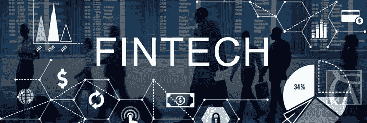

# 金融科技是新的黑色？

> 原文：<https://medium.com/hackernoon/fintech-is-the-new-black-7a42b50876b>

Source: [https://www.ccmalta.com/fintech](https://www.ccmalta.com/fintech)

传统上，银行是每个经济体的稳定力量。不是吗？尤其是英国的银行一直在激励着世界其他地方的中央银行。

但现在也是时候从经验中学习，扩大进步，努力迈向未来，以继续改善目前的银行模式。我不否认银行业取得了进步，但这就足够了吗？

我们会看到经济学家坐在一张圆而优雅的桌子前讨论政策吗？或者它们会被运行某种机器学习算法的智能机器所取代？

## 真正的问题是:下一代金融科技将如何改变银行业？

[科技领域](https://hackernoon.com/tagged/technology)大概比光速还快！考虑一下创新的影响，比如——[、区块链](https://hackernoon.com/tagged/blockchain)、人工智能、物联网、增强/虚拟现实等。

区块链为加密货币打开大门。加密货币不仅仅是通过 PayPal 或 M-Pesa 进行的数字支付。这种货币完全是另一种货币。**这些货币拥有自己的记账单位和支付系统。他们允许没有央行的点对点交易！但是他们对当前的系统(法定货币系统)没有挑战，因为它太新，太冒险，太不稳定，太动态，基础技术(区块链)不可扩展。但是预防总是胜于治疗。很久以前，一些专家说，个人电脑永远不会被采用，平板电脑只会被用作昂贵的咖啡托盘。因此，抛弃 crypto 根本不是明智的选择。**

人工智能将使目前的许多工作自动化。它不仅会影响中产阶级(这一次，某些东西不仅影响他们)，还会影响上层阶级。人工智能之所以是它，是因为它获得的数据。**数据是新的石油，人们。**目前大约 90%的可用数据是在过去两年中生成的。互联网，因此，数据现在是丰富的，无处不在的，当我们把它与人工智能结合起来时，它变得越来越有价值。

看看我在同一个网站上写的文章—

 [## 我们在创造数字撒旦吗？

### 电影《2001:太空漫游》可能不再完全是虚构的了。人工智能正在超越人类…

codeburst.io](https://codeburst.io/are-we-creating-digital-satan-46f78f66f9b0) 

人类仍然是需要的。我们需要智慧。机器还没有那个**。**

**没人能准确预测会发生什么，但是让我向你保证，这样的技术将会带来一场无人能阻挡的革命。只有适应的人才能生存。Rest 将只是坐下来，看看查尔斯·达尔文的适者生存的实际例子被应用到他们身上，让他们意识到他们不适合。就像互联网把所有该死的东西都放到网上一样，区块链会把所有东西都放到一个分散的格式里。人工智能将使决策更可靠、更好。增强现实和虚拟现实能够也将会提升客户体验。金融界即将经历一场疯狂的颠覆。但是能成为其中的一部分会很棒！**