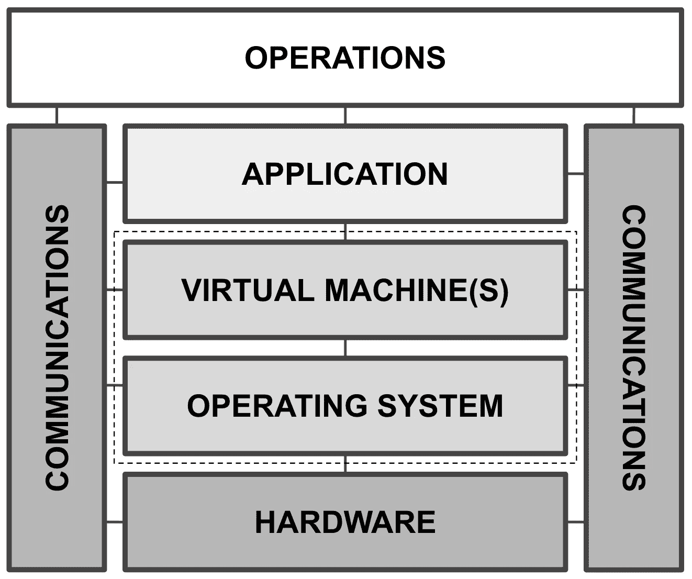

# Erlang & Elixir Systems 的 FIPS

> 原文：<https://medium.com/hackernoon/fips-for-erlang-elixir-systems-9d288a333720>

由阿扬达·杜贝

**(联邦信息处理标准)[【1】](http://www2.erlang-solutions.com/l/23452/2018-02-20/5b8gd9#FIPS)是由**(美国国家标准与技术研究所)定义的一套标准，旨在提供一种管理和控制计算机系统如何以行业认可、可信和可接受的方式互操作的方法。FIPS-140 并不是全面的必需品，但是如果你在政府系统这样不妥协的部门工作，我强烈建议你努力成为 FIPS-140 的兼容者。FIPS-140 出版物定义了与计算机系统中采用的加密模块和功能相关的标准要求，包括但不限于设计、实现、安装和使用的所有阶段。****

****基于 Erlang 的系统(如 [RabbitMQ](https://www.rabbitmq.com/) 、 [MongooseIM](https://github.com/esl/MongooseIM) 、 [Riak](http://docs.basho.com/) 、 [WombatOAM](https://www.erlang-solutions.com/products/wombatoam.html) )满足 FIPS-140 标准的需求正在快速增长，这是因为它们在关键任务环境中大量使用，例如在政府部门中，在这些环境中，安全要求是不可妥协的，并且是最重要的。这些 Erlang 系统由多个应用程序组成，这些应用程序作为其他底层应用程序和子系统(如 Erlang 虚拟机和操作系统)的一部分运行。因此，为了满足 FIPS-140 的合规性，考虑事项也必须跨越这些底层、使能层，重点是与经验证的 FIPS 安全模块的操作和交互。以下是为了符合 FIPS-140 标准而在 Erlang/Elixir 系统中考虑的组件和方面的图示和讨论。****

********

****Fig 1: Components and aspects to be considered for FIPS-140 compliance****

# ****1.五金器具****

****FIPS-140 定义了从硬件到操作系统及其安全库的平台安全要求。对硬件的要求包括对硬件安全模块的类型进行分类，如单芯片和多芯片嵌入式密码模块，其中定义了物理覆盖和涂层以防止篡改等方面，以及其他内部方面，如敏感“片上”信息的归零等。在 Erlang 的范围内，正在开发和交付的嵌入式系统，例如带有 [Erlang-ALE](https://github.com/esl/erlang_ale) (以及 [Elixir-ALE](https://github.com/fhunleth/elixir_ale) 或[neurs](http://nerves-project.org/)，用于嵌入式 Elixir 系统)将需要在固件实现和硬件制造上考虑这些因素。****

# ****2.操作系统和虚拟化****

****对操作系统的要求决定了所采用的加密软件模块的类型(它是否是可信的操作系统)和方式，这些加密软件模块将根据 FIPS-140 标准中定义的数据保护的规定发挥作用。这些需求是巨大的，令开发人员和社区高兴的是，像 [OpenSSL](https://www.openssl.org/) 这样的库实现了这些特性集，如果理解得好，这些特性集在执行时需要被配置和启用以符合 FIPS-140。FIPS-140 推荐了一种软件设计和实现的模块化方法，OpenSSL 也紧随其后，通过一个经过验证的 OpenSSL FIPS 对象模块实现了 FIPS-140。其他库，比如 GnuTLS，也根据用户的喜好加入了 FIPS-140 兼容性。****

****在要考虑的方面的范围内，包括满足 FIPS-140 的操作系统，还有可产生的虚拟机和实例，它们封装并充当各种应用的有效供应的容器。这些可以是完整的操作系统，例如由 Docker、Kubernetes、CoreOS 等自动化工具提供给应用程序运行时虚拟机(例如 **Erlang 虚拟机**、JVM 等)的操作系统。网等。****

********

****Fig 2: Erlang****

****在[*www.erlang-solutions.com*](http://www2.erlang-solutions.com/l/23452/2018-02-20/5b8gd9)上阅读这篇博文的其余部分。****

# ****参考****

****[1][https://csrc.nist.gov/publications/fips](https://csrc.nist.gov/publications/fips)****

*****原载于 2018 年 2 月 20 日*[*【www.erlang-solutions.com】*](http://www2.erlang-solutions.com/l/23452/2018-02-20/5b8gd9)*。*****