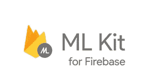
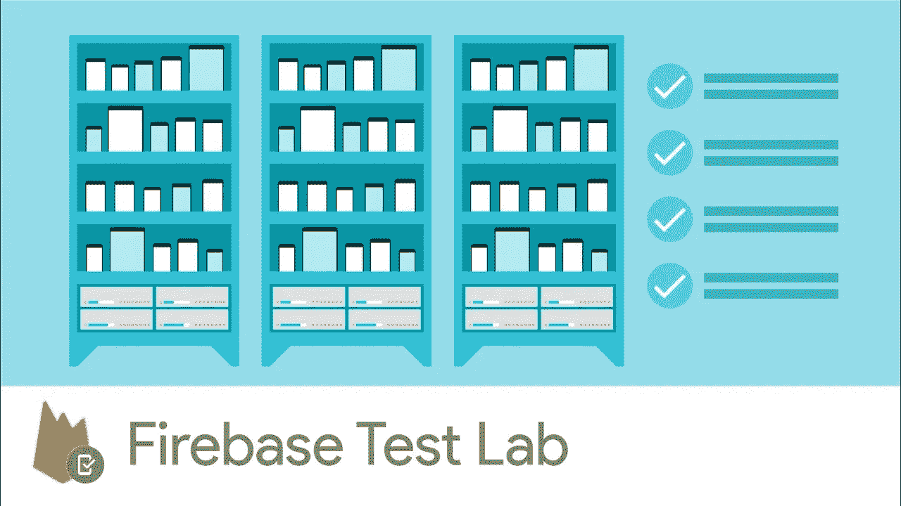
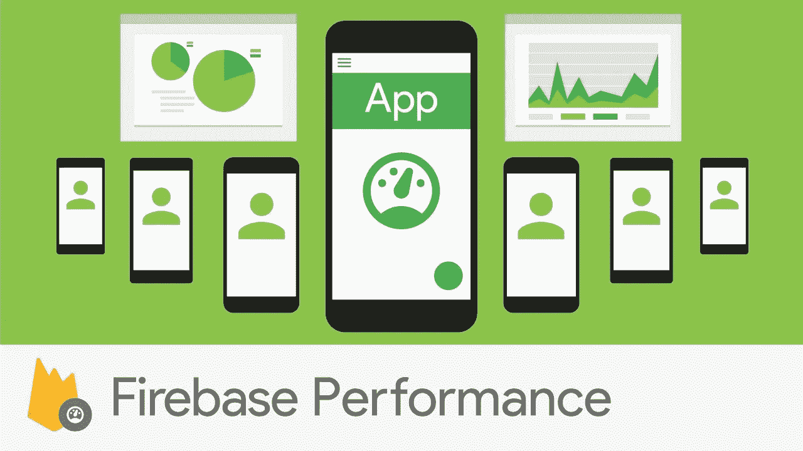

# Firebase 在 Google I/O 2018 上宣布了一些让我们垂涎三尺的东西…

> 原文：<https://medium.com/hackernoon/firebase-announced-some-stuff-at-google-i-o-2018-thats-got-us-licking-our-lips-4a35e0a5b1c7>

Photo by [Nghia Le](https://unsplash.com/photos/V3DokM1NQcs?utm_source=unsplash&utm_medium=referral&utm_content=creditCopyText) on [Unsplash](https://unsplash.com/search/photos/thumbs-up?utm_source=unsplash&utm_medium=referral&utm_content=creditCopyText)

我们在 [**Flamelink.io**](https://flamelink.io/) 的团队毫不掩饰我们有多爱 [Firebase](https://hackernoon.com/tagged/firebase) (我的意思是我们最终确实专门为 Firebase 构建了一个无头 CMS，你知道吗？).它快速、安全、可扩展，强大的功能和产品不胜枚举。但是 Firebase 最让我们兴奋的事情是，他们不断推出 rad 产品，使那些委托 Firebase 满足 BaaS 需求的开发人员和他们的应用程序受益——我认为这一特性是他们在过去几年中大举进军 BaaS 领域的关键。

在谷歌 2018 年 I/O 大会上，Firebase 发布了一系列我们非常期待的公告。如果你在你的项目中使用 Firebase，并且你今天只能阅读一件东西，这个列表应该是它(当你完成后， [**将这个链接**](https://www.youtube.com/watch?v=7rH6ECWsq3c&list=PLl-K7zZEsYLn1omgx_VUhCDFsQMA7PRDd) 加入书签，以便稍后在 Google I/O 2018 上尽情观看所有的 Firebase 会议)。

1.  **Firebase 的机器学习套件**

在周二的谷歌 I/O 大会上，Firebase 推出了 ML 套件的测试版，将谷歌的机器学习专业知识带到了移动开发人员中。

Firebase 让 ML 初学者更容易开始使用 5 个现成的 API，涵盖了常见的移动用例。这些是:

*   条形码扫描
*   人脸检测
*   图像标注
*   地标识别
*   文本识别

在对机器学习的非常高层次的理解/应用上，让我们考虑以下几点:

今天早上，我用当地咖啡店的一个应用程序兑换了我通过他们的忠诚计划得到的一杯免费咖啡。为了兑现我的优惠券，点击了 7 次才兑现了我的免费咖啡。

现在想象一下，通过机器学习，咖啡店的应用程序发现我在他们的一家咖啡店(地标识别)，并学习当我打开应用程序时，我会做以下事情之一:我要么为购买的咖啡赚取代金券，要么兑换奖励以获得我的免费咖啡。该应用程序可以在一个屏幕上打开，我可以选择“兑换”(如果我有奖励等待)或“赚取”我的咖啡奖励。嘭，从打开我的手机到完成交易只需 3 次点击。

进一步想象一下，该应用程序识别出我妻子的手机(和她的咖啡店应用程序)就在我的附近，它知道我点了什么(2 杯双份、淡咖啡)，知道她点了什么(单份、无咖啡因、蜂蜜果仁拿铁)，并在我下车走向商店时发送推送通知，给我一个选项来订购、支付和赚取我的 3 张代金券，所有这些都在几步之内，并帮助我跳过排队，直接去取货(条形码扫描)。

如果我的妻子告诉我给她带一个羊角面包和她的咖啡，文本识别也可以在那里，但是嘿，我只是在这里拿一杯咖啡，而不是解决整个世界的问题。

太棒了。

现在我知道 ML 的功能远远不止帮助我更快地获得每日咖啡因。我知道这是我们这个时代的惊人发明之一，它可以使技术变得更好，技术可以在解决世界上一些最大的挑战方面发挥作用。但是现在，我只是在想象成千上万的 Firebase 应用程序，以及它们将如何从 ML 中受益，这让我很兴奋。

L [从专家那里了解更多关于 Firebase 套件的信息](https://firebase.googleblog.com/2018/05/introducing-ml-kit-for-firebase.html)。

**2) Firebase 测试实验室正在向 iOS 扩展**

在科技领域，我们都知道，确保你拿出来的东西是多么重要，这些东西是你的血汗、泪水、深夜、清晨和大量咖啡换来的。不仅如此，它还可以在 Android 和 iOS 上运行。

这就是为什么为 iOS 推出测试实验室是一件非常重要的事情——它将帮助开发者能够测试他们的应用程序，并在你将其发布给最严厉的批评者——公众用户之前让他们达到高质量。所有的 QA 团队现在都在庆祝。

测试实验室为您提供物理和虚拟设备，使您能够运行测试来模拟实际使用环境——您能听到遍布各地的 QA 团队正在庆祝吗？

如果你想成为一名早期的测试员，今天就在这里加入等候名单。[https://docs . Google . com/forms/d/e/1 faipqlsf 5 CX 1 ot 8 ndhu 9 yrfkcn 6 GPO qzlxgw _ 6 H13 e _ bot 3 he 90n 7 ng/view form](https://docs.google.com/forms/d/e/1FAIpQLSf5cx1ot8ndHU9YrFkCn6gPoQZLxgW_6H13e_bot3he90n7Ng/viewform)

**3)绩效监控毕业生出 beta。**

去年在 I/O 推出测试版，性能监控为您提供一系列关键见解和信息，帮助您保持应用程序的最佳性能。

Firebase 目前每天报告 1000 亿个性能指标，地球上一些最大的应用程序的开发者使用这些数据来使他们的应用程序更好地工作。

您还会注意到，随着这次升级，Firebase 控制台上已经推出了一些改进。

关于 Firebase 性能管理的更多信息，[请查看](https://youtu.be/gpoqgQPwu_k?list=PLl-K7zZEsYLn1omgx_VUhCDFsQMA7PRDd):

这些只是我们在 2018 年 I/O 大会上发布的三款 Firebase 产品。查看 [**Firebase 博客**](https://firebase.googleblog.com/) 了解更多关于 I/O 上宣布的其他 Firebase 产品