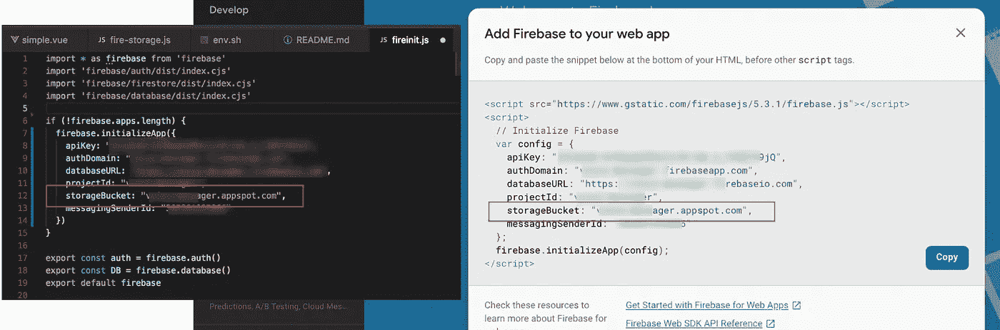
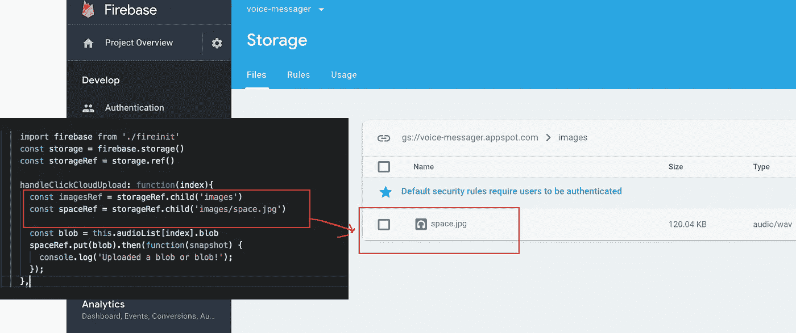

# [Firebase]通过 3 个步骤设置从浏览器上传存储

> 原文：<https://medium.com/hackernoon/firebase-setup-storage-upload-browser-in-3-step-tutorial-example-bucket-website-javascript-vue-react-driect-4d005c001152>


[Firebase] Setup storage upload from Browser in 3 step

> 在尝试了 Firebase 身份验证模块之后(对如此方便的实用程序感到惊讶)，我玩了一下 Firebase 的存储部分，对它的设计非常满意。

# 赞成的意见

Firebase 存储是专门针对**规模**、**安全**、**网络弹性(** [***阅读更多***](https://firebase.googleblog.com/2016/07/5-tips-for-firebase-storage.html) **)** 。

*   **规模:**每一个上传的文件都有**谷歌云存储**做备份，规模达到*Pb*。
*   **安全性:**可以使用存储安全规则来保护特定用户或用户组的文件。
*   **网络弹性:**在网络连接不畅的情况下会自动重试上传和下载，这样你就不用自己跟踪了。

# 骗局

当你的产品有自己的认证系统时，在 firebase 上配置 ACL 并不容易。firebase SDK 很好地封装了一切，当然也包括存储访问控制规则。

# 1.在项目中设置存储桶键

您必须将您的存储桶添加到 Firebase SDK 配置中。



# 2.设置规则

存储安全规则必须首先指定评估规则所依据的云`storage`(通过`match /b/{bucket}/o`)。

简单来说就是四种:`default`、`public`、`user`、`private,` 我们准备以 public 为例( ***少认证问题来演示*** )。

```
service firebase.storage {
  match /b/{bucket}/o {
    match /{allPaths=**} {
      allow read, write;
    }
  }
}
```

# 3.编码

云存储允许开发人员快速轻松地将文件上传到由 Firebase 提供和管理的 [Google 云存储](https://cloud.google.com/storage)桶中。

由于默认的 Google App Engine 应用程序和 Firebase 共享这个桶，配置公共访问可能会使新上传的应用程序引擎文件也可以公开访问。设置身份验证时，请确保再次限制对存储桶的访问。

同样，Firebase 支持 ***Blob*** 和 ***文件*** 对象上传。



# 参考:

——[https://firebase.google.com/docs/storage/web/start](https://firebase.google.com/docs/storage/web/start)

—[https://firebase . Google . com/docs/storage/security/start # sample-rules](https://firebase.google.com/docs/storage/security/start#sample-rules)

—[https://firebase . Google blog . com/2016/07/5-tips-for-firebase-storage . html](https://firebase.googleblog.com/2016/07/5-tips-for-firebase-storage.html)