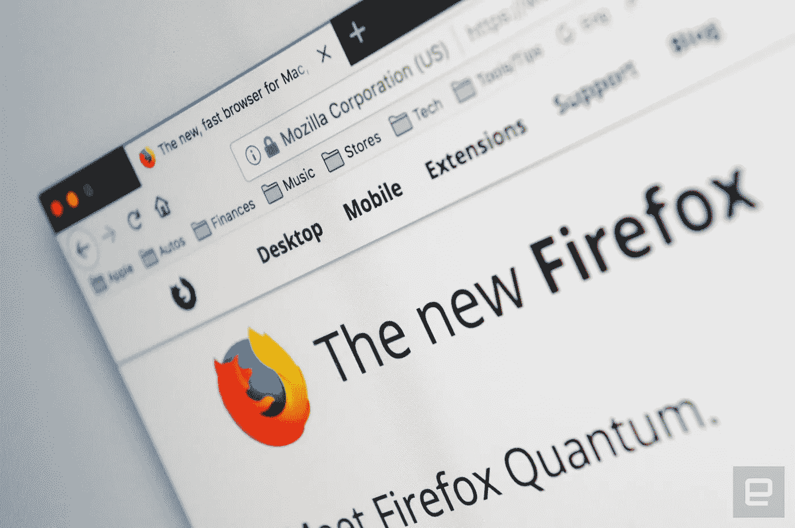
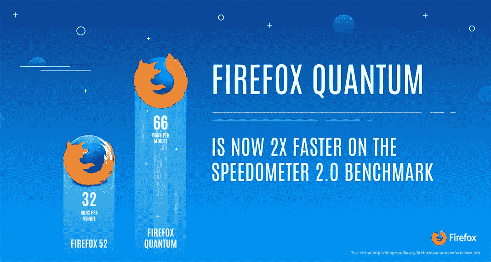

# 火狐量子值得吗？

> 原文：<https://medium.com/hackernoon/firefox-ffe71d0e16c3>

## 我做了一个简单的实验。这些是结果。

Firefox Quantum launched in November of last year. [Source](https://www.engadget.com/2017/11/14/firefox-quantum-arrives/)

hrome 在市场上已经被锁定很久了。和大多数人一样，我已经很多年没有考虑过更换浏览器了。

但是当 Firefox Quantum 在几个月前发布时，我惊讶于发布时的大肆宣传和营销。Mozilla 对他们的新浏览器做出了一些诱人的承诺。

我赞成尝试新的应用程序。可能是因为我喜欢别人为我的工作做同样的事。所以，我决定做一个简单的实验。我会使用 Firefox Quantum 几个星期，看看它是否值得切换浏览器。

# 实验

我是一名技术人员，所以我的很多工作和生活都在浏览器中进行。我愿意做一个实验，但是我定下了一些规则:

1.  只有当火狐浏览器比 Chrome 浏览器更好的时候，我才会转换。
2.  为了进行清晰的比较，我会定期在两者之间来回切换。
3.  我会一路上记笔记，跟踪事情的进展。
4.  我会试着保持开放的心态，无论是对谷歌还是 Mozilla。

作为参考，我有一台 2014 年中期的 MacBook Pro，15 英寸，2.5 GHz 英特尔酷睿 i7，16 GB 内存。

现在，让我们来看看调查结果。

# 好人

Quantum is purportedly 2x faster than its predecessor. It shows. [Source](https://blog.mozilla.org/blog/2017/09/26/firefox-quantum-beta-developer-edition/)

## 浏览速度

这是 Mozilla 一直吹捧的东西，所以我一直在关注。我不认为我经常访问的网站中有任何一个网站的 Firefox 速度较慢。感觉和 Chrome 一样快或者更快。

速度的提高并不绝对令人兴奋，但它们是显而易见的，这就足够了。

## 对隐私更直接的控制

我的锡箔帽比太阳帽更像圆顶小帽。知道谷歌有这么多关于我的信息让我有点不舒服，但我对此并不太介意。

不管浏览器的制造商是谁，Firefox 让我可以更细致地控制向公司提供多少数据。我相信这对我和广大的网络观众来说都是一件好事。

## 开发工具

就我的基本目的而言，我会说开发工具比 Chrome 的好一点。我喜欢样式编辑器、检查器侧边栏中的标签等。 [React 开发者工具](https://addons.mozilla.org/en-US/firefox/addon/react-devtools/)也可以在 Firefox 中使用。

## 资源使用

据我所知，Firefox 和 Chrome 在资源使用上的差异是显著的。

有一些迹象表明，Chrome 在我的机器上拉得更紧了，即使只有一个打开的标签。例如，有时在转换到我打开的 Chrome 窗口时会有一些延迟；有了 Firefox，一切总是很顺利。当我使用 Chrome 时，我发现我的风扇启动得更频繁了，我的电池似乎消耗得更快了。

我有一台内存充足的不错的电脑，但这是我迄今为止使用 Firefox 最喜欢的部分之一。有一种明显的感觉，运行它只需要更少的资源。我喜欢每天打开浏览器时知道这一点。

## 内置截屏

我定期使用截图，内置的[截图](https://screenshots.firefox.com/)功能很棒。我找不到任何一个 Chrome 扩展像它一样简单、制作精良、功能恰到好处。

## 用户界面感觉更快

与 Firefox 相比，Chrome 有时感觉有点迟钝或滞后。我不确定这是因为 Firefox 使用了更少的处理能力还是因为它的编码更好(或者两者都是)，但我想这并不重要。

Firefox Quantum 总是流畅而敏捷。

## 支持 Mozilla

我既需要浏览器的功能，也需要支持良好组织的能力。谢天谢地，有了 Firefox，我不必为了得到另一个而放弃一个——我两样都得到了。

Mozilla 是一个伟大的组织，它做了很多事情来让网络成为一个更好的地方。任何阅读这篇文章的人都应该对此感到高兴。

# 同一事物

## 扩展ˌ扩张

我知道这对一些人来说是一个交易破坏者，但我不是一个巨大的扩展用户。我用的几个都可以在 Firefox Quantum 上找到。

## 视觉设计

*边注:这只是指 UI 的视觉设计，而不是整体的用户体验。视觉设计很重要，但它不是 UX 的唯一因素。*

这是个人喜好问题。我认为 Chrome 比 Firefox 有更好的视觉设计。但是我用一个 userChrome.css 文件(如下)对困扰我的东西做了一些自定义的修改，现在我称之为 even。

现在，真的只是一系列的取舍。

# 坏事

## 移动的

火狐手机 app 并不可怕。我其实喜欢一些东西，比如底部的导航。但对我来说，Chrome 的移动应用程序感觉更精致一些。

在 iOS 上，我发现更多的应用程序可以选择在 Chrome 中打开链接。只有少数几个人允许火狐这么做。

## 谷歌视频

Hangouts [目前在 Firefox 中不能使用](https://support.mozilla.org/en-US/kb/google-hangouts-temporarily-wont-work-on-firefox)。

编辑:从 v58 开始，Hangouts 现在可以工作了。

## 自动填写地址和信用卡

目前并非所有人都可以使用这些功能。v58 将提供全面的可用性，所以我通过升级到 Firefox Beta 解决了这个问题。其他人可能不想这样做。

即使 v58 出来了，我实际上可能还是会坚持使用 Beta。

# 判决

我对我的实验结果感到惊讶。

老实说，我对火狐不抱太大希望。我很高兴尝试一些新的东西，但我没想到它会好到足以保证改变。事实证明我错了。

火狐现在是我的主要浏览器。我真的很开心。

如果你和我一样，换成 Firefox 可能也是正确的选择。

[Source](https://www.myce.com/news/mozilla-moves-away-from-releasing-a-new-firefox-version-every-6-weeks-78540/)