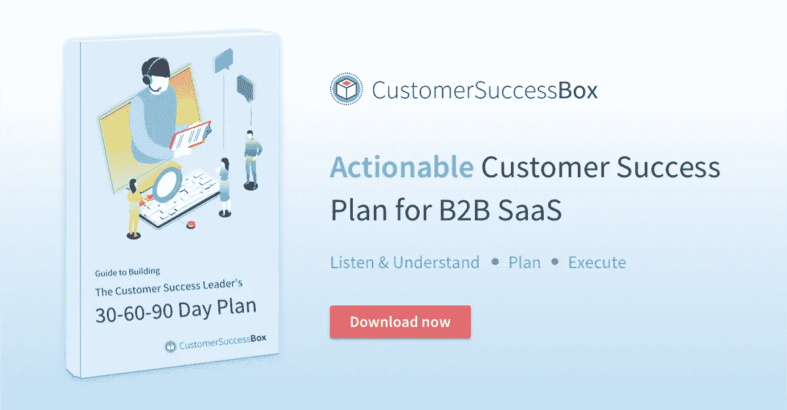

# 客户成功管理的前 90 天计划

> 原文：<https://medium.com/hackernoon/first-90-days-plan-for-customer-success-management-aaf1718bd184>

祝贺你决定在你的 SaaS 公司建立客户成功管理实践。你决定投资客户，帮助他们从你的产品中获得更多价值。但是问题仍然存在——从哪里开始呢？

这份为期 90 天的路线图将帮助您在您的公司建立客户成功管理(CSM)实践，并了解您应该在头 90 天内完成什么。

> 寻找一个详细的 30–60–90 天计划来帮助客户取得成功？下载这份全面的[指南，构建客户成功领导者的 30–60–90 天计划](https://customersuccessbox.com/the-customer-success-leaders-30-60-90-day-plan/)。

在实施完本博客中的所有策略后，我希望您能够了解您的客户角色、构建客户细分、绘制客户旅程图、了解何时以及如何与您的客户互动、雇佣客户成功领导者、建立报告和仪表板、扩大您的客户成功团队并决定构建或选择客户成功平台。

# **前 30 天**

*前 30 天花在客户角色、客户数据和创建细分市场(桶)上。*

**确保产品路线图包括持续提供价值。**如果您的产品路线图没有提供客户最初购买产品的特定价值，那么任何客户成功计划都不会成功。

**掌握产品使用指标**。跟踪每日/每周/每月的使用情况、活跃用户数量、许可证利用率，即一组许可证的活跃登录数量，并了解每个客户如何从您的产品中获取价值。

**构建基本的细分策略**。使用关键指标来自动化该过程，每个客户在其生命周期的任何时间点都必须属于这些桶之一。

*   健康——客户健康状况良好，不会去任何地方。
*   有风险——某些事情引发了潜在的客户流失。这些是你应该在头 90 天甚至第一年花 80%的时间关注的客户。
*   健康不佳:他们一只脚在门外。你可以给他们整个世界，他们可能还是会离开。

**使用工具(如 [Hootsuite Insights](https://hootsuite.com/products/insights/uses) 和 [Rapidminer](https://rapidminer.com/solutions/text-mining/?utm_term=text+mining) )或通过 [Twitter 高级搜索](https://twitter.com/search-advanced?lang=en)进行跟踪来监控客户情绪**。他们可能会在电子邮件中告诉你你是最棒的，同时在社交媒体上抨击你。

与你的顾客交谈。了解您的理想客户概况(ICP)和相关使用案例。理解他们在使用你的产品时所面临的挑战。对照购买您产品的目标，回顾他们在实现价值方面取得的进展。这必须首先与您的销售和营销团队协调完成，因为他们是 ICP 的创建者。因此，将您从客户电话中推断出的 ICP 与销售和营销部门同意的 ICP 进行比较。

**审查你的产品定价**将客户获得的价值与他/她为你的产品支付的钱联系起来。早期的试验对于决定一个合适的定价方案大有帮助，这样客户的成功就不必承受太多定价方案的影响。

要记住的一件重要事情是，不是每个客户都会与你交谈，但你需要确定 ICP，并在未来 30 天内制定战略，以实现目标并为客户创造价值。

# **第 31–60 天**

*制定高级客户服务战略，聘请客户服务负责人，规划客户旅程，建立客户参与模型，并确定未来 30 天内的追加销售机会*

**将前 30 天的研究和数据转化为高水平的客户成功战略。**在雇佣一名经验丰富的客户成功领导者并分享您的高级战略时，测试并微调最初 2 周的战略。

**与这位领导一起测试该战略**，退一步(是的，你仍然是首席执行官)，让他/她推动客户成功。记录一切。起点是什么，你改变了什么，每次改变的结果是什么。在您的客户成功领导者之后，您俩达成一致的计划将成为您的客户成功员工的基准。

**设计有效的客户入职框架。**一旦你知道你的客户在寻找什么价值，你需要找到最短的路径来帮助他们尽快达到目标。因此，您需要确保您对客户进行培训的每个功能对于获得价值都至关重要。

> 这里有一个[客户入职框架模板](https://docs.google.com/spreadsheets/d/1-P3WY8qCzbv6QmyTlIgRpbu4kvaf5dcjWUTGYu_alSk/)，您可以用它来建立一个有效的客户入职流程。

**绘制客户生命周期之旅**以确保您根据客户的生命周期阶段与其互动。显然，您不想向尚未加入的客户发送续订电子邮件。

**将数据与真实的客户案例研究联系起来。**比方说，一位客户一天登录两次以上，突然您发现该帐户已经停用一周了。这可能是一个即将流失的客户。因此，您需要为每个帐户设置这样的检查，以跟踪客户的成功。

**建立客户参与模型。**现在，您已经了解了数据的意义以及您希望在每个生命周期阶段采取的行动，您需要建立一个参与模型。典型的互动模式包括季度业务回顾(qbr)、一对一会议、自动化活动、反馈电话等。

**发现扩张和追加销售机会。**作为规划生命周期的一部分，您还可以确定准备购买更多许可证或转向更高定价计划的客户。比如活跃用户数突然增加，就有很大概率膨胀。或者说客户在 20 天内达到了每月数据上传的上限，您必须与他们接洽以获得追加销售的机会。

# **第 61–90 天**

*构建仪表板，设置 KPI，扩大团队，选择客户成功工具。*

**报告**:当你开始将每月经常性收入(MRR)目标归入年度收入目标并进行分解时，就是你的客户成功战略开始获得回报的时候。

尽早并经常分析数据。大多数客户流失发生在前 90 天。你需要知道为什么，这样你才能堵住漏桶。它还将有助于指出你的产品、销售、定价计划和/或客户成功战略中的缺陷。

**设置正确的** [**客户成功 KPI**](https://customersuccessbox.com/blog/10-customer-success-kpis/)**。一家公司的成功不一定是另一家公司的最佳成功标准。例如，如果您是 Slack，您会想知道一个用户发送了多少条消息，创建了多少个通道，用于登录的设备数量等等。或者，如果你是一家营销自动化公司，你可以查看使用你的产品的客户每次活动的转化率。**

扩大你的客户成功团队。了解管理 100 个、200 个或 1000 个客户对你的客户主管来说意味着什么。让他/她制定一个招聘计划。仅供参考，记住(销售人员会因此恨我)你可以将销售主管转变为客户成功经理，他们做得不错；-)

**选择一个客户成功平台**。构建或购买一个产品来支持您的客户成功管理实践(将其构建到您的 CRM 中，而不是购买[客户成功盒](https://customersuccessbox.com)或 [Gainsight](https://www.gainsight.com/) 或[to tango](https://www.totango.com/)…对讲机或细分市场不是客户成功平台)。

第一次建立客户成功管理实践可能会非常困难，但如果你遵循这个 90 天客户成功管理计划，你将能够为未来的发展打下坚实的基础。

> 这篇文章入选了 2018 年最受欢迎的 20 篇 SaaS 综述文章。

*如果你喜欢这篇文章，* ***随便打那个拍手👏按钮几下*** *帮助别人找到它*😄