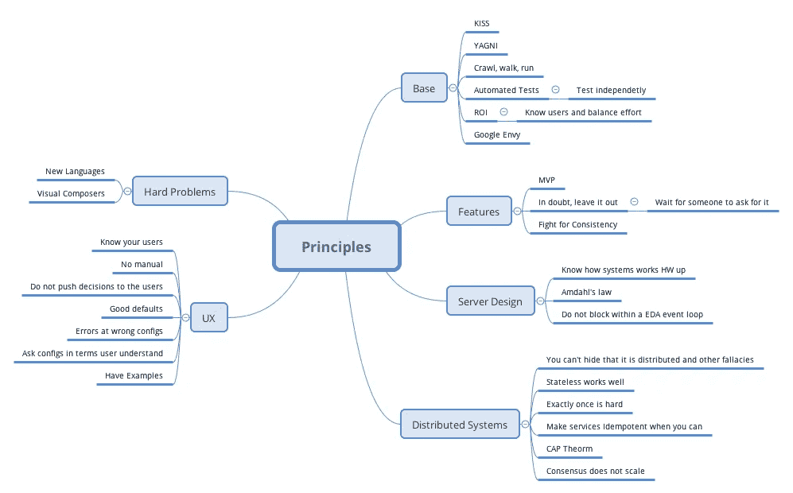

# 讨论软件架构的 30 个共享原则

> 原文：<https://medium.com/hackernoon/first-do-no-harm-30-principles-that-helped-me-avoid-fly-by-architecture-reviews-e8952ac632a>

想象一次飞越式架构审查。一个建筑师走进来，看了看，掩饰了一下，用双筒望远镜看了看。他提供的评论通常过于笼统或者脱离了上下文。评论经常遇到震耳欲聋的沉默或曲折的争论。他们很少帮助任何人。每个程序员都害怕它；每个建筑师也害怕它。

据说软件架构师应该像园丁而不是指挥官一样思考。前者塑造、管理和清除杂草，而后者定义和规定。建筑师应该策划而不是发号施令，塑造而不是定义，引发讨论而不是贴标签。但是，如何让它发挥作用呢？

在 WSO2，我做了八年多的架构评审。WSO2 拥有广泛的产品组合，包括众所周知的 [WSO2 ESB](https://wso2.com/integration) 、 [WSO2 API Manager](https://wso2.com/api-management/) 和 [WSO2 SP](https://wso2.com/analytics) 。在过去的八年里，我们讨论、设计、改进和重新设计了许多产品和功能。

我们设计过程的一个关键部分是建筑不是由建筑师完成的。我们没有一组架构师来指定架构蓝图，由其他人来实现。相比之下，设计是由编写代码的团队完成的。建筑师修正、抱怨、策划和改进设计。我们有一个架构团队，但他们是向导和看门人，而不是独裁者。

在接下来的演讲中，Gregor Hohpe 很好地抓住了这个观点。

[https://www.youtube.com/watch?v=qVyt3qQ_7TA](https://www.youtube.com/watch?v=qVyt3qQ_7TA[/embed)

从短期来看，指定一个架构更快，甚至可能更便宜。是真的。然而，从长远来看，我们通过让他们自己思考，让他们进化架构，有时让他们犯自己的错误，来建立更好的团队。当我们专注于团队时，他们会随着时间变得更好。执行变得更容易，因为架构首先是团队的想法。

然而，架构审查也有其缺陷。Paul ( [@pzfreo](http://twitter.com/pzfreo) )曾经称这种建筑驱动力为建筑师走进去，倾听，评论，然后继续前进。作为一名建筑师，你可以很容易地检查、抱怨和拆开设计。然而，如果你不小心，你可能会让团队不知所措，不知道该做什么。

我们通过共享架构原则的列表来解决这个问题。这些是每个人都同意的原则。架构师给出反馈说，由于委托人 x，这样不好。原则指导我们，并使我们的讨论扎根。他们也避免无休止的哲学争论。最后，如果设计者从未听说过该原理，他很容易学会。

以下是其中的一些原则。有些是众所周知的，而有些是我们通过艰苦的努力才获得的。

# 基础

**原则一:** [亲吻(保持简单)](https://people.apache.org/~fhanik/kiss.html)以及“一切都要尽可能简单但不能更简单。”这个想法是使用最简单的解决方案。

**原则 2:**[【YAGNI】(*你不会需要它)*](http://martinfowler.com/bliki/Yagni.html)*——*不到需要的时候，不要建造它。

**原理三:**爬，走，跑。换句话说，让它工作，让它变得更好，让它变得伟大。进行迭代开发——进行敏捷的迭代开发。对于每个特性，创建里程碑(最多 2 周)并迭代。

原则 4: 构建稳定、高质量产品的唯一方法是通过自动化测试。自动化测试要有创造性；一切都可以自动化！！设计的时候想想这个。

**原则 5:** 始终考虑投资回报(ROI)，投入最多的注意力以产生最大的影响。

**原则 6:** 了解你的用户，并据此平衡你的努力。对于大多数产品来说，会有成千上万的最终用户，20 个开发人员来扩展产品，100 个开发人员来建立产品。例如，不要花几个月的时间为不太可能使用它的开发者构建 UI(他们喜欢脚本！而是)。这是原则 5 的特例。

原则 7: 尽可能独立地设计和测试特性。设计的时候想想这个。从长远来看，这将省去很多麻烦，否则在所有东西都构建好之前，你无法测试系统。同样，有了这个原则，你的发布会更顺利。

**原则八:**望风谷歌羡慕。我们都喜欢闪亮的设计。很容易将您永远不需要的特性和解决方案引入到您的架构中。

# 选择功能

**原则 9:** 想透用户会如何充分使用我们的产品是不可能的。所以拥抱 MVP(最小可行产品)。这个想法是找出几个用例，只做支持这些用例的特性，交付产品，并根据反馈和经验塑造未来的产品。

原则 10: 尽可能少做一些功能，如果有疑问，就把它删掉。许多特性从未被使用过，也许你应该留下一个扩展点。

**原则 11:** 等待别人提出要求(例如，不妨碍交易的特性，等到需要的时候)

**原则 12:** 如果客户要求的功能搞乱了大局，要有勇气与客户抗争。找出更大的图景，试着找到处理这个问题的另一种方法。记得福特的名言“如果我问人们想要什么，他们会说是更快的马。”另外，记住你是专家。你应该领导。领导者的工作是做正确的事，而不是流行的事。用户以后会感谢你的。

# 服务器设计和并发

**原则 13:** 从硬件、操作系统到你的编程语言，了解服务器是如何工作的。优化 IO 调用的数量是通向最佳架构的第一盏指路明灯。

**原理 14:** 知道阿姆达尔关于同步的定律。线程间共享的可变数据会降低程序速度。尽可能使用并发数据结构，只有在必要时才使用同步。尽可能短时间地保持锁定。如果你打算在持有锁的时候阻塞，确保你知道你在做什么。能破就破。

**原则 15:** 如果你的设计是基于非阻塞、事件驱动的架构，那么永远不要阻塞线程或者从那些线程做 IO。如果你这样做，系统会像骡子一样慢。

# **分布式系统**

**原则 16:** 无状态系统是可伸缩且简单明了的。尽可能了解并使用[无共享架构](https://en.wikipedia.org/wiki/Shared-nothing_architecture)。

原则 17: 除非你同时控制客户端和服务器端的代码，否则不管失败与否，都很难精确地传递一次消息。试着将你的系统设计得更少(例如使用原则 18)。知道大多数承诺一次送达的系统在某处偷工减料。

**原则 18:** 尽可能将运算实现为幂等运算。然后就很容易恢复，至少一次分娩就可以生活。

**原理 19:** 知道 CAP 定理。扩大交易规模很难。尽可能使用补偿。基于 RDBMS 的事务不可伸缩。

**原则 20:** 分布式共识不可扩展，群组通信也不可扩展，集群范围的可靠消息传递也不可扩展。两者的最大节点限制都是一天 8 个节点左右。

原则 21: 你永远无法隐藏分布式系统中的延迟和故障。(参见[分布式计算的谬误解释](https://en.wikipedia.org/wiki/Fallacies_of_distributed_computing))。

# **用户体验**

**原则 22:** 了解你的用户，知道他们的目标:他是新手、专家，还是临时用户？他对计算机科学了解多少？极客喜欢扩展点，开发者喜欢样本和脚本，普通人喜欢 ui。

**原则 23:** 最好的产品不需要说明书。其用途不言而喻。

**原则 24:** 当你无法在两个选择之间做出决定时，不要把问题变成一个配置选项。你让用户和解决方案架构师的日子不好过了。他们对系统如何运作的了解甚至比你还少，他们怎么能决定呢？最好的选择是找到一个每次都有效的选择；第二好的方法是自动做出选择，第三好的方法是添加一个配置参数并设置一个合理的默认值。

**原则 25:** 始终为配置提供合理的默认值。

**原则 26:** 设计不良的配置会造成很多混乱。始终记录一些配置的示例值。

**原则 27:** 询问配置值，用户无需进行计算就可以立即回答(例如，不要询问最大缓存条目数，而是询问应该用于缓存的最大内存)

**原则 28:** 看到未知配置抛出错误。千万不要默默忽视。静默配置错误是调试时许多时间损失的来源。

# 难题

原则 29: 想出新的语言很容易，但掌握它们却很难。除非团队能在这上面花费至少 10 个人年的时间，否则尽量不要做。如果你还不确定，那就看看[关于语言设计的五个问题](http://www.paulgraham.com/langdes.html)。

原则 30: 可组合的拖放 ui 很难，除非团队准备投入十年的时间，否则不要创建。

最后，让我谈谈我随着时间的推移而改变想法的一些事情。在理想情况下，平台必须由正交的组件组成，每个组件处理一个方面(例如，安全性、消息传递、注册、中介、分析)。具有这些特征的系统将是最佳的。

不幸的是，很难达到那种状态。呆在那里甚至很难。严格执行这一点可能是错误的，特别是在新功能的初始阶段，简单的功能可能会级联成大的变化，因为我们试图让一切正交。有时候，我们发现我们添加的功能根本没有用，然后所有额外的工作都白费了。最后，如果这导致了多个团队之间的协商，那么这个特性可能永远也完成不了。

事后看来，当试图消除导致严重复杂性的重复时，我愿意忍受重复。治疗可能比疾病更糟糕。

# 结论

作为建筑师，应该像园丁一样思考，他塑造、管理和清除杂草，而不是定义和建造。你应该策划而不是发号施令，塑造而不是定义，引发讨论而不是贴标签。虽然短期来看，指定架构可能更便宜、更容易，但从长远来看，指导团队并让他们找到自己的路是有回报的。

如果你不小心，这是更容易做到的飞行由架构，设计师只告诉他的架构是错误的，但没有为什么它是错误的。避免这种情况的一个方法是拥有一套被普遍接受的原则，这些原则成为讨论的基础，也是崭露头角的架构师的学习途径。

我们讨论了一些帮助我应对挑战的原则。以下是总结。

如果你能想到任何其他人，我会很高兴通过评论听到他们。

希望这有用。如果你喜欢这篇文章，你可能也会喜欢 [*掌握微服务架构中的 4 种平衡行为*](/systems-architectures/walking-the-microservices-path-towards-loose-coupling-few-pitfalls-4067bf5e497a) 和[*Java、C#、C、C++、Go 和 Rust*](/@srinathperera/concurrency-ideologies-of-programming-languages-java-c-c-c-go-and-rust-bd4671d943f.) 的并发思想。