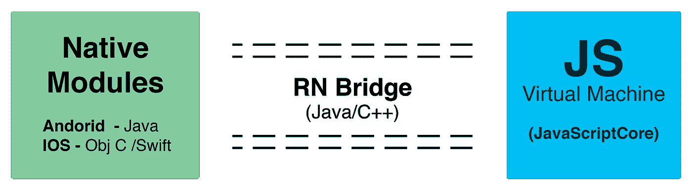
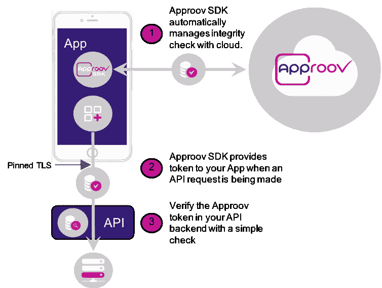
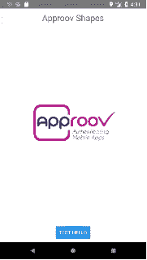
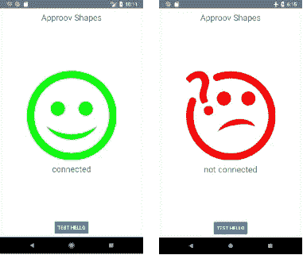
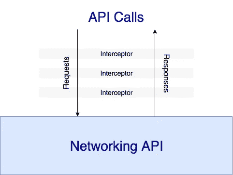
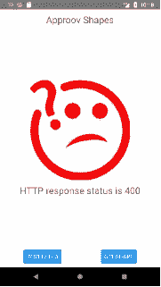
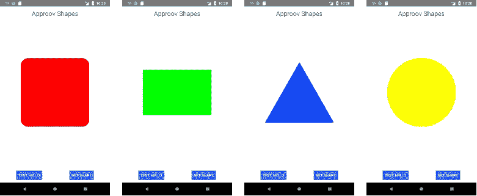

# React Native 的第一次体验:为应用程序认证桥接 Android 原生模块

> 原文：<https://medium.com/hackernoon/first-experiences-with-react-native-bridging-an-android-native-module-for-app-authentication-501fec247b2b>


Photo by [NGO TUNG](https://unsplash.com/photos/B76nvP51iew?utm_source=unsplash&utm_medium=referral&utm_content=creditCopyText) on [Unsplash](https://unsplash.com/search/photos/bridging?utm_source=unsplash&utm_medium=referral&utm_content=creditCopyText)

我的公司 CriticalBlue 提供名为[approv](https://www.approov.io/)的远程移动应用认证服务。Approov SDK 作为嵌入式库提供给原生 iOS 和 Android 应用程序开发人员。

随着我们的许多客户使用或试验 React Native，我希望提供一个方便的 Javascript 模块，向 React Native 开发人员公开 native Approov SDK 功能。

总的来说，创建我的第一个 React 原生模块非常简单。我最初的概念验证的所有代码都可以在 [github 库](https://github.com/approov/rndemo)中找到。

# 反应本地桥

对于 react Native，脸书提供了一个坚实的入门指南,介绍了基础知识，包括如何设置应用程序，以及底层 UI 组件与常见的 React web 元素有何不同。



from [React Made Native Easy](https://www.reactnative.guide/3-react-native-internals/3.1-react-native-internals.html)

在架构上，每个 React 本机应用程序中都运行着两个重要的线程——一个是主 UI 线程，另一个运行 Javascript VM。这两个线程通过一个桥进行交互，这个桥的通信是异步的、序列化的和批处理的，尽可能地将两个系统解耦。

虽然 React 本机应用程序的大部分是在 React 中描述的，并在 Javascript VM 上运行，但用户界面是使用本机平台的用户界面元素呈现的，改变应用程序用户界面的操作作为消息通过桥从 VM 传递到应用程序的主用户界面线程。

为原生设备环境开发的系统功能和库可以使用 React Native 的原生模块接口向 Javascript VM 公开，并通过 React Native 桥访问。

# Approov 原生 SDK

Approov SDK 是一个嵌入式原生 iOS 或 Android 库。它与基于云的 Approov 认证服务进行交互，该服务验证应用程序是真实的、未经篡改的，并且不是机器人。从身份验证服务返回一个应用程序完整性令牌，该令牌随每个 API 调用一起发送，以确保后端 API 服务正在处理一个已知的真实前端请求。

我们将在本机模块概念验证中公开的基本操作是`fetchApproovToken()`，这是本机 SDK 中的一个异步操作。



Approov-protected API call

在每个需要应用程序身份验证的后端 API 调用之前，客户端应用程序都会发出一个获取令牌的请求。如果需要新令牌，SDK 会发出远程证明请求，证明服务会对应用进行加密身份验证，并使用应用完整性令牌进行响应。

令牌的生命周期很短，并且由只有 Approov 服务和应用程序后端服务知道的秘密签名。应用程序中没有存储任何秘密，事实上，应用程序不知道返回的令牌是否有效。该应用程序只需将完整性令牌添加到后端 API 调用中，后端服务器在处理请求之前验证令牌是否已过期并正确签名。

# Approov 演示服务

Approov 提供了一个[可下载演示](https://approov.io/demo-reg.html)，它提供了演示 iOS 和 Android SDKs 以及一个具有两个端点的后端服务:

*   https://demo-server.approovr.io/hello[，提供一个公共可访问的测试点。](https://demo-server.approovr.io/hello)
*   [https://demo-server.approovr.io/shapes](https://demo-server.approovr.io/hello)，仅当请求包含有效的完整性令牌时，它才提供随机形状。

我们将使用 Android SDK 和后端服务来演示一个使用 Approov 的简单 React 本地应用程序。还提供了使用 iOS SDK 和 React native 的示例版本。

# 打招呼

我使用 create-react-native-app (CRNA)开始了我的 React Native 项目。按照 [CRNA 安装说明](https://github.com/react-community/create-react-native-app)设置 React 本地环境，然后:

```
$ create-react-native-app rndemo
```

我将在应用程序中添加本机代码，所以现在就从 create-react-native-app 中退出:

```
$ cd rndemo
$ yarn eject
...Ejecting is permanent! Please be careful with your selection.? How would you like to eject from create-react-native-app? React Native: I’d like a regular React Native project.
We have a couple of questions to ask you about how you’d like to name your app:
? What should your app appear as on a user’s home screen? RN Demo
? What should your Android Studio and Xcode projects be called? rndemoWrote to app.json, please update it manually in the future.
Generating the iOS folder.
Generating the Android folder.
...
```

选择一个常规的 React 原生项目，并随意命名。iOS 和 Android 项目已经生成，您需要安装 [Xcode](https://developer.apple.com/xcode/) 和/或 [Android Studio](https://developer.android.com/studio/) 构建环境。稍后，原生代码将添加到原生 Android 项目中。

我们将使用一个非常简单的概念验证应用程序进行实验，该应用程序将使用演示服务器 hello endpoint 来验证我们的网络连接。

React Native 实现了用于联网的[获取 API](https://facebook.github.io/react-native/docs/network.html) 。我们将连接检查、UI 呈现和样式化全部结合在`App.js`文件中:

顶层 App 组件注册在`index.js`文件中。

主视图由无状态视图组件呈现，该组件显示图像选项和状态消息:

我在这些例子中使用的是 Android，但是在 iOS 上也是一样的。启动一个 Android 模拟器(为此你可能需要启动 Android Studio)或者通过`adb`连接一部手机。在`rndemo`目录中，启动应用程序:

```
$ cd rndemo
$ yarn run android
```

您应该会看到这样的屏幕:



按下`TEST HELLO`按钮，如果一切正常，你应该会看到一条连接信息:



这验证了 React 本地应用程序和演示服务器之间的网络通信。您可以在手机或模拟器上设置飞行模式，然后再次按下测试按钮来验证是否不再有连接。

# Approov 本机模块

approv 演示包包括一个自述文件、iOS 和 Android Approov 演示库、示例客户端和应用程序注册工具。下载[演示包](https://approov.io/demo-reg.html)，保存下载邮件中包含的应用注册令牌。

Approov SDK 包含了我们想要公开的本机代码，以实现 React Native。它必须包含在我们弹出 create-react-native-app 时生成的 iOS 或 Android 原生项目中。对于 Android，这个项目位于`rndemo/android`。按照[approv 文档](https://approov.io/docs)中的这些[指令](https://approov.io/docs/androidclientapiuserguide.html#importing-the-approov-sdk-into-android-studio)将 Approov SDK 导入 Android 项目。

通过扩展`ReactContextBaseJavaModule`类，用 Java 描述了一个 Android 原生模块。必须实现`getName()`方法，并将模块的名称提供给 Javascript。

暴露给 React Native 的方法用`@ReactMethod`修饰，可能提供 Javascript 回调或承诺机制。我们将在例子中使用承诺。脸书的[原生模块页面](https://facebook.github.io/react-native/docs/native-modules-android.html)描述了其他功能，比如向 Javascript 发送事件和监听生命周期事件。

我们在本机模块构造函数中初始化 approv 身份验证的默认配置，并在`getName()`调用中定义‘approv’。

公开的`fetchApproovToken()`调用包装异步本机`fetchApproovToken()`并在令牌获取完成时完成承诺。

一个`ReactPackage`捆绑并创建一个或多个本机模块:

项目的主应用程序实现`ReactApplication`，并创建和返回一个模块包列表。我们将 Approov 包添加到`getPackages()`的列表中。

在 Javascript 方面，Approov 原生模块现在将包含在从`react-native`导入的`NativeModules`中。在我们的实现中，`Approov.fetchApproovToken()`返回一个普通的 javascript 承诺:

将原生环境和 Javascript 环境联系起来出人意料地简单。

# 截击机

许多网络库，如 [Axios](https://github.com/axios/axios) 和 [OkHt](http://square.github.io/okhttp/) tp，都包含了拦截器的概念。拦截器可以用来拦截网络请求和响应，并注入一些额外的处理。



当使用 Android SDK 本地实现时，大多数客户使用拦截器来获取 Approov 令牌并将其添加到每个 API 请求的头中，因此我们希望在生产模块中完全实现这一抽象。对于这个简单的例子，我们将在一个`fetchWithToken()`调用中硬连接拦截。

在`fetchWithToken()`方法中，当本地获取令牌调用完成时，如果承诺被解析，我们将令牌添加到输入请求头，并使用增强的输入请求进行`fetch()`调用。完成后，fetch 返回一个包含 API 服务器响应的解析承诺。

为了方便起见，我们从`NativeModules.Approov`对象创建了一个`Approov`对象，添加了一个`fetch()`方法，它实际上是`fetchWithToken()`方法，然后我们将其导出为`Approov`模块。

# 获取形状

现在我们准备使用`Approov`对象进行认证。我们在我们的`App`中添加了一个`getShape()`方法，该方法调用`Approov.fetch(request)`来验证和请求一个随机的形状值。一旦获取完成，`App`组件状态更新，触发`render()`调用，导致`ShapeView`显示更新的形状和状态信息。

按钮栏中添加了一个`GET SHAPES`按钮，用于请求新的形状。

一切看起来都很好，但是当我们请求一个新的形状时，我们看到一个带有 400 状态代码的失败，表明客户端请求有问题。



Failure to fetch a shape

调用失败，因为 Approov 添加的完整性令牌无效。在我们的示例应用程序正确注册到 Approov 服务之前，`fetchWithToken()`调用将始终无法通过身份验证检查。

演示下载中包含命令行注册工具。要注册应用程序，请发出注册请求，指定应用程序的 APK 捆绑包和您从演示下载电子邮件中保存的应用程序注册令牌。出于对其他演示用户的礼貌，请使用`-e`标志将您的注册设置为几小时后到期:

```
$ cd <<approov-demo-package>>/registration-tools/Android/Mac/
$ ./registration 
   -a <<rndemo-project>>/android/app/build/outputs/apk/app-debug.apk 
   -t <registration-token>
   -e 2hSubmitting data…
Success: new app signature added to database.always be done. 
```

一旦应用程序被注册并被正确认证，按下`GET SHAPES`按钮应该会返回以下形状之一:



Successfully fetching random shapes

# 中间的人攻击

在 API 调用期间，通信通道的安全性非常重要。如果通道不安全，API 调用可能会被拦截和修改。尽管完整性令牌的生命周期很短，但它可能会在不安全的通道中被观察到，并被用来进行恶意的 API 调用而不受惩罚。

尽管在发出 API 请求时使用 HTTPS/TLS，但同时控制网络和移动设备的攻击者可以轻松设置[中间人(MitM)攻击](https://en.wikipedia.org/wiki/Man-in-the-middle_attack)，在 Approov 令牌过期前窃取并快速重用它们。

为了应对 MitM 攻击，移动客户端应使用[证书或公钥“锁定”](https://www.owasp.org/index.php/Certificate_and_Public_Key_Pinning)，检查后端服务提供的证书或公钥是否为客户端应用程序所知。其他证书虽然看起来可信，但会被客户端拒绝，并且不会进行 API 调用。

在 React Native 中实现锁定有点复杂，将在另一篇文章中描述，并集成到这个示例的代码库中。

# 更进一步

我们已经在 React Native 中演示了一个本机模块实现，其中一个硬连线的拦截器成功地提供了应用程序验证和 API 保护。

React Native 的产品质量本机模块实现将概括拦截器功能，添加方便的配置方法，并提供完整的 MitM 保护。相比之下， [Cordova](https://cordova.apache.org/) 和 [Ionic](https://ionicframework.com/framework) 混合应用已经有了类似的[approv 插件库](https://github.com/approov/cordova-plugin-approov-http)。

这个例子的所有代码都位于 [github](https://github.com/approov/rndemo) 上。

感谢阅读！有关移动 API 安全性的更多信息，请查看。

如果你推荐这篇文章(点击👏按钮)以便其他人可以找到它。