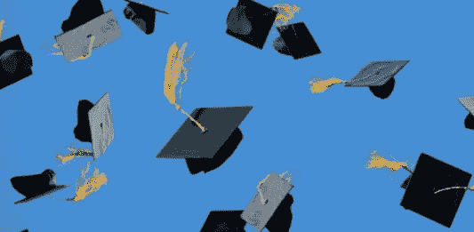

# 加拿大第一所通过区块链颁发毕业生证书的学校

> 原文：<https://medium.com/hackernoon/first-school-canada-diploma-credentials-blockchain-127a20403076>

## 使用基于以太坊的 dApp 是对日益增长的成绩单欺诈的回应

很快，南阿尔伯塔理工学院的毕业生将不仅仅获得一纸文凭。他们将很快通过安全的区块链密钥接收他们的凭证。位于卡尔加里的技术专上学院是加拿大第一所颁发区块链担保证书的学校，也是全球十几所学校之一(包括麻省理工学院和斯坦福大学)。

> "二级后学校不得不处理越来越多的伪造成绩单的案例."
> 
> 尼拉·阿罗拉，SAIT 书记官长

SAIT 首席信息官丹尼尔·达菲(Daniel Duffy)表示，由于比特币和其他加密货币，大多数人可能都熟悉区块链技术。然而，金融交易只是它的第一个用例。区块链在许多领域都有应用，包括存储安全和私人信息。

> “区块链是一种技术，其功能是公共的、分布式的和不可改变的账本。它通过对个人数据进行加密，赋予学生对其个人数据的所有权，因此只有他们才能访问这些数据。”
> 
> 丹尼尔·达菲，SAIT 的首席信息官

不再需要联系学校来核实成绩单的雇主。过去，学生必须订购一份成绩单，学校的一个部门会处理成绩单并邮寄出去。毕业生将能够立即把他们的证书寄给雇主或其他机构，而不收取任何费用。机构也将立即能够验证证书是否合法，而不需要学校邮寄硬拷贝。

## 建造在以太坊上

毕业生证书将通过一个建立在以太坊区块链上的 dApp 来颁发，该 dApp 由按需教育市场(一个开源的智能计算平台)开发。

这些证书将链接到一个加密的、防篡改的数字签名，可以与该机构的数字签名实时交叉引用。

首批获得新证书的毕业生将是 2018 年 12 月从就业前汽车服务技术员项目毕业的 25 名学生。

*订阅我在* [*上的频道*](/@minadown) *和*[*Twitter*](https://twitter.com/minad21)*如果你喜欢我的文章并想了解更多的区块链和加密货币项目。

如果您对本文有任何疑问，请在下面的部分发表评论。谢谢大家！*