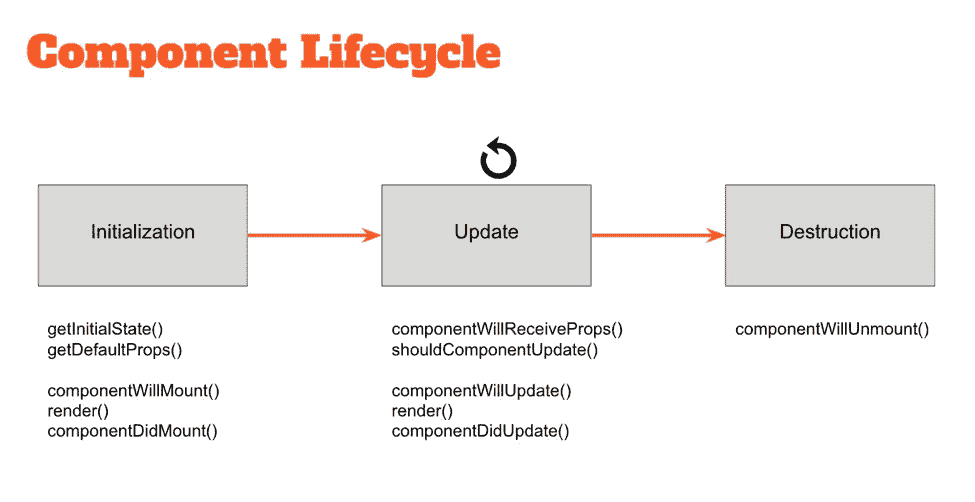

# react 的第一步

> 原文：<https://medium.com/hackernoon/first-steps-in-react-ef8c000c0585>

有一次，我试图向我的朋友描述 react 是什么，为什么它这么快，为什么它这么受欢迎。他知道它使用虚拟 DOM，为更新制作补丁，不接触所有其他页面。

但是当我开始描述什么是组件以及如何将它们组合成大组件，什么是有状态和无状态，纯组件时，他不明白。我想这是因为我们刚刚谈过，我没有给出例子。


所以在这里我会试着展示一些例子。

但是在我想分享一些有用的运行示例的资源之前:

## 在线的

*   [https://codesandbox.io](https://codesandbox.io)
*   https://jsfiddle.net/
*   [https://codepen.io](https://codepen.io)

我认为第一个链接 CodeSandbox 是最有趣的:

[](https://hackernoon.com/codesandbox-an-online-react-editor-b8945ce095d2) [## code sandbox——在线 React 编辑器🏖

### 一个多星期前，Bas Buursma 和我发布了 CodeSandbox:一个专注于分享的在线代码编辑器…

hackernoon.com](https://hackernoon.com/codesandbox-an-online-react-editor-b8945ce095d2) 

## 脱机的

为了在你的电脑上运行 react，你需要[安装 node.js](https://nodejs.org/uk/download/package-manager/) (试试 [nvm](https://github.com/creationix/nvm) 或者 [docker](https://hackernoon.com/making-right-things-using-docker-7296cf0f6c6e) )。

*   [创建-反应-应用](https://github.com/facebookincubator/create-react-app)
*   [故事书](https://storybook.js.org/)

或者你可以阅读我的文章《如何在你的电脑上安装完整的 react 生态系统》:

[](/@evheniybystrov/react-app-from-scratch-d694300d1631) [## 从头开始反应应用程序

### 这是教程的第一部分，我将展示如何从头开始创建 react 应用程序。

medium.com](/@evheniybystrov/react-app-from-scratch-d694300d1631) 

# 什么是组件？

在我们开始之前，我需要解释什么是组件？

[组件](https://reactjs.org/docs/components-and-props.html)让你将用户界面分割成独立的、可重用的部分，并孤立地考虑每一部分。例如，标题组件可能是这样的:

```
<h1>Hello, {this.props.name}</h1>
```

你可以创建其他组件，并把它组合成一个大组件，就像 HTML 中的标签一样。

可能有**有状态**和**无状态**组件，其他名称:智能/愚蠢、容器/组件。如果谈论表单输入(文本、按钮、复选框……)组件是可以控制的。

所以还是一个一个来查吧。

## 有状态和无状态范例

如果你使用 JavaScript，你可以使用类或函数。

一个*类*是一个蓝图或者模板或者一组指令来构建一个特定类型的对象。每个对象都是从一个类构建的。它们是同一个类的实例，但由于各自的状态不同而不同。您不能比较对象。

```
class Component {
  state = {}; render() { }
}const firstComponent = new Component();
const secondComponent = new Component();firstComponent !== secondComponent
```

如果您使用没有副作用的函数—纯函数，您可以通过传递相同的参数来重复相同的结果。

```
function buildComponent(text) {
  return `<h1>${text}</h1>`;
}const firstComponent = buildComponent('Hi');
const secondComponent = buildComponent('Hi');firstComponent === secondComponent
```

## 有状态组件

因为 JS 中的对象有自己的状态，并且是使用类创建的，所以有状态组件是从 React 扩展的类创建的对象。分量或反应。PureComponent(使用它来避免无用渲染)。

使用有状态组件的主要原因是管理应用程序或组件的状态。

您可以使用 this.setState 方法通过放置普通对象来更改状态

```
this.setState({comment: 'Hello'});
```

或功能:

```
this.setState((prevState, props) => ({
  counter: prevState.counter + props.increment
}));
```

但是不要使用手动更改:

```
// Wrong!!!
this.state.comment = 'Hello';
```

没用的。别忘了渲染是异步操作。

另一个原因是为了管理组件的生命周期。



您可以阅读有关生命周期的更多信息:

[](https://engineering.musefind.com/react-lifecycle-methods-how-and-when-to-use-them-2111a1b692b1) [## React 生命周期方法——如何以及何时使用它们

### 以上是 React 组件的生命周期，从出生(预安装)到死亡(卸载)。

engineering.musefind.com](https://engineering.musefind.com/react-lifecycle-methods-how-and-when-to-use-them-2111a1b692b1) 

## 无状态组件

无状态组件只是一个纯函数。它获取属性并返回组件。

或者使用新的 ES6 标准，我们可以使用箭头功能:

所以如果你喜欢函数式编程，你可以这样使用它: **props = > jsx** 。

太简单了，太有用了。

## 受控组件

如果您需要从表单输入(复选框、输入文本、文本区)获取数据，您需要使用带状态的组件。

在这种状态下，您可以存储更新、呈现更新并将其返回给高阶组件以处理该数据。

让我们看看更多有用的例子。如果我们希望在提交时发送名称，我们可以将 form 编写为一个受控组件:

Input 通过输入数据改变状态，在提交表单时，处理程序可以访问状态，并可以对其进行任何操作。

另一种方法是使用 [react ref](https://reactjs.org/docs/refs-and-the-dom.html) 从 DOM 获取数据，但这不是 react 方法。

## 状态

州可以是全局的和局部的。使用 [**redux**](https://redux.js.org/docs/introduction/) 可以更好地管理全局状态，但是对于小型应用程序，您仍然可以使用有状态组件。

对于管理本地状态(表单输入)，您可以使用有状态组件或 [**重组**](https://github.com/acdlite/recompose)——为您提供一组用于管理状态、生命周期的高阶组件(HOC)的库...

使用重组，您只能使用功能组件。我将在下一篇文章中更多地描述这个库。

 [## 反应“啊哈”时刻

### 作为一名教师，我的一个主要目标是最大化人们的“啊哈”时刻。

medium.freecodecamp.org](https://medium.freecodecamp.org/react-aha-moments-4b92bd36cc4e)