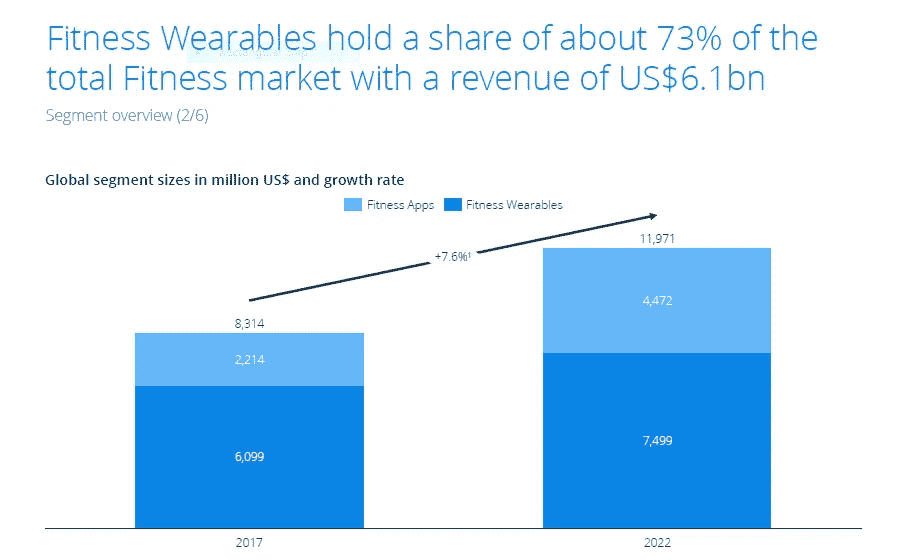
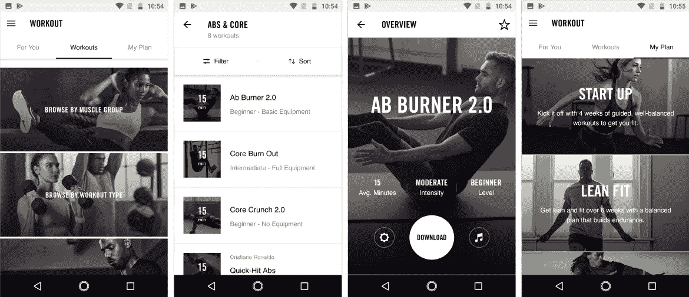
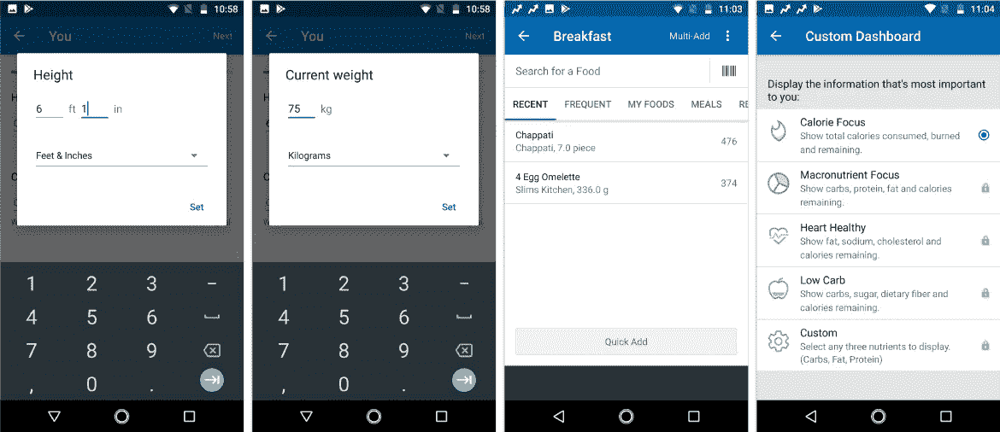
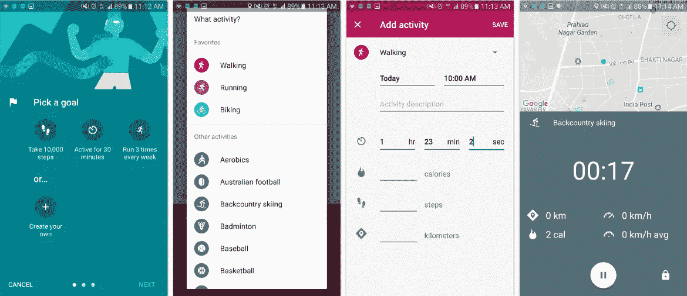

# 健身应用——资金最多、回报最高的初创企业

> 原文：<https://medium.com/hackernoon/fitness-apps-the-most-funded-and-rewarding-start-ups-655b1b456450>

当你在午夜毫无头绪地更换电视频道时，你可能会在一个出售健身器材的广告前停下来，这种器材会让你的腹部出汗，并神奇地塑造你的腹肌。如果你像许多其他人一样，你的意识可能会激发你获得一个健康的身体。但是因为你和许多其他人一样，你足够聪明，明白这个设备是没有用的，你需要一个务实的解决方案。

一如既往，科技让我们的生活变得更加轻松，健身也不例外。健身应用和可穿戴设备让人们更容易采取健康的生活方式并保持健康。

每天，健身应用的使用率都在飙升。如果你不相信我，看看这些迷人的数据。

根据 Technavio 的一项研究，到 2020 年底，全球健身应用市场将会以大约 31%的 T2 CAGR 增长。

T4 统计局的一项调查显示:

–就收入而言，美国是领先的国家，**2017 年为**US**21 亿美元。**
**—** 欧洲增长最快的部分是**健身应用，年收入增长 14.7%**
**—**在美国，**2017 年有 3950 万用户为健身应用或可穿戴设备付费**。

你看到健身 app 行业有多大了吗？上述统计数据清楚地显示了它的受欢迎程度，这是所有的钱-钱生意。

请听我说，因为我们将深入了解它的细节。

# 健身应用的普及和增长

在过去的几年里，千禧一代越来越意识到健身，并改变他们的生活方式以获得更好的健康。每个人都想保持健康，有一个可以炫耀的体格和一个没有疾病的身体。所有这些欲望都刺激了健身 app 的使用。

这些应用程序越来越受欢迎，因为它们让用户更容易锻炼、跟踪、分析和正确饮食。

根据 Statista 的统计数据显示，配备传感器的健身手表，测量和分析身体活动和身体功能的活动跟踪器，测量身体功能的智能衣服或眼镜，用于检测/跟踪/分析和分享活力和健身成就的健身和营养应用程序，以及另外提供应用程序的桌面版健身应用程序，预计将在未来几年内出现巨大增长。

健身细分市场在 2017 年的收入为 83 亿美元，其中可穿戴设备占据了整个健身市场约 73%的份额，收入为 61 亿美元。

成为热门话题的技术自然会吸引投资者的眼球。最近的趋势表明，许多投资者热衷于资助健身[移动应用开发](https://www.techuz.com/mobile-application-development/)项目。

# 投资者被吸引投资健身应用

运动和活动跟踪公司[hook 已经为他们的风险投资筹集了 2500 万美元的资金。投资者包括 NFL 球员协会、杜兰特公司、Twitter 高管杰克·多西、前 NBA 专员大卫·斯特恩和麻省理工学院媒体实验室创始人尼古拉斯·尼葛洛庞帝。](https://techcrunch.com/2018/03/06/whoop-raises-25-million-to-tell-everyone-from-athletes-to-execs-about-their-health/)

*(来源-http://hook . com/)*

最近，三星 Next 投资了 HealthifyMe，这是一款总部位于印度的健身应用程序，可以帮助用户跟踪他们的卡路里摄入量，并提供个性化的教练。

甚至在以前，许多健身应用初创公司都成功地吸引了投资者的资金。其中一些:

**–**[**grow fit**](https://getgrowfit.com/)，一家由 GrowthStory 支持的风险企业在 2017 年已经筹集了 450 万美元。

**–**[**cure . fit**](https://www.cure.fit/)by Flipkart 高管 Ankit Nagori 和 Myntra 联合创始人 Mukesh Bansal 从 UCRNT 基金 A 轮融资 300 万美元。2016 年 7 月，它已经从其他投资者那里筹集了 1500 万美元。

**–**[**fit SOA**](https://www.getfitso.com/)，一个在线私人教练和营养应用程序筹集了 20 万美元。

# 你有什么好处？

如果你正在寻找一家回报丰厚、获得资助并帮助人们改善生活的初创公司，那么一款健身应用可能是你的绝佳选择。随着这些应用程序的使用和有兴趣投资的投资者的爆炸式增长，健身应用程序初创公司可能会硕果累累。

# 你可以选择的健身应用类型。

现在你知道了，健身应用程序越来越受欢迎，投资者已经准备好投入资金。但是在你打算做自己的健身 app 之前，你需要了解他们的类型。这些应用程序可以分为三类。

**1。健身程序应用程序**
**2。食物和营养应用程序**
**3。活动追踪器**

## #1.锻炼应用程序

顾名思义，锻炼应用程序专注于锻炼。这些应用程序提供了锻炼和锻炼以及如何进行锻炼的详细指导和说明。解说可以是 3D 模型、Gif 或者视频的形式。这些应用程序还根据用户的目标提供个性化的训练计划。一些应用程序甚至可以与可穿戴设备同步，帮助检查和分析收集的数据。

*(Nike Training Club —健身程序&健身计划应用)*

## #2.食品和营养应用

食物和营养应用程序主要帮助用户跟踪他们的卡路里、水和咖啡因摄入量，从而帮助他们养成健康饮食的习惯。这些类型的应用程序根据用户的目标提供营养计划，划分宏观和微观营养，帮助他们保持体重和体脂。

*(MyFitnessPal.com:卡路里计数器&饮食日记 App)*

## #3.活动跟踪器

活动跟踪器是监控身体活动的应用程序。它使用地理定位来计算用户步行或跑步的距离。这些应用程序还可以跟踪心跳、睡眠量、燃烧的卡路里等，并与可穿戴设备同步。

*(Google Fit——健身追踪应用)*

# 包裹

随着人们关注健康、幸福和更健康的生活，健身应用程序行业蓬勃发展，并将在未来几年继续增长。这可能是打入市场获取回报的最佳时机。作为[顶级移动应用开发公司](https://www.techuz.com/)，Techuz 可以帮你开发你需要的健身应用。我们擅长使用最新的技术和工具来开发 Android 和 iOS 应用程序，以及使用 WatchOS 和 Android gear 的可穿戴设备。如果您需要任何帮助或有任何疑问，我们随时都可以为您提供帮助。随时[联系我们](https://www.techuz.com/contact-us/)！

*原载于 2018 年 3 月 23 日 www.techuz.com***。**