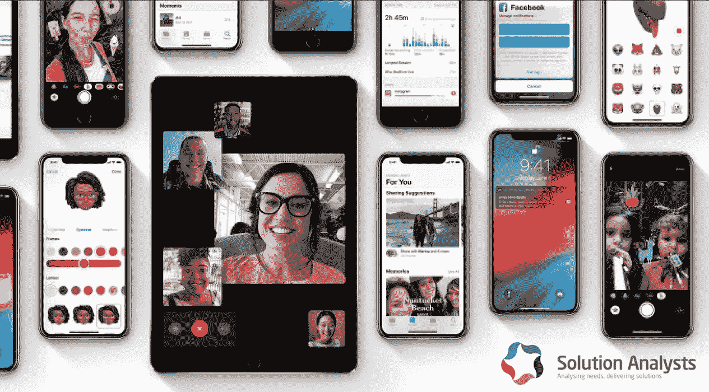

# 企业家应该转用 iOS 12 的五大理由

> 原文：<https://medium.com/hackernoon/five-fantastic-reasons-why-entrepreneurs-should-switch-to-ios-12-f2e408de3faf>

苹果公司的 Craig Federighi 声称，在最近的 WWDC 活动中，他们对 iOS 12 的性能加倍。看看它的公开测试版，他的说法似乎是真的。虽然最新版本没有任何突出的功能，但它成功地消除了 iOS 11 的所有故障。换句话说， [iOS](https://hackernoon.com/tagged/ios) 12 不像它的前辈那样引人注目，但它能够在 iPhones 和 iPads 上提供无缝的性能。

当谈到企业级 iOS 应用程序时，一家 iOS 应用程序[开发](https://hackernoon.com/tagged/development)公司努力利用 iOS 平台提供的所有好处。随着 iOS 12 的到来，企业家可以期待更强大的应用程序，这些应用程序可以在各种型号的 iPhones 和 iPads 上无缝运行。在这里，我们给出了五个令人信服的理由来切换到 iOS 12 或使他们的应用程序兼容 iOS 12:

# #1 旧 iPhones 变得更快

最新的 iOS 12 应用程序启动速度加快了 40%，键盘打开速度加快了 50%，这一切都为最新的 iPhones 提供了动力。但是，好消息是:这些重大改进不仅限于即将推出的 iPhones。由于这些性能增强，从 iPhone 6+到 iPad Air 等 iPad 的旧款 iPhone 可以运行得更快。

兼容 iOS 12 的商业应用程序可以更快地打开，同时也可以在旧款 iPhones 和 iPads 上无缝工作。由于 iOS 12 提供了广泛的设备支持，数以亿计的 iPhone 和 iPad 用户将更新他们的设备。在这样的场景下，创业者可以带来持久的商务移动应用。

# #2 通知越来越好

“通知”是 Android 最好的功能之一，苹果在 iOS 12 中智能地模仿了它。该版本带来了群组通知功能，使忙碌的员工能够跟踪收到的消息、应用程序相关的提醒以及日常任务。用户还可以使用此功能根据通知的重要性为其分配级别。

“停机时间”是另一个有用的功能，可以限制设备拨打或接听电话，以及使用用户定义的某些应用程序。在工作场所推广 BYOD 和移动性的同时，企业家可以利用这一功能来防止 iPhones 和 iPads 在工作时间对员工的生产力和能力产生任何负面影响。

# #3 Siri 通过“快捷方式”变得更强大

Siri 是最有前途的虚拟助手之一。新的“快捷方式”对企业用户和客户都更有用。现在，通过 Siri 的扩展功能，可以轻松实现工作和个人活动的自动化。快捷方式功能使用户能够对与主活动相关的一系列动作进行编程。

随着 Siri 在 iOS 12 中变得更加智能，该应用程序使企业家能够利用机器智能的好处。

# #4 对电话使用的更多控制

随着我们越来越依赖智能设备，有必要对使用进行更多的控制。除了应用程序的限制，iOS 12 扩展了勿扰模式的概念。现在，这项功能被称为“睡前勿扰”，它将停止屏幕通知以及手机的铃声和振动。它帮助用户保持工作与生活的平衡。

更重要的是，新的 iOS 12 带有活动使用报告，可以向用户提供他们使用 iPhones 或 iPads 进行在线活动的所有细节。

# #5 商业增强现实的到来

ARKit 2 的出现将未来 AR 技术的范围扩展到了游戏之外。多人支持和在消息和邮件中发送基于 AR 的对象的能力是两个可以彻底改变开发者在商业应用中使用增强现实的方式的功能。新的 AR 应用 Measure 也为企业 iOS 应用开发打开了新的机会之门。

企业家现在可以通过基于 iOS 12 的应用程序利用 AR 开发培训指南、操作程序、现场指南等。

除了这些原因，iOS 12 还为企业用户提供了许多其他东西。例如，最新的 iOS 版本保持了增强安全功能的传统，引入了双重身份验证、[对第三方密码管理器](http://www.applemust.com/wwdc-apples-password-manager-api-puts-ios-in-the-dashlane/)的扩展支持以及其他隐私改进。

暂时就这样吧！您可以雇佣 iOS 应用程序开发人员，以经济高效的方式利用这一 iOS 版本的优势。无论你有一个 iOS 应用程序，还是你有一个针对 iPhone 和 iPad 用户的应用程序想法，你都可以联系一个可靠的 [iPhone 应用程序开发公司](https://www.solutionanalysts.com/iphone-app-development/)来获得一个兼容 iOS 12 的企业应用程序。