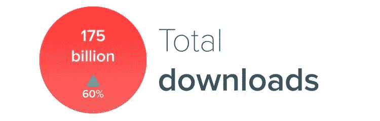
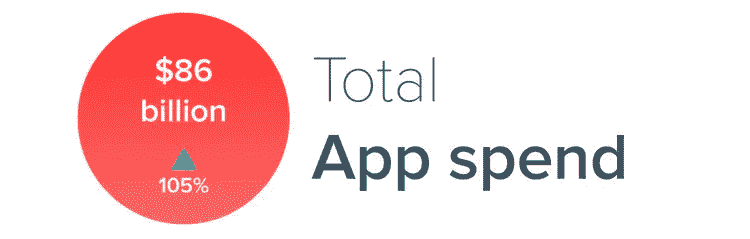
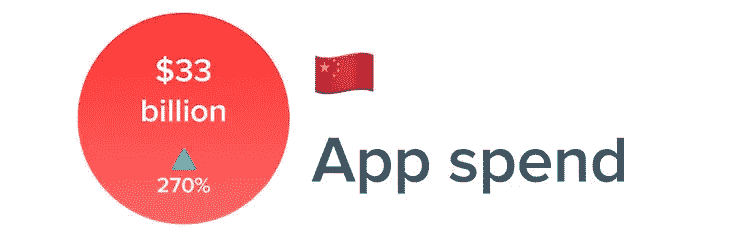

# 应用开发者应该知道的五个关键移动应用统计数据

> 原文：<https://medium.com/hackernoon/five-key-mobile-app-statistics-app-developers-should-know-af6fe432578>

当然，从应用程序使用到收入，每年都有报告。我们欢迎这些，它们可以为开发者提供关于应用程序经济的重要信息。但通常很难理解这些趋势将如何影响你的应用。

所以我们尽力帮忙。我们将根据去年的数据来看五个有趣的统计数据。然后，我们将尝试了解这些趋势显示了什么，它将如何影响货币化、参与度和其他应用程序指标。我们还将探讨开发者如何采用他们的应用策略来适应这些趋势。

 [## 相关阅读:应用程序货币化终极指南

### 正如我们之前提到的，这仍然是应用程序所有者中最受欢迎的。这通常会引发很多讨论…

www.tamoco.com](https://www.tamoco.com/blog/ultimate-app-monetization-guide) 

# 去年，移动设备应用程序下载量超过 1750 亿次

Source: [App Annie](https://www.appannie.com/en/insights/market-data/app-annie-2017-retrospective)

这比 2015 年增长了 60%。这是健康的，这有几个原因。

首先，越来越多的应用程序可以免费使用或试用，越来越多的开发者发现这种模式很有吸引力。对于消费者来说，这意味着应用程序可以免费下载。随着订阅模式和其他下载后盈利模式的兴起，这对出版商来说也是个好消息。

流通中的智能手机数量有所增加，尤其是在新兴市场。移动应用的迅速普及表明应用增长仍有巨大潜力。

移动设备现在有了更好的存储选择。用户以前必须小心管理设备存储。较新设备上的最低存储级别增加了，更便宜的云选项为以前会占用太多空间的应用程序留下了更多空间。

最后，人们开始优先使用移动设备来完成通常在移动设备上很难完成的任务。应用程序现在更加安全和用户友好。一个例子是 [VPN 应用](https://www.top50vpn.com/best-vpn-app)的兴起。这使得购物或理财等任务变得更加容易。

## 开发者能从中学到什么？

你应该考虑让你的应用免费下载，并在[应用体验](https://www.tamoco.com/blog/mobile-app-design-ux-ui-engagement/)后赚钱。用户越来越希望应用程序是免费的。

虽然保持你的应用程序尽可能小仍然很重要，但这并不像以前那样是一个很大的障碍。相反，用户正在寻找能帮助他们在手机上完成任务的应用。积极的用户体验对用户来说很重要。他们希望能够在出色的应用程序体验中做强大的事情，而不必打开笔记本电脑。

# 2017 年，消费者支出超过 860 亿美元

Source: App Annie

当我们看用户的总支出时，这些数字令人乐观。得益于发展中国家智能手机普及率的提高，这一增长势头依然强劲。出版商从用户那里获取更多收入的能力不容忽视。

在应用商店方面，iOS 中的应用收入仍然高于 Google play。2017 年，应用商店的全球总收入达到 385 亿美元，而 Google play 商店的总收入为 201 亿美元。

这表明苹果产品确实继续吸引用户，平均来说，用户更有可能通过应用程序支付现金。然而，两家商店的收入增长水平相似，都在 35%左右。

持续的增长表明出版商正在成功实施货币化战略。这使得他们能够从每个用户身上获得更多的收入。这可能包括订阅和免费增值等。

开发商将很高兴看到顶级市场的货币化保持了大幅增长——美国为 70%，英国为 35%。但就应用程序开发而言，去年的真实情况是发展中市场的增长规模。

简而言之，应用经济现在处于一个非常好的位置。2017 年消费者支出翻了一番。出版商需要考虑他们在发达市场的盈利策略。在这方面，他们需要平衡体验和盈利。除此之外，他们应该寻找新的赚钱方式，而不是选择广告方案。

# 从 2016 年到 2017 年，中国的 App store 消费者支出增长了 270%

Source: App Annie

新兴经济体的 App store 支出增长速度要快得多。

中国和新兴市场是开发者在应用货币化方面应该关注的绝佳例子。去年，应用程序在市民的日常生活中广泛使用。就像应用程序彻底改变了其他生活方式一样，同样的事情也发生在新兴市场。这是因为越来越多的人使用移动设备来执行日常任务。

其他发展中国家下载量的快速增长将提供更多的增长机会。

现在，这些新兴市场的下载量与应用开发者的同等收入之间存在差距。货币化的潜力巨大。出版商需要采取行动，以确保他们能够利用最大的赚钱机会之一。

此外，印度和巴西的应用程序使用量也在以惊人的速度增长。就应用程序下载数量而言，印度目前位居全球第二。在这些经济体中，安卓设备更受欢迎。这意味着确保您能够支持这两个平台可能是持续增长的关键。

## 这一切对开发者意味着什么？

首先，我们仍然可以得出结论，就货币化潜力而言，普通 iOS 用户比 Android 用户更有价值。但是两个操作系统的增长都很稳定。

出版商在购买点后的成功盈利继续推动着发达市场的收入。订阅模式和其他模式让发行商有时间教育和吸引用户了解他们的应用价值。这鼓励更好的货币化。广告仍然是应用收入的一个重要来源。但应用即服务的数量正在增加，开发者从这种货币化模式中获得了良好的结果。

在发达市场，应用发现变得越来越困难。但是，下载后通过货币化获得收入的潜力正在增加。

发展中国家的移动应用正在急剧增加。新设备的快速普及意味着大量的新用户。与发达市场相比，这些用户的价值仍然很低。但是，将对这些新市场的关注与[转化率优化](https://www.rich-page.com/website-optimization/the-ultimate-guide-to-conversion-rate-optimization/)相结合，仍然代表着收入增长的巨大机遇。

# 每个移动用户每年在应用上花费 1.5 个月

Source: App Annie

可以肯定地说，用户在应用上花费的时间越来越多。平均而言，用户使用更多的应用程序也是非常确定的。去年，用户平均每天花在移动应用上的时间超过 3 小时。

这为开发者创造[有效的参与策略](https://www.tamoco.com/blog/app-engagement-and-retention-guide)提供了更多的机会。用户希望在移动设备上完成更多任务，他们喜欢在应用程序中完成这些任务。

提高[的终身价值和客户满意度](https://www.tamoco.com/blog/mobile-app-design-ux-ui-engagement/)是创建一个成功应用的关键部分。能够使用应用程序会带来更好的盈利，并有更多的机会快速增加你的用户群。

这里发生了两件事。在发达市场，用户在手机上做更多的事情。但在新兴市场，用户已经跳过了使用台式机，首次将手机视为完成某些任务的有效方式。

现在是开发者把体验放在应用策略中心的时候了。他们的应用程序解决方案应该利用用户在移动设备上完成的任务量的增加。在某些方面，参与比下载更重要——如果你不能让用户留在你的应用中，那么你就会流失用户，很快就会有一个毫无价值的应用。这些数字表明，用户想要积极的体验和在应用程序中完成目标的能力——开发者应该专注于实现这一点。

# 智能手机用户平均每月访问大约 40 个应用程序

Source: App Annie

在手机上完成的任务比以往任何时候都多。

你可能认为所有的时间都花在了更大的应用程序上。事实根本不是这样。用户希望应用程序执行各种只能由单个应用程序完成的任务。用户在每个类别中寻找功能强大的应用程序，他们选择具有最佳体验和最佳工具的应用程序来完成相关工作。

参与对货币化当然很重要。让用户保持参与和快乐是创造高收入的关键。这就是为什么这些数据对开发者来说是有希望的。如果你能成功实施一个伟大的参与战略，你将能够有效地赚钱。

随着应用受到越来越多的关注，发行商需要理解这对他们的应用意味着什么。这可能意味着专注于 UX，并理解如何改善这将意味着更多的参与用户。或者这可能意味着专注于[推送通知](https://www.tamoco.com/blog/app-push-notifications-complete-guide)如何提高应用的留存率。

## 这对开发者意味着什么？

随着用户在应用上花费更多时间，并使用应用来解决问题和完成任务，开发者需要抓住机会，确保他们的应用提供无缝的用户体验。

经验是成功货币化的关键。寻求增加收入的出版商，尤其是新兴经济体的出版商，需要专注于留住用户。

统计数据显示，用户在应用上花费的时间越来越多，但他们不会选择任何旧的应用来达到他们的目标。应用程序仍然需要强大，它们仍然需要有良好的体验来吸引和留住用户。