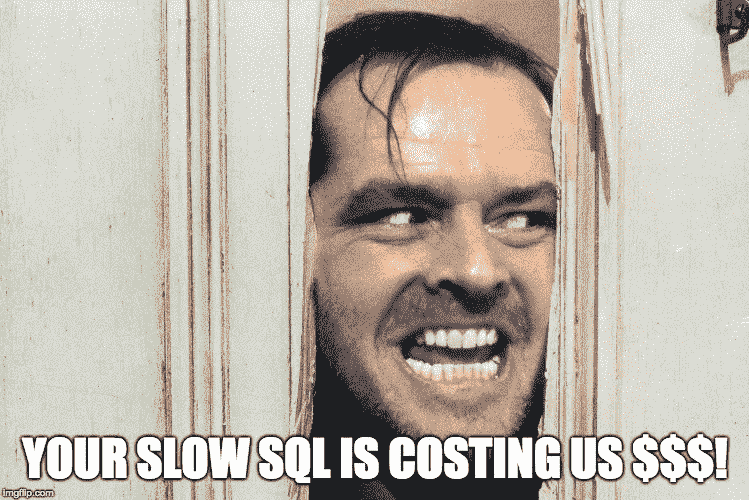
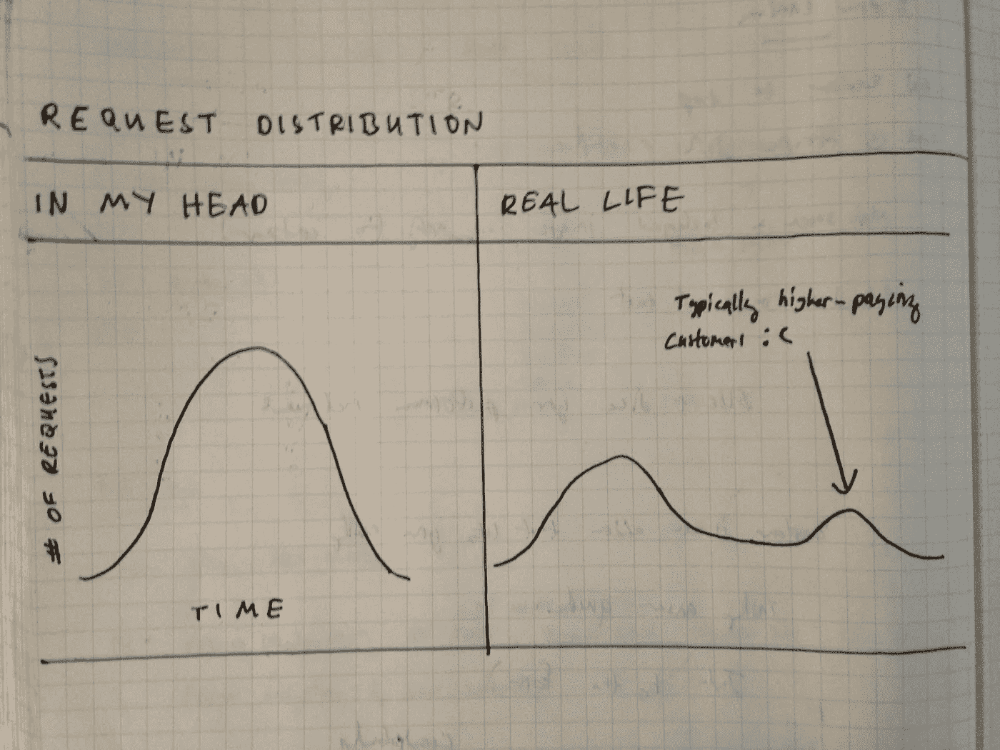
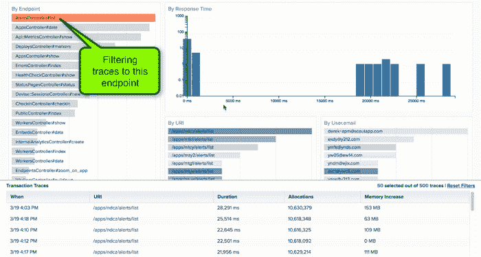

# 来自 3650 天网络表演工作的五个教训

> 原文：<https://medium.com/hackernoon/five-lessons-from-3-650-days-of-web-performance-work-6ec3a262fa88>

Moscow Olympics Team Pursuit. [Via Anders on Flickr](https://www.flickr.com/photos/40365317@N06/4830395488/in/photolist-8mR3hQ-VK5gdg-VWw6gt-4Zgb7y-eiZAf9-ToaZxR-ggVW8u-obdee9-bBDCoK-YZm1P7-ejE4Mi-pQVTnu-8V3jio-qKugvv-auWcfw-kf49t5-eip2ck-4J7KaW-4GhD7g-bSTDrF-kf2tF6-gigEsc-cWw2F-kkrnXf-nypDAr-ei5MG2-8vydqG-byZwhP-6QSVZF-kf2tCv-8MPcLE-8F1Adr-cWw2g-byZvwV-6TLakr-dmTFbX-dcuE7X-cE9DYW-cC5Wf5-7EZNKg-UBN9fV-6Uwnt4-8vuiDZ-djQ1Dz-ivX65c-crj4YC-8vv83p-cWw1e-8ML4MZ-8vuowe).

> *披露:* [Manifold](https://hackernoon.com/r/?url=https%3A%2F%2Fgoo.gl%2FcF8TcH) ，独立开发者服务市场*，之前赞助过黑客正午。* [使用 code HACKERNOON2018 获得任何服务 10 美元优惠。](https://hackernoon.com/r/?url=https%3A%2F%2Fgoo.gl%2FcF8TcH)

在我职业生涯的最后十年，我一直专注于让 [Rails](https://scoutapp.com/ruby-monitoring) 、 [Elixir](https://scoutapp.com/elixir-monitoring) 和 [Python](https://scoutapp.com/elixir-monitoring) 应用程序运行得更快、更平静。以下是我从惨痛的教训中学到的五个语言不可知论者的教训。

## 1.不要通过案例研究来激励，要用潜伏的情感代价来激励

每 [100 毫秒的延迟](https://www.digitalrealty.com/blog/the-cost-of-latency/)会让亚马逊损失 1%的销售额！多 500 毫秒的页面加载时间会让谷歌的流量下降 20%!比竞争对手慢 [5 毫秒](https://www.slideshare.net/EquinixUK/the-centre-of-performance-infographic)的电子交易平台会导致每毫秒 400 万美元的收入损失！

网络表演公司喜欢制造恐慌。这种宣传经常是从案例研究中摘录极端场景。作为应用性能管理(APM)公司 [Scout](https://scoutapp.com) 的联合创始人，你可能希望我制作信息图，展示你的缓慢的、无索引的 SQL 查询是如何拖累你的业务的。不装 Scout 你就要为雇主的早逝负责！

现实是，我们黑客正午社区中的大多数人并不对亚马逊或谷歌这样规模的应用负责。我们无法做出科学合理的研究，将我们应用的延迟与收入联系起来。对每个团队来说，真正的问题是——无论是谷歌规模的还是 99%的非谷歌规模的应用——一连串不可预测的稳定性问题传播着不信任。当随叫随到的开发人员筋疲力尽，销售和支持团队无法信任技术团队时，有害的工作环境和客户关系就会形成。

你需要一个可靠的网络应用程序，就像你不想强调你的汽车在一周的公路旅行中会如何停滞不前一样。一个可靠的应用程序是一个健康公司的核心情感需求。

## 2.更少关注平均值，更多关注异常值

十年后，仍然很难不把 web 应用程序请求的响应时间分布看作一条钟形曲线。感觉很自然的事情与现实生活中实际发生的事情:

这意味着**如果你基于聚合数据优化你的应用，你就是在优化一个不存在的场景**。为了更好地理解最慢的请求发生了什么，**您需要访问未过滤的事件**。例如，对于系统中有大量数据的高级用户来说，请求可能比较慢。

工具仍在努力处理这些高维事件。Scout 是一种工具，允许您通过跟踪资源管理器研究从原始事务跟踪中收集的数据:

向 LogDNA 和 Honeycomb 这样的系统发送结构化日志和事件也是探索更一般的多维数据的好方法。

## 3.暂存环境几乎毫无用处

除了为开发中无法模拟的主要变化进行实践之外，我发现阶段环境是一片荒地。在转移环境中精确复制生产环境通常成本高昂，转移环境的负载远低于生产环境。阶段化最终成为开发和产品之间的一个奇怪的中间阶段。

## 4.为数据库帮助付费并不可耻

**对于 web 应用程序，数据库是最常见的瓶颈。**扩展数据库涉及很多内容。我们在 Scout 花的一些最划算的钱是在我们成长的时候请来了 Percona 来帮助我们配置数据库。知道自己没有 DBA 超能力也没关系。

## 5.伐木很便宜。使用它。

当客户报告问题时，我只能说“对我有效”，我觉得自己很无能。如今，我比十年前更加积极地记录代码的敏感区域。一个健壮的测试套件不能代替产品中可能出现的所有奇怪的边缘情况。

## 摘要

当你创建一个更冷静的 web 应用程序时，你会把这些相同的特征灌输到你公司的 DNA 中。