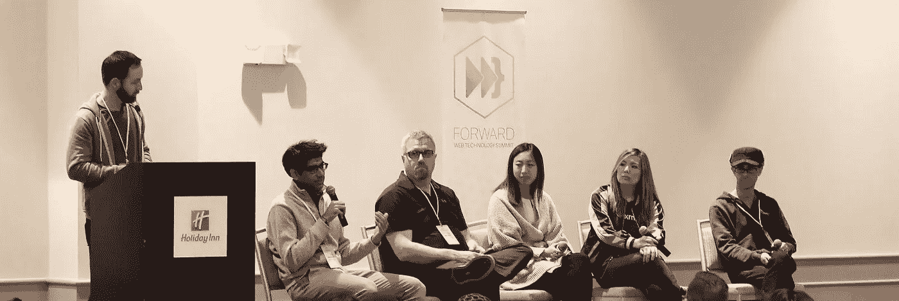

# 五个流行的 JavaScript 技术讲座:JWT、异步/等待、数组/对象和 Jest

> 原文：<https://medium.com/hackernoon/five-popular-javascript-tech-talks-jwt-async-await-arrays-objects-and-jest-e5a87e76bd30>

来自 Slack、IBM、Okta、Docker 和 Intrinsic 等公司的演讲者每年聚集两次，进行关于 JavaScript、T2 软件和文化的高技术演讲，并在网上免费直播。

下面是刚刚发布的上一次活动中关于 JavaScript 的五个热门话题:

# 对话界面、JavaScript 和 W3C

Slack 的朋美·伊穆拉讨论了应用程序设计从网络和移动界面到机器人和人工智能扩展领域的转变。无论最终消费者是人还是 API，您的应用程序将如何与这些新接口交互？

# JSON Web 令牌糟透了

[Okta 的 Randall Degges](https://medium.com/u/707f0052951e?source=post_page-----e5a87e76bd30--------------------------------) 就 jwt 如何不如 session cookies 做了一个全面且有争议的演讲。他介绍了最近的 JWT 安全漏洞、OWASP 对本地存储的建议、法规遵从性和潜在的 CSRF 问题。

[Okta 开发者](https://twitter.com/oktadev)最近举办了以开发者为中心的 Iterate 大会，你可以在 [Okta 开发者 YouTube 频道](https://www.youtube.com/channel/UC5AMiWqFVFxF1q9Ya1FuZ_Q)上找到那些视频。

# JavaScript 通往 Async/Await 的漫长道路

[托马斯·亨特 II](https://medium.com/u/ac187d616e0b?source=post_page-----e5a87e76bd30--------------------------------) 向我们展示了 JS 中异步代码的历史和未来，包括回调、承诺、生成器/产出和异步/等待。他的分析包括错误处理、承诺拒绝、浏览器支持、代码重构和 API 承诺。

# 数组万岁！JavaScript 最佳对象的技巧和窍门

[IBM 的 Erin McKean](https://medium.com/u/477db04d1e8d?source=post_page-----e5a87e76bd30--------------------------------) 从 JS 数组及其助手函数的基础知识开始，以及入门级和更有经验的开发人员遇到的问题。刚接触 JavaScript 的人会对如何处理数组有一个很好的了解；将向更有经验的开发人员介绍具有空值、长度和新的 ES6 特性的边缘情况。

# 以笑话为平台

Docker 的 Rogelio Guzman 讨论 Jest，一个易于设置的 JavaScript 测试框架，以及如何挑选测试特性并在 Jest 上集成测试工具。使用现有的遗留测试框架和代码库，精选的 Jest 特性可以简化您的测试基础设施，而无需重写它。

后续步骤:

*   在接下来的几周里，我们会将剩余的视频发布到我们的 YouTube 频道[。](https://www.youtube.com/c/ForwardJS)
*   如果您想亲自参加，请查看我们在[渥太华](https://forwardjs.com/ottawa)和[三藩市](https://forwardjs.com)的会议。