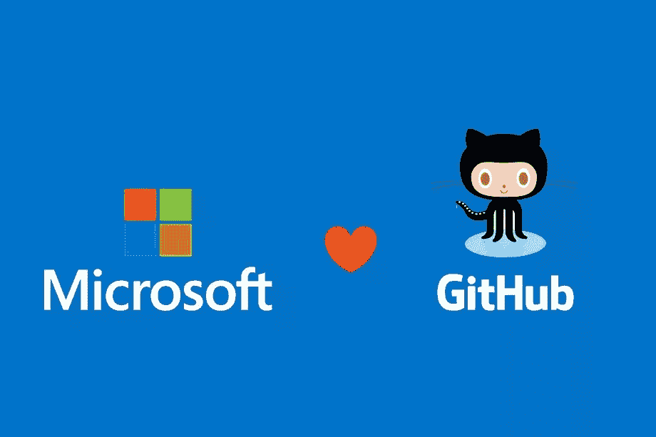
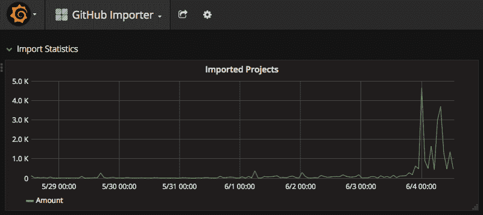

# 关于微软+ Github 的五个快速想法

> 原文：<https://medium.com/hackernoon/five-quick-thoughts-on-microsoft-github-b3563722e856>

*Image:* [*The Verge*](https://www.theverge.com/2018/6/4/17422788/microsoft-github-acquisition-official-deal)

*由* [到*约瑟夫*到](https://twitter.com/josephflaherty)

微软将以 75 亿美元的股票价格收购 GitHub。这对科技生态系统和初创公司意味着什么？这里有一些快速的想法:

# **1。从爬行者到程序员再到首席执行官**

一个早熟的程序员今天开始的第一个编码项目几乎肯定会是《我的世界》mod。一旦这位工程师准备好从基于砖块的生物群落毕业，GitHub 档案就是一个自然的落脚点。在这个崭露头角的工程师掌握了 MongoDB 之后，他们可能会被管理和 LinkedIn 的诱惑所诱惑。这还不是一个完全清晰的故事，但微软正在拼凑一系列令人兴奋的资产，从幼儿园到角落办公室。

# **2。微软在用苹果 2001 年的剧本吗？**

苹果在早期的复兴通常归功于时尚的 iMac 和第一代 iPod 的革命性点拨轮，但许多人忘记或低估了基于 Unix 的 OSX 的发布对于赢得开发者社区的份额有多么重要。这些开发人员是“阿尔法极客”，向科技大众传播，并在早年储备了 iOS 应用商店。

微软正在尝试运行这一剧本吗？正如微软在 20 世纪 90 年代所做的那样，苹果和谷歌正在努力弥合办公室和家庭之间的差距，微软正在加倍努力提高生产力和工具。也许《空手道小子》会重新开机，与史蒂文·斯皮尔伯格的合作会让谷歌和苹果从无聊的软件业务中分心，给微软一个重新树立自己的机会？

# **3。创业公司会填补 GitHub 的空白吗？还是网络效应太强大了？**

GitHub 的竞争对手 GitLab 在周末的收购新闻中看到了项目导入量的激增，但是这代表了真正的开发者反抗还是仅仅是一种抗议行为，会被卓越的网络效应所抵消？在未来几周内，寻求填补空白的加密支持的替代品有哪些优势/劣势？

# **4。不打最后一战**

根据 Mac 和 PC 之战的结果，许多人预测苹果会将手机“输”给更开放的安卓系统。这里似乎也有类似的想法，微软注定要摧毁 GitHub 的独特之处。这是这种想法的一个好例子:

这是一个合理的担忧，但我不太确定。在首席执行官塞特亚·纳德拉的领导下，微软已经摆脱了许多(如果不是大部分)盖茨/鲍尔默时代的不良做法。尽管微软的资产负债表令人印象深刻，但在思想份额和工具使用方面，它在精英开发者中可以说是第四名。

几乎所有精英开发者都使用苹果硬件，iOS 是全球软件市场的关键。Gmail 和 Docs 比 Office 套件更受欢迎，解决 Android 问题是必须的。在 iOS 之后，AWS 是科技界最重要的三个字母。

此外，在过去的几年里，这些公司都在开发商中遭受了严重的公关打击。苹果质量声誉的下降和对开发者持续的敌意让许多人感到烦恼。谷歌正在为政府制造杀手级无人机，并向出价最高者出售个人数据，这两者都让相当一部分开发者望而却步。亚马逊什么都吃。与此同时，微软专注于自己的业务，悄悄地销售软件和服务，令人难以置信的是，对于一个经历过 20 世纪 90 年代的人来说，它是失败者。看到围绕雷德蒙的叙述发生巨大变化，我不会感到惊讶。

# **5。高效创业的回报**

Github 在风险投资中为[筹集了 3 . 5 亿美元，这是一大笔资金，但创始人推迟了公司前四年的投资，直到他们创造了可观的价值。我还没有看到最近的工资表，但推迟融资的决定可能会让创始人成为亿万富翁。教训？耐心会有回报。](https://www.crunchbase.com/organization/github#section-locked-marketplace)

## **下一步是什么？**

开源是作为对 90 年代微软霸权的回应而出现的，现在微软是最大的开源社区之一的所有者。想象一下，向一个在 1997 年陷入昏迷的技术人员解释这个标题。那么下一步是什么？

与 Adobe 合并和/或收购 Sketch/InVision，为苹果越来越不重视的创意阶层造势？微软会利用其 Xbox 特许经营权和 Hololens 在娱乐领域展开竞争吗？在这一点上，问题比答案多，但很长时间以来，微软第一次变得*有趣*。