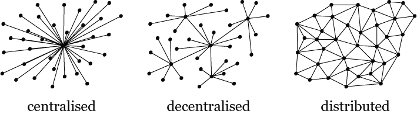
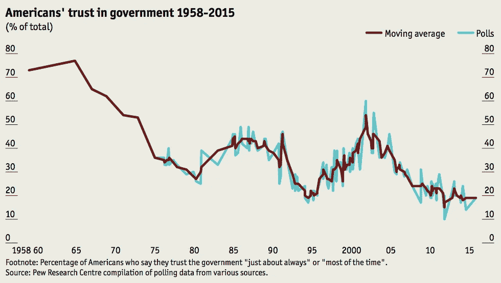
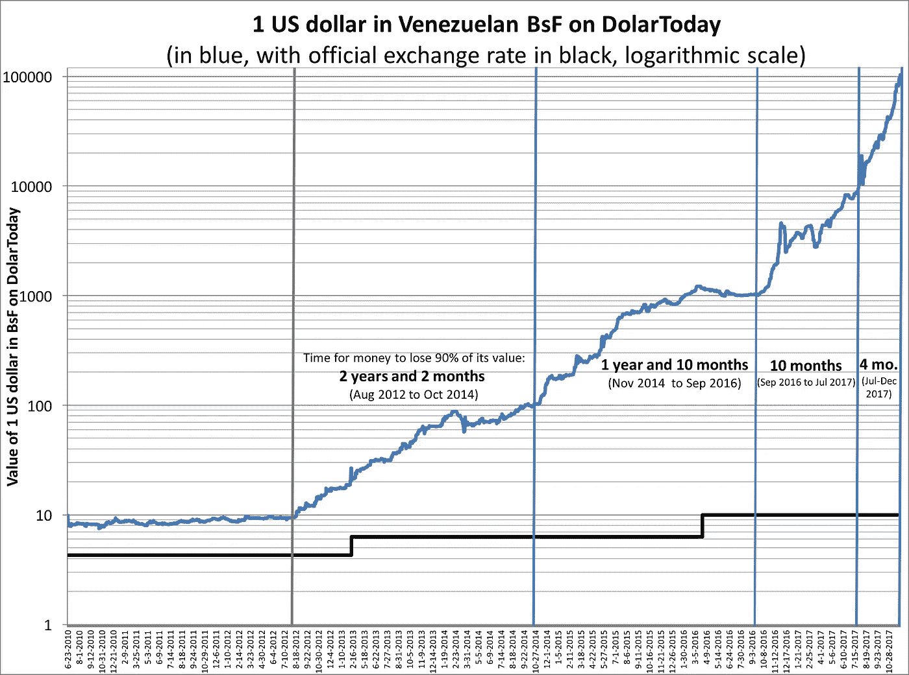

# 加密货币之所以重要的五个原因

> 原文：<https://medium.com/hackernoon/five-reasons-why-cryptocurrencies-matter-afc839d9b7ea>

目前，加密货币市场正从历史高点下跌，一些新吸引的投资者和爱好者可能会对这项技术失去兴趣。现在是退一步重新审视基本面的好时机。虽然不可能说出市场将从这里走向何方，但有一点是肯定的——加密货币将会存在。原因如下。

# 1.没有信任的全球范围的合作

是什么让人类如此强大？这不是我们的智力。石器时代的人类和现代人有相同的大脑容量。然而，作为一个石器时代的群体，人类是脆弱的，易受攻击的，并且暴露在许多危险中。现代人的力量来自于他们在大群体中合作的能力。

互联网如此重要是因为它使世界范围的合作成为可能。这种合作的一些伟大成就是维基百科和大型开源软件项目，如 Linux 操作系统。

然而，信任始终是不同方之间合作的先决条件。每当双方之间的信任度不够时，解决办法就是加强中央集权。例如，尽管我个人并不认识并信任我所有的隔壁邻居，但这并不妨碍我们和平共处。为了使这种情况成为可能，我们所有人都需要充分信任政府和其他中央机构，如银行和警察。这听起来可能不错，但很明显，这个想法甚至在国家层面都不适用，更不用说地区和全球层面了。既然我们面临一些真正全球性的问题，我们也需要全球性的解决方案。不幸的是，世界各国和各地区之间的信任水平一如既往地低，因此很难在协调解决全球问题方面取得真正的进展，例如全球变暖和人工智能改变世界的影响。

[区块链](https://hackernoon.com/tagged/blockchain)——大多数加密货币背后的技术——是如此具有革命性，因为它允许各方之间直接交换价值。它不要求这些当事人相互信任，或者他们信任一个中间人。它用对源代码的信任取代了对中央组织的信任。我们怎么知道这个想法可行呢？这方面的一个证据是[比特币](https://hackernoon.com/tagged/bitcoin)的市值。它基于一个全球性的、不可信的网络，价值 5000 亿美元。尽管这笔钱利润丰厚，但比特币本身从未被黑客攻击过。

加密货币只是区块链技术的第一个应用；概念验证。然而，区块链即将到来的未来应用不会孤立于加密货币之外；他们将使用加密货币作为基础层。例如，考虑一个定义了托管机制的智能合同。对这份合约的信任度应该和其基础区块链的总价值一样高。如果该智能合同使用的货币总估值低于 100 万美元，并且要求甲方向乙方支付 100 万美元，那么对甲方来说，获得对该货币的控制权(通过获得大部分采矿权或其他方式)比支付全部金额更有利可图。因此，只有由有价值的平台支持的大型、开放的区块链才能为大型项目提供足够的信任。

Paper ballots: not the most efficient or secure way of counting votes

这类项目有哪些例子？区块链技术允许对大量的人进行管理。因此，答案是“几乎任何政府和企业目前正在做的事情，甚至更多。”通过智能合约，人们将能够直接参与决策，用他们的代币投票。目前，我们不断听到许多人的担忧，他们感觉被排除在他们国家、生活和未来的“控制圈”之外。不管是好是坏，基于区块链的技术为普通公民提供了一个更直接参与决策的选择。是否使用这一选项取决于我们做出的政治决定。在任何情况下，那些拥有更多资金和影响力的人将能够通过在未来即将到来的分散自治组织中获得更大的股份来利用他们的权力。

一份正规合同要求所有当事人都是共享法律体系下的法律主体，例如，这使得[知识产权](/@foustry/blockchain-based-solutions-for-intellectual-property-management-2ba14b51d5f6)很难在全球范围内实施。智能合约使互不认识、可能不说同一种语言、甚至可能不是传统法律实体的各方之间能够进行对等交易。例如，与钱包相关联的物联网设备是智能合同中的有效当事人。想象一下，一辆智能汽车可以与其他汽车通信，自主协商优先通行权！机器对机器交易可能是智能合约的杀手级应用之一。

# 2.弹性技术

实体机构可能看起来比实际更稳定，因为我们习惯于将稳定与令人印象深刻的实体存在联系在一起。另一方面，加密货币似乎是“稳定”的反义词:它们是不稳定的，显然受到无数外部因素的控制。然而，有理由认为，从长远来看，加密货币背后的理念和技术将比当今的任何机构都要好得多。

我出生在苏联，一个曾经拥有巨大权力和资源的国家。苏联于 1991 年解体，尽管大多数 T2 公民仍然支持它，其中一些人仍然热情地相信它。在苏联之前，有一个俄罗斯帝国——一个曾经拥有巨大权力和资源的国家。这个帝国于 1917 年崩溃，即使 1917 年仍有许多人支持并热情信奉君主制。这种信念并没有拯救帝国。今天我们有欧盟。欧盟不像苏联或过去的殖民帝国；它的目标是成为一个权力下放的民主组织。尽管我很喜欢欧盟，但我也接受这样一种可能性，有一天我醒来会发现欧盟已经不存在了。

有些观念是脆弱的，比如帝国和世界强国的观念。其他人很有弹性。加密货币基于区块链，这是一个有弹性的想法。这是为什么呢？

You all have seen this graph before; it’s still a good one

首先，区块链是一个*分布式*技术。在中央系统中，对中央节点的单一攻击可能是致命的。相比之下，只要至少有一些参与者继续相信区块链，它就会存在——他们会相信的，因为区块链碰巧也抵制审查。作为加密货币弹性的证据，考虑到目前为止它们总是能够在市场崩溃、黑客攻击和各种其他类型的攻击后反弹。平均而言，比特币每年都会经历几次大的价格调整。它经常失去市场、大众媒体和公众的信任；但它仍然存在！暂时的危机无关紧要。只要还有人热情地相信比特币，它就会有真正的价值。

第二，区块链是一项*技术。*不可能“发现”技术；一旦公开，只要它们仍然有用，它们通常会被人们所知。很多人把比特币和特定的政治联系在一起。但是为了使用区块链，一个人不必是自由意志主义者，或者相信任何政治！作为证据，政府和银行正计划在不久的将来发行自己的中央区块链和加密货币。但其他任何人也可以——如果他们决定让他们的加密货币分发、开放和公开，它就有更好的机会长期生存，因为这样它就不会有单点故障。

# 3.政府和中央银行的替代品

法定货币没有内在价值。他们是由对政府和央行的信任支撑的。另一方面，加密货币是由对政府的不信任支撑的。一个可以用来对冲另一个。

你不必为了承认政府偶尔会搞砸而相信政府是“邪恶的”。每个人都会犯错；当拥有巨大权力的实体犯错误时，他们的错误有时会产生巨大的后果。从实际角度来看，将一些资金投入加密货币可以让我们对冲这种错误。我个人更希望政府不要搞砸——即使这意味着加密货币最终会失去一些价值。但为法定货币可能失去大部分的可能性做好准备不会有什么坏处。一场新的经济危机、一场新的战争或一场具有全球影响的环境灾难都是我们需要考虑的现实风险。使用黄金或其他商品[是防范这些风险的一种方式。使用比特币和其他加密货币是另一种更方便更新的方式。历史上，比特币与其他资产类别](https://www.bloomberg.com/news/articles/2017-10-10/is-gold-really-a-good-hedge)一直[不相关，在危机情况下应该会有额外需求。](https://www.signalplot.com/what-is-bitcoins-correlation-with-other-financial-assets/)

另一方面，世界各地的一些政府和央行显然没有考虑到本国公民的最佳利益。纵观历史，有些国家一直如此。现在，有史以来第一次，这些国家的公民可以选择退出他们的体系——比如，将他们的储蓄储存在加密货币中，而不是高度通胀的法定货币中。突然间，暴虐、腐败或无能的政府没有以前那么大的权力了。突然间，这些政府有了一个竞争对手，金融和其他服务的替代提供商——这些服务迄今为止一直由政府独家垄断。突然间，这些政府再也不能轻易地审查或关闭他们的私人竞争，因为它是基于一种弹性和分布式技术:没有一个单一的中心点来审查或关闭。

The risks from hyperinflation can be mitigated by cryptocurrencies

同样，你不必为了支持这个机制而反对政府，这只是一个新的激励，让好的政府更好地为他们的公民服务。

Only a slight hyperbole.

# 4.公司的替代品

有一段时间，似乎不仅全球化不可避免，而且集中化也不可避免。我们似乎只有两个选择——要么给政府更多的控制权，要么给大公司更多的控制权。从这两个选项中，西方世界倾向于第二个。因此，我们最终陷入了这样一种境地，即脸书、推特、谷歌、亚马逊和微软等公司从我们的生活和权力中获取了令人不安的大量知识。

现在，第三种选择的机会突然出现了。分散的、基于区块链的社交网络已经存在。除了其他博客平台，我们还有 Steemit。除了 YouTube，我们还有 [Dtube](https://d.tube/) 。除了 Twitter，我们还有……一些分散的 Twitter 克隆体？

我不想给人留下去中心化社交媒体将很快取代脸书的印象。这项技术目前还不存在；特别是定制内容的访问级别可能很难实现，因为默认情况下，区块链中的所有内容都是公开的。

然而，一旦实施，分散的区块链社交网络和其他在线服务将让我们拥有和货币化我们的在线存在。我们不断留下的数字痕迹将首先属于我们，而不是像现在这样属于公司。

# 5.财富创造以及储蓄和投资

如前所述，加密货币的价值超越了投机投资；但是也没有理由完全忽略这一方面。

加密货币市场的总市值约为 6000 亿美元。到目前为止，投入市场的资金量远低于这个数字，因为这个市场的大多数投资都是在加密货币的估值远低于现在的时候进行的。尽管 6000 亿欧元永远无法在短期内从市场中提取出来(因为大规模抛售将导致价格下跌)，但从长期来看，附加值最终是可以提取出来的。显然，财富的大量创造已经发生。

热衷于加密的千禧一代和来自发展中国家的人们有很多理由对当今的全球经济状况感到不满。如果加密货币这种新的资产类别不存在，他们中的许多人根本不会存钱或投资；这些群体中的人很少被传统投资承诺的相对较小的收益所吸引。可以说，即使加密货币市场下跌，大多数参与者最终失去了与最初投资相比的价值，这些首次投资者仍将从他们对加密货币的敞口中获得一些长期收益——至少是通过增加关于储蓄和投资的经验和知识。

# 结论

当回顾计算机科学最近最重要的创新时，有两项技术特别突出——加密货币和深度学习。然而，尽管深度学习的胜利进军让我对未来感到焦虑和担忧，但分布式账本技术的到来却产生了相反的效果。

有了深度学习，我们就放弃了理解，并期待增加能力作为回报。这是一种危险的交易。深度学习算法将以前需要人类完成的任务自动化，并以这种方式将更多的权力赋予那些拥有和控制算法的人。然而，利用深度学习解决一些现实世界的问题并不能直接转化为更多的知识或洞察力。从长远来看，我们面临着被越来越多难以理解的算法处理的越来越大的数据堆包围的风险——这些算法我们无法理解，但却做出与我们生活相关的决定。

区块链技术的前景正好相反:通过没有相互信任的高效合作来赋予个人权力，而牺牲政府、企业和其他中央集权组织的利益。信任可以通过合作建立，但不再是合作的必要前提。如果实施正确，分布式账本技术将允许我们将直接、民主的治理提升到全球水平——这是我们迫切需要的，因为全球问题迫在眉睫。

*作者，*[*Atis Elsts*](http://www.bristol.ac.uk/engineering/departments/eeng/people/atis-elsts/overview.html)*博士，是英国布里斯托大学物联网研究助理。所有观点都是他自己的。*