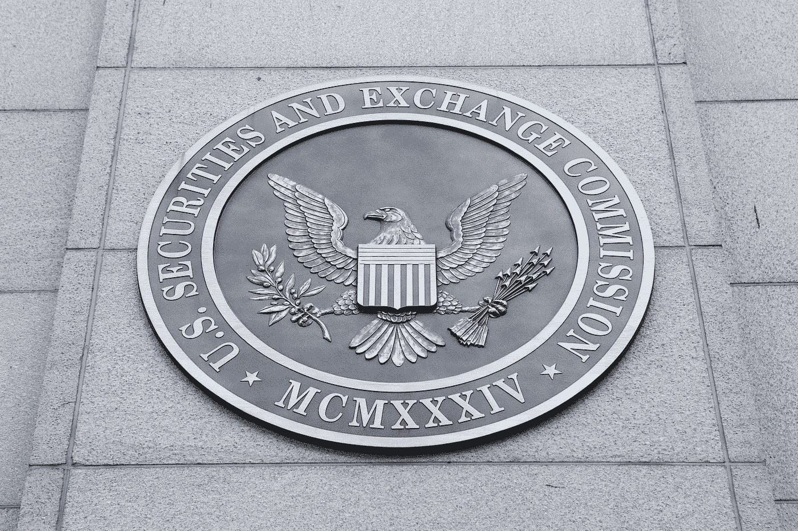

# 五个符合 SEC 标准的 A+sto 值得一看

> 原文：<https://medium.com/hackernoon/five-sec-compliant-reg-a-stos-worth-watching-1027ed9d6c53>

[安全](https://hackernoon.com/tagged/security)还是实用令牌？这是 2018 年主导 ICO 市场的一个大问题，尤其是对任何总部位于美国的公司而言。在最近接受[美国消费者新闻与商业频道](https://www.cnbc.com/amp/2018/06/06/sec-chairman-clayton-says-agency-wont-change-definition-of-a-security.html?__twitter_impression=true)、 [SEC 主席](https://hackernoon.com/tagged/sec-chairman)杰伊·克雷顿的采访中，他完全强调了这个话题:“如果它是一种证券，我们就对它进行监管，”他解释道，“一种象征，一种数字资产，我把钱给你，你就去冒险，作为回报，你说‘你可以得到回报’——这就是证券。”

根据这一宽泛的定义，在美国进行的几乎所有 ico 都属于证券范畴。随着美国证券交易委员会明确阐述其立场，公司面临的事实是，唯一安全的途径是在监管框架内。这是既定的，现在是一个很好的时机来看看一些公司已经试图在规则内运行，并进行符合 SEC 的 STO。具体来说，我们将关注那些根据 Reg A+申请或打算申请的公司，这意味着非授权投资者可以参与。

# 饶舌

free speech frog 可能是宣布提供合规代币的最引人注目的公司之一。首席执行官安德鲁·托巴明确了他们的计划，希望筹集 1000 万美元。在 Gab 的 Startengine 页面上，他说:“我们的目标是提供第一个完全符合美国基金法的 A+ STO 法规。”

Gab 社交网络仍然必须开辟一条艰难的道路，被谷歌和苹果商店屏蔽，但 Torba 仍然蔑视他认为来自互联网巨头的明确审查。"我们的追求是高尚的，并且符合美国言论自由的传统标准."

区区 1000 万美元对他们挑战 Twitter、脸书和其他更成熟的社交网络的努力会产生什么影响还有待观察，但言论自由倡导者肯定会对这个故事的进展感兴趣。

# 诺贝拉科技

Knowbella Tech 是一家总部位于辛辛那提的公司，利用区块链的技术创建了一个开放科学和科学合作的平台。他们的使命是将全球研究人员与全球机构、大学和公司中价值 4 万亿美元的闲置知识产权和知识联系起来。该公司的目标是通过他们的 s to 筹集 5000 万美元，目前，这是 Reg A+合规性的当前资金上限。

正如首席执行官马克·波尔坎普(Mark Pohlkamp)所描述的，完成 STO 的监管基础比 ICO“更长、更昂贵、更耗时、更痛苦”，但投资者信心和安全的回报让这一努力变得更值得。由于 Knowbella Tech 是首批根据 Reg A+而不是 Reg D 申请的公司之一，加密投资者将饶有兴趣地关注这一领域，以了解这一先驱如何通过 SEC 程序。

# 里德科恩

RideCoin 是区块链对优步的替代，并把自己提升和推销为出租车市场颠覆的下一步。RideCoin 承诺省去中间人，允许司机为自己工作，乘客支付更少的费用。这基本上是一个出租车奖励系统，那些着急的人会为更快的服务提供更多的钱，而那些不那么着急的人可以提供更少的钱。

RideCoin 是 Startengine 平台上托管的越来越多的 sto 之一。他们计划发行两个令牌，一个是安全令牌，另一个是实用令牌，安全令牌符合 SEC 标准。正如 RideCoin 首席执行官 Jimmy Gorham 所说，“通过 ICO 筹集资金启动一个项目是一项投资合同，应该受到政府的监督。我相信这个权威，也认同这个分类。”

# 货物运费

[dexFreight](http://dexfreight.io/) 是一个面向国内和国际托运人、货运代理和承运人的 B2B 市场。他们将参与竞争的全球物流行业是一个绝对的庞然大物，已经有许多 ico 试图解决这个问题。dexFreight 与其竞争对手的不同之处在于，他们是第一家追求 Reg A+合规性的物流公司。

作为一家运输公司，dexFreight 深知及时到达目的地的重要性。用首席执行官 Rajat Rajbhandari 的话说，“dexFreight 期待完成 Reg A+下最早的 s to 之一，并成为其他公司效仿的榜样。”

到 2023 年，全球物流行业估计价值 15 万亿美元，因此开源的 dexFreight 平台可能是一个非常有利可图的提议，特别是如果它能够第一个到达的话。

# 曼陀罗

[Mandala](https://mandalaex.com/) 是一家位于开曼群岛的数字资产交易所，计划使用两种不同的安排:Reg A+和 Reg S。第一种是 Reg S，这是一种“安全港”豁免，仅适用于美国以外的公司。在 Reg 筹资的同时，该公司还寻求根据 Reg A+申请，允许其寻求来自美国的投资。因此，Mandala 将被证明是 Reg A+的一个有趣的测试案例，因为该公司在另一个管辖区，并且因为他们的代币发行将在 SEC 考虑他们的 Reg A+申请时已经进行得很好。

由于证券化令牌仍处于婴儿期，这些测试案例的命运可能会决定未来 s to 会发生什么，并对整个加密领域产生影响。出于这个原因，这五个先驱肯定会吸引加密投资者、志同道合的公司和任何参与区块链的人的注意。现在，我们正处于 SEC 法规遵从性新时代的开端。这一天会发生什么还有待观察。

*关于作者:*[*Robert d . Knight*](https://www.linkedin.com/in/robertdknight/)*是一名文案和内容营销人员，专攻区块链、加密货币和 ICO/sto。*

*2018 年 7 月 13 日澄清:尽管曼陀罗打算根据 Reg A+申请，代币本身将被归类为公用事业，而不是证券。*