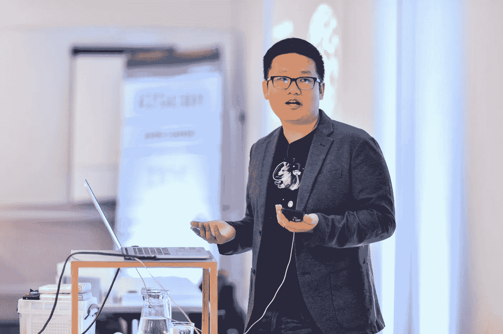

# 成为国际会议演讲者的五个简单步骤！

> 原文：<https://medium.com/hackernoon/five-simple-steps-to-becoming-an-international-conference-speaker-a4d13c02529>

Me speaking at iOSCon London 2018\. Image copyright [Ed Telling](http://www.edtelling.com)

几年前，我给自己定了一个目标，要开始在会议上发言。在过去，我参加过不少精彩的会议，我真的很钦佩那些能够登上舞台，分享大量知识，并激励观众做出很酷的事情的人。虽然我有一些公开演讲的经验(我在一些当地的 iOS/Android 会议上发言，并在 11 年和 13 年的 SXSW 主持了两个小组)，但我想尝试一个“真正的”会议场所。

我认为说服我开始申请的会议是我在 2015 年参加的 Swift Summit。有一些真正鼓舞人心的演讲，社区感到非常新鲜和受欢迎。说句有意思的话:我在加入 Lyft 后了解到，我现在的 iOS 同事中至少有三人在那次会议上发言([基思](https://www.youtube.com/watch?v=FmT3A_tm9_4)、[萨姆](https://www.youtube.com/watch?v=P0HD5bODhZM)和 [JP](https://www.youtube.com/watch?v=kz6d-ES7WtE) ，尽管只有基思当时在 Lyft 工作)，还有其他几个人也参加了那年的会议。我不确定这是相关还是因果关系在起作用。

# 第一步:申请发言

根据我的记录我的 CFP 申请的谷歌文档，我在 2016 年开始大量申请。在我想申请的时候和我开始申请的时候之间有一个间隙，仅仅是因为我觉得我没有太多可谈的。当我在星巴克工作时，曾经有过一些关于 iMessage 和可访问性的有趣经历，我想人们可能也想知道这些事情。回想起来，我想我可能等得太久了。如果你对某件事充满热情，不要等到你觉得自己是这方面的专家。那一天可能(至少对我来说)永远不会到来，一旦你的主题被接受，你可以随时做研究！

在我所有的 CFP 中，我都使用我在参加 [Twilio Heroes](https://www.twilio.com/blog/2014/01/introducing-the-twilio-heroes-nt.html) 计划期间学到的模板。本质上，您需要:

1.  陈述一个问题或挑战
2.  给出一些通用的解决方案(设置一个稻草人)
3.  给出你比#2 更好的具体解决方案，因为你很牛逼。

下面是我的 iMessage 演讲的一个例子，它使用了那个模板:

> (1)消息应用程序非常庞大，而且越来越庞大。随着 WhatsApp、微信和脸书 Messenger 的用户数以百万或数十亿计，很明显，发信息不是一种时尚。那么开发者如何利用这种增长呢？(2)启动一个新的消息应用程序可能是不可能的。(3)谢天谢地，苹果已经在 iOS 10 中引入了 iMessage 应用扩展。了解如何使用 iMessage 让您的用户发送丰富的交互式信息，并了解如何利用 iMessage 应用程序扩展允许的网络效果，包括 iOS 11 中引入的更新，如实时信息布局和直接发送 API。

# 第二步:被拒绝

在使用这个模板进行演讲并申请了 2016 年几乎所有与 iOS 相关的会议后，我最终收到了大量的拒绝。这完全没问题，也在意料之中，因为我认为大多数会议得到的演讲提议都比他们的位置多得多。我还注意到，会议倾向于邀请以前发言过的人，这是一种风险管理形式，但对从未发言过的人来说也有点不公平。

打破这种先有鸡还是先有蛋的局面的最好方法可能是瞄准当地的聚会，这些聚会总是在寻找人来做演讲！这样做的另一个好处是，在把你的演讲带到更大的舞台和观众面前之前，你可以练习和完善你的演讲(这正是我今年在伦敦 iOSCon 上做的关于可访问性的演讲)。因为我在大会两周前的一次 Xcoders 会议上发表了我的演讲，我能够为我的演讲计时，在人们面前练习，让他们的问题融入到演讲中，并且当我在更多人面前演讲时，我感觉我已经准备好了。

# 第三步:被接受

我真正开始认真申请参加会议的第一年，我的录取率是 7 分之 1。成功！我参加了在英国切斯特举行的第一届 [CodeMobile](http://www.codemobile.co.uk) 大会，并谈论了 iMessage 应用。登上舞台，分享我认为有趣的东西，然后得到人们对它确实感兴趣的反馈，这种体验太棒了！与会者都很棒，我终于有生以来第一次走出了北美。我已经实现了我的目标，成为了一名国际演讲者，同时也成为了一名 iOS 会议演讲者。

# 第四步:准备

大多数人不会告诉你的事情，也是你在准备会议演讲时很快就会发现的事情，就是要准备多少工作！作为一些伟大演讲的观众，我总是认为演讲可能需要几个小时来准备和安排。

实际上，一场 45 分钟的讲座可能需要 40-50 个小时。这包括提出建议，了解主题(这通常发生在建议被接受之后！)，想出一个能教育和启发(希望能娱乐)你的观众的形式，并练习材料的传递。你可能还想为你的听众量身定制你的演讲；他们大多数是学生吗？向什么技能水平的人展示最合适？什么样的笑话可能会对你的观众产生良好的效果？

我花了大量的时间来准备演讲，这是一种练习。这完全取决于你希望演讲有多完美，以及你在演讲中所做的大量练习会让你有多舒服。正如我之前提到的，在一个较小的群体中提前演示真的很有帮助，可以比实际的演讲提前设定一个截止日期，并提供一种收集反馈的方法来调整你的演讲，使它变得更好。

有一件事情很棒，那就是你可以在拖延的时候做一些非常有成效的事情。为了避免准备我的 iOSCon 演讲，我申请在纽约一个名为！！那份申请最终被接受了，所以我开始了在更多的会议上发言的恶性循环！

我最近在 Twitter 上看到许多演讲者分享他们的过程以及他们在演讲中投入的时间:

# 第五步:实际展示

做真正的演讲是一种奇怪的经历。在花了大量的时间进行预先谈话后，我发现实际的谈话进行得比我想象的要快。一旦我站起来开始说话，我或多或少处于自动驾驶状态，这几乎就像有一种灵魂出窍的体验。这可能是因为我把我所有的脑力都投入到演讲中，但是一旦演讲结束，我甚至不记得我是怎么做的了。然后在最后，每个人都鼓掌，希望人们会问一些有见地的问题，没有人会问一个实际上只是他们试图用来证明他们知道一些事情的陈述的问题。

一旦我做了报告，我就能真正享受会议了。我很幸运，在我演讲的前几个会议上，我是第一天主题演讲后的第一个演讲者。早点去也很好，因为这样人们会看到你说话，他们通常会更愿意在走廊上和你聊天。

# 展示更多

在英国切斯特的 [CodeMobile](https://youtu.be/zXQOTEwxv-U) 发表演讲后，大约一年的时间里，我没有任何演讲被接受。我最终再次在英国演讲，这一次是 2018 年 3 月在伦敦为 [iOSCon](https://skillsmatter.com/skillscasts/11320-designing-and-building-with-accessibility-in-mind) 演讲。然后我最近在[演讲！！五月的纽约。下个月我将在波士顿的 SwiftFest 上发布我的 iOS 可访问性演讲的更新版本。](http://bangbangcon.com)

这一次，我的录取率是 3/6，这要好得多。我认为这主要是因为我去年在 CodeMobile 做了一个演讲。我还申请了一些更多样化的技术会议，因为专门针对 iOS 的会议较少(我想我申请的一些会议实际上并没有举行)。

在未来，我希望我能再次发言，但由于我在今年 3 月/5 月/6 月连续做了三场演讲，我准备在回到会议巡回演讲之前稍微休息一下。我真的很高兴我有机会分享我的一些经历，以及到目前为止我参加过的非常愉快的会议。

# 你也应该说话！

当我第一次设定在一些会议上演讲的个人目标时，我真的不确定我是否具备成功的条件。我不认为自己是一个伟大的演说家，也不认为自己是一个杰出的软件工程师。秘密在于，这两者都不是与人分享酷东西的必要条件。你只需要对某件事有一些激情，并通过讲述你的故事来有效地传达这种激情。

如果你想申请参加 iOS 会议，这里有一个维护良好的列表，上面有 CFP 会议的截止日期。祝你好运！

最后，如果你在会议上见到我，打个招呼！我总是很高兴与人聊天，即使我看起来很忙或专注于其他事情。

事实上，我最终接受了另一个演讲，但会议没有兴趣报销我的任何差旅费，所以我礼貌地拒绝了。考虑到准备一场精彩的演讲所花费的时间，会议绝对应该补偿你的发言费用。