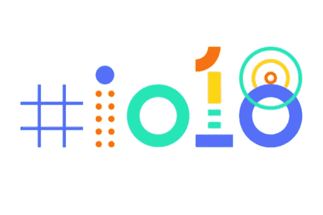

# Google I/O’18 的五个特别公告:Google Keynote

> 原文：<https://medium.com/hackernoon/five-special-announcements-of-google-i-o18-google-keynote-5e530c83ea81>

我们都知道 Google I/O 2018 主题演讲活动已经成功举办。在那次活动中，我们看到了谷歌的许多新产品，这些产品令人惊叹。

在去年的 Google I/O 2017 中，我们看到了人工智能的精彩贡献，但今年人工智能的影响变得更加强大。让我们来看看。

**1。预测心血管风险:**首先，谷歌人工智能将医疗保健作为最重要的领域。去年，谷歌宣布了诊断糖尿病视网膜病变的工作，以帮助医生通过视网膜扫描和深度学习进行诊断。今年，我们知道谷歌人工智能已经开始预测心血管风险。通过同样的视网膜扫描，谷歌可以预测中风或心脏病发作等心血管疾病的风险。此外，谷歌人工智能已经开始向医生预测医疗方法。

**2。智能撰写:**谷歌的产品 Gmail 进行了重新设计。他们增加了一个新功能，叫做智能作曲。

在智能写作中，当用户开始写作时，ML 将向他/她建议他/她可以容易地写作阶段。

**3。建议动作:**建议动作是 Google 相册的一项新功能，人工智能系统将建议正确的动作来调整照片的对比度和亮度。另一个有趣的功能是，如果我们给一个文档拍照，谷歌会把它转换成 pdf 格式。在谷歌照片中，人工智能使照片更加美丽和自然。

**4。精彩 Google Assistant:**Google Assistant 中新增了 6 种语音。谷歌助手现在是自然对话和视觉辅助。谷歌助手推出了持续对话和多动作功能。最大的小企业没有好的网上预约系统。在这种情况下，谷歌助理推出了新的基于人工智能的约会系统。

**5。Android P:** Android P 是 Android 的新版本。Android P 的新功能是自适应电池，它使用 ML 来预测未来几个小时内将使用哪些应用程序，应用程序动作预测用户的下一个任务。切片和 ML 是开发者的新 API。

所以下面是谷歌最新酷炫产品的简短描述。我希望你会喜欢它。