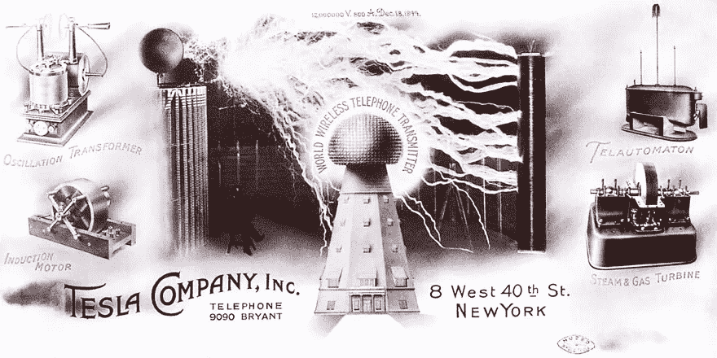
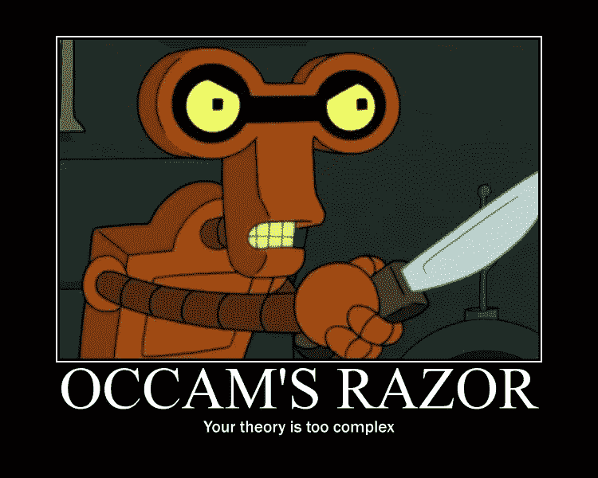

# 清晰思维的五个步骤

> 原文：<https://medium.com/hackernoon/five-steps-to-crystal-clear-thinking-6e94372789af>

我最近问我的朋友和粉丝，他们希望我写些什么。

一个问题出现了很多次:

怎么想比较好？

起初这让我很惊讶。怎么想不是很明显吗？然后我意识到不，不是的。

不再有人教我们如何思考，只教我们如何思考。

差别很大。

一旦你意识到你自然想要改变。但是怎么做呢？你从哪里开始？有可能变得更快、更聪明、更灵活吗？

是的，但是不容易。

不幸的是，我们都有很多伤害要弥补。从我们从子宫里尖叫着爬出来的那天起，这个世界就想摧毁我们的精神和自由意志。

我们的学校没有教我们质疑和探索，而是教我们死记硬背。

“New blood joins this Earth and quickly he’s subdued. Through constant pained disgrace the young boy learns their rules.” — Metallica, Unforgiven

我们的社会，我们的父母和媒体不希望我们发展自己的想法。他们想要机器人、无人机和奴隶。他们想不惜一切代价向我们灌输一种已经存在的意识形态。

在专制社会中，这是明显的。他们带着年幼的孩子，在他们完全不知道国家和意识形态意味着什么之前，训练他们游行，唱关于祖国的爱国歌曲。他们试图尽早打破他们幼小的心灵，在他们还具有可塑性和柔韧性的时候，让他们屈从于国家和集体的意志。

在发达社会，这种情况也会发生，只是更加微妙。我们被教导要相信自己的伟大和优越性高于一切，但绝不质疑任何事情。

伟大不会像你眼睛的颜色一样传承下去。它不是从过去伟大的几代人那里继承来的。

这是应得的。

每一代人都必须更新伟大的契约。

这就是为什么那么多才华横溢、有权有势的男人和女人的孩子会一事无成。他们拥有一切优势，基因，金钱，甚至天才的火花，但他们却一事无成。

为什么？

因为他们没有投入工作去获得它。他们认为这是他们的神圣权利。

每个人都必须在万神殿中获得自己的雕像。

你猜怎么着？历史上最伟大的人物几乎都来自普通人。

没有人教爱迪生如何制造灯泡或收音机。泰斯拉的父亲没有教他电学。理查德·丹尼斯，著名的海龟交易者，从 400 美元赚了 2 亿美元，但是他的父亲是蓝领工人，即使他想教他商品交易，他也不会教他。

这些人中的每一个人都有不懈的追求成功的动力。他们试了又试，失败了，当他们崩溃了，燃烧了，他们又站了起来。什么也没有给他们。当然，他们有天生的天赋，也许还有一些特殊的心理素质，但正是他们自己的努力、好奇心和想象力让他们获得了永恒的荣耀。

伟大是先天和后天的某种奇怪结合。

但问题是。你不知道你是否有来自大自然的特殊天赋。也许以后你会明白的。但是一开始没有人真正知道。他们只是知道自己与众不同，他们想要的不是社会展示给他们的东西。

所以你必须表现得好像你注定要成为伟人。不，这并不意味着大摇大摆地走来走去，好像你是上帝给地球的礼物。

这意味着向全世界证明你是认真的。这意味着带着谦逊、耐心和清晰的愿景，致力于真正伟大的努力工作。

但是，标志着历史上最聪明的头脑的特征是什么呢？你如何开发它们？

让我们来看看。

# 第一:自力更生

我小的时候，妈妈喜欢画画。但是在为我画了几年漂亮的画之后，她告诉我她不干了。如果我想要更多的画，我必须自己画。

我又踢又叫又生气，但她坚持住了。

她给我买了铅笔和纸，让我开始工作。我就是这样学会为自己创作的。如果我想要太空船、外星人和怪物，我必须自己完成。

起初我并不好。这些线条从来没有按照我想要的方式组合在一起，但我坚持了下来。最终我学会了画画，而且画得很好。到了高中，我可以选择是去艺术学院还是普通学院。

**我妈妈没有教我画画。**

**她真正教给我的是自力更生。**

她没有教我如何素描。她不时给我指点，但主要是通过反复试验让我弄明白。

事情是这样的。如果你在等待某人给你合适的培训来改变你的工作或做一些生活中完全不同的事情，你将永远等待下去。全靠你自己训练。

如果你是公共汽车司机，没人会教你画画。如果你是做市场营销的，没人会提供作为自然摄影师环游世界的课程。如果你是一名技术人员，你的公司里没有人提供成为世界级厨师的培训。

但是没关系。你只要站起来自学就行了。

这是唯一能学到东西的方法。

腾出时间。放弃一些无用的东西，比如电视，去酒吧，或者花两个小时浏览互联网，阅读垃圾新闻，让自己充满愤怒。

**坚持不懈地开始阅读。开始学习。练习。**

**全靠你了。那你打算怎么办？**

站起来，动起来。这就是。

# 第二:学会学习

我很抱歉地告诉你，你在学校学习的方法完全是胡说八道。如果你想在《危险边缘》中获胜，记忆信息是一个巧妙的技巧，但是你能塞进脑子里并根据命令吐出来的大量废话并不会让你变得聪明。

那不是思考。那就是做机器人。

记住，那是他们想要的，所以那是他们教你的。这取决于你是否能跳出编程的窠臼，从不同的角度思考问题。

那么真正的学习是什么样子的呢？

学习很乱。这是反复试验。这是一次又一次的失败，然后慢慢想明白。

学习不是一个严格的正式系统，没有精确标注的步骤。

又野又乱。当我开始学习某样东西时，我会开始又停止，就像一个神经网络完全随机地学习，但一开始就完全错了。

有一本书比其他任何一本书都更好地抓住了这一过程:乔希·考夫曼的《头 20 个小时》 。

**考夫曼鼓励你忘记一万小时规则。**

是的，你知道的。每个人都知道马尔孔·格拉德威尔的口头禅。你做梦去吧。

你一生中只能在一两件事情上花费一万个小时。

你想学的其他东西呢，比如买房子的正确方法，或者如何建造橱柜，或者中国最好的吃饭的地方，或者如何交易加密货币，或者画一幅画？

一天中没有足够的时间花 10，000 个小时在所有这些事情上。

相反，你应该尽快变得有能力。把学习当成玩耍。什么都玩。快速失败，打破东西不仅仅是编码。

创造力和探索不是你能控制的。他们是你屈服的东西，是比你更伟大的东西。这是一个放手的过程，伴随着你完全的无知和无能。没错。你必须驾驭你愚蠢的河流，看看它是否能把你带到彩虹尽头的专家之地。

也许你想象我有一套严格的步骤和一本日记来探索隐藏的真相？也许是一套荧光笔和一套固定的问题？

没有。

根本不是这样的。

基本上我只是开始在心里问问题，然后开始阅读。我和自己对话。这是苏格拉底式教学法在起作用。

Socrates. They killed him because they were too stupid to understand him.

*   这有道理吗？
*   我哪里知道？
*   我能证明吗？
*   怎么会？
*   为什么会这样？
*   怎么会不一样呢？
*   我们怎样才能做得更好呢？
*   还能更糟吗？

然后我努力吸取我能找到的所有知识。我借或买尽可能多的关于某一主题的书。我经常广泛阅读，通常每天两到三个小时。

伯克希尔·哈撒韦公司的查理·芒格说:“在我的一生中，我不知道在广泛的主题领域里有没有不一直阅读的智者——一个也没有，零个也没有。”

学习就是探索。给自己自由去探索，去搞砸，去重新开始。

如果你期望在第一天就做好，那你是在欺骗自己。

# 第三:放弃魔法信仰

你曾经花钱参加过动机研讨会或一些秘密技术来学习一些特别的东西吗？

结果如何？

如果你看到激励大师先生在他的大型演出的舞台上，我敢打赌你出来的时候几天或几周都充满了激情。然后发生了什么？它失败了，对吗？你慢慢地回到了原来的样子，还是那个懒惰的你。

或者你读到了一些惊人的销售技巧，所以你报名参加了为期六周的课程，并致力于此。但是你的销售数字从来没有真正改变过，不是吗？

**每个卖给你动力的人都是在卖给你蛇油。**

对不起，但他们是，即使他们是好意。如果他们是善意的，他们是玛雅最后不知情的代理人。换句话说，他们不是故意这样做的，他们实际上认为他们在帮忙。

但事实并非如此。

**你不能借别人的动力。无论你读多少书或唱多少圣歌，你都不会变得更有动力。**

**动力来自内心。它来自你，而不是其他地方。**

没人能给你。永远不会。在任何情况下。连我都不知道。

忘记激励的废话。激励你该死的自己。

动机不是一些古怪的技巧，比如想象你想要什么。那只是卖给你一套 DVD 和一个研讨会的垃圾。

你不会因为“思考”它而变得富有。无论这个愚蠢的“秘密”说什么，每天早餐前想象一辆快车都不会让你拥有一辆法拉利。

你越早放弃古鲁和神奇的信仰，你就越早永远地抛弃幼稚的东西，你就越早开始真正的艰苦变革。

那么我们如何摧毁对[魔法信仰](https://www.psychologytoday.com/articles/200803/magical-thinking)的依赖呢？

# **第四:批判性思维**

什么是批判性思维？

这是已知宇宙中最被低估和不被重视的技能。

批判性思维的基础[是这样定义的:](http://www.criticalthinking.org/pages/defining-critical-thinking/766)

“批判性思维是一种智力训练过程，它积极而熟练地概念化、应用、分析、综合和/或评估从观察、经验、思考、推理或交流中收集或产生的信息，作为信念和行动的指南。”

啊？不管是谁写的，都花了太多时间试图在一句话里塞进太多东西。很难读懂*和*来解析。太复杂了。太复杂了。

欢迎来到你批判性思维的第一次练习。

是时候拒绝这个定义了。忽略它来自批判性思维的官方声音基础。你的信息来自哪里并不重要。如果它来自一个权威的声音团体或当地无家可归的人，这没有什么区别。不管信息传递者是谁，每一点信息都必须有其自身的价值。

所以让我们试试字典里更简单的定义。

"批判性思维是对一个问题的客观分析和评价，以形成判断."

那好多了。简洁明了。

但我认为我们可以进一步简化。 [**奥卡姆剃刀**](https://en.wikipedia.org/wiki/Occam%27s_razor) 统治世界。最简单的解释往往是正确的。

也许批判性思维的最佳定义是旧 X 档案的口号:

**“质疑一切”**

不要接受任何表面上的东西。

如果你被教导某事是正确的，问问你自己为什么？你怎么知道的？你怎么证明给自己看？这是真的吗？仅仅是因为这是书上说的还是因为你喜欢的人告诉你的？不。你必须自己找出真相。

那么真相是什么？

真理是再简单不过的了。

当你把一切都分解到它的绝对本质时，你就找到了真相。

你会发现生活中没有什么神秘。你需要的一切都写在罐子上了。如果你能让你的头脑停止喋喋不休的胡说八道，去读它所说的，你就能开始有所成就。

# **第五:站在别人的立场上**

你遇到过无论如何都是对的人吗？

我做到了。我年轻的时候。

伙计，我太笨了。

如果你遇到一个人，他认为自己已经想通了一切，更糟糕的是，他带着愤怒的自信说出了这句话，那就赶紧走吧。尽可能快地跑。离开那里，因为我向你保证他们疯了。像真的疯了一样。更糟糕的是，他们并不知道。即使他们完全相信一派胡言，他们也绝对肯定自己是对的。

Bizarro, courtesy of DC and the[**Justice League Animated series**](http://amzn.to/2ET0yVW).

在比扎罗，恶即是善，比扎罗相信这一点。

在这个现实中，任何事情都不可能有 100%的把握。

最聪明的人知道他们知道的是多么少。他们乐于改变。他们不是固定和僵硬的，而是屈服的，如果他们得到新的信息，随时准备适应。

当生活证明他们错了，他们会接受并改变。

你越早意识到你知道得有多少越好。托马斯·爱迪生说过:“我们对任何事情都一无所知。”

当你被自己的观点或信仰完全固定时，你基本上就被冻结了。大多数人没有意识到他们的信仰只是编程。他们相信他们所相信的是真的。没有什么比这更偏离事实了。

我们是微小的，无限小的生物，能力有限。宇宙浩瀚，不断变化。我们不可能一秒一秒地处理所有冲击我们的信息，并以任何确定性得出绝对的真理。我们只是没有处理能力。

把所有知识的总和想象成一个巨大的球体。我们每个人都不过是那个球体上的一个小点。从那个小点，我们不能指望看到全局。

世界上的白痴想象他们的微观观点是整个球体。

最聪明的人都知道他们无可救药地局限在那个小点上。

OK not like this but humor is a good thing.

**这就是为什么他们会竭尽所能地站在另一个人的立场上走一英里。**他们看起来能跃入他人的思维，从他们小小的、点状的有利位置观察。

找到不认同你的人。和他们谈谈。听着。找到相反的观点，然后全部阅读。

地球上没有一个人有哪怕一丁点的希望去了解我们周围的世界。

但是如果我们坚持通过别人的眼睛去看，那么我们至少可以开始了解事物的形状。它只不过是一个近似值，一个球体的轮廓，一个柏拉图式的影子，但它比你一辈子坐在一个地方，想象你已经看到了整个世界要好得多。

要想看到整个世界，你必须走出去看看这个世界。

把你的小思想抛在脑后，步入更大的思想。

# **你迈向更大世界的第一步**

我越想越意识到思考是很难的。做好就更难了。

我们每天都被无数令人不快的信息轰炸。我们周围都是自信的人，他们什么都不知道，却骄傲地宣称他们有多正确。

批判性思维越深入，你就越会意识到世界上有多少傻瓜。世界上的国王和王后、政治家和工业大师往往只不过是无情和幸运的白痴。如果他们的生活依赖于纸袋，他们就无法从纸袋中找到出路。

你学得越多，你就会越意识到我们生活在一个孩子的世界里，这个世界里的人从十三岁左右就停止了学习，一生都停滞不前，再也没有学到任何东西。

不要成为那些人。

不管你知不知道，你已经中毒了。这个世界感染了你的思想。你周围都是假装的大师和那些自以为知道到底发生了什么但实际上什么都不知道的人。如果你知道自己一无所知，那么你在这个世界上就有了巨大的优势。

你被赋予了一套固定的规则，一套固定的信念。你得到了一个笼子。

但是笼子从来没有锁过。一旦你意识到这一点，你就可以打开它，走进一个更光明的世界。

你想开一家伟大的公司，或者写一部伟大的美国小说，或者在市场上赚一百万美元吗？

你一直都有能力做到。它一直在你手里。

现在你知道了。

是时候做点什么了。

###########################################

## 点击这里查看更多我关于神奇的 [**未来思想家播客**](http://futurethinkers.org/daniel-jeffries-cryptocurrency/) 的想法。

###########################################

## 如果你喜欢我的作品，请[访问我的 Patreon 页面](https://www.patreon.com/danjeffries)，因为那是我与所有粉丝分享特别见解的地方。顶级赞助人可以独家访问传奇的硬币表 Discord，在这里您可以找到:

*   **市场来电**来自我和其他专业技术分析大师。
*   进入**投币人**专用**私聊**。
*   **幕后**看看我和其他专业人士是如何解读市场的。
*   **你还可以独家参加每月一次的虚拟聚会**，在那里我会分享我正在做的一切，让你看看我的幕后过程。
*   我会在每一次谈话后都有一个问答环节。问我任何问题，我都会回答。

############################################

你也可以在加密货币和分散应用项目 的虚拟合作点 [**DecStack 停下来，在那里你可以接触多个项目。永远完全免费。只是进来和社交，一起工作，分享代码和想法。通过反馈让你的想法更好。寻找新朋友。见见你的新家人。**](http://decstack.com/)

############################################

你不是在用 [**Coinloop**](https://coinloop.io/) 吗？问问你自己为什么不快速。那就改变。

############################################

简单介绍一下我:我是一名作家、工程师和连续创业者。在过去的二十年中，我涉及了从 Linux 到虚拟化和容器的广泛技术。

## 读者们称我的突破性纳米块小说[、蝎子游戏](http://amzn.to/2gNn04x)、“对神经癌的第一次严肃竞争”和“黑色侦探遇上约翰尼助记术”

##################

## 最后，你可以[加入我的私人脸书小组，Nanopunk Posthuman 刺客](https://www.facebook.com/groups/1736763229929363/)，在这里我们讨论所有的科技、科幻、幻想等等。

############################################

## 你没有一件[金钱獾 t 恤是有原因的吗？你可能想要一个，因为它们比比特币便宜多了。](https://teespring.com/money-badger)

############################################

对于我的一些最独家的故事和这个星球上最好的效用币研究，请查看[**战略币**](http://strategiccoin.com/category/news/) **！**

############################################