# 我在用 Vue.js 构建 Saas 应用时学到的五件事

> 原文：<https://medium.com/hackernoon/five-things-i-learned-building-a-saas-app-with-vue-js-90b6a5acd275>

[*Fernando Botero, Still Life with Fruits, Oil on canvas, 78.1 x 99.1 cm, Rosenbaum Contemporary*](http://www.rosenbaumcontemporary.com/)

六个月前，我开始开发我的第一个真正的 Saas 应用，名为 [Checkly](https://checklyhq.com) 。这篇文章是我在过去半年里学到的五件事的快照。我希望它能帮助其他已经拥抱了****温暖**和**幸福**的自创业单飞开发者**

**给你一些背景，这是 Checkly 做的事情。Checkly 是 IT 运营和开发人员的工具。它做两件事。**

1.  **它主动验证 API 端点的正确性和响应时间。**
2.  **它主动验证关键浏览器点击流的正确性。**

**销售谈够了。这是我学到的五件事。**

# ****1。让认证不那么糟糕很难。****

**用户可能会更多地与你的登录页面互动，而不是与你的登陆页面、定价页面或你的应用程序中只有你认为非常非常酷的其他无关部分互动。这就是为什么 login 和它的相关认证哥们不应该吸。**

**在一个典型且重要的身份验证场景中，您必须跨越多个障碍:**

**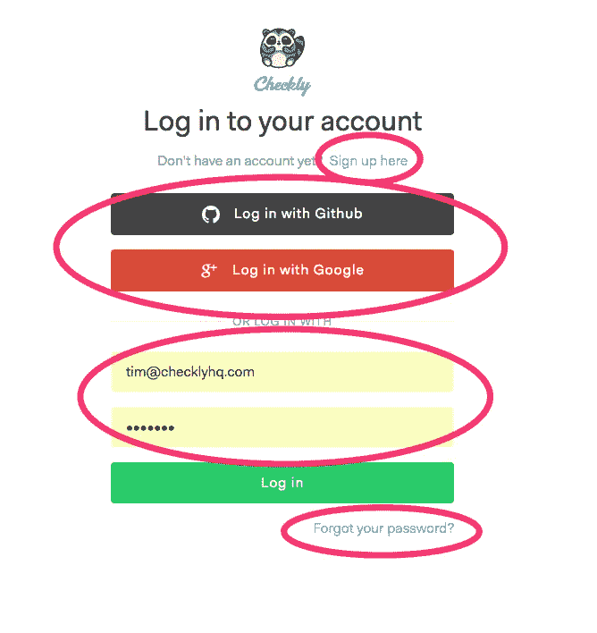**

**Checkly login page**

*   **注册**
*   **社交登录**
*   **用户名/密码登录**
*   **密码重置**
*   **社交登录的回调处理程序**
*   **注册/首次注册处理程序**

**这已经相当复杂了，在你的用户真正开始做事之前，有很多事情需要去做。此外，这些组件的测试可能很棘手，因为有许多后端和第三方服务交互正在进行，很难模仿或以其他方式解决。**

**在我的解决方案中，我采取了两个特定的架构决策来减轻这种痛苦:**

1.  **将 Auth0 用于实际的身份验证后端。我使用社交登录、用户名/密码登录和他们的 JWT 服务向 Checkly API 认证用户。*免责声明:我与 Auth0 没有任何关系，但他们的服务是一流的，非常💵对创业公司友好，因为他们非常自由的免费计划。***
2.  **将 Auth0 交互抽象为 Vue app 中的一个服务组件。你的 Vue 组件对 Auth0、JWT 令牌一无所知。他们只是导入一个“auth”服务并调用一些方法。如有需要，可轻松更换。**
3.  **将每个“步骤”分成自己的路线和组成部分。这让你和其他人的生活变得轻松。现在，您可以轻松地在营销中使用/login 和/signup 链接，而不用担心组件状态。状态由路由决定，就像任何正常的网页一样。**

**这是整个设置的可视化表示。跳舞的仓鼠意味着你完全注册和/或登录。**

**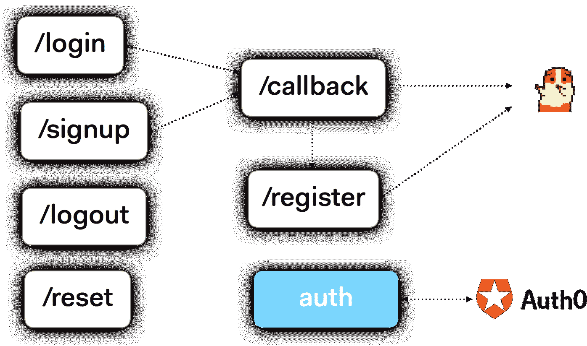**

**Auth flow in Checkly**

## **额外收获:处理未授权状态**

**当用户的 JWT 令牌过期时，API 后端会以 401 未授权报头来响应。您可能希望将用户重定向到您的登录页面，或者显示一些友好的消息。使用 Axios http 客户端和 Vue，这大约是五行代码。**

*   **在您的中央 http.js 服务中添加一个拦截器到 Axios。让 Axios 在 Vue.js 消息总线上发出一个错误。**
*   **倾听顶层组件中的信息并采取行动。在我的例子中，重定向到/login。**

**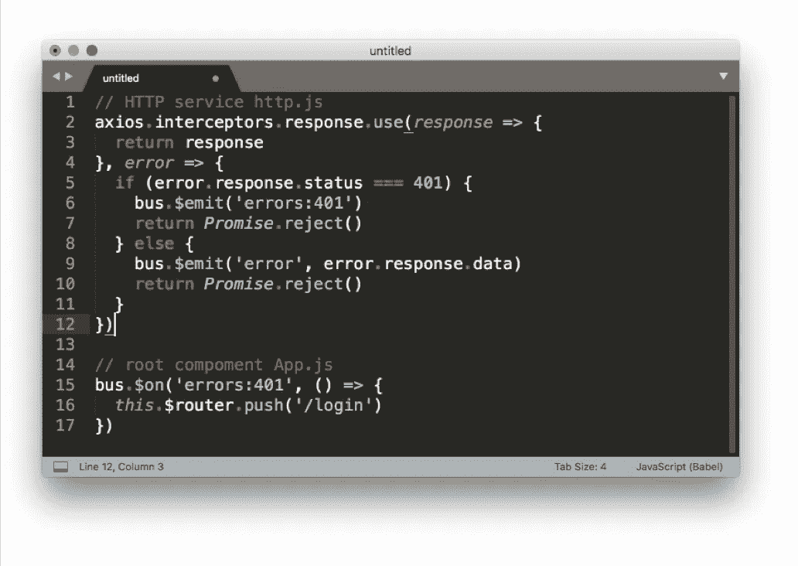**

**Using Axios interceptors with the Vue.js bus.**

# ****2。组件重用需要一点规划。****

**什么是组件？按钮可以是一个组件。但是全屏也可以是一个组件。你的整个应用就是一个组件！事实证明，在理解一个应用程序是如何构建的时候,“组件”和“非组件”之间的划分不够精细。**

**当然，我不是唯一一个发现这一点的人。[丹·阿布拉莫夫](https://medium.com/u/a3a8af6addc1?source=post_page-----90b6a5acd275--------------------------------)的[文章](/@dan_abramov/smart-and-dumb-components-7ca2f9a7c7d0)，当然是在 ReactJS 的上下文中，做了一些总结:将组件分解成**容器**和**你看到的东西**(丹帖子中的代表性组件，我的观点)。我的解决方案的唯一特点是**视图**总是被映射到子路径。**

**在下面的例子中，你会看到一个典型的编辑屏幕。在这种情况下是用于编辑 API 检查的编辑屏幕。这是容器，它映射到 url `/checks/<id>/edit/api`。屏幕在“位置&调度”选项卡上，映射到它自己在`/scheduling`的子路线**

**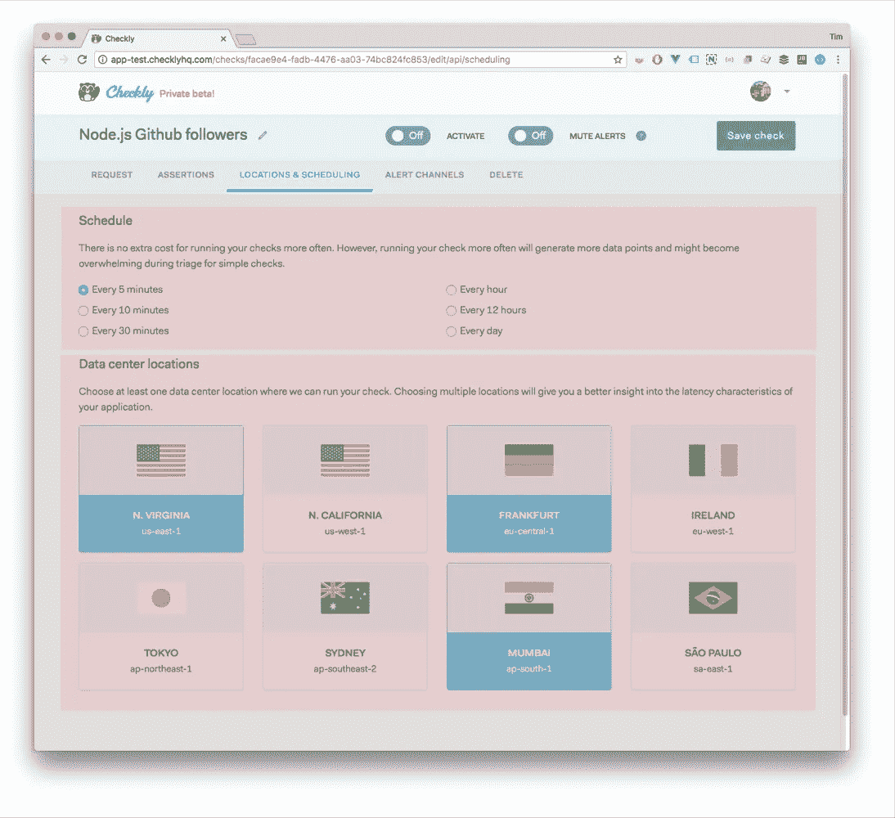**

**该选项卡包含国家选择和时间安排组件(红色部分)。然而，这些组件也存在于其他三个屏幕中:两次在创建向导中，一次在编辑屏幕中用于浏览器检查。**

**每个屏幕都是不同的，为每个组件提供不同的数据上下文和可视上下文，比如我们是处于“编辑”模式还是“创建”模式。换句话说，不仅注入组件的数据发生了变化(通过道具)，屏幕上的视觉排列也发生了变化。使用**容器/视图**分割有助于组织这一过程。**

*   ****容器**是顶级路线，大部分时间从 Vuex 读取。**
*   ****视图**是容器的显式子路线，不包含任何状态。**
*   **两个都可以容纳裸露的组件。**

# ****3。部署到 CDN 也需要一点规划。****

**现在来点完全不同的！**

**Checkly 后端部署在 Heroku 上，所以我考虑也从 Heroku 提供 web 应用程序。运动部件越少越好！然而，这比你想象的要麻烦得多。**

*   **您需要将 web 应用程序部署与 API 部署同步。不太实用。**
*   **您需要将编译后的资产打包到 API deployable 中。在大多数情况下，这些都是独立的(git)项目。现在你需要添加一个阶段，从一个人工制品注入到另一个🤢**

**我查看了第三方部署/CI/CD 服务。我看着 Netlify。但是最后，我只是使用了一些简单的 NPM 脚本和我已经从 AWS 获得的知识。**

**搅拌一个 S3 桶，然后安装 s3-deploy NPM 包。在 package.json 脚本部分添加三行代码。**

**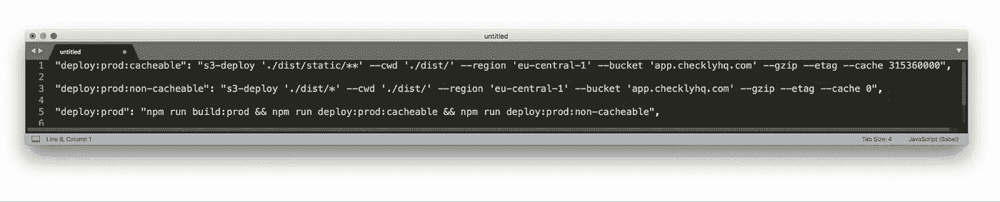**

**Three lines for great deploys**

1.  **将所有资产部署到 S3 存储桶，并设置缓存头和 etags。**
2.  **部署您的 index.html 没有缓存头，有效地缓存破坏您的浏览器的缓存每当有一个新版本。**
3.  **把两者连在一起。完成的**

**这组脚本将最初用 Vue-CLI 启动的 Vue.js 应用程序推送到 AWS S3 桶。在我的情况下，我也是作为一个 CDN 使用 AWS Cloudfront 的 S3 bucket。创建此设置时，有几个初始设置问题:**

*   **在 web pack 配置中添加一个 robots.txt。得驯服那些机器人。**
*   **已经提到过，但仍然是:注意正确的缓存头。您希望每一次代码更新或资产更新都可以立即看到。这意味着您应该使用**零**缓存来推送您的 index.html。这通常是一种好的做法。**
*   **设置 AWS S3 和 AWS Cloudfront 来处理单页面应用程序。这在 AWS 自己的文档中几乎完全没有。**
*   **将存储桶设置为托管**

**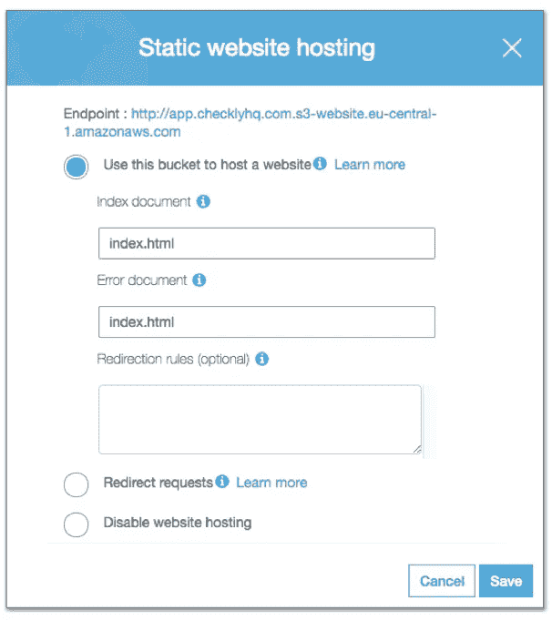**

**Set your S3 Bucket to hosting and return the index.hml on every error**

*   **将错误页面设置为 index.html**
*   **在 Cloudfront 上为 404 和 403 消息创建自定义错误响应。**

**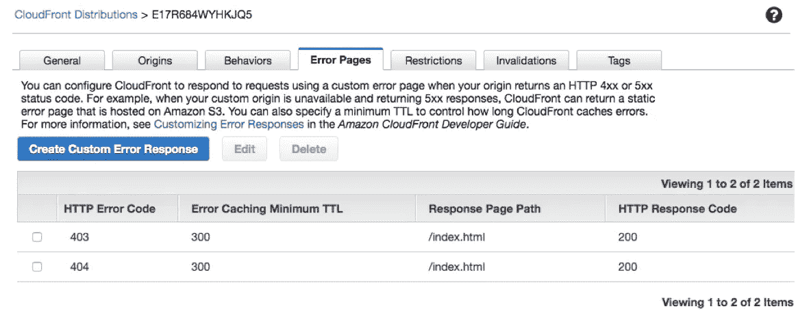**

**Create “fake” error pages that just return your app in Cloudfront**

# ****4。拥抱第三方插件，但仅限于…****

**暂停。我已经做了大约 20 年了。我有关于第一次互联网泡沫的无聊战争故事。尽管技术、市场和世界都发生了变化，但有一件事从未改变**

****开发漂亮有用的应用程序是一项繁重的工作****

**每个人都低估了这一点:经理、工程师、客户、我。因此，我使用第三方解决方案、开源框架、插件等的唯一原因。是我能否减少工作量。不要与花哨的东西结合，不要成为最新使用 x 或 y 的人，不是因为脸书使用它。似乎完全显而易见，但许多人似乎忘记了。**

**大声抱怨。下面是我可以推荐的三个 Vue.js 插件。我大量使用它们。他们做什么大概很清楚。它们并不完美，但会帮助你减少工作量。**

**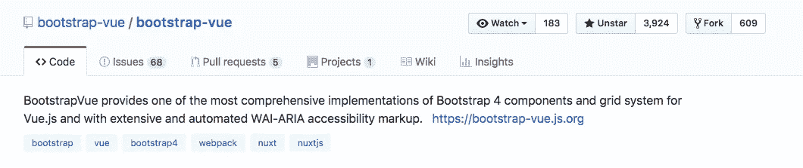**

**Bootstrap Vue**

**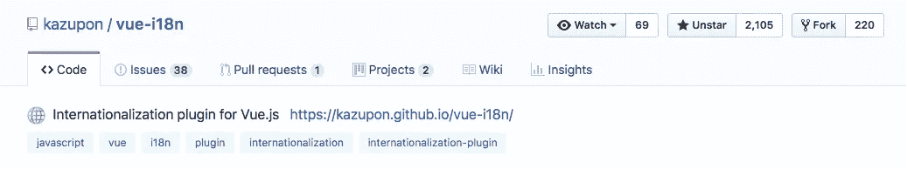**

**Vue-i18n**

**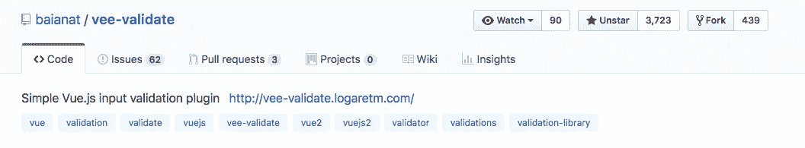**

**vee-validate**

# ****5。Vue.js 开发工具是一个很棒的省时工具。****

**Vue.js 开发工具 Chrome 扩展令人难以置信。我每天都用它。对我来说，它和 Vuex、Vue 路由器一样，是 Vue.js 生态系统不可或缺的一部分。这里有一个例子来说明它为什么会晃动。**

**我对用户界面和 UX 问题相当敏感。我不介意花很多时间**

*   **流行的颜色。**
*   **平稳过渡。**
*   **提供背景的微型动画。**
*   **一种让你与众不同的字体。**

**这意味着在错误的情况下，或者其他的极端情况下，我仍然希望一些好的事情发生。在前端开发过程中实现这一点可能相当棘手。**

**当转换和东西依赖于复杂的后端状态和 XHR 消息时，用快速编辑切换真/假状态真的真的真的很有帮助。**

**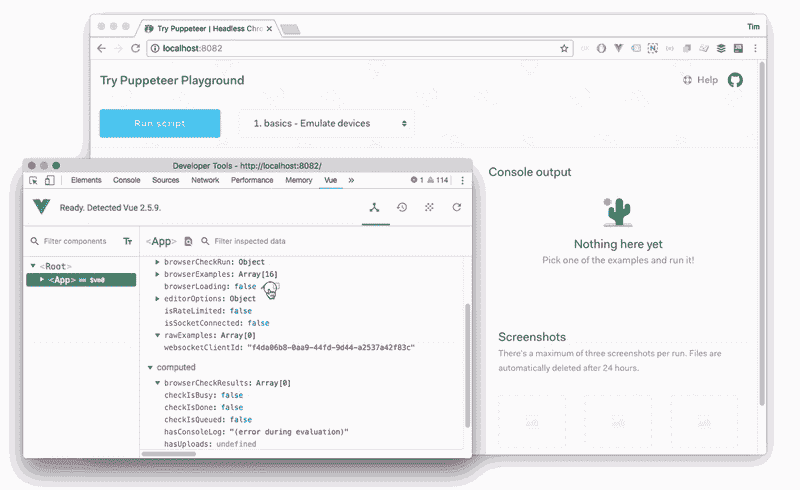**

**在上面的例子中，后端 API 需要处于特定的状态才能触发前端的某个屏幕。然而，这种状态不是静态的:它取决于时间和其他不断变化的变量。**

**除了添加您自己的调试按钮来切换这些状态之外，您别无选择。Vue.js 开发工具消除了这种痛苦。感谢 Vue.js 开发工具。**

**我正在为位于[https://checklyhq.com](https://checklyhq.com?utm_campaign=untrustedjavascript&utm_source=freecodecamp)的开发和运营团队构建一个主动监控解决方案。注册 15 天免费试用。还不确定？试试刚才的**鼓掌**👏下面！或者…**

**克雷克雷。🍍**