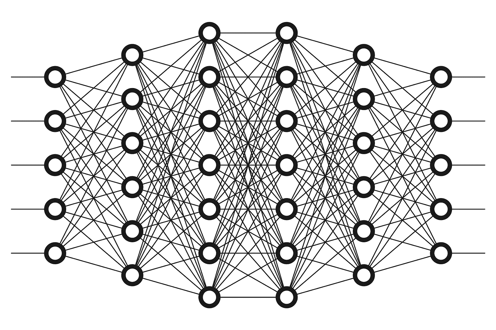

# 人工智能改变网页可访问性的五种方式

> 原文：<https://medium.com/hackernoon/five-ways-in-which-artificial-intelligence-changes-the-face-of-web-accessibility-dcd223aa8f16>

A common representation of a multi-tiered neural network, made up of many layers of models, where each layer takes input from the previous layer, processes it, and outputs it to the next layer.

人工智能现在风靡一时。你的新闻提要和社交媒体时间线很可能充满了预测人工智能将如何改变我们与周围世界互动方式的文章。从我们消费内容、开展业务、与同行互动、运输自己以及谋生的方式，一切都将受到人工智能相关创新的影响。革命已经开始了。

虽然这项技术还不完善，但在过去的 18 个月里已经达到了重要的里程碑。毫无疑问，这些里程碑表明人工智能可以改善残疾人的生活。这篇文章将让你对我们的技术走向有一个前瞻性的认识。以及这对残疾人在数字空间中的可访问性和包容性意味着什么。

# 神经网络和机器学习

人工智能经常看起来像是发生在一个黑盒子里。但是它的基础可以相对容易地解释。接触海量数据是所有魔术的核心。简而言之，没有大量的数据，人工智能就无法实现。然后是大量的计算能力来处理大量的信息。这就是人工智能如何开发新的理解。神奇的事情(姑且称之为[机器学习](https://hackernoon.com/tagged/machine-learning))是如何发生的。

机器学习可以总结为使用算法解析数据，从这些数据中学习，然后通过复杂的神经网络进行确定或预测的实践。人工智能系统在暴露于数据时建立的连接会产生技术可以识别的模式。这些模式带来了新的可能性，例如完成在此之前机器不可能完成的任务:在人群中识别熟悉的面孔，识别我们周围的物体，实时解释信息等。

神经网络是机器学习能力的核心。把它想象成人类的大脑:信息通过我们的感官进入，然后被处理。联想是基于先前存在的知识而产生的。结果是新知识出现了。类似的过程导致对机器的新理解。计算机可以通过人工智能建立的关联是发展数字包容未来的关键。

# 人工智能的构建模块

随着神经网络自我构建，以及机器从产生的组合数据点中学习，构建服务于非常具体、有点“简单”的目的或任务的人工智能模块变得可能。在用户需求的推动下，再加上一点点创造力，这些积木可以被组装起来，创造出更复杂的服务，然后改善我们的生活，代表我们完成任务。一般来说，简化人类日常需要做的一些事情。

让我们来关注五个这样的构件，看看它们是如何让人们的在线体验变得更容易理解的。其中一些模块与克服残疾有关，而其他模块则解决更广泛的人类挑战。

*   自动图像识别，
*   自动面部识别，
*   自动唇读识别，
*   自动文本摘要，
*   实时自动翻译。

想想我们在这一点上仅仅触及了皮毛。该死的。

# 1.图像识别修复 alt 文本问题？

每天，人们在脸书、Instagram、Messenger 和 WhatsApp 上上传超过 20 亿张图片。想象一下，在没有任何图像的情况下浏览自己的时间线会是什么感觉。这是数百万有视觉障碍的人的现实，直到脸书决定对此做些什么。

2016 年初，这家社交媒体巨头发布了其开创性的自动替代文本功能。它动态地向盲人和视障人士描述图像。该功能使脸书的平台能够识别组成图像的各种组件。在机器学习和神经网络的支持下，它可以以令人瞠目结舌的准确度描述每一个人。

以前，发布在你的时间线上的图片的替换文字只提到发布图片的人的名字。今天，发布在你的时间线上的图像是基于每个可以通过人工智能识别的元素来描述的。一张三个朋友在一个阳光明媚的日子享受独木舟之旅的照片可能被描述为三个人，微笑着，一片水域，蓝天，户外。当然，这并不像人类书写的替代文本那样丰富和引人注目。但是对于那些看不到图像的人来说，这已经是一个惊人的进步了。想想看，脸书这样做才 18 个月！

再过 5 到 7 年，图像识别人工智能将变得如此精确，以至于仅仅为图像编写替代文本的想法将变得毫无意义。对我们今天的一些人来说，使用布局表格而不是 CSS 是毫无意义的。

# 2.面部识别，作为期待已久的验证码杀手？

随着苹果将面部识别作为解锁下一代 iPhones 的新方式，微软一直在努力实现 Windows Hello。

这两种技术都允许您仅使用面部识别来登录您的计算机。最终目标是什么？根除对密码的需求，我们知道大多数人都不擅长管理密码。来自苹果公司的数据显示，到目前为止，它运行得很好。虽然触控 ID 在 iOS 上的错误率约为五万分之一，但苹果声称，通过面部识别，他们已经将这一比例降至百万分之一。谈一个改进！

是的，面部识别引发了严重的安全和隐私问题。但它也解决了许多与在线认证相关的挑战。通过接触数据——在这种情况下，是一个人面部的多张照片，来自多个角度——人工智能的构建模块学会对谁在摄像机前做出假设。因此，它们最终能够在各种环境中识别和验证一个人。

CAPTCHA 图像的替换是残疾人可能从面部识别中受益最多的一个领域。一旦系统通过相机镜头识别出与它互动的人是人类，清除机器人的需要应该成为过去。人工智能面部识别可能是我们一直在等待的验证码杀手。

# 3.唇读识别改善视频字幕？

你知道人工智能已经以 4 比 1 的比例击败了世界顶级的唇读专家吗？同样，通过大量接触数据，人工智能的构建模块已经学会随着时间的推移识别模式和口型。这些系统现在可以解释人们在说什么。

谷歌 DeepMind 项目对取自 BBC 视频的 10 万多个自然句子进行了研究。这些视频有各种各样的语言，语速，口音，灯光和头部位置的变化。研究人员让一些世界顶级专家试图解读屏幕上的人在说什么。然后，他们对谷歌 DeepMind 的神经网络运行了相同的视频集合。[的结果是惊人的](https://www.techrepublic.com/article/google-deepmind-ai-destroys-human-expert-in-lip-reading-competition/)。虽然最好的专家解释了大约 12.4%的内容，但人工智能成功地解释了 46.8%。足以让任何专家自惭形秽！

自动唇读也引发了严重的隐私问题。如果任何一台摄像机都可以拍摄到某个人在公共场所所说内容的近 50%，那会怎么样？尽管如此，这项技术仍然产生了惊人的潜力，可以帮助那些试图消费在线视频内容的听力残疾人士。给谷歌 DeepMind 和其他类似的人工智能模块几年时间，让它们在唇读方面做得更好。随着自动字幕质量和相关性的提高，我们将开始看到这些在线服务准确性的显著提高。

# 4.自动文本摘要有助于学习障碍？

人工智能有助于为有视觉或听觉障碍的人消除障碍。但是有认知障碍的人也能受益！Salesforce 和其他人一直在研究一种抽象的摘要算法。该算法使用机器学习来产生更短的文本摘要。虽然仍处于初级阶段，但它既连贯又准确。对于机器来说，人类语言是人类智能中最复杂的方面之一。这个构建模块为有学习障碍(如阅读障碍)的人以及有注意力缺陷障碍、记忆问题或低识字技能水平的人带来了巨大的希望。

几年后，Salesforce 在自动摘要方面取得了令人印象深刻的进步。他们现在正在利用人工智能从提取模型转向抽象模型。提取模型从文本中预先存在的单词中提取以创建摘要。这使得模型相当僵化。有了抽象模型，计算机有了更多的选择。他们可以引入新的相关单词和同义词，只要系统对上下文的理解足以引入正确的单词来概括文本。这是大规模数据暴露允许人工智能做出更好的猜测的另一个领域。这些猜测然后导致成功，相关性和准确性。

在当今世界，面对如此多的信息，跟上数据是一个巨大的挑战。处理相关信息同时剔除剩余信息已经成为 21 世纪最大的挑战之一。我们都必须越来越多地阅读，以跟上我们的工作、新闻和社交媒体。对于有认知障碍的人、识字能力低的人或来自不同文化的人来说，这是一个更大的挑战。我们先不要在抽象概括上屏息以待，但这可能是我们找到摆脱认知超载困境的最好希望。

# 5.实时翻译就像传说中的巴别鱼？

语言和文化的多样性可能是人类最丰富的方面之一。当与来自世界各地的人交流时，这也是一个不可克服的问题。自从人类有记忆以来，人们就一直梦想着建造能够让人们没有语言障碍地交流的机器。直到现在。

我们都已经熟悉了谷歌翻译等服务。我们大多数人经常取笑翻译出来的东西是多么的不准确。尤其是在各种不太常见的语言中，因此也没有被表示出来。2016 年 11 月，谷歌推出了其神经机器翻译(GNMT)系统，该系统[将错误率降低了高达 85%](https://research.googleblog.com/2016/09/a-neural-network-for-machine.html) 。这种服务逐字翻译的日子已经一去不复返了。现在，多亏了 GNMT，翻译已经全球化了。句子对句子，想法对想法。人工智能接触一种语言越多，对它的了解就越多，翻译就越准确。

今年早些时候，谷歌发布了 PixelBuds。这些耳塞可以与最新发布的手机配合使用。这些设备现在可以将你听到的内容实时翻译成多达 40 种不同的语言。这只是开始。从可访问性和消除障碍的角度来看，这是不可思议的。我们离巴别鱼(银河系漫游指南中的一种黄色水蛭般的小外星人)如此之近，几乎可以触摸到它。

# 这仅仅是开始

由于人工智能，这些积木只是出现的创新中的一小部分。这是人工智能的冰山一角。未来几年将会有更多的事情发生。这种创新已经在辅助技术中找到了自己的路。它们已经为缩小残疾人的差距做出了贡献。当有创造力的人把这些积木连接起来时，我们看到产品、应用和服务正在把人们的生活变得更好。这是激动人心的时刻。

自动驾驶汽车、环境识别应用、大脑植入计算机接口等。几年前，这种想法被认为是科幻小说。一场完美的 AI 风暴即将来临。它将改善每个人的生活，尤其是残疾人的生活。

作为一个生活和呼吸着数字包容的人，我迫不及待地想看看未来会怎样。我计划记录这些事情。如果你也是，我们应该在 Twitter 上互相关注，这样我们就可以一起看它的发展。给我对着 [@dboudreau](https://twitter.com/dboudreau) 喊一声。

这篇文章最初发表在 24a11y.com 的[和](https://www.24a11y.com/2017/five-ways-in-which-ai-changes-the-face-of-web-accessibility/)[德克博客](https://www.deque.com/blog/ways-artificial-intelligence-face-web-accessibility/)上。