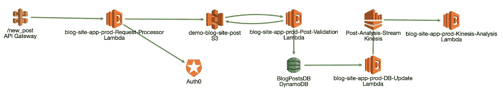
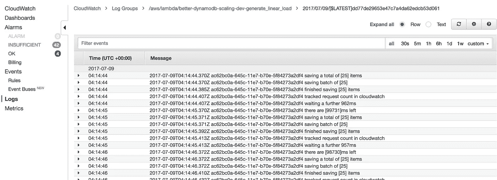
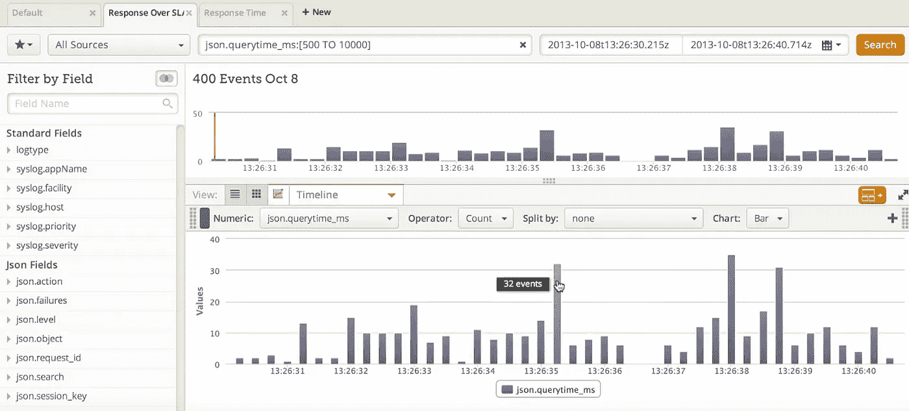
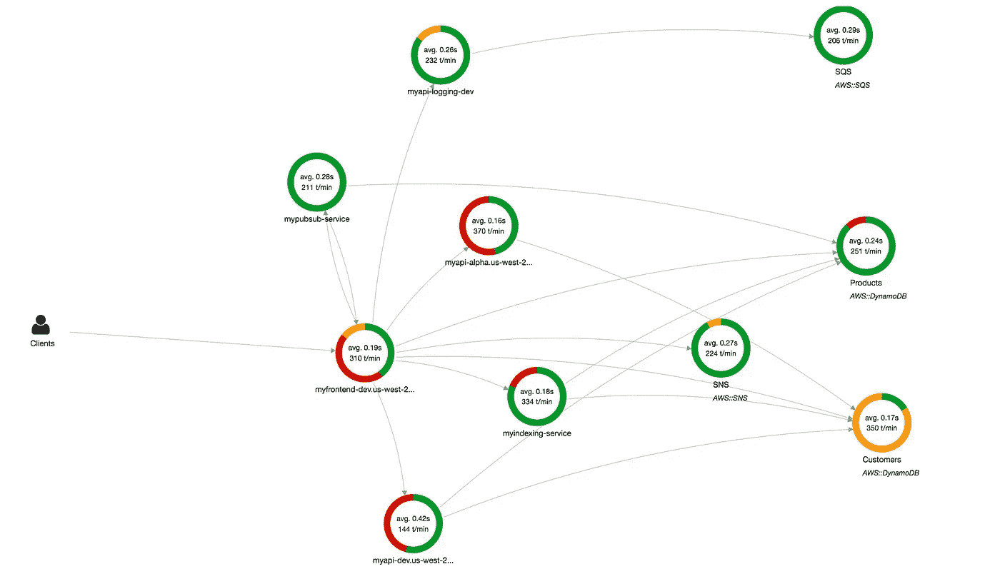
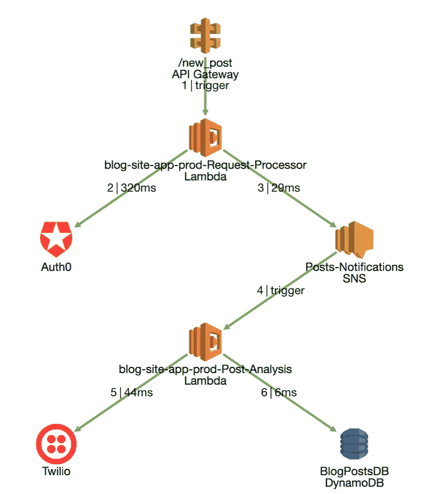

# 获得无服务器可观测性的 5 种方法

> 原文：<https://medium.com/hackernoon/five-ways-to-gain-serverless-observability-406e5cab51af>

在这篇文章中，我将介绍在无服务器(基于 FaaS)系统中获得可观测性的五种方法。我希望它能帮助开发人员、系统架构师和 DevOps 工程师使无服务器之旅成功，不那么令人沮丧，当然也是令人愉快的。

[无服务器](https://hackernoon.com/tagged/serverless)和功能即服务(FaaS)已经存在大约三年了。它始于 AWS Lambda，并迅速扩展到由领先的云供应商提供的类似服务——微软、[、谷歌](https://hackernoon.com/tagged/google)、IBM 和其他公司。然而，随着人们开始使用它，无服务器变得不仅仅是 FaaS。如今，无服务器系统包括由云供应商提供的功能、容器、托管服务(例如，消息队列、数据库、存储)和各种各样的 SaaS API(例如，Auth0、Twilio、Stripe)，所有这些都相互交互。

由于这些功能的性质——有限的运行时间、低内存和无状态，开发人员被鼓励使用越来越多的这些托管服务。随着函数和 API 数量的增加，无服务器应用程序的复杂性也在增加。现代应用程序是高度分布式的(“纳米服务”)和事件驱动的。最重要的是，缺乏对任何服务器的访问，以及一切都是无状态的，都不会让事情变得更容易。当试图快速解决问题、防止系统停机以及了解性能和成本影响时，可观察性是一个核心挑战。

*Serverless system are distributed and event-driven*

为了克服这些挑战，开发人员和 DevOps 工程师现在有几种选择来获得对他们系统的可观察性。每种方法都有优点和缺点，自然也有它的优点。由于 AWS 是当今最受欢迎的无服务器平台，这里给出的许多例子都来自 AWS，但是它们也可以应用于其他云供应商。

# 1.“这很简单”——使用默认的云供应商控制台

云供应商的控制台是尝试解决无服务器系统问题的第一个也是最直接的方法。AWS 为开发者配备了 [CloudWatch](https://aws.amazon.com/cloudwatch/) 、*“一种针对 AWS 云资源和你在 AWS 上运行的应用的监控服务。”*任何使用 AWS Lambda 的人都非常熟悉 CloudWatch 控制台。在那里，您可以找到每个函数的日志组，每个组包含该函数的所有日志。日志异步刷新，日志更新可能需要几秒到几分钟的时间。

*The CloudWatch console*

因为大多数开发人员觉得写日志很舒服，所以使用起来很简单。只需运行您的函数，并查看日志。然而，当事情变得有点复杂时，例如，在一个具有多个函数、队列、触发器等的分布式系统中，理解整个情况并连接所有不同的日志项可能是相当具有挑战性的。想象一下一串 5 个 Lambda 函数，中间有触发器——更不用说您不记得记录所有内容的时候了。Azure 和 Google 有一个类似的解决方案，可以从他们的 FaaS 服务中登录。默认控制台是一个很好的开始，确实不能忽视。然而，当跨越 5 或 10 个功能范围时，大多数团队很快发现理解他们的系统的挑战，有些甚至提到它有“日志地狱”让我们探索一些替代方案。

# 2.“我们去别的地方吧！”—将数据流记录到外部服务

当您的无服务器架构发展时，您会经历日志、更多的日志和更多的日志，突然感觉有些不对劲。事情不应该是这样的——是吗？你花了所有的时间去浏览无数的行，这些行是由每天运行数百万次的函数编写的。不实用，也就是不再管用了。即使您在日志中找到了正确的错误，回溯并进行根本原因分析几乎是不可能的。

所有消息队列中发生了什么？也许是外部 API 降低了您的系统速度，导致您的云账单激增？一定有更好的解决方案，对吗？

您可能听说过日志聚合平台，如 Splunk、Loggly 等。其中一些非常棒——它们甚至可以自动为您检测异常情况！在这种情况下，为什么不把你所有的日志放到这样一个服务中，然后快速方便地搜索和过滤那里的所有内容呢？不再需要手动清理日志？万岁！

*Log aggregation platforms (source: Loggly)*

崔琰在他的许多优秀博客文章中的一篇中描述了其中的一些方法。将日志流式传输到任何现有的日志聚合服务中相对容易。所以，现在，你可以快速地做你一直想做的所有查询和搜索。当一个功能失败时，您可以找到相应的日志，也可以搜索其他功能的日志。

然而，这真的是你想要的吗？你仍然需要手动记录所有的事情，你仍然没有弄清楚系统的**异步特性**。所有的触发器和事件在哪里？它们是如何连接的？此外，这些日志聚合工具并不便宜。

是时候考虑一个更合适的解决方案了——分布式跟踪解决方案。

# 3.“我想要更多”——云供应商提供的高级可观察层

幸运的是，AWS 和其他云供应商不会空手而来(这一部分我将重点介绍 AWS)。AWS 提出了 [X 射线](https://aws.amazon.com/xray/)，*“让开发人员能够通过端到端的跟踪能力，轻松分析他们生产的分布式应用程序的行为。”* AWS X-Ray 是一个很棒的工具，它允许您跟踪和检测您的代码，以获得对正在发生的事情的额外可见性。它还使您能够分析代码的不同部分，并识别慢速点，或慢速 AWS APIs，如 DynamoDB、SQS 等。

*AWS X-Ray (source: AWS)*

我们在几个分布式无服务器应用程序中测试了 X 射线，发现它确实能在理解是什么降低了 Lambda 速度方面提供很多价值。Lambda 函数的自动集成和插装有助于发现问题、触发器和缓慢的 API。X-Ray 还没有连接异步事件，比如一个 Lambda 将消息发布到 SNS，这会触发另一个 Lambda。因此，对 X 射线的复杂问题进行故障诊断是一项挑战。此外，许多 X 射线的酷东西不会自动发生，而是需要开发人员手动插入跟踪。最后，无服务器架构是动态的，总是在发展，并且与多个外部第三方服务相连接。对于公司来说，这是一个利用高级人工智能来预测在这样一个动态环境中可能发生的任何问题的绝佳机会。如果像 X 射线这样的内置工具还不够，你可能会考虑下一步。

# 4.“别管我”——自己实施追踪解决方案

有时候，现有的工具是不够的。你有一个复杂的分布式系统，有几十或几百个功能。在一天结束时，您希望能够回答这样的问题:“一切都正常吗？”，“是什么降低了我系统的速度？”，还有，当出现问题时——“它为什么会坏？”以及“最快的修复方法是什么？”。

既然你是一个有天赋的开发人员，并且你没有设法找到一个满意的解决方案，你决定自己实现一个。这篇有趣的[博客文章](https://theburningmonk.com/2017/09/capture-and-forward-correlation-ids-through-different-lambda-event-sources/)提出了捕获和转发函数间关联 id 的方法，这可能是这种跟踪技术的灵感来源。

使用类似的方法，您也许能够跟踪整个系统中的异步事件！很美，不是吗？现在，您需要采用这种出色的跟踪技术，将它扩展到所有不同的云供应商服务和您正在使用的外部 API，实现一个后端来分析所有事件，有一个漂亮的 UI 来显示它，当然，添加一些警报，这样您就可以知道什么时候出现了问题…如果您已经到了这一步，请三思而行。你将进入一个迷人的分布式跟踪世界，除非这是你公司的业务(对我们中的一些人来说，就是这种情况)，否则你将在这上面花很多时间——而且可能永远都不够。你应该考虑的一件事是——你想如何度过你的时间？利用无服务器到最后，扩展您的业务，或者整天紧紧抓住所有的 Lambda 功能，以确保一切不会崩溃？外面一定有什么东西！

# 5.“帮帮我，谷歌！”—搜索专用的解决方案

你已经走了这么远。你在寻求帮助。最终，你不想自己开发一个无服务器的可观察性解决方案，就像你不想自己实现 AWS Lambda 一样。利用托管服务—这是您选择遵循的信条。今天，有几种产品可以帮助您了解无服务器系统中发生了什么。他们中的大多数人只关注 AWS，因为它仍然占有很大的市场份额，尽管微软、谷歌和 IBM 正在迅速向它前进。在选择这样的解决方案时，您需要问自己的核心问题是，“这个产品能解决我的分布式系统中最困难的挑战吗？”同样，由于现代的基于微服务的系统本质上是分布式的，当单独观察每个服务或每个功能时，很难快速解决问题。您正在使用的各种触发器、事件、服务和 API 可以将小问题变成大问题。这些异步事件是卑鄙的！

在为您的无服务器系统选择可观测性解决方案时，我建议考虑以下事项:

*   该解决方案是否能帮助我快速查明系统中的问题？
*   我能了解正在进行的所有事情，而不仅仅是我的代码吗？(API、托管服务等。)
*   对我来说这就够了吗，还是我必须回到云供应商的控制台以获得更多信息？

在[艾普森](https://epsagon.com/)，我们热爱分布式追踪。这就是我们研究和开发可视化和端到端可观察性技术的原因，专门用于现代无服务器系统。

*End to end transaction in Epsagon*

有很多很好的解决方案，在回到老的“记录和搜索”方法之前，一定要尝试一下。无服务器是一种新的软件模式，它需要新的方法来观察和监控。世界在飞速发展，不要让它溜走！

AWS 无服务器 AWS Lambda 可观测性监控性能分布式系统分布式跟踪无服务器监控 Lambda 监控

*最初发表于*[*【epsagon.com】*](https://blog.epsagon.com/five-ways-to-gain-serverless-observability)*。*