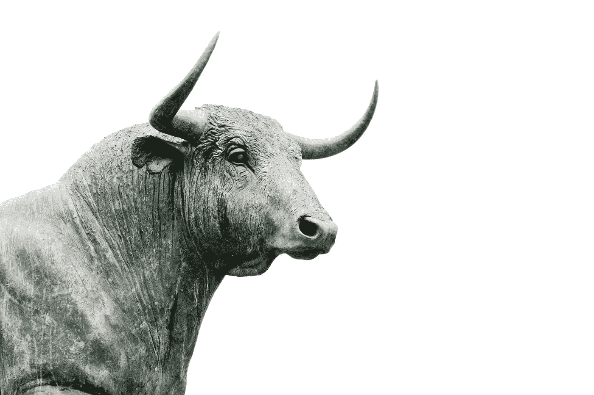
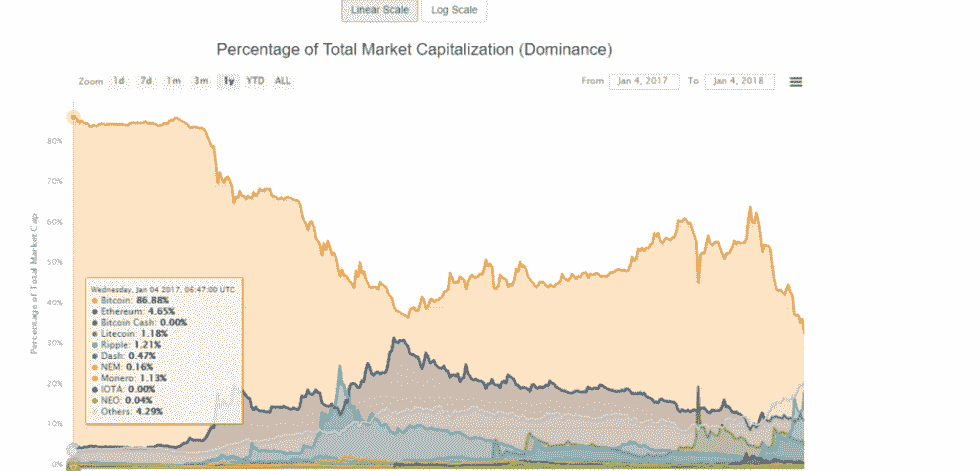
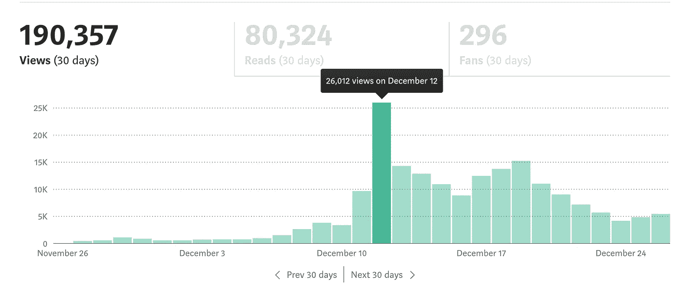
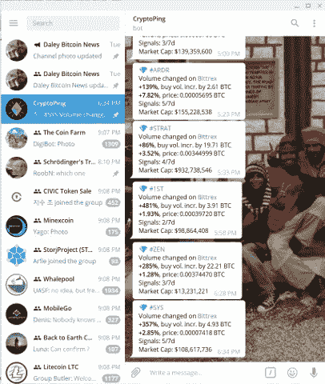
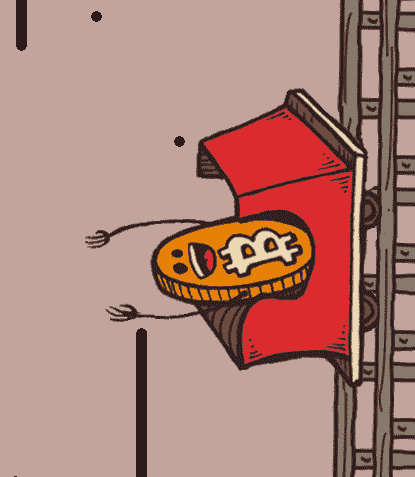
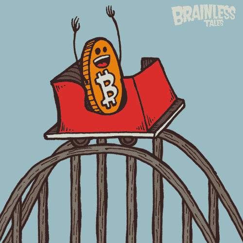
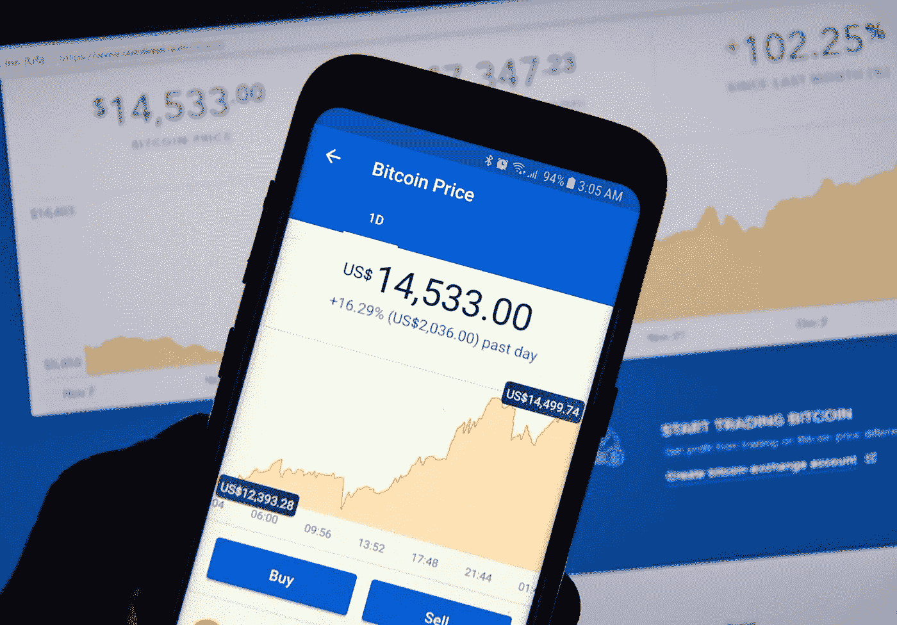

# 识别比特币牛市的五种方法？

> 原文：<https://medium.com/hackernoon/five-ways-to-identify-a-bitcoin-bull-run-56a788ff60e5>

## 对于那些已经看了比特币一年多的人来说，现在知道什么是牛市了，它是如何将替代硬币粉碎的，以及一旦比特币在每个水平稳定下来，它们是如何重新获得地位的。这是我们在过去观察到的一种模式，并且到目前为止一直在按预期工作。但是，识别牛市有什么症状吗？

Photo by [Hans Eiskonen](https://unsplash.com/photos/wn57cSQ7VzI?utm_source=unsplash&utm_medium=referral&utm_content=creditCopyText) on [Unsplash](https://unsplash.com/search/photos/bull-run?utm_source=unsplash&utm_medium=referral&utm_content=creditCopyText)

鉴于 2018 年初以来的价格暴跌，一年前或历史高点进入的交易员和投资者对 2018 年的 Q1 和 Q2 相当缓慢和失望。每个人心里只有一件事——下一轮比特币牛市什么时候到来？

投资者希望看到他们的资产重现往日的辉煌，交易者希望在牛市中做一些有利可图的交易，尽可能多赚钱。但要实现这一切，还需要一轮牛市。这什么时候会发生？有没有一种方法可以让我们察觉牛市即将来临？

以下是识别比特币牛市的五种方法:

## 1.BTC 和 alt 之间的相关性

一般在淡季，比特币和 alt-coins 是齐头并进的。但是，在牛市即将到来的那一刻，比特币摆脱了其他替代货币，开始了自己的牛市。这时，BTC 和另类硬币之间的相关性发生逆转，导致比特币在整个加密货币市场的主导地位上升。

因此，当这种相关性开始淡化时，这是比特币牛市或整个加密货币市场的迹象之一。

## 2.关注中等统计数据

这是一个有趣的因素，对于那些媒体上的作家来说。如果你是加密货币、比特币、另类硬币和相关东西等主题的知名作家，自 2018 年初以来，即在熊市期间，你的中等统计数据将非常平坦。但是，当牛市即将到来时，你会看到统计数据开始增长。

My medium stats for the month of December

由于 medium 上的大多数流量都是通过谷歌进行的，这可能意味着更多的零售用户正在寻找加密货币和比特币的相关知识，他们将购买比特币并增加需求——从而导致价格飙升。

因此，如果你的中等统计数据飙升——这是比特币或加密货币市场牛市的迹象之一。

## 3.你的电报活动出现峰值

From Google — Not mine

电报小组，就像通用的加密货币讨论小组或分析小组(我不是在说泵和转储小组)——这些小组在过去几个月里必须是平静和无生气的。除了一些转发的文章或一些由热心者分享的突破性新闻链接，他们希望价格朝着积极的方向发展。

但是，当牛市即将来临，几天后，你会感觉到你所在的各种加密货币相关电报组的活动增加。唯一常见的是对价格、应用、采用、主流媒体文章和所有好消息的讨论，以及一些可靠的看涨和看跌期权——各地的信心水平都在提高。

因此，电报组活动的增加以及其他迹象将是识别即将到来的牛市的一种方式。

## 4.正面新闻和 Reddit 迷因帖子

Reddit 是互联网的首页，也是围绕加密货币及其项目进行讨论的重要场所。我猜 Reddit 是唯一一个人们把这些代币和硬币称为项目而不是交换的金融工具的地方。

模因是人类表达情感不可或缺的一部分——这些模因最适合用于表达牛市、熊市、焦虑、绝望、攻击性和更多的情感。比特币/以太坊/Ethtrader 上分享了大量有趣、幽默和搞笑的模因，以及更多关于价格和重大事件的子主题。

牛市之前，reddit 上的活跃度也在上升。平常日子的活动大多局限于项目的开发或营销更新，以及一些初学者问题和更多的客户服务咆哮。但是，是的！在奔牛节之前——一切都像周五晚上的派对——非常热闹，每个人都会围着分享创意迷因或发布相同的旧迷因跳舞。

因此，reddit 活动是识别牛市的标志之一。

## 5.实际的 BTC 心脏——如果你密切关注它，它会一直增长！相信我！！

有趣的是，比特币的价格也在牛市中开始快速上涨——这是比特币正在运行的最重要信号。忘掉泡沫、破裂和熊市吧。当你觉得这是一个牛市时，尽你所能去做&抛售以获取利润。

如果你等过了牛市&进入熊市— ***你可以把这篇文章收藏到那个时候再读！***

## 所以，这是一些有趣的信息，可以帮助你识别即将到来的比特币牛市。如果你觉得这很有帮助——为这篇文章鼓掌，并在社交媒体上分享。

*所提供的信息基于经验，并添加了一些幽默元素，使其变得有趣。这不是任何形式的建议或财务建议，也不应被视为建议或财务建议。加密货币市场非常不稳定，人们可能会失去全部投资。因此，请使用您自己的判断力作出任何决定，并采取他们经过彻底的研究。*

如果你已经投资了加密货币，并且需要帮助计算税收，请使用我们的服务 bear tax——它可以无缝连接到数吨交易所，并在几分钟内为你提供损益计算。查看 [www.bear.tax](https://bear.tax)

 [## BearTax -您的加密税务助理

### 密码交易员、会计专业人员、注册会计师连接交易所、进口交易的简单可信的平台…

熊税](https://bear.tax)