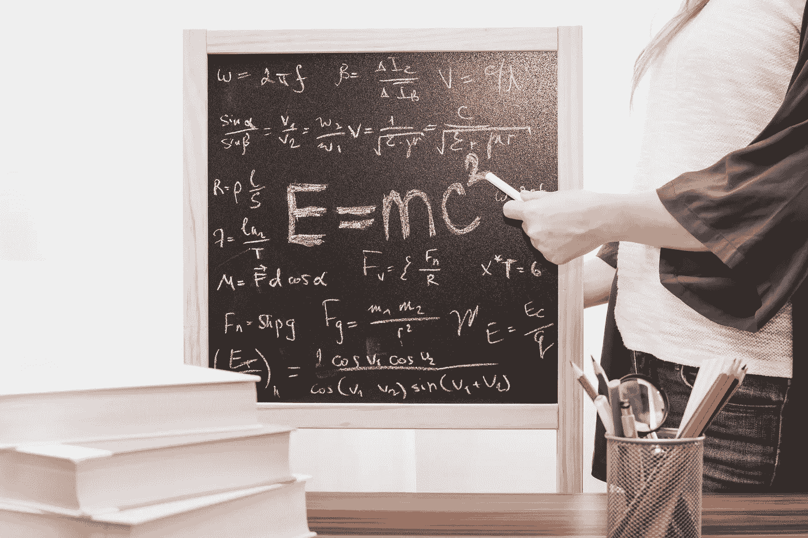
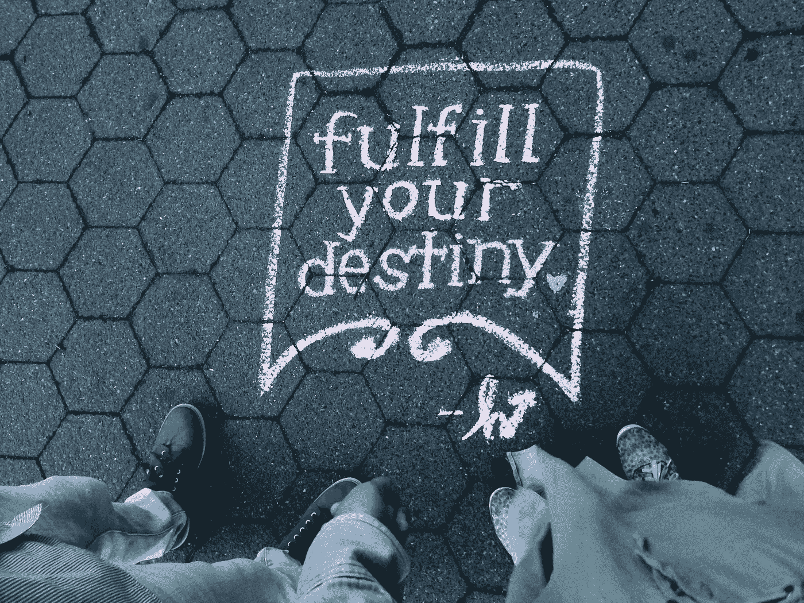

# 克服消极思维的五种方法

> 原文：<https://medium.com/hackernoon/five-ways-to-overcome-negative-thinking-3c697cbe2b98>

你有没有过被自己的思想困住的感觉？你有没有觉得你的自我怀疑阻碍了你？

一项[研究](http://www.michaelafreemanmd.com/Research_files/Are%20Entrepreneurs%20Touched%20with%20Fire%20(pre-pub%20n)%204-17-15.pdf)显示，惊人的 **49** 百分比的企业家患有至少一种精神疾病，如注意力缺陷多动症、抑郁症、双相情感障碍、焦虑或成瘾，大约三分之一的企业家患有不止一种精神疾病。如果一切都要靠自己，责任会压过你。我想向你介绍五个步骤，这五个步骤将消除消极思维，同时也为一个充满活力的积极心态的表现提供一个基础。

## **停止看过去**

你搞砸了，事情没有像你计划的那样发展，你感到背运困扰着你。它发生了。克服它。意识到你的不足是重要的，不断地思考它们并不重要。你需要克服它有两个主要原因。首先，过去和未来都是假象。唯一真实存在的是当下。你每天只有 **24** 个小时，你不知道自己是否会成为未来的一部分。你唯一确定的是，只要你还在呼吸，你就活着。你只能在当下采取行动。如果你只是在思考过去或者担心即将到来的事情，而不是采取行动，那么就没有时间让你为未来的自己设计更好的礼物了。采取行动是成功的关键。如果你一直在想一些已经发生或将来可能发生的事情，你就没有在努力实现你的成功。

## **焦点**

就像你的时间一样，你的精力是有限的。不要把你的注意力浪费在那些不会给你的生活带来价值的事情上。专注只不过是精神能量的强烈集中。如果你把你的精神能量用于消极，你就是在浪费你本可以用于建设性的、积极的想法的能量。消极没有通向成功的道路。请记住，积极的行为会带来积极的结果。尽管由菲尼亚斯·昆比(Phineas Quimby)在 19 世纪早期(T2)提出的吸引力定律由于缺乏证据而不能被认为是一个经过验证的科学概念，但 T4 的双缝实验(T5)已经证明了结果的数量是无限的，并且最终的结果取决于观察者。这个结论强烈暗示了思想确实对结果有影响。极其成功的人以这样或那样的方式遵循这个原则，例如，亨利·福特在近一个世纪前总结道:“不管你认为你能，还是你认为你不能，你都是对的。”

## **一切都是波，包括你的生活**

虽然专业交易者使用艾略特波浪原理来预测市场，但发明了我们今天所依赖的大多数技术的人尼古拉·特斯拉说:“如果你想找到宇宙的秘密，就从能量、频率和振动的角度来考虑。”
尽管你可能厌倦了所有普通的激励性建议，比如“坚持下去！”或者“永不放弃！”这个建议对很多人来说都没有用。
生活充满了起起落落，当你认真对待时，不幸其实只不过是一件发生概率极低的不利事件。但如果你被厄运缠身，这意味着什么呢？假设你不是你的问题的源头，你认为这是一种不幸，长时间的坏运气意味着一连发生了许多不太可能的事情。由于概率法则，这使得你很有可能很快就会走运。可以这样想:
每一项投资都可能在暂时价值上波动，完全独立于资产的真实价值。如果你买了一个没有价值的资产，下跌趋势很可能会持续到价格为零。如果你一次又一次地犯错误，而[没有从中吸取教训](https://hackernoon.com/tagged/learning)，情况就是如此。那还不算坏运气。不幸不是你能控制的。就像具有实际价值的资产的价格可能会失控一样，非理性的价格倾销也可能因政治或社会原因而发生。但如果你持有一项有价值的资产，而它的价格越来越低，你能做的最糟糕的事情就是在底部卖掉它。你的生活也是如此。

## **退出**

过得不好就退出，就像在底部卖出。如果你在艰难的几个星期后放弃了，你没有得到概率的概念。如果你去赌场的轮盘赌桌上赌 10 次黑色，你有 51%的机会第一次就输了。假设你输了十次，下一个结果越来越有可能是黑色，因为红色的机会只有 49%。

## **现实是由能量形成的**

如果你理解了概率的概念，你很快就会得出结论:你唯一应该关注的事情就是在当下尽你最大的努力。由于阿尔伯特·爱因斯坦的狭义相对论，证明了每个原子都由量子组成，具体来说，这意味着一切都是能量。此外，你的思想是能量，这种能量对创造你的现实的能量有影响。每一项发明，都有在它之前就存在的东西；将想法变成现实的想象力。如果人类了解他们聚焦的力量，他们就能够形成现实。
约翰·霍普斯金大学物理学和天文学教授 R.C .亨利进一步解释了[事物](http://webcache.googleusercontent.com/search?q=cache:http://henry.pha.jhu.edu/The.mental.universe.pdf) *，*说新物理学的一个基本结论也承认观察者创造了现实。

作为观察者，我们亲自参与了我们自己的现实的创造。物理学家被迫承认宇宙是一个“精神”的构造。先驱物理学家詹姆斯·琼斯爵士写道:

> *“知识的洪流正走向一个非机械的现实；宇宙开始看起来更像一个伟大的思想，而不是一个伟大的机器。心灵不再是物质领域的偶然入侵者，我们应该欢呼它是物质领域的创造者和统治者。克服它，接受无可争辩的结论。宇宙是非物质的——精神的和精神的。”*

## 关于感恩的普遍误解

如果你不学会快乐，你永远不会快乐。感恩是人类最难理解的概念之一。快乐来自内心——很多人都是通过痛苦的方式才认识到这一点。当然，你在实现一个目标后会产生多巴胺，也许你一直想买得起一辆保时捷，当第一次发生时，这很好，但习惯它是人的天性。

那就是你问自己:“下一步是什么？”

除了你自己，没有什么能让你持续快乐。对感恩的普遍误解导致了错误的假设，所以你认为在得到你生活中想要的东西后，你会感到感恩。
即使你是通过努力挣来的，你也永远不会对外在的东西感到欣慰。感激是一种技能如果你不学会感激你已经拥有的东西，你怎么会认为你会感激更多呢？

## **相对性**

这背后的原因很简单，也是因为阿尔伯特·爱因斯坦的发现。他不仅向我们展示了一切都是由能量构成的，而且他还引入了相对论的概念。此外，相对论是你无法满足于可以用数字来衡量的事物的原因。金钱不会让你快乐，自由会。总有更好的，更多的，更差的，更少的。如果你认为你得到这个或那个就会快乐，你只是把你的快乐推迟到以后，这件事可能会让你快乐一小段时间，但不会持续很久。如果你正在读这篇文章，你很可能比目前因营养不良而挨饿的 815 万 T2 人过得更好。此外，超过 10 亿人目前生活在贫民窟。如果你现在还不感激，你就没有意识到你已经有多幸运了。

## **冥想是无为的艺术**

每个人都在谈论冥想，以及冥想对你的成功是多么重要。然而，没有人告诉你这是怎么回事。冥想是一种什么也不做、不分心、不对事物做出反应的能力。你的目标是进入纯意识状态。当你专注于你的呼吸时，你开始重新获得专注的能力。然而，不仅仅是专注。如果你每天练习冥想，你可以学会以一种超现实的方式想象事物，你将能够看到、品尝和感受你在头脑中创造的每一个现实。这可以作为一个强大的工具来保持一个强烈的愿景，因为你可以想象你的现实应该是什么样子。你将获得的喜悦感将是继续工作的强大动力。此外，无所事事的艺术将你从每天面临的压力中释放出来。事实上，正如哈佛大学研究员赫伯特·本森在 2002 年**的[哈佛公报](https://news.harvard.edu/gazette/story/2002/04/meditation-dramatically-changes-body-temperatures/)中总结的那样，科学证明少林和尚由于过度的冥想练习而获得了超人的力量。**

## **对生活中的坏事心存感激**

你有幸运也有不幸——生活就是这样。如果你接受这个前提，你有两个选择:

你可以决定庆祝你的成功，沉思你的失败，或者你可以庆祝你的失败和成功，把你生活中最坏的情况变成一场派对。别误会我的意思。我不是在说故意做蠢事或犯愚蠢的错误。我也不是说你应该为自己的失败感到骄傲。

我要说的是你应该全力以赴。尽你所能，努力工作，为自己庆祝，即使没有成功。厄运是暂时的，你会再次走运，这是自然法则。如果你不断提高自己，努力工作，你就不可能永远不走运。

话虽如此，最终旅程必须是目标。为了潜在的更好的未来而牺牲现在的时间不是解决办法。不要为了更好的未来而牺牲你的现在，因为时间只会向前移动，到了某个时候，你的时间就会用完。想办法在将来保存你快乐的现在。