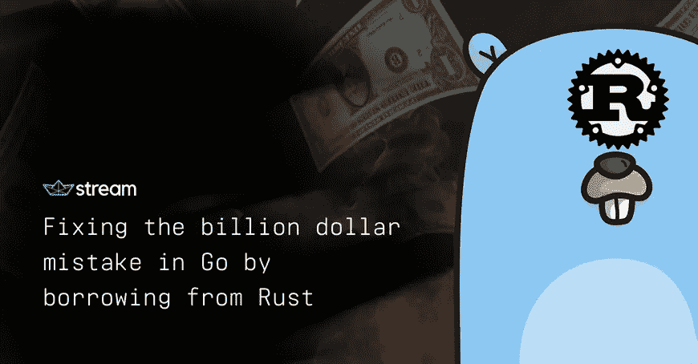

# 通过向 Rust 借款来修复 Go 中的十亿美元错误

> 原文：<https://medium.com/hackernoon/fixing-the-billion-dollar-mistake-in-go-by-borrowing-from-rust-66fab3ea715e>



```
panic: runtime error: invalid memory address or nil pointer dereference
```

如果您曾经使用过 Go，您可能至少会看到一次这个错误。某处一个 nil 指针或 nil 接口被传递给了一个不处理 nil 的函数。在所有情况下，这都是一个编程错误，要么函数应该处理 nil，要么调用者不应该将 nil 传递给…