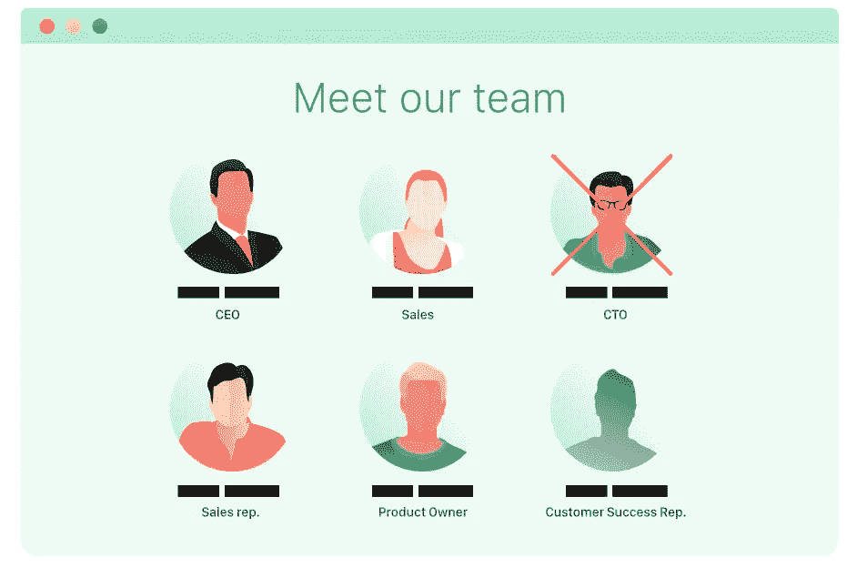
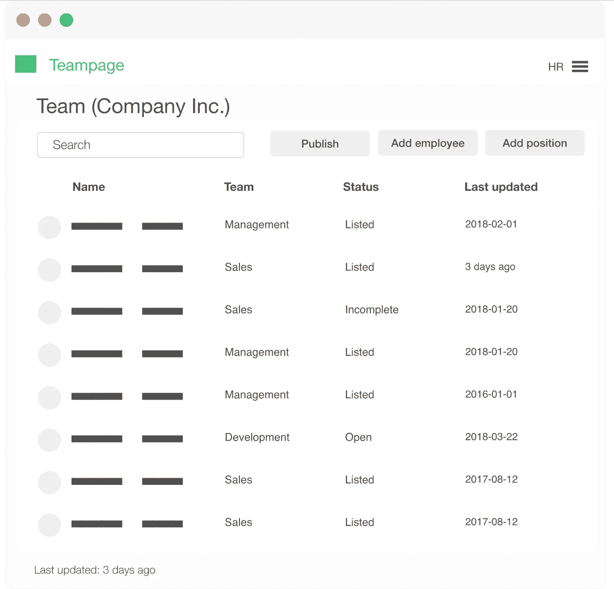

# 修复我离开的公司—即服务

> 原文：<https://medium.com/hackernoon/fixing-the-company-i-left-as-a-service-b71df0d7d3e1>

当我还是荷兰最大的[房地产门户网站](https://pararius.com/)的[首席技术官](https://hackernoon.com/tagged/cto)时，我们的开发团队是精干的，我们的想法是宏大的。这迫使我们将开发资源集中在我们最优先的任务上:季度*下一件大事*或出问题的事情。

这种专注让我们取得了明显的进步，同时[也为我们的客户保持了高质量的服务水平。](https://hackernoon.com/tagged/maintaining)

但是缺点是我们的 sprints 总是被完全塞满，我们的 backlog 随着优先级较低的维护类任务快速增长。

当我们有时间的时候，我们试着为那些任务腾出时间，但是因为开发人员自己挑选那些任务，相对来说更无聊的任务很容易被跳过。

那些重复出现的令人厌烦的(然而我认为是重要的——见下文)任务之一是对我们公司团队页面的变更。

该公司进行了合并，我们获得了新的销售人员，进行了晋升，开发团队重新洗牌，客户支持与实习生混合(每 6 个月一批)…总共有很多人力资源突变。

Meet our team, in mid-2016.

该公司的[团队页面](https://www.pararius.nl/dit-zijn-wij)现在向公众提供，是我们团队在 2016 年年中的快照(仍然笨拙地以我为 CTO——在 2017 年年中离职后)。

但是因为我知道问题的根本原因是什么，所以我知道如何解决它！因此，我将与一些认识到团队页面的价值，但讨厌维护它的负担和资源成本的公司一起，推出我的第一个测试项目。

**有了 Teampage，我们可以帮助公司轻松提供漂亮的团队页面**。通过投资适当地展示他们的团队(让员工感到自豪)，我们也清除了开发积压(让开发人员高兴)，并且不再担心在团队页面上提供过时的信息(管理层和 HR 高兴)。

Teampage 由一个简单的仪表板组成，允许公司中合适的人对公司的团队页面进行更改，而无需开发团队的参与。

Mockup dashboard

仪表板 UI 允许轻松的团队管理，简单的头像上传，快速的员工添加和编辑，以及完全控制如何在您的网站上显示您的团队。

*如果您的公司团队页面没有得到应有的关注，作为发布前的促销活动，如果您订阅了即将推出的以下产品搜索，您将获得提前访问和 50%的终身折扣(以换取您帮助我们改进服务的反馈)。*

 [## 团队页面-产品搜寻

### 团队页面——为寻找产品的公司提供的轻松团队页面

www.producthunt.com](https://www.producthunt.com/upcoming/teampage)