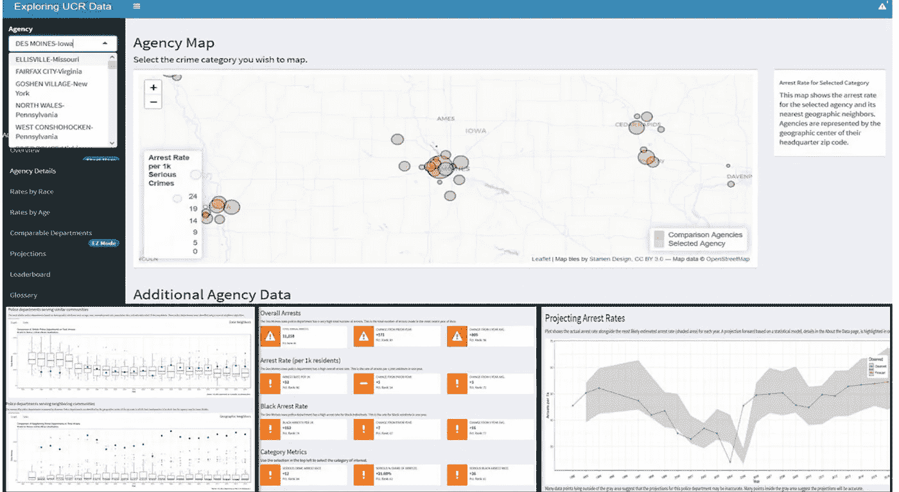

# 解决警察问责中的数据问题

> 原文：<https://medium.com/hackernoon/fixing-the-data-problem-in-police-accountability-d4fc56be2408>

*RootProject 与*[*civillytics 的创始人 Jared Knowles 博士、*](https://www.jaredknowles.com/) *合作，为一个试点项目筹集资金，该项目旨在授权社区倡导者寻求警察问责制和司法改革。*

“今天，真正包容性公民话语的主要障碍之一是政府对技术专长的依赖。甚至当地政府部门，如警察、消防和教育部门，现在也依靠专家网络来管理和指导他们的工作。**对专业知识的这种依赖导致政府反映的是为其提供建议的专家的价值观，而不是它所服务的广大公众的价值观。公众开始把政府的这种管理方式视为强加于它的东西。这是民主问责制的悖论——政府需要技术专长来开展工作，但公众需要保留监督权，以确保工作反映民主意愿。”——贾里德·诺尔斯**

贾里德是一名政治科学家，他正在研究政府对技术专长的依赖(包括数据分析和绩效管理)给民主社会中的公众参与带来的挑战。在他之前作为威斯康星州数据分析师的工作中，Jared 为教育工作者建立了一个机器学习学生表现分析工具。Jared 在全州范围内识别高风险学生的模型获得了 UW-麦迪逊拉福莱特公共政策学院的奖励，并被当地和国家媒体报道。他发现，这个项目成功的关键不是算法的复杂程度或数据集的大小，而是在设计过程中包含了许多视角。

现在，他利用这一过程来建立必要的基础设施，以支持对当地警察部门表现的调查。Civilytics 是一家构建公共部门分析解决方案的独立数据科学公司，其长期路线图是构建数据工具，将问责、监督和绩效管理的权力交到公众手中，以构建数据和分析共享空间。

**关于活动**

竞选基金将支持 Jared 建立一个开源互动工具，以比较全国所有 18，000 多个警察部门的多方面表现。该项目的目标是:1)建立一个免费、透明的在线工具，公众可以使用该工具从多方面评估当地警察局；2)让历史上被边缘化的社区在该工具的设计及其包含的分析中拥有突出的发言权；以及 3)作为促进新形式的政府公共问责制所需的基础设施的概念证明。

Screenshots from the prototype showing different forms of user interaction and information display

当被要求谈一谈这项工作的必要性时，Jared 写道:

“这种工具还不存在的原因是，开发过程由于包含了利益相关者而变慢了。但是利益相关者的投入和支持对于实现授权至关重要，从而赋予该工具合法性。”在设计过程中花费的额外时间对于实现建立一个成功的警务民主问责平台的愿景至关重要，这一平台使社区倡导者能够看到警察和司法改革。

该项目将通过三种方式让公众了解。首先，它将以一种免费、互动和易于使用的方式提供关于警察部门绩效的可操作信息。第二，这将有利于代表性不足的选区的利益；这与现有的警方数据工具形成了鲜明对比，后者主要是回答由吸引潜在购房者到网站销售广告这一目标驱动的问题。第三，它将作为一种资源，警察部门和倡导者都可以聚集在一起，就警察相对于同行的表现进行循证讨论。

该项目的最终产品将有四个组成部分:1)探索上述警察分析的互动工具；2)托管该工具的网站，以及针对每个受众(倡导者、警察、媒体和学者)的关于如何解释分析并在公共审议中使用它们的用户指南；3)所有数据、代码和文档的公共可用性，以允许外部审计，因为其他人复制和验证工具的每个方面的能力对于创建具有对利益相关者有用所必需的可信度和权威性的分析是必不可少的；以及 4)接受正在进行的社区贡献以增强和扩展该工具的过程——通过发布数据和计算使参与成为可能。

为了开始这个过程，Jared 从 18，000 个警察部门收集了超过 35 年的当地警察表现数据，并建立了一个原型来探索警察逮捕的模式。Jared 将使用这个现有的原型让来自社区的利益相关者参与到以人为中心的设计过程中。下面的路线图描述了里程碑和完成这项工作所需的估计筹款金额。

**$20，000 —与利益相关者进行初步设计会议和规划。**

*   与至少两个具有警务宣传经验的社区宣传组织举行设计会议。
*   这些设计会议的结果将用于开发初始产品设计。
*   关键费用将用于利益相关者的参与和签约设计专家，以帮助促进设计会议

**$40，000 —利益相关方设计的原型**

*   一家设计公司将与 Civilytics 合作决定产品的设计。
*   这些设计对话的结果将与利益相关方分享。

**:85，000 美元——修改后的原型+数据文档、用户指南**

*   将开发一个实现利益相关者设计的原型
*   虚拟和面对面的设计会议将与利益相关者举行，以公布原型，讨论功能，并产生修订。
*   利用这些设计会议的反馈，Jared 将编写用户指南和文档来支持该工具的使用。
*   一名作家/文字编辑将签约协助用户指南和文档，一家设计公司将提供工具设计的输入，Jared 将从事数据采集、准备和开发指标和分析。

**120，000 美元——出版并向利益攸关方传播他们的工具**

*   Jared 将前往利益相关方，向他们展示该工具，并为他们提供使用该工具的任何必要培训。
*   目前，所有的培训材料、用户指南和文档都将由利益相关方负责，他们的反馈将为最终修订提供信息。
*   将与一名文案编辑签约，协助所有用户指南和文件的最终制作。利益攸关方将获得报酬，作为审查小组的成员，协助开发和改进工具和用户指南。

**$175，000 —所有权转让**

*   为了产生变革性的影响，整个工具和所有文档都将发布在 GitHub 上，并对社区投入、改进和分叉开放。
*   将所有权转移给公众需要准备所有的源代码，制定贡献者指南，并建立一个受欢迎和清晰的贡献过程。

RootProject 非常兴奋地宣布与 Jared 和 Civilytics 的合作。该项目的总预算为 17.5 万美元，将来自众筹和私人捐助收入的结合。

我们期待着让您了解 Jared 在整个活动中的最新进展。请继续关注支持 Jared 的方式。任何关于活动或项目的问题都可以直接向 gina@rootproject.co 提出

# 关于根项目

通过将区块链技术应用于众筹，RootProject 让资助我们最关心的事情变得更加容易。我们利用智能合同的力量，对 RootProject 支持的众筹活动收取零费用。不是收取典型的众筹费用，而是筹集一定比例的资金在公开市场上购买代币，从而推高价格。我们称之为货币-费用模型。通过将我们的 ROOTS 代币锁定一两年，我们能够将所有资金返还给我们的合作伙伴组织和合作伙伴项目，因此您的所有捐款都将直接进入非营利组织，而不是行政费用。