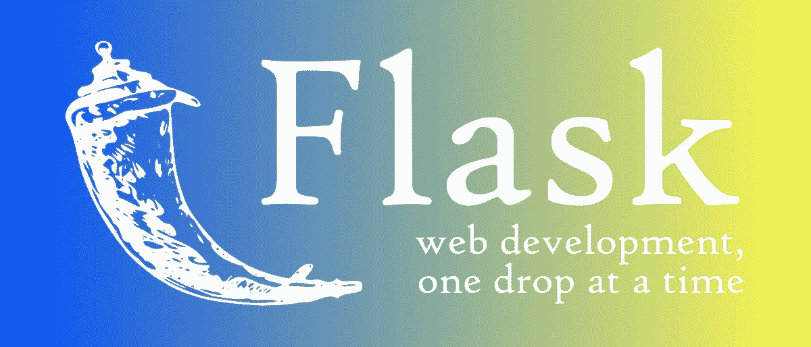
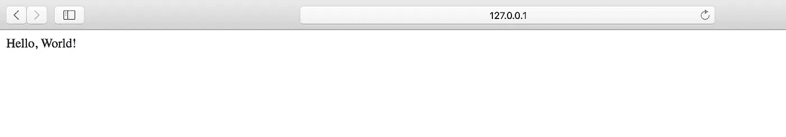
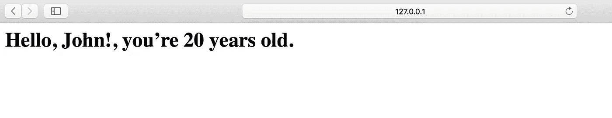
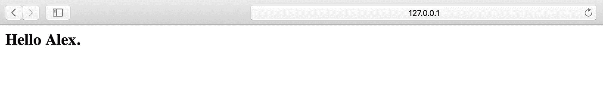
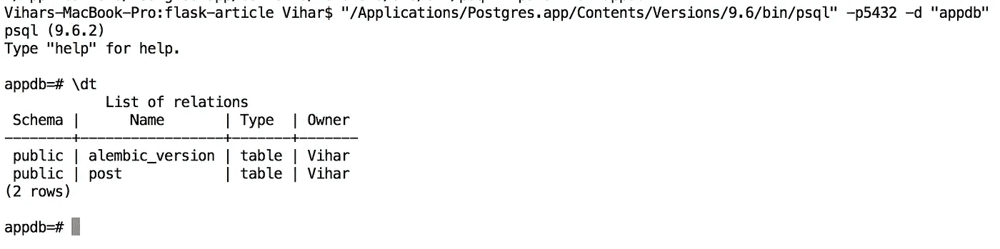
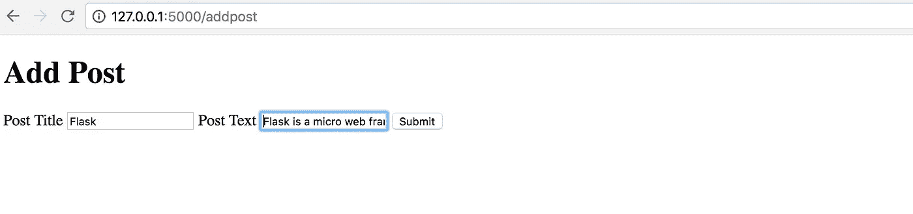
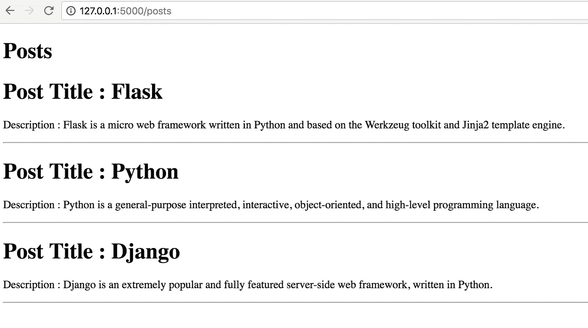

# 从头开始 Flask Web 编程

> 原文：<https://medium.com/hackernoon/flask-web-programming-from-scratch-9ada8088fde1>

SQLAlchemy 和 Postgres 的 Flask 1.0 完全指南。

选择 web 框架是构建动态网站最重要也是最令人沮丧的任务之一。有数千种不同编程语言的 web 框架。我们基于不同的用例使用这些 web 框架。例如，Whatsapp 使用擅长并发的 Erlang 编程语言，因此对于 Whatsapp 这样的应用程序，我们需要选择一个足够并发的框架来处理多个连接。因此，在开始 web 编程或建立网站之前，有一个能够处理所有类型功能的健壮框架是至关重要的。在本文中，我们将了解最常用和最著名的 web 框架之一“Flask”



> web 框架( **WF** )或 web 应用框架(WAF)是一种软件框架，旨在支持包括 web 服务、web 资源和 web APIs 在内的 web 应用的开发。

## **关于&为什么要烧瓶？**

这是一个微观层次的网络框架，由阿明·罗纳彻和几个开源贡献者用 [Python](https://hackernoon.com/tagged/python) 编写。Flask 基于 Werkzeug(实用程序和请求)，Jinja 2(模板)。

下面是官方 [*Flask 1.0 文档*](http://flask.pocoo.org/docs/1.0/) 的链接。

Flask 社区最近发布了它的稳定版本“Flask 1.0”，这是一个生产就绪的版本，包含了几个新的特性和更新。

***优点*** — Flask 提供了极度的简单性、灵活性和细粒度的控制。它实现了最基本的东西，并把多余的东西留给了附加组件或开发人员。路由 URL 很简单。所需的[数据库](https://hackernoon.com/tagged/database)连接可以显式同步。它更容易学习和实现，因此对于那些渴望开始 web 开发之旅的人来说是一个很好的起点。

***缺点*** —非异步。缺少数据库和 ORM(对象关系映射——这是一种编程技术，其中使用元数据描述符将对象代码连接到关系数据库)。

最后，Flask 是所有 web 程序员从头开始构建极简 web 应用程序的最佳选择。使用 Flask 的另一个优势是，你可以轻松地将机器学习算法(基于 Python)集成到函数中，这使得你的应用程序更加智能和具有认知能力。

## **你能用烧瓶做什么？**

从博客应用到克隆 facebook/twitter，Flask 中几乎一切皆有可能。有很多像 flask-sockets，flask-google-maps 等库。您可以在应用程序中嵌入一些特性。Flask 支持 MySQL、Postgresql、MongoDB 和其他一些数据库，我们需要根据用例选择最合适的数据库。

***这里有几个你可以用 Flask 搭建的网站模型:***

博客应用，聊天应用，数据可视化，仪表盘，REST 应用，管理页面，电子邮件服务。

# 开始使用 Flask 1.0

***先决条件*** :在开始使用 flask 之前，你应该对 Python 有所了解，如果你正在学习 Python，请参考[这篇关于 Python 的](https://towardsdatascience.com/python-programming-in-15-min-part-1-3ad2d773834c)文章或文档[这里](https://docs.python.org/3/)。在电脑上安装 Python > =3，配置 PIP (Python 包索引)。

## 安装烧瓶

要安装 flask，你需要做的只是在你的命令提示符下运行这个命令，如果你使用的是 windows，终端，如果你使用的是 MacOS 或 Linux。

```
$ pip install flask
```

以下软件包也将使用该命令安装:Werkzeug、Jinja、MarkupSafe、ItsDangerous、Click，它们是运行应用程序所必需的。我们现在不用担心这个，弗拉斯克会在后面处理的。

## 写出第一个传统节目“你好，世界！”

要启动我们的第一个 flask“Hello World”应用程序，需要遵循以下几个步骤。创建一个新的 app.py 文件，并按照相应的步骤操作。

1.  首先，我们需要从我们之前安装的 flask 模块中导入 Flask 类，这个 Flask 类将包含我们在编写应用程序时使用的所有方法和属性，所以这将是我们程序中的第一行。

```
from flask import Flask
```

2.其次，我们需要声明一个包含 flask 对象的变量。这个变量将用于运行和配置我们的应用程序。

```
app = Flask(__name__)
```

> “__name__”是 Python 中的一个特殊变量。如果源文件作为主程序执行，解释器将 __name__ 变量设置为值“__main__”。如果该文件是从另一个模块导入的，__name__ 将被设置为该模块的名称。

3.写主函数。

在我们的主函数中，我们需要运行 flask 变量，为此我们需要使用我们之前声明的 app 变量，并对它使用 run 方法。这个 run 方法在您的机器上启动一个本地服务器。通常，默认地址是“localhost:5000”要更改端口地址，我们可以向 run 方法传递一个参数，将它分配给任何所需的端口号。每当我们更改应用程序中的代码时，我们都需要重新启动我们的服务器，为了克服这一点，我们可以使用给定的调试参数来运行方法，并将其设置为“True”。现在，只要对源代码做了任何更改，服务器就会自动重启。调试器还用于跟踪错误(如果有的话)。下面是 main 函数的代码片段。

```
if __name__ =="__main__":
    app.run(debug=True, port=8080)
```

4.按指定路线发送

然后我们使用 app 变量上的 **route() decorator** 来告诉 Flask 哪个 URL 应该触发我们的函数。所需的 URL 模式应该以字符串的形式写入路由装饰器。应该由路由触发的功能将在它下面声明。下面是如何声明路由的代码片段。

```
@app.route('/')
def hello_world():
    return 'Hello, World!'
```

> “/”是主路径，只要您运行服务器，它就会首先触发。

5.运行烧瓶应用程序。

一旦上述所有步骤完成，现在我们的源代码看起来像这样。

运行 flask 应用程序类似于执行 python 程序。一旦服务器开始运行，您可以看到以下信息。

```
$ python app.py* Serving Flask app "app" (lazy loading)
* Environment: production
* Debug mode: on
* Running on http://127.0.0.1:8080/ (Press CTRL+C to quit)
* Restarting with stat
* Debugger is active!
* Debugger PIN: 770-937-705
```

现在，打开你的网页浏览器，点击网址: *http://127.0.0.1:8080/* 你可以看到“Hello World！”印在那里。



# **烧瓶模板(金贾 2)**

那么，如何在 Flask 应用程序中插入普通的 HTML 代码呢？

这里我们创建了一个包含用户名和年龄的字典，稍后在 HTML 代码中提取这些值。

解释模板的代码片段。

这给出了输出:你好，John！，你已经 20 岁了。

*http://127 . 0 . 0 . 1:8080/greet*



如果 HTML 代码必须定期更改，这是非常麻烦的。因此，它不是真正可行和可扩展的。如果把逻辑部分从表现中分离出来会更好。因此，Flask 会自动为我们配置 Jinja2 模板引擎。我们可以使用 render_template()函数插入 HTML 文件，而不是将 HTML 硬编码到 Flask 中。

放置 HTML 文件时必须遵循的层次结构。py 文件被放在名为“Apps”的模块中

```
Apps folder
/app.py
templates
   |-/index.html
```

因此，创建一个名为 templates 的文件夹，并将 HTML 文件添加到其中。

视图/函数必须返回 render_template()和应该呈现的 html 页面的名称。下面是代码片段，你如何从视图渲染模板。

在 HTML 页面中，我们呈现传递的模板，变量名也在 HTML 页面上返回。

*http://127 . 0 . 0 . 1:8080/hello/亚历克斯*



上面的代码片段清楚地解释了如何插入由条件语句组成的 HTML 文件，在本例中为‘if’。{{ }}表示变量的占位符。

是用于插入控制语句的容器。

# **烧瓶的形式和要求。**

表单是每个 web 应用程序的构建块，使用这些表单，我们接受几个类别的输入，如用户名表单和电子邮件表单。这些帮助我们接收来自用户/客户的信息，并将它们存储到数据库中。

现在让我们创建一个简单的生物数据表单，它在 Flask 中接受一些输入，如姓名、年龄、电子邮件和爱好，并将其呈现在 HTML 页面上。表单的 HTML 代码如下——“bio _ form . HTML”。

现在，我们使用请求库从表单输入字段中检索提交的数据。首先，我们需要知道请求-响应在互联网上是如何工作的。每当一个表单被提交时，它都在 POST 方法下，它被请求将所有的页面加载到互联网上。我们需要创建一个视图来请求表单中的信息。表单一提交，视图就与 POST 方法进行比较，并从输入标签中请求数据。表单的索引应该等于输入标记的 name 属性。

```
--HTML--
<input type="text" name="username" placeholder="Your Name"/>--Python--
if request.method == "POST":
    username = request.form['username']
```

现在对于上面的 HTML 表单，让我们声明一个视图 bio_data_form()来将输入存储到 Python 变量中。— *该视图呈现了上面的“bio _ form . html”*

```
@app.route('/form', methods=['POST', 'GET'])
def bio_data_form():    
    if request.method == "POST":
        username = request.form['username']        
        age = request.form['age']        
        email = request.form['email']        
        hobbies = request.form['hobbies']        
        return redirect(url_for('showbio',                              
                                username=username,
                                age=age,
                                email=email,   
                                hobbies=hobbies))    
    return render_template("bio_form.html")
```

一旦表单中的所有变量被请求，这些变量将被发送到' **showbio** '视图，以便在 HTML 页面中呈现信息。我们使用“url_for”重定向到视图。因此，只要请求方法是 POST，表单就被提交，数据以参数的形式被发送，这些参数从 url 获取并呈现在" **show_bio.html** "上

*论点是这样提交的:*[*http://127 . 0 . 0 . 1:8080/showbiousername = Stark&email = Stark 07% 40 Gmail . com&业余爱好=Play%2C+Code*](http://127.0.0.1:8080/showbio?username=Stark&email=stark07%40gmail.com&hobbies=Play%2C+Code)

```
@app.route('/showbio', methods=['GET'])
def showbio():    
    username = request.args.get('username')    
    age = request.args.get('age')    
    email = request.args.get('email')    
    hobbies = request.args.get('hobbies')    
    return render_template("show_bio.html",
                           username=username,                         
                           age=age,                          
                           email=email,                         
                           hobbies=hobbies)
```

一旦添加了这两个视图，您的源代码应该是这样的，

我们使用 Jinja 2 在 HTML 页面上呈现这些变量，确保这个函数返回获取的变量。如果函数不返回变量，它们就不会呈现在 HTML 页面上。

运行您的应用程序，并访问:[http://127 . 0 . 0 . 1:8080/form](http://127.0.0.1:8080/form)

# 使用 **Flask-SQLAlchemy** 整合 Flask 和 Postgres(数据库)

Flask 不能直接连接到数据库，所以我们需要一个媒介来连接它们。我们使用的媒介称为 ORM(对象关系映射器)。

这里我们将探讨 Flask-SQLAlchemy，它是一个扩展，为流行的 [SQLAlchemy](http://www.sqlalchemy.org/) 包提供了一个 Flask 友好的包装器，这是一个 ORM。这允许应用程序使用高级实体(如类、对象和方法)而不是表和 SQL 来管理数据库。ORM 的工作是将高级操作翻译成数据库命令。SQLAlchemy 支持一长串数据库引擎，包括流行的 MySQL、PostgreSQL 和 SQLite。

要使用 SQLAlchemy 和 PostgreSQL 配置您的应用程序，请执行以下步骤:

1.  **在你的机器上安装 Flask-SQLAlchemy 和 PostgresQL。**

使用 pip 安装 Flask-SQlAlchemy。在终端或命令提示符下运行以下命令来安装 Flask-SQLAlchemy。

```
$ pip install flask-sqlalchemy
```

要在 MAC 上安装 PostgreSQL，请使用自制软件

```
brew install postgres
```

或者下载 Postgres 申请—【https://postgresapp.com/ 

在 windows 中你需要下载并安装 Postgres，这里是下载 Postgres 的链接—[https://www.postgresql.org/download/windows/](https://www.postgresql.org/download/windows/)

**2。创建数据库**

安装并运行 Postgres 后，创建一个名为“appdb”的数据库，用作我们的本地开发数据库:

在您的终端或命令提示符下，使用以下命令创建 Postgres 数据库。

```
$ createdb appdb
```

这个命令在您的本地机器上创建一个 Postgres 数据库。如果出现任何错误，请尝试重新安装 Postgres。

**3。更新应用程序设置。**

通过设置 app.config 变量，用所有 SQlAlchemy 和 Postgres 配置您的源代码。

现在，我们需要使用 SQLAlchemy 作为媒介将我们的应用程序与这个数据库链接起来。在我们的源代码中，将 SQLALCHEMY_DATABASE_URI 字段添加到 app.config 中，并声明一个名为 db 的新变量，该变量是使用 SQLALCHEMY 对象创建的，在本例中是通过将其传递给名为 app 的应用程序来创建的。然后，该对象包含来自 sqlalchemy 和 sqlalchemy.orm 的所有函数和帮助程序。此外，它还提供了一个名为 Model 的类，该类是一个声明性基础，可用于声明模型。

下面是配置 SQlAlchemy 和 Postgres 的代码。

```
app.config['DEBUG'] = True
app.config['SQLALCHEMY_DATABASE_URI']='postgresql://localhost/appdb'
SQLALCHEMY_TRACK_MODIFICATIONS = True
db = SQLAlchemy(app)
```

更新 app.py 后，它应该是这样的，

这三个步骤，将让你连接你的应用程序与 Postgres 数据库。

现在，让我们创建我们的第一个 M **模型**。所有模型的基类都称为 db.Model，它存储在我们要创建的 SQLAlchemy 实例中。使用 Column 定义列。列的名称是您为其指定的名称。

下面是在 flask 中声明模型的代码片段。这类似于我们在 Python 中创建类的方式。在这里，我们声明了一个 Post 模型，它有三个属性 id(primary_key)、文章标题和文章描述(post_text)。

```
class Post(db.Model):
    id = db.Column(db.Integer(), primary_key=True)
    title = db.Column(db.String(80), unique=True)
    post_text = db.Column(db.String(255))

    def __init__(self, title, post_text):
        self.title = title
        self.post_text = post_text
```

将您的模型添加到源代码中。

## 烧瓶迁移

为了跟上现有的修改和应用程序不断变化的需求，必须对数据库进行下一次迁移。必须使用的第二个扩展是 Flask-Migrate。这个扩展是一个用于 SQLAlchemy 的数据库迁移框架 [Alembic](https://bitbucket.org/zzzeek/alembic) 的 Flask 包装器。

使用 PIP 安装 flask 迁移和 flask 脚本(具有激活管理器命令的管理器类)包。

```
$ pip install flask-migrate
$ pip install flask_script
```

要在我们的应用程序中设置迁移，我们需要在应用程序中定义 Migrate 类作为我们的基本实例。在源文件中添加以下行来配置迁移。

首先将 flask 迁移和管理器类导入到源代码中。

```
from flask_script import Manager
from flask_migrate import Migrate, MigrateCommand
```

接下来，使用迁移配置应用程序设置。

```
migrate = Migrate(app, db)
manager = Manager(app)
manager.add_command('db', MigrateCommand)
```

为了详细说明这一点，我们设置我们的配置来获取我们的场景——基于环境变量——创建一个 migrate 实例，使用 app 和 db 作为参数，并设置一个 manager 命令来初始化我们的应用程序的 Manager 实例。最后，我们向管理器添加了 db 命令，以便我们可以从命令行运行迁移。

现在，由于我们的管理器应用程序有整个应用程序和数据库实例，我们需要运行替换的应用程序变量，它是主函数中的管理器变量。

```
if __name__ == '__main__':
    manager.run()
```

现在，配置的源代码(app.py)将如下所示:

为了运行迁移来初始化 Alembic，请使用以下命令。

```
$ python app.py db init
Creating directory /Users/Vihar/Desktop/flask-databases/migrations ... done
...
...
...
Generating /Users/Vihar/Desktop/flask-databases/migrations/alembic.ini ... done
```

运行该命令后，管理器会提供上述信息，说明迁移已成功创建。运行数据库初始化后，您将在项目中看到一个名为“migrations”的新文件夹。

让我们通过运行 migrate 命令进行第一次迁移。使用以下命令在数据库中更新和创建表。

```
$ python app.py db migrate
INFO  [alembic.runtime.migration] Context impl PostgresqlImpl.
INFO  [alembic.runtime.migration] Will assume transactional DDL.
INFO  [alembic.autogenerate.compare] Detected added table 'post'Generating /Users/Vihar/Desktop/flask-databases/migrations/versions/ed3b3a028447_.py ... done
```

使用此命令，如果没有表，现在将创建表，如果有表，则修改表。

现在我们将使用`db upgrade`命令对数据库进行升级:

```
$ python app.py db upgrade
```



在这里，您可以看到从 Postgres shell 向 appdb 中添加了两行。

## Flask-Postgres 最小博客。

我们可以使用 Flask-WTF Extension 将表单中的信息添加到数据库中，它是 WTForms 包的包装器。当使用 WTForms 时，我们必须首先将表单定义为类。因此，要使用 PIP 安装 Flask-WTF，命令是

```
$ pip install flask-wtf
```

你的表单类应该包含所有的字段，对于上面的 Post 模型，这是我们声明表单类的方式

```
class Post(db.Model):
    id = db.Column(db.Integer(), primary_key=True)
    title = db.Column(db.String(80), unique=True)
    post_text = db.Column(db.String(255)) def __init__(self, title, post_text):
        self.title = title
        self.post_text = post_text# Declaring Flask WTF-Formclass PostForm(FlaskForm):
    title = StringField('Title', validators=[DataRequired()])
    post_text = StringField('Post_Text',                            
                             validators=[DataRequired()]
                           )
```

现在我们需要声明一个视图，它将所有的表单值发送到 HTML 模板。

在下面的代码片段中，我们在“/add post”route 下声明了一个新视图“add_post”。

在这个视图中，我们呈现了“post_form.html ”,它有表单输入字段。现在在视图中，首先我们需要创建一个 PostForm 的新实例，这样每当页面刷新或重新加载时，都会创建一个新实例。

这里我们使用 Flask 请求从表单中获取信息。每当从 web 页面提交内容时，它都属于 POST 请求方法。在这个视图中，最初是 GET 呈现 post_form.html，后来当我们提交 PostForm 时，它将调用 post 方法，从而从表单中收集数据。

一旦我们将数据发布到页面，就应该为信息创建一个会话，以便将数据添加到数据库中。我们使用 db.session.add()将数据添加到会话中，使用 db.session.commit()将数据推送到数据库中。因此，add_post 视图被定义为

```
@app.route('/addpost', methods=['GET', 'POST'])
def add_post():
    postform = PostForm()
        if request.method == 'POST':
            pf = Post(
                postform.title.data,
                postform.post_text.data,
            )
            db.session.add(pf)
            db.session.commit()
        return redirect(url_for('view_posts'))
    return render_template('post_form.html', postform = postform)
```

要将 flask-wtf 表单呈现到 HTML 上，我们需要使用 postform 变量调用，从而将这些作为参数传递给模型 post，该模型 Post 将返回到“post_form.html”

表单提交到数据库后，我们将页面重定向到 view_posts，在这里我们查询所有的帖子并呈现在模板上。下面是“view_posts”的代码片段

```
@app.route('/posts', methods=['GET', 'POST'])
def view_posts():
    posts = Post.query.all()
    return render_template('view_posts.html', posts=posts)
```

所有的文章都在 view_posts 中查询并返回 view_post.html，并使用 jinja 循环在 html 页面中迭代。下面是 view_post.html 的代码片段，它解释了 Jinja 2 中的循环变量。

由于所有的帖子都是从 view_posts 返回并呈现在 view_posts 上的，所以我们遍历一个循环并呈现在 HTML 上。

完整的源代码如下所示:

http://localhost:5000/addpost



http://localhost:5000/post



这解释了博客应用程序的最小工作，所有的前端部分可以直接添加到 HTML 文件中。

祝贺您学习 Flask 1.0，有了它，您将能够创建无缝和智能的 web 应用程序。

这篇文章的源代码可以在这里找到。

感谢阅读。如果你觉得这个故事有帮助，请点击下面的👏去传播爱。

本文由[维哈尔·鞍马](https://medium.com/u/4ce24554e1d2?source=post_page-----9ada8088fde1--------------------------------)和[萨姆希塔·阿拉](https://medium.com/u/7e65fabdea53?source=post_page-----9ada8088fde1--------------------------------)撰写。

请继续关注关于 Flask 的更多文章。

重要链接:

[](https://towardsdatascience.com/python-programming-in-15-min-part-1-3ad2d773834c) [## 15 分钟 Python 编程第 1 部分

### 关于 Python

towardsdatascience.com](https://towardsdatascience.com/python-programming-in-15-min-part-1-3ad2d773834c)