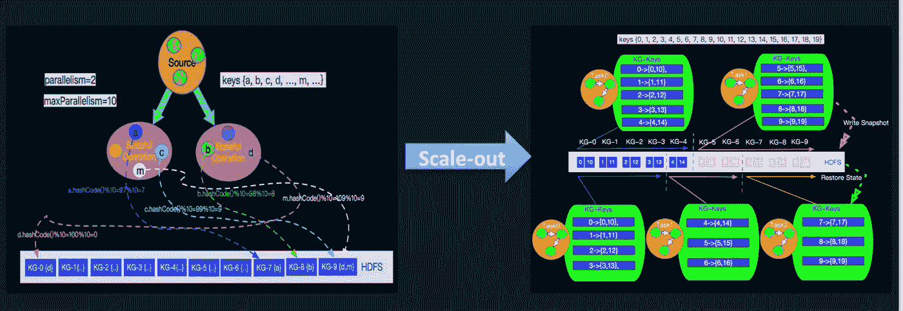

# Flink 还是 unk？为什么 Ele.me 喜欢上了 Apache Flink

> 原文：<https://medium.com/hackernoon/flink-or-flunk-why-ele-me-is-developing-a-taste-for-apache-flink-7d2a74e4d6c0>

## Flink 的独特之处是什么，它与 Storm 和 Spark 的区别是什么？

*本文是* [***阿里巴巴旗下 Flink 系列***](/@alitech_2017/a-flink-series-from-the-alibaba-tech-team-b8b5539fdc70) *的一部分。*

Engineers at Alibaba’s food delivery app Ele.me(饿了吗) are finding themselves increasingly reliant on Apache Flink, an open source stream processing framework released in 2018.

Flink 的独特之处是什么，它与 Storm 和 Spark 的区别是什么？本文调查了 Ele.me 的大数据平台如何在实时计算方面运行，并评估了 Flink 的各种优势和劣势。

# Ele.me 今日平台

下图说明了 Ele.me 平台的当前架构。

Current platform architecture

在 Ele.me 目前的平台上，来自多个来源的数据首先被写入 Apache Kafka。用于此的主要计算框架是 Storm、Spark 和 Flink。来自这些框架的数据结果随后被存放到各种类型的存储器中。

目前在 Storm 中有超过 100 个任务，在 Spark 中大约有 50 个，在 Flink 中数量更少。

当前的集群规模为每天 60TB 的数据、10 亿次计算和 400 个节点。这里需要注意的一点是，Spark 和 Flink 都是靠纱线运行的。虽然 Flink on YARN 主要用作任务之间的作业管理器隔离，但 Storm on YARN 处于独立模式。

**本文将主要关注五个方面——一致语义、Apache Storm、Apache Spark 的 Spark 流和结构化流，以及 Apache Flink。**

# 一致语义

这里值得强调的是，维护以下语义的一致性至关重要。

**最多一次(或一劳永逸)**:通常，在编写 Java 应用程序时，会使用简单的“最多一次”语义，而不考虑源代码的偏移量管理和下游幂等性。当数据传入时，无论是中间状态还是写入数据状态，都没有 ACK 机制。

**至少一次**:重传数据的重传机制，保证每一段至少处理一次。

**恰好一次**:这是通过粗检查点粒度控制实现的。大多数精确一次语义指的是计算框架中的那些，或者换句话说，每一步的操作符内部的状态是否可以重放，如果最后一个作业失败了，是否可以从之前的状态顺利恢复。这不涉及输出到 sink 的幂等性。

**幂等性+至少一次=恰好一次**:如果能保证下游有基于 MySQL 的“关于重复密钥更新”等幂等操作，或者使用 ES/Cassandra 等。，您可以使用主键来实现“颠覆”语义。如果在确保至少一次的情况下将幂等性加入到混合中，那么结果正好是一次。

# 阿帕奇风暴

虽然 Spark 流媒体和结构化流媒体直到 2017 年才完全投入实践，但 Ele.me 从 2016 年之前就开始使用 Apache Storm 了。Storm 拥有以下特点。

数据是基于元组的

延迟是毫秒级的

一开始支持 Java，但是现在使用了 Apache Beam，Python 和 Go 也支持了

SQL 函数不完整。Typhon 已经内部封装，用户只需要扩展我们的一些接口就可以使用众多的主要功能。通量也是风暴的好工具。有了它，要描述一个风暴任务，你只需要写一个 YAML 文件。这在一定程度上满足了需求，但是用户仍然需要在工程师级别编写 Java，这意味着数据分析师经常不能使用它。

## 摘要

综上所述，Storm 主要有以下三大优势。

**易用性**:因为门槛高，所以推广受限。

**State Backend** :它需要更多的外部存储，包括 Redis 这样的键值存储数据库。

**资源分配**:预设工人和槽位。吞吐量非常低，因为只执行了少量的优化。

# 阿帕奇火花:火花流

有一次，Ele.me 团队被问到是否可以编写一个 SQL，在几分钟内发布一个实时计算任务。为此，该团队开始使用 Apache Spark 流，其主要概念如下。

微批处理:您必须预设一个窗口，并在该窗口中处理数据。

延迟在第二级，通常在 500 毫秒左右。

开发语言包括 Java 和 Scala。

流式 SQL:ele . me 技术团队希望在不久的将来为流式 SQL 提供一个平台。

## 关键特征

Spark 生态系统和 SparkSQL
这代表了 Spark 的一大优势。技术栈是统一的，SQL、图形计算和机器学习包都是可互操作的。与 Flink 不同，使用 Spark 时，先进行批处理，这意味着它的实时和离线 API 是统一的。

HDFS 检查站

运行在 YARN 上
Spark 属于 Hadoop 生态系统，与 YARN 高度集成。

高通量
由于它是一种微量配料的方式，因此通量相对较高。

下图是 Ele.me 平台上的操作页面，显示了用户发布实时任务时所需的步骤。

在页面上，有许多用户必须选择的必要参数。首先，用户必须为每个分区选择 Kafka 集群和最大消耗率。默认情况下，背压启用。对于购物位置，用户每次都必须指定。用户可以在下一次重写实时任务时，根据他们的要求选择一个偏移购物点。

在中间，用户可以描述管道。SQL 是多个卡夫卡主题。当您选择一个输出表时，SQL 将购物的 Kafka DStream 注册为一个表，然后写入一个管道字符串。最后，为用户封装了一些外部接收器。支持提到的所有存储类型。如果存储可以实现 upsert 语义，则它是受支持的。

## 多流连接

一些用户可能仍然想知道如何执行多流连接。对于 Spark 1.5，请参考 Spark 流 SQL。在这个开源项目中，DStream 被注册为一个表，连接操作是在表上完成的。但该操作仅在 1.5 之前的版本中受支持。在 Spark 2.0 中引入结构化流之后，该项目被放弃了。方法很棘手:

Unique method

当允许 Spark Streaming 购买多个主题时，购物数据流中的每批 rdd 都被转换为数据帧，以便数据帧可以注册为表。然后将表一分为二，这样就可以进行连接。这个加入完全依赖于这个购物的数据，加入的条件是不可控的。这就是为什么这种方法很棘手。

以下面这个案例为例。购买了两个主题。在 filer 条件下，表被一分为二。然后可以对这两个表进行连接。然而，它本质上是一个流。

## 恰好一次语义

对于恰好一次，需要注意的是，在偏移量提交之前，必须要求数据接收到外部存储。无论数据是传到 ZK 还是 MySQL，确保它在事务中是很重要的。在源驱动程序生成卡夫卡 RDD 和执行器消费数据之前，还需要将其输出到外部存储。如果满足这些条件，就可以实现端到端的一次性语义。这是一个大前提。

## 摘要

**有状态处理 SQL ( < 2.x mapWithState，updateStateByKey)** :如果想用 1。x 版本，通过这两个接口来做。您仍然需要将此状态保存到 HDFS 或外部存储器。因此，实现有点复杂。

**真正的多流连接**:真正的多流连接语义是无法实现的。

**端到端恰好一次语义**:这些很难实现。您必须将它们接收到外部存储，然后在事务中手动提交偏移量。

# Apache Spark:结构化流

在 Spark 2 之后的版本中。x，使用增量有状态计算。下图来自官网。

这里所有的流计算指的是谷歌的数据流，它有一个重要的概念——事件发生的时间和数据被处理的时间之间的间隔。StreamCompute 领域有一个水印，可以指定延时的范围。可以丢弃延迟窗口之外的数据。

下图说明了结构化流的体系结构。

在该图中，实现了恰好一次语义的步骤 1、2 和 3。本质上，实现使用批处理方法。使用这种方法，偏移量保持不变，HDFS 用于状态存储。外部接收器不会运行类似的幂等运算，也不会在写入后提交偏移量。该实现实现了内部引擎的恰好一次性，同时保证了容错性。

## 关键特征

**有状态处理 SQL 和 DSL** :这个可以满足有状态流计算。

**真正的多流连接**:多流连接可以通过 Spark 2.3 实现。实现方法与 Flink 类似。你要定义两个流的条件(这主要涉及到定义时间为条件)。例如，两个主题流入，您通过特定模式中的字段(通常是事件时间)限制需要缓冲的数据。通过这样做，你就把这两股流合在一起了。

**更容易实现端到端恰好一次语义**。为了支持幂等运算，您只需要扩展 sink 接口，这将产生恰好一次语义。

结构化流与本地流 API 的最大区别在于，当结构化流创建表的数据帧时，必须指定表的模式。这意味着您必须提前指定模式。

另外，它的水印不支持 SQL。在 Ele.me，技术团队添加了一个扩展来实现完整的 SQL 写入和从左到右的转换(如下图所示)。希望这不仅适用于程序员，也适用于不知道如何编程的数据分析师。

## 摘要

**触发器**:在 2.3 版本之前，结构化流主要基于处理时间。这样，每一批数据处理的完成都会触发下一批的计算。版本 2.3 引入了连续处理的触发功能，逐个记录。

**连续处理**:目前只支持类似 map 的操作，对 SQL 的支持也有限。

**低端到端延迟，保证一次到位**:端到端一次到位语义的保证需要额外的扩展。Ele.me tech 团队发现 Kafka 版本提供了事务性功能，在此基础上我们可以考虑实现从源到引擎和 sink 的端到端恰好一次语义。

**CEP (Drools)** :对于需要 CEP 等函数处理复杂事件的用户，Drools 规则引擎可以在每个执行器上运行。

考虑到 Apache Spark 在结构化流方面的上述缺点，Ele.me 的工程师们决定开始使用 Flink。

# 阿帕奇弗林克

开源流处理框架 Flink 是流媒体领域的领导者。它拥有出色的图形计算和机器学习功能，其底层支持 YARN、Tez 等。

## 弗林克框架

Flink 中的 JobManager 类似于 Spark 中的 driver，TaskManager 类似于 executor，两者中的任务是相同的。不过 Flink 用的 RPC 是 Akka，Flink 内核定制内存的序列化框架。此外，Flink 中的任务不需要像 Spark 的每个阶段的任务那样等待对方，而是在处理后将数据发送到下游。

## 弗林克二进制数据处理算子

对于 Spark 中的序列化，用户通常使用默认的 Kryo 或 Java 序列化。钨项目还为 Spark 程序优化了 JVM 层和代码生成。与此同时，Flink 实现了一个基于内存的序列化框架，该框架维护了键和指针的概念。它的关键是连续存储，并在 CPU 级别进行了优化。高速缓存未命中的概率极低。在对数据进行比较和排序时，您不是在比较真实的数据，而是首先比较键。只有当结果相等时，数据才会从内存中反序列化。此时，可以对比一下具体的数据。这代表了可靠的性能优化。

## 弗林克的任务链

有了 OperatorChain，如果上下游的数据分布不需要重新洗牌，那么后面的地图只是一个简单的数据过滤器。如果我们把它放在一个线程中，线程上下文切换的开销就可以降低。

## 平行的概念

为了说明这个概念，假设五个任务需要多个并发线程来运行。如果任务被链接，它们可以在一个线程中运行，这提高了数据传输性能。使用 Spark，操作者不能设置他们的并发度，而使用 Flink，他们可以，这使得 Flink 更加灵活，资源利用更加有效。

Spark 一般通过 Spark.default.parallelism 来调整并行度，在 shuffle 操作过程中，一般通过 Spark.sql.shuffle.partitions 参数来调整并行度。在实时计算中，该参数应设置为较小的值。例如，在生产中，Kafka 和 partition 参数被设置为几乎相同，而 batch 被调整为稍大的值。在左图中，Ele.me 工程师将并发性设置为 2(最多 10)。然后，他们运行两个并发批处理，并根据密钥组成一个组(最多 10 个)。这样，数据可以尽可能分散。

## 州和检查站

Flink 逐段处理数据，每一段处理完后，立即发送到下游。相比之下，Spark 中的数据必须等到操作员所在阶段的所有任务都完成之后。

Flink 有一个粗粒度的检查点机制，以较低的成本给每个元素一个快照。只有当属于该快照的所有数据都进入时，计算才会被触发。在计算之后，缓冲数据被发送到下游。目前，Flink SQL 不提供控制缓冲超时的接口，换句话说，就是数据缓冲需要多长时间。当构造 Flink 上下文时，可以将缓冲区超时指定为 0，这样数据在处理后将立即发送。您不需要等到达到某个阈值后再发送它。

默认情况下，后端保存在 JobManager 内存中。每个操作员的状态被写入 RocksDB，异步周期被增量同步到外部存储。

## 误差容限

图表左侧的红色节点有一个故障转移。如果至少有一次，那么在最上游重新传输数据可以纠正错误。然而，如果它是精确的一次，每个计算节点必须从最后一个错误的时间回放。

## 恰好一次两阶段提交

在 Flink 1.4 之后，引入了两阶段提交协议来支持恰好一次提交。从上游 Kafka 消费数据后，每一步都会发起投票来记录状态，标记通过检查点关卡处理。状态只写到结尾的 Kafka(这只适用于 Kafka 0.11 或更高版本)。只有在最终完成后，每一步的状态才会被通知给 JobManager 中的协调器并被固化，从而实现恰好一次。

## 保存点

Flink 的另一个优点是可以利用 Flink 的检查点实现保存点功能。保存点不仅是数据恢复的一种方式，也是恢复计算状态的一种方式。

## 最终分析:Flink 的优点与缺点

Flink 的优势可以总结为以下几个主要特点:

**Trigger** :与 Spark 相反，Flink 支持更丰富的流语义，包括处理时间、事件时间和摄取时间。

**连续处理& windows** : Flink 支持连续处理，在 windows 上的表现比 Spark 好。

**低端到端延迟，保证一次到位**:通过两阶段提交协议，用户可以根据业务需求选择牺牲吞吐量来调整和确保端到端一次到位语义。

**文化教育**

**保存点**:用户可以根据自己的业务需求进行版本控制。

然而，在以下方面也有一些不足之处:

1.**SQL**:SQL 特性不完整。大部分用户都是从 Hive 迁移过来的，那里 Spark 的覆盖率超过 99%。目前，不支持 SQL 函数，也不支持为单个操作符设置并行度。

2.**机器学习，图形计算** : Flink 在这里的表现弱于 Spark，但是社区正在努力在这些方面进行改进。

*本文是* [***阿里巴巴旗下 Flink 系列***](/@alitech_2017/a-flink-series-from-the-alibaba-tech-team-b8b5539fdc70) *的一部分。*

# 阿里巴巴科技

关于阿里巴巴最新技术的第一手深度资料→脸书: [**【阿里巴巴科技】**](http://www.facebook.com/AlibabaTechnology) 。推特:[**【AlibabaTech】**](https://twitter.com/AliTech2017)。