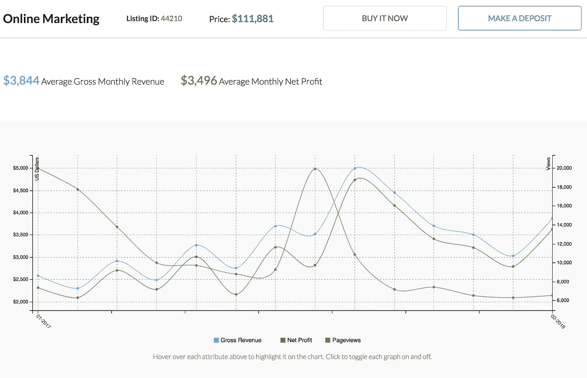
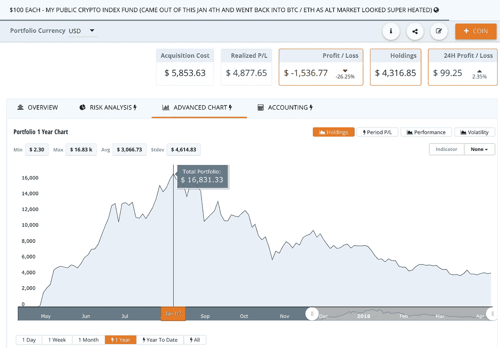

# 想黑财富？翻转网站而不是密码

> 原文：<https://medium.com/hackernoon/flip-websites-not-cryptos-e9d5266d13f7>

Predictable asset value and revenue from a website

去年我失去了注意力。

自从 2009 年我辞去工作并计划成为职业玩家以来，没有什么比在线扑克更吸引我的了。

Crypto Bug 找到了我。

在这之前，我很开心地通过建立和销售在线业务赚钱(盈利网站，而不仅仅是域名)。

早在 2016 年夏天，我就卖掉了我在 [Empire Flippers](https://empireflippers.com/) 上的第一个网站，并用所得购买了我的第一枚比特币。当时我对区块链科技一无所知，但我的企业家朋友们对它很感兴趣，这对我来说已经足够了。

在接下来的 9 个月里，我继续做我的网站，在 [FE International](https://feinternational.com) 上上市并出售我的第二个在线业务[漏斗引擎](https://funnelengine.com/)。

然后在 2017 年 3 月，我刷新了我的比特币基地余额，发现我涨了 600%。

这让我震惊。

从那以后，我花了 12 个月的时间深入了解比特币、区块链和这个全新的比特币市场。

2017 年 11 月底，就在市场疯狂之前，我买了 60 种不同的替代硬币。实际上，我在 1 月初接近市场顶部时卖掉了它们，这是市场开始下跌(赢利)的 3 天前。但即使我把一些利润变成了现金，我在 BTC 通过 70%的修正(失败)持有了大部分。

Unpredictable asset value and no revenue from cryptos

# 如何将网站转化为资产

密码是投机性的，但在线业务是可预测的。

在这疯狂的加密年里，我实际上赚的钱比我只专注于翻转网站盈利(我的[翻转网站](https://flippingwebsites.co/)播客的主题)要少。

*在线业务的倍数一直在上升*。

如果你能建立一个每月只赚 1500 美元的内容网站，你现在可以赚 50000 美元(33 倍的月利润)。

一旦你理解了搜索流量是如何工作的(我关注的网站的主要流量渠道)，并且利用了搜索引擎优化工具，比如 Ahrefs，你就不难将你建立的流量货币化了。

我关注的是所谓的联盟营销，即通过使用联盟跟踪软件推广其他人的产品或报价来赚取佣金。这可以是推广软件产品，或者只是把人送到亚马逊，通过他们的[合作项目](https://www.authorityhacker.com/amazon-associates/)赚取 3-6%的佣金。在尝试了[每一种不同的盈利方式](https://blog.markgrowth.com/best-online-business-models-d807ad335325)后，我最终以推广软件作为自己的谋生手段。

我在[网站投资](https://richardpatey.com/website-investing/)上写了一篇文章，讲述了如何在三年内，通过仅仅 3 次网站切换，将 10 万美元的投资滚雪球到 100 万美元，并在最短的时间内持有这些在线资产。

作为一个霍德勒，我的交易时代已经过去了。我知道，在接下来的 12 个月里，我会通过专注于建设和翻转网站，而不是为下一个 alt 赛季祈祷，来赚更多的钱和建立真正的财富。

正如史蒂夫·乔布斯所说，专注就是说不:

*喜欢这篇文章？下面请鼓掌:)*