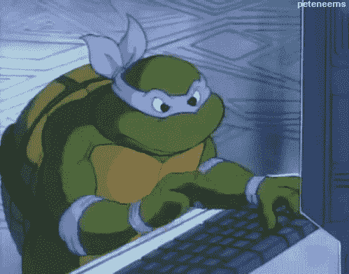
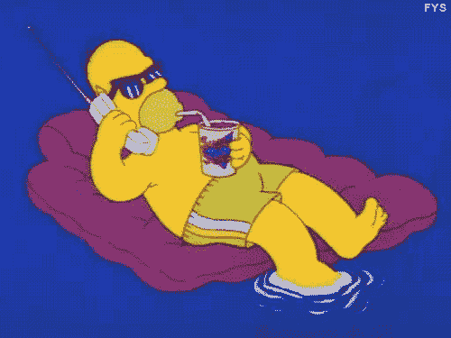

# 打开传统平面设计定价结构的开关

> 原文：<https://medium.com/hackernoon/flipping-the-switch-on-the-traditional-graphic-design-pricing-structure-98d7baceb438>

[Draftss.com](http://draftss.com)是一项产品化服务，以包月模式提供**无限的平面设计服务。服务包括**设计标识，插图，用户界面，你需要的一切。**不同套餐的价格区间从 259 美元到 1299 美元不等。
你可以在这里[详细了解我们](http://draftss.com/blog/index.php/2018/07/24/graphic-design-on-steroids/)。**

美国平面设计师的平均年薪为 39791 美元。薪水通常从 17，636 美元到 65，587 美元不等。这些数字取决于几个因素，如教育水平、经验、行业、公司规模和地点。你可以在这里[和](https://www.sokanu.com/careers/graphic-designer/salary/)阅读完整的报告。

**我们如何实现它。**

“It’s magical!”

服务分为 3 个包；[启动](https://hackernoon.com/tagged/startup)计划、Pro 计划和专用计划。专业和专门的计划涵盖了所有可以设计的东西。在定价为 1299 美元的专用包中，一次可以创建 6 个设计任务，其中 6 个设计师负责每个任务。

根据计算，每个设计师的成本为每月 216.5 美元。
$216.5(每个设计师)x 12(月)= $2，598(每个设计师每年)
$2598 x 15(设计师)= $38，970(15 个设计师每年的费用)

你的成本怎么会这么低？

“Work. Work. Work. Work.”

这项服务在印度孟买运营，那里专业平面设计师的成本很低。此外，优化我们的资源以进一步降低成本的完整流程。最常见的出错情况是客户和设计师之间的沟通，导致不利的[设计](https://hackernoon.com/tagged/design)输出。指派一个专门的有经验的艺术经理来更好地理解客户的需求，以最少的迭代带来期望的结果，进一步降低每[设计](https://hackernoon.com/tagged/design)的成本。

这是否意味着设计质量低劣？
不，艺术就是艺术，设计的质量不能因为设计师的来源地而被贴上低劣的标签。用回归测试雇佣有经验的设计师为设计输出提供了一定的基准。该数据通过完成 50 多个月的满意客户订阅进行验证，到目前为止没有退款。是的，如果顾客对设计不满意，可以在 7 天内全额退款。

**15 名设计师+ 1 名专职美术经理！**

“Sit back and relax!”

我们不指望你和 15 个设计师交谈来完成你的工作。我们为您提供一个专门的艺术经理，作为消除任何语言障碍的一个联系点。我们相信在挑选角色时，我们每个人都致力于自己最擅长的领域。

我们还有更小的计划，针对早期阶段的[初创企业](https://hackernoon.com/tagged/startups)，点击这里查看我们的详细定价[。](http://draftss.com#pricing)

**TL；博士:利用来自发展中国家的廉价劳动力优化设计成本**

我们希望收到您的来信。如果你有任何反馈，请随时联系 amin@draftss.com