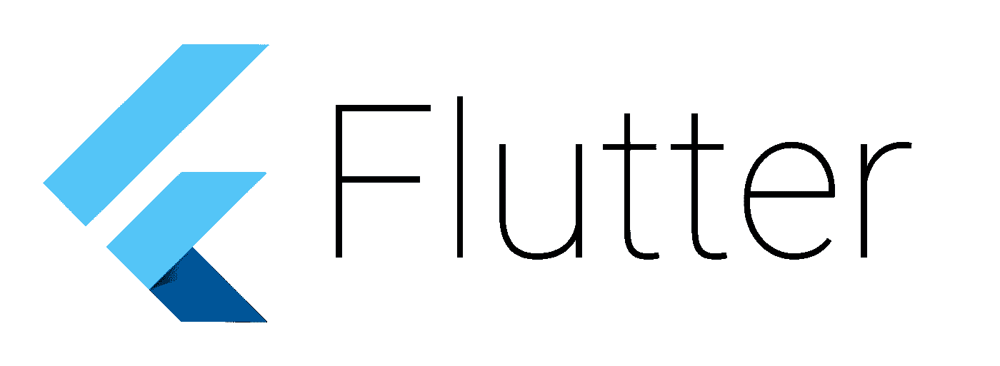
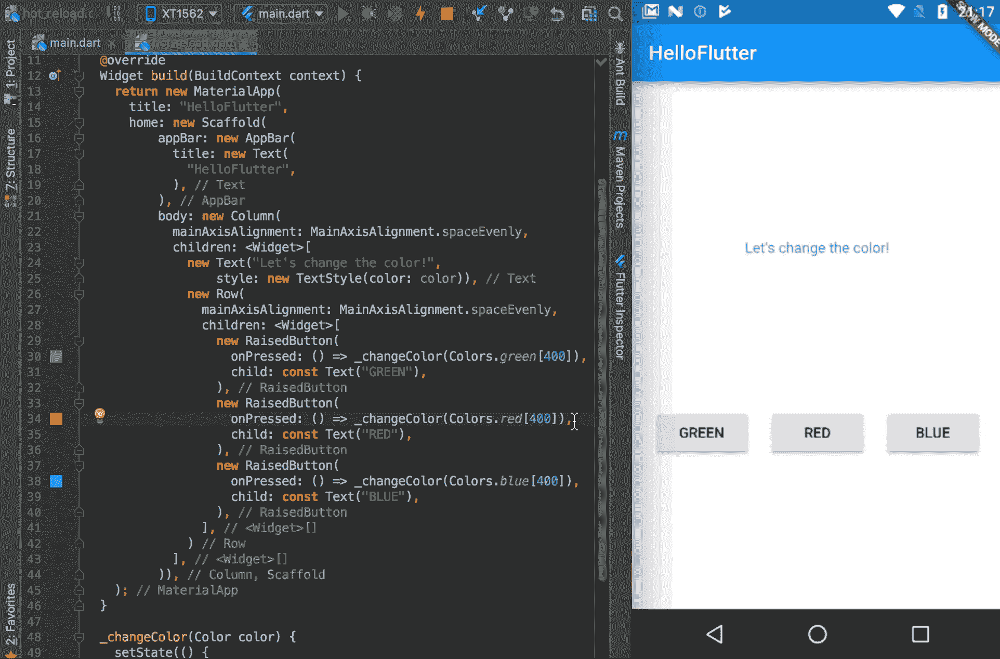
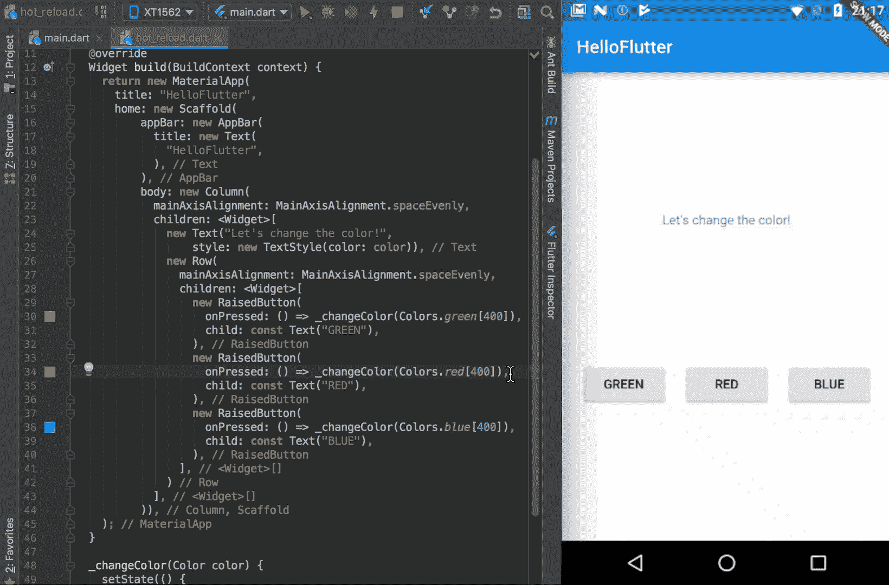
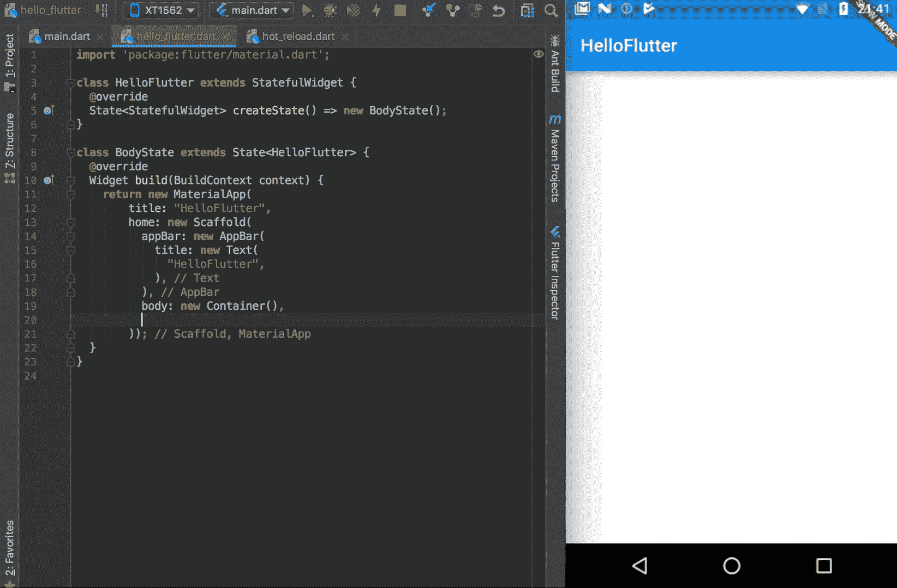
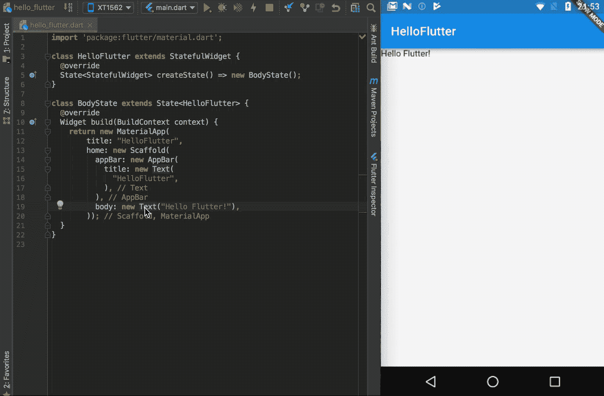
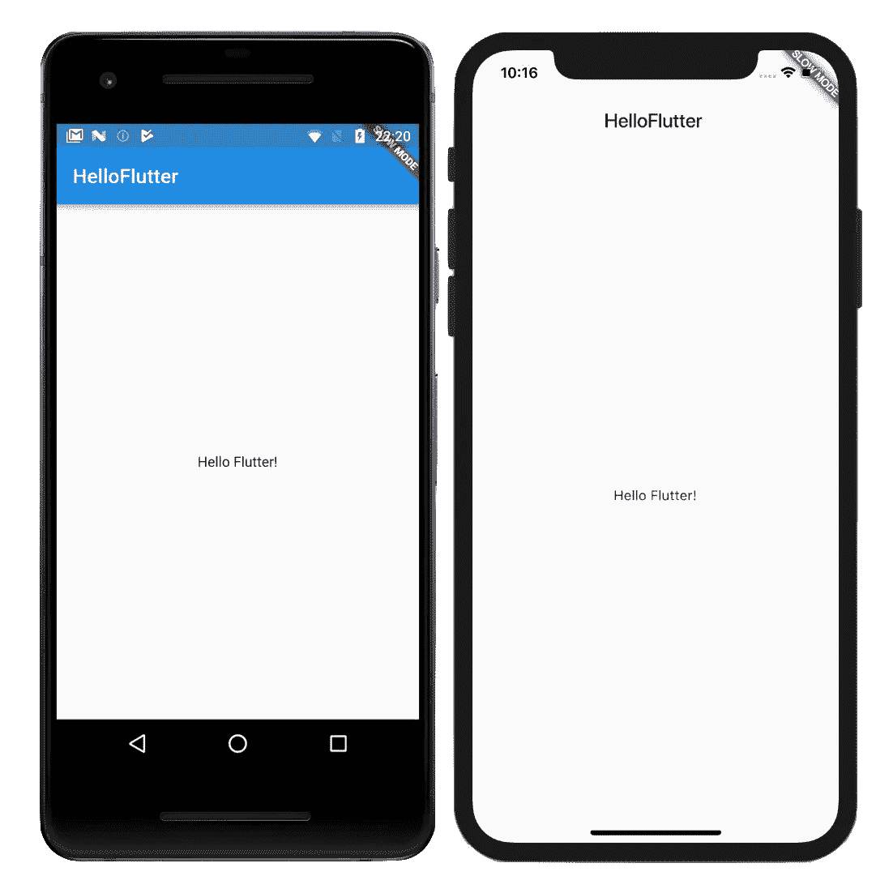

# 颤动——你可能喜欢它的 5 个理由

> 原文：<https://medium.com/hackernoon/flutter-5-reasons-why-you-may-love-it-55021fdbf1aa>

在 2017 年谷歌 I/O 大会上，谷歌推出了 us Flutter——一个用于创建移动应用的新开源库。

如你所知，Flutter 是一个用于创建具有漂亮 UI 的****移动应用**的解决方案。Flutter 设计视图的方式类似于 web 应用程序，因此您可以找到许多与 HTML/CSS 的相似之处。**

**根据他们的承诺:**

> **Flutter 可以轻松快速地构建漂亮的移动应用。**

**听起来很棒，但是乍一看，**我并不太相信**另一个跨平台解决方案。我们有很多这样的产品——Xamarin、PhoneGap、Ionic、React Native 等等。我们都知道有许多选择，并且它们都有一些优点和缺点。我不确定 Flutter 是否会与他们有所不同。但是我很惊讶。**

**从 Android 开发者的角度来看，Flutter 有许多非常有趣的特性。在这篇文章中，我想向你展示一些真正与我有关的事情。所以我们开始吧！**

****

## **为什么颤动？**

**你可能会好奇，问自己一个问题:**

> **“Flutter 有什么创新之处？它是如何工作的？Flutter 与 React Native 有何不同？”**

**我不会在这里讨论技术话题，因为其他人做得更好。如果你对 Flutter 的工作细节感兴趣，我鼓励你阅读这篇文章:[Flutter 的革命性在哪里？](https://hackernoon.com/whats-revolutionary-about-flutter-946915b09514)您还可以查看[“颤振的魔力”演示](https://docs.google.com/presentation/d/1B3p0kP6NV_XMOimRV09Ms75ymIjU5gr6GGIX74Om_DE/edit)中颤振概念的总结。**

**在快捷方式中，Flutter 是一个**移动 SDK** ，它允许我们创建**跨平台移动应用**(所以你可以编写一个代码，在 Android 和 iOS 上运行应用)。你用 Google 开发的语言 [**Dart**](https://www.dartlang.org/) 写代码，如果你以前用过 Java 的话看起来很熟悉。您不用 XML 文件，而是像这样构建**布局树**:**

**如您所见，布局是由嵌套的组件(*小部件*)构建的。核心小部件是 *MaterialApp* (那是整个应用)，然后我们有 *Scaffold* (那是主要的布局结构)，然后在里面我们有 *AppBar* (像 Android `Toolbar`)和一些*容器*作为主体。在 body 中，我们将放置布局小部件——文本、按钮等。**

**这只是截止日期。如果你想了解更多关于布局的内容，请查看 [Flutter 关于建筑布局的教程](https://flutter.io/tutorials/layout/)。**

# **#1 热重装**

**好了，现在我们开始吧！**

**我们将从基本的应用程序开始。我们有三个按钮，每个按钮都会改变文本颜色:**

****

**现在，我们将使用最酷的特性之一— **热重装**。它允许您立即重建您的项目，就像它只是一个网页。看一看热重装的动作:**

****

**我们在这里做什么？我们更改代码中的某些内容(例如按钮上的文本)，然后我们单击“热重新加载”(在 IntelliJ IDE 的顶部)，我们将在几秒钟内看到结果**。很酷，不是吗？****

****热重新加载不仅**快速**而且**智能**——如果你已经显示了一些数据(如本例中文本的颜色)，你可以**在应用运行时改变 UI** ，如果你热重新加载应用:它们将保持**不变**！****

# ****#2 全套(材料设计)部件****

****关于 Flutter 的另一个伟大的事情是，我们有一个非常丰富的内置 UI 组件目录。有两套 widget——[材质设计](https://flutter.io/widgets/material/)(安卓用)和[库比蒂诺](https://flutter.io/widgets/cupertino/)(iOS 用)。您可以选择并轻松实现您想要的任何内容。您想要创建新的浮动操作按钮吗？给你:****

********

****最棒的是，你可以在每个平台上实现每个小部件。如果你实现一些材料设计或 Cupertino 小部件，它在每个 Android 和 iOS 设备上看起来都一样。你不需要担心一些东西在很多设备上看起来会不一样。****

# ****#3 一切都是小部件****

****正如你在之前的 gif 中看到的，创建 UI 非常容易。这是可能的，因为 Flutter 的核心原理，其中**一切都是一个小部件**。你的 app 类是一个 widget ( [MaterialApp](https://docs.flutter.io/flutter/material/MaterialApp-class.html) )，你的整个布局结构是一个 widget ( [Scaffold](https://docs.flutter.io/flutter/material/Scaffold-class.html) )，基本上一切都是 widget ( [AppBar](https://docs.flutter.io/flutter/material/AppBar-class.html) 、[抽屉](https://docs.flutter.io/flutter/material/Drawer-class.html)、 [SnackBar](https://docs.flutter.io/flutter/material/SnackBar-class.html) )。您希望视图居中吗？用**居中**小工具将它( *Cmd/Ctrl + Enter* )包裹起来！****

********

****由于这个原因，创建 UI 就像用许多不同的小部件组成布局一样简单。****

****这也与另一个核心原则有关——在 Flutter 中**合成优先于继承**。这意味着，如果你想创建一些新的窗口小部件，而不是扩展窗口小部件类(就像你在 Android 中通过扩展某个`View`类所做的那样)，你可以用几个小窗口小部件组成**新窗口小部件。******

# ****#4 不同的 Android/iOS 主题****

****通常，我们希望我们的 Android 应用程序看起来与 iOS 应用程序不同。差异不仅在于颜色，还在于部件的尺寸和样式。我们可以通过主题来实现这一点:****

********

****正如你所看到的，我们为工具栏设置了不同的颜色和高度。我们使用`Theme.of(context).platform`参数来获取当前平台(Android/iOS):****

# ****#5 许多许多许多包****

****虽然 Flutter 还在 alpha 版本，但是社区真的很大，涉及面也很广。感谢这个 Flutter 有许多包的支持(库，就像 Android 中的 Gradle 依赖)。我们有用于打开图像、发出 HTTP 请求、共享内容、存储偏好、访问传感器、实现 Firebase 等等的包。当然大家**都支持 Android 和 iOS** 。****

# ****如何开始？****

****如果你喜欢 Flutter 并想自己尝试一下，最好的办法是启动 Google Codelabs:****

*   ****在这一篇中，你会学到创建布局的基础知识:[用 Flutter 构建漂亮的用户界面](https://codelabs.developers.google.com/codelabs/flutter/#0)****
*   ****如果你想尝试更多的颤振，你必须尝试[颤振](https://codelabs.developers.google.com/codelabs/flutter-firebase)的 Firebase****

****在这些代码实验室之后，你将会制作一个简单而漂亮的**聊天消息应用**。你可以在我的 GitHub 上查看我对这个应用的实现:****

**** [## pszklarska/HelloFlutter

### hello Flutter——一个用 Flutter 编写的简单聊天应用程序，具有 Firebase SDK 的核心特性

github.com](https://github.com/pszklarska/HelloFlutter) 

您也可以查看 Flutter Gallery 应用程序，在那里您可以看到大多数正在运行的 Flutter UI 组件:

 [## 颤振画廊 Google Play 上的应用程序

### (Flutter 是 beta 版技术)一系列的小部件和行为，加上演示和小插图，都是用 Flutter 构建的…

play.google.com](https://play.google.com/store/apps/details?id=io.flutter.demo.gallery) 

如果你对 Flutter 更感兴趣，你可以看看我关于 Flutter 和 Redux 的文章:

 [## Flutter + Redux —如何制作购物清单 App？

### 在这篇文章中，我将向你展示如何使用 Redux 创建 Flutter 应用程序。

hackernoon.com](https://hackernoon.com/flutter-redux-how-to-make-shopping-list-app-1cd315e79b65) 

就这些，谢谢！如果你喜欢这篇文章，别忘了留下👏！****