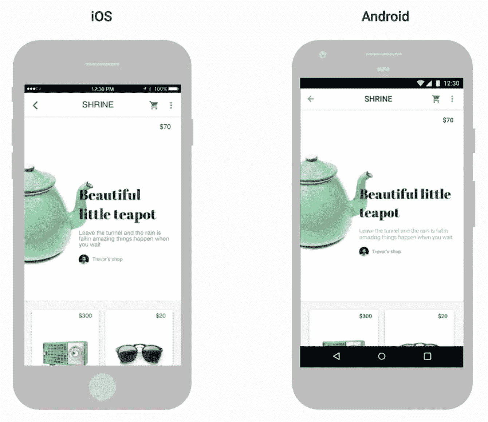
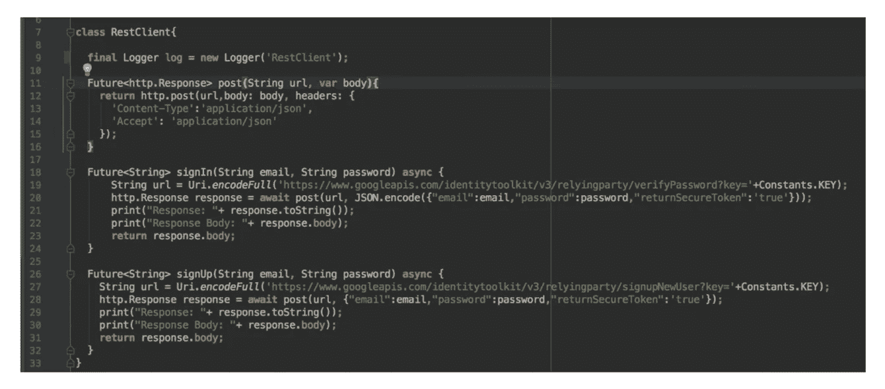

# 颤振:无缝跨平台开发的利与弊

> 原文：<https://medium.com/hackernoon/flutter-pros-and-cons-for-seamless-cross-platform-development-c81bde5a4083>

iOS 和 Android 是移动应用开发的主要平台。你通常需要为他们两个开发，写不同的代码。因此，跨平台开发在移动行业越来越受欢迎。构建 app 时省时省力。不同的工具已经出现，使跨平台开发成为可能和可取的。有基于网络的工具，如 Adobe 的 PhoneGap、微软的 T2、T4 和脸书的 React Native。每种解决方案都有其优缺点，这阻碍了成功的移动应用程序开发。

开发人员不断寻求扩展他们的知识并学习新技术，以帮助他们构建高性能的应用程序。另一方面，应用程序所有者寻求优化开发时间。这就是为什么 Flutter 进入了移动开发领域。它是由谷歌在 2018 年 2 月的世界移动通信大会上宣布的。谷歌此前曾在 2017 年的谷歌 I/O 上推出过 alpha 版本。自从发布这个新框架以来，谷歌一直在会议上推广它，因为他们希望更多的人使用它。

# 什么是颤振？

Flutter 是谷歌的现代开发套件，旨在为 Android、iOS 和谷歌 Fuchsia(谷歌正在开发的新平台)构建移动应用。

# 做了什么

在准备投入普遍使用之前，已经投入了数万小时来开发颤振。谷歌工程师致力于

*   提高发动机性能的主要部件；
*   支持在 Windows 上开发；
*   用于 [Android Studio](https://plugins.jetbrains.com/plugin/9212-flutter) 和 [Visual Studio 代码](https://marketplace.visualstudio.com/items?itemName=Dart-Code.dart-code)的工具；
*   支持更多的[Firebase](https://github.com/flutter/plugins/blob/master/FlutterFire.md)API；
*   支持[内嵌视频](https://pub.dartlang.org/packages/video_player)、[广告](https://pub.dartlang.org/packages/firebase_admob)、[图表](https://pub.dartlang.org/packages/charts_flutter)；
*   [国际化](https://flutter.io/tutorials/internationalization/)和[可达性](https://flutter.io/accessibility/)；
*   好的[文档](https://flutter.io/docs/)；
*   大量的 [bug 修复](https://steelkiwi.com/blog/is-there-such-a-thing-as-bug-free-software/)。

# 关于颤振的一些事实

*   免费开源；
*   使用 C++渲染引擎；
*   基于 Dart 编程语言；
*   提供自己的小部件；
*   架构基于反应式编程。

Flutter 在 GitHub 上越来越受欢迎，聚集了很多明星，如下图所示:

*Source: Github.com*

自该框架正式宣布以来，许多与颤振相关的事件在全球涌现:

# Flutter 如何在跨平台开发中取得成功

谷歌的开发工具包允许你建立 2D 移动应用程序。您可以使用它来开发功能全面的应用程序，包括对相机、地理位置、网络、存储等的支持。如果你需要构建令人印象深刻的品牌设计或股票平台应用，那么像 Flutter 这样的跨平台框架非常适合。

# 颤振中的移动应用开发

目前，工具包的[用例](https://flutter.io/showcase/)很少，但是它们相当令人印象深刻。谷歌自己已经使用 Flutter 创建了 AdWords 应用程序，该程序可以帮助广告商并跟踪广告购买情况。阿里巴巴的应用也是用这个工具包构建的。阿里巴巴是中国最大的电子商务公司，类似于亚马逊。

也有一些用 Flutter 构建的其他应用没有 AdWords 和阿里巴巴那么受欢迎。例如，百老汇音乐剧《汉密尔顿》的官方应用。汉密尔顿应用程序具有每日彩票、独家新闻和视频、问答游戏、商品商店等功能。蔻驰你自己(一个针对德国市场的冥想应用)和 Abbey Roads Studios 的 Topline 应用(一个记录歌曲想法的服务)也是用 Flutter 构建的。

我们认为 Flutter 对开发者社区以及寻求简化开发过程的应用程序所有者都有价值。然而，隐藏这一框架的利弊是不公平的。

# 赞成的意见

Flutter 有许多优势，可以吸引大量的开发者社区和应用程序所有者。让我们来看看 Flutter 框架给移动应用开发者和企业主带来的好处。

# 热重装

关于颤振的一个伟大的事情是热重装。开发人员可以在应用程序中立即看到他们对代码所做的所有更改。只需几秒钟就能看到变化，因此团队可以快速添加新功能、修复错误并进行试验。当开发人员和设计人员想要改善应用程序的外观并立即检查效果时，热重新加载可以实现他们之间更好的协作。不过，热重装有一些限制。

使用原生应用程序开发，您需要等待几分钟才能看到您所做的每个更改。

*Source: Flutter.io*

# 跨平台开发

有了跨平台开发，就不需要为两个平台分别构建了。您可以只构建一次，拥有一个代码库，并将该代码库用于两个应用程序。除了跨平台开发之外，Flutter 还可以让您开始开发 Fuchsia 平台。Fuchsia 是谷歌正在开发的实验性操作系统。许多人认为 Fuchsia 是 Android 的未来替代品。

# 最适合 MVP

如果你想尽快向投资者展示你的产品，你可以构建一个在 Android 和 iOS 上看起来都是原生的 Flutter 移动应用程序。因此，你的投资者将对你的 [MVP](https://steelkiwi.com/blog/what-mvp-and-why-it-necessary/) 有一个清晰的概念。开发两个独立的应用程序会花费更多的时间和金钱。

*Source:* [*Flutter.io*](https://flutter.io/technical-overview/)

# 较少代码

Flutter 的编程语言是 Dart。Dart 是面向对象和强类型的。Flutter 类似 React Native，它的编程风格是反应式和声明式的。Flutter 不需要使用 JavaScript 桥，这改善了应用程序的启动时间和整体性能。Dart 之所以能取得这样的成绩，要归功于超前(或称 AOT)编译。Dart 还利用实时(JIT)编译。使用 Flutter 的 JIT 编译改进了开发工作流，允许在开发过程中使用热重载功能刷新 UI，而不需要全新构建。

*Source:* [*Steelkiwi.com*](https://steelkiwi.com/)

颤振意味着代码更少。代码越少，错误就越少。使用 Dart，通常 100%的代码在 iOS 和 Android 应用程序之间共享。

# 小工具

小部件是应用程序的视图和界面所必需的。无论屏幕大小如何，它们都必须具有自然的外观和感觉。它们还必须快速、可扩展和可定制。Flutter 采用了“一切都是 T4”的方式。它有一组丰富的小部件和创建复杂的定制小部件的广泛能力。在 Flutter 中，小部件不仅仅用于视图。它们也用于整个屏幕，甚至应用程序本身。

正如 Flutter 的文档所说，每个小部件都是用户界面一部分的不可变声明。其他框架将视图、视图控制器、布局和其他属性分开。另一方面，Flutter 有一个一致、统一的对象模型:小部件。

小部件可以定义:

*   结构元素(如按钮或菜单)；
*   风格元素(如字体或配色方案)；
*   布局的一个方面(如填充)；
*   诸如此类。

小部件根据它们的组成形成一个层次结构。每个小部件嵌套在内，并从其父部件继承属性。没有单独的应用程序对象。相反，根小部件充当这个角色。

*Source:* [*Flutter.io*](https://flutter.io/technical-overview/)

Flutter 有一整套谷歌材质设计和苹果风格的 T2 库比蒂诺包。小部件渲染直接发生在 Skia 引擎中，不使用原始设备制造商的小部件。因此，与其他跨平台框架相比，我们可以获得更流畅的 UI 体验。

下面是原生 Android/iOS 代码如何与 React Native 等其他跨平台框架交互:

*Source:* [*Hackernoon.com*](https://hackernoon.com/why-native-app-developers-should-take-a-serious-look-at-flutter-e97361a1c073)

下面是 Flutter 与平台的交互方式:

*Source:* [*Hackernoon.com*](https://hackernoon.com/why-native-app-developers-should-take-a-serious-look-at-flutter-e97361a1c073)

该框架从平台需要的只是一个画布，在其中呈现小部件，以便它们可以出现在设备屏幕上并访问事件(触摸、计时器等)。)和服务(位置、相机等。).

# 访问本机功能

一些特定于平台的功能，如相机和地理定位，需要访问本机功能。这些功能需要借助原生语言来实现，而 Flutter 给人的感觉就是在原生平台上开发。Flutter 允许您重用现有的 Java、Swift 和 Objective-C 代码来访问 iOS 和 Android 上的原生功能和 SDK。

# 官方支持

因为 Flutter 是 Google 的首创，所以这个框架背后有一个很大的名字。材料设计团队和一个由 1000 多名开发人员组成的社区给予了大力支持，他们愿意为这个框架的发展做出贡献。

# 易于设置

Flutter 很容易在低端机器上设置和开始编码。你不需要担心你的操作系统不能处理 Flutter。恰恰相反，Flutter 不需要强大的机器。

2Dimensions 的联合创始人路易吉·罗索(Luigi Rosso)对 Flutter 应用程序的开发有如下看法:

> “我喜欢 Flutter 的无摩擦迭代。热重新加载让我处于一个反馈循环中，让我专注于我的工作。我最大的生产力抑制因素之一是运行速度比开发人员慢的工具。颤动最终重置了那个标杆。”

# 骗局

这个框架相对来说还很年轻，并且还在成长和发展中。这个工具包有它的缺陷。让我们看看他们。

# 仅限手机

Flutter 只适用于移动应用，不支持网络浏览器。当您选择想要使用的技术时，这会影响您的决策。如果你想要最大的设备灵活性，那么 Flutter 可能不是你要找的东西。

# 有限的库

Google 支持 Flutter，有很多有用的库。然而，该框架相对较新。你不会找到你想要的所有功能。相反，本地应用程序在其本地 SDK 中拥有一切，包括 Stripe、Twilio 和大多数流媒体服务，如 WoWza 和 UStream。使用 Flutter，开发人员将不得不自己构建这些库，这非常耗时。

# 连续累计

对于原生 Android 和 iOS 应用程序，有许多现成的解决方案允许它们与 Travis 和 Jenkins 等 CI 平台配合工作。还有 Travis 或 Circle 等大多数热门 CI 平台的现成颤振解决方案。然而，您需要为这些类型的平台建立工具包。Travis 可用于[多个回购](https://github.com/yjbanov/flutter_travis_sample)。该框架还支持像浪子和 T4【never code】这样的[。至于我们，我们已经为 Flutter 应用程序使用 Gitlab CI 和浪子进行了复杂的决策。](https://flutter.io/fastlane-cd/)

# 有限的电视支持

如果你想知道在这个框架的帮助下构建的应用程序是否可以在 Android TV 或 Apple TV 上运行，那么答案是否定的。Flutter 几乎不支持安卓电视和苹果电视。

# 用 Flutter 做一个 app 要多少钱？

在 Flutter 中开发一个可以在 iOS 和 Android 上运行的普通应用程序需要大约 250 个小时，而为 iOS 开发这样一个应用程序需要大约 400 个小时，为 Android 开发一个普通应用程序需要 250 个小时。要想知道用 Flutter 开发一个应用程序需要多少成本，你可以用开发人员的时薪乘以小时数。您可以看到，分别为两个平台开发是适时的，并且需要大量资源。如果你想快速构建你的 app，并且省钱，那么你需要选择跨平台开发，而不是选择开发两个原生 app。

# 最佳跨平台移动开发

Google 正在为跨平台开发的未来铺平道路。开发人员经常需要在生产率和质量之间做出妥协。他们选择为 iOS 和 Android 开发单独的应用程序，或者转向无法提供原生体验的跨平台解决方案。Flutter 旨在弥合这一差距。它侧重于本机性能、复杂的视觉效果和工作效率。Flutter 可以提供统一的体验，减少您需要花费的时间和精力，同时降低出错的风险。

我们目前正在用 Flutter 开发一个应用程序，并准备好回答你关于这个框架的所有问题。如果你想用谷歌的新工具包开发一个应用，[与我们联系](https://steelkiwi.com/contacts/)，我们将确保你和你的企业的跨平台开发顺利进行。