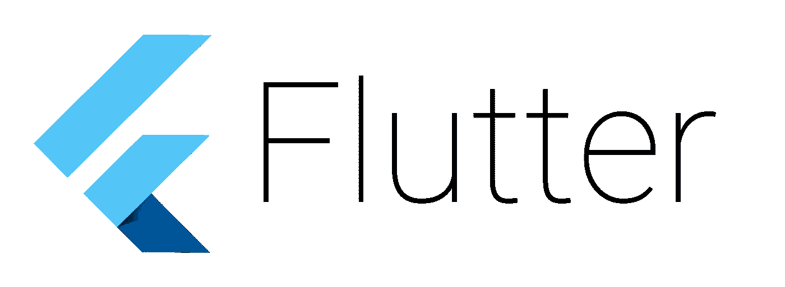
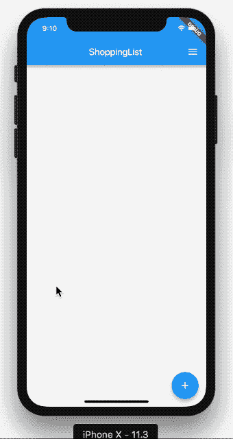
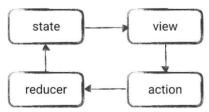

# Flutter + Redux —如何制作购物清单 App

> 原文：<https://medium.com/hackernoon/flutter-redux-how-to-make-shopping-list-app-1cd315e79b65>



大家好！在这篇文章中，我将向你展示如何使用 **Redux** 创建 **Flutter** 应用程序。如果你不知道什么是 Flutter，我鼓励你阅读我的文章[Flutter——你可能会喜欢它的 5 个理由](/@pszklarska/flutter-5-reasons-why-you-may-love-it-55021fdbf1aa)。然而，如果你知道什么是 Flutter，并且你想创建一个设计良好、易于测试、行为可预测的应用程序，那么继续阅读吧！

# Redux 是什么？

首先，让我们从解释什么是 **Redux** 开始。 [Redux](https://redux.js.org/) 是一个应用架构，最初是为 JavaScript 做的，现在用在用**反应式框架**构建的应用中(比如 React Native 或者 Flutter)。Redux 是简化版的 [Flux](https://facebook.github.io/flux/docs/overview.html) 架构，由脸书制造。但是 Redux 是怎么回事呢？基本上，你需要知道三件事:

1.  有一个**真实的单一来源**——您的整个应用程序状态只保存在一个地方(称为 store)
2.  **状态是只读的**——要更改应用程序状态，您需要分派一个动作，然后创建新状态
3.  用**纯函数**做了改变——一个纯函数(简单来说，它是一个没有副作用的函数)接受先前的状态和一个动作，并返回新的状态

听起来很酷，但是这种解决方案的优势是什么？

*   我们拥有对状态的控制——这意味着我们确切地知道是什么导致了状态变化，我们没有重复的状态，并且我们可以轻松地跟踪数据流
*   纯粹的**减速器功能很容易测试**——如果结果正确，我们可以通过状态、动作和测试
*   应用程序是**结构清晰的**——我们有不同的动作层、模型层、业务逻辑层等等。—所以你确切地知道在哪里放置另一个新特性
*   对于更复杂的应用程序来说，这是一个很好的架构——你不需要在整个视图树中从父节点传递到子节点
*   还有一个…

## Redux 时间旅行

Redux 可能有一个很酷的功能🎉**时间旅行**！使用 Redux 和[适当的工具](https://pub.dartlang.org/packages/flutter_redux_dev_tools)，您可以**跟踪您的应用程序状态**，检查实际状态并且**随时重新创建它**。查看该功能的实际应用:



Time Travel in action — how cool is that?

# 一个简单例子中的 Redux 小部件

以上所有规则使得 Redux **中的数据流是单向的**。但这意味着什么呢？实际上，这都是通过**动作、减速器、存储和状态**来完成的。让我们想象一下显示按钮计数器的应用程序:


1.  您的应用程序在开始时有一些**状态**(点击次数，为 0)
2.  基于该状态，视图**被渲染。**
3.  如果用户点击按钮，会有**动作**发送(如增量计数器)
4.  **缩减器**接收动作，缩减器知道前一状态(计数器 0)，接收动作(IncrementCounter)并能返回新状态(计数器 1)
5.  您的应用程序具有新的**状态**(计数器 1)
6.  基于新的状态，**视图**被再次渲染

如你所见，一般来说，这都是关于状态的。你有单个 app **状态**，**状态**只读查看，要创建新的**状态**你需要发送动作。发送动作触发创建并发出新应用程序**状态**的缩减器。历史会重演。



Redux Data Flow

# Redux 购物清单应用示例

让我在更多的高级例子中展示 Redux 是如何工作的。我们将创建一个简单的购物车应用程序。在该应用中，将有以下功能:

*   添加项目
*   将项目标记为选中
*   基本上就这些了😎

该应用程序将如下所示:


你可以在 GitHub 上看到完整的应用程序代码:

[](https://github.com/pszklarska/FlutterShoppingCart) [## pszklarska/FlutterShoppingCart

### FlutterShoppingCart -使用 Redux 架构的购物应用程序的 Flutter 示例

github.com](https://github.com/pszklarska/FlutterShoppingCart) 

先说编码吧！👇

## 先决条件

在本文中，我不会展示如何为这个应用程序创建 UI。您可以在这里 实现 Redux 之前查看 [**这个购物清单应用的代码。我们将从这一点开始编码，并将 Redux 添加到这个应用程序中。**](https://github.com/pszklarska/FlutterShoppingCart/tree/a8120a23232a05d380384bb377f3994ef65ad221)

如果你以前从未使用过 Flutter，我鼓励你试试 Google 的 [Flutter Codelabs。](https://codelabs.developers.google.com/codelabs/flutter/)

## **设置**

要在 Flutter 上运行 Redux，您需要向您的`pubspec.yaml`文件添加依赖项:

```
flutter_redux: ^0.5.2
```

您可以在 [flutter_redux](https://pub.dartlang.org/packages/flutter_redux) 包页面查看最新版本。

## 模型

我们的应用程序需要管理项目的添加和更改，所以我们将使用简单的`CartItem`模型来存储单个项目的状态。**我们的整个应用状态将只是 CartItems 的列表**。如你所见，CartItem 只是一个普通的 Dart 对象。

```
class **CartItem** {
  String name;
  bool checked;

  **CartItem**(this.name, this.checked);
}
```

> 注意:这是这个文件的完整源代码。

## 行动

首先，我们需要声明**动作**。动作基本上是任何可以被调用来改变应用程序状态的**意图。在我们的应用程序中，我们将有两个动作，用于添加和更改项目:**

```
class **AddItemAction** {
  final CartItem item;

  **AddItemAction**(this.item);
}

class **ToggleItemStateAction** {
  final CartItem item;

  **ToggleItemStateAction**(this.item);
}
```

> [注意:这里是这个文件的完整源代码](https://github.com/pszklarska/FlutterShoppingCart/blob/4756839d5749dfa36073e830b208bb45cb5f8874/lib/redux/actions.dart)

## 还原剂

然后，我们需要告诉我们的应用程序应该如何处理这些动作。这就是为什么**还原器**的作用——它们简单地**获取当前的应用程序状态和动作，然后它们创建并返回新的应用程序状态**。我们有两个 reducers 方法:

```
List<CartItem> **appReducers**(List<CartItem> items, dynamic action) {
  if (action is AddItemAction) {
    return **addItem(items, action)**;
  } else if (action is ToggleItemStateAction) {
    return **toggleItemState(items, action)**;
  } 
  return items;
}

List<CartItem> **addItem**(List<CartItem> items, AddItemAction action) {
  return List.from(items)..add(action.item);
}

List<CartItem> **toggleItemState**(List<CartItem> items, ToggleItemStateAction action) {
  return items.map((item) => item.name == action.item.name ?
    action.item : item).toList();
}
```

> [注意:这里是这个文件的完整源代码。](https://github.com/pszklarska/FlutterShoppingCart/blob/4756839d5749dfa36073e830b208bb45cb5f8874/lib/redux/reducers.dart)

方法`appReducers()`将动作委托给适当的方法。方法`addItem()`和`toggleItemState()`都返回新的列表——这是我们新的应用程序状态。如你所见，**你不应该修改当前列表**。相反，我们每次都创建新的列表。

## 商店提供商

现在，当我们有了 actions 和 reducers，我们需要提供存储应用程序状态的地方。在 Redux 中，它被称为 **store** ，对于我们的应用程序来说，它是**真实的单一来源**。

```
void main() {
  **final store = new Store<List<CartItem>>(
      appReducers,
      initialState: new List());**

  runApp(new FlutterReduxApp(store));
}
```

> 注意:这是这个文件的完整源代码。

要创建 store，我们需要通过 **reducers** 方法和**初始应用状态**。如果我们创建了商店，我们必须将它传递给 **StoreProvider** 来告诉我们的应用程序，任何想要请求应用程序状态的人都可以使用它:

```
class FlutterReduxApp extends StatelessWidget {
  final Store<List<CartItem>> store;

  FlutterReduxApp(this.store);

  @override
  Widget build(BuildContext context) {
    **return new StoreProvider<List<CartItem>>(
      store: store,
      child: new ShoppingCartApp(),
    );**
  }
}
```

> [注意:这里是这个文件的完整源代码。](https://github.com/pszklarska/FlutterShoppingCart/blob/4756839d5749dfa36073e830b208bb45cb5f8874/lib/main.dart)

在上面的例子中,`ShoppingCartApp()`是主应用程序小部件。

## 存储连接器

目前，我们有一切，除了…实际增加和改变项目。怎么做呢？为此，我们需要使用 **StoreConnector** 。这是一种**获取商店并对其进行操作或读取其状态**的方法。

首先，我们希望**读取当前数据并将其显示在列表中**:

```
classShoppingListextends StatelessWidget {
  @override
  Widget build(BuildContext context) {
    return new **StoreConnector<List<CartItem>, List<CartItem>>**(
      **converter: (store) => store.state,
      builder: (context, list)** {
        return new ListView.builder(
            itemCount: list.length,
            itemBuilder: (context, position) =>
                **new ShoppingListItem(list[position]));**
      },
    );
  }
}
```

> 注意:这是这个文件的完整源代码。

上面的代码用`StoreConnector`包装了默认的`ListView.builder`。StoreConnector 可以获取当前的应用程序状态(即`List<CartItem>`，并使用`converter`函数将其映射到任何东西。出于这个例子的目的，它将是相同的状态(`List<CartItem>`)，因为我们在这里需要整个列表。

接下来，在`builder`函数中我们得到`list`——这基本上是来自`store`的 CartItems 列表，我们可以用它来构建 ListView。

好的，酷——我们这里有阅读数据。现在**如何设置一些数据？**

为此，我们也将使用 **StoreConnector** ，但方式略有不同。

```
class AddItemDialog extends StatelessWidget {
  @override
  Widget build(BuildContext context) {
    return new StoreConnector<List<CartItem>, OnItemAddedCallback>(
        converter: (store) { **return (itemName) =>
          store.dispatch(AddItemAction(CartItem(itemName, false)));** }**,** builder: (context, callback) {
      return new AddItemDialogWidget(**callback**);
    });
  }
}**typedef OnItemAddedCallback = Function(String itemName);**
```

> 注意:这是这个文件的完整源代码。

让我们看看代码。和前面的例子一样，我们使用了 **StoreConnector** ，但是这一次，我们没有将 CartItems 的列表映射到同一个列表，而是将它映射到`OnItemAddedCallback`。这样我们可以将回调传递给`AddItemDialogWidget`，并在用户添加新项目时调用它:

```
class AddItemDialogWidgetState extends State<AddItemDialogWidget> {
  String itemName;

  **final OnItemAddedCallback callback;
  AddItemDialogWidgetState(this.callback);**

  @override
  Widget build(BuildContext context) {
    return new AlertDialog(
      ...
      actions: <Widget>[
        ...
        new FlatButton(
            child: const Text('ADD'),
            **onPressed: () {** ... **callback(itemName);
            })**
      ],
    );
  }
}
```

> 注意:这是这个文件的完整源代码。

现在，每次用户按下“添加”按钮，回调将调度`AddItemAction()`事件。

现在，我们可以做非常类似的事情来切换项目状态:

```
class ShoppingListItem extends StatelessWidget {
  final CartItem item;

  ShoppingListItem(this.item);

  @override
  Widget build(BuildContext context) {
    return new **StoreConnector<List<CartItem>, OnStateChanged>**(
        converter: (store) {
      **return (item) => store.dispatch(ToggleItemStateAction(item));**
    }, builder: (context, callback) {
      return new ListTile(
        title: new Text(item.name),
        leading: new Checkbox(
            value: item.checked,
            **onChanged: (bool newValue) {
              callback(CartItem(item.name, newValue));
            }),**
      );
    });
  }
}

**typedef OnStateChanged = Function(CartItem item);**
```

> [注意:这里是这个文件的完整源代码。](https://github.com/pszklarska/FlutterShoppingCart/blob/4756839d5749dfa36073e830b208bb45cb5f8874/lib/list/shopping_list_item.dart)

和前面的例子一样，我们使用 **StoreConnector** 将`List<CartItem>`映射到`OnStateChanged`回调。现在每次复选框被改变时(在`onChanged`方法中)，回调触发`ToggleItemStateAction`事件。

# 摘要

仅此而已！在本文中，我们使用 Redux 架构创建了一个简单的购物清单应用程序。在我们的应用程序中，我们可以添加一些项目并改变它们的状态。**向该应用程序添加新功能就像添加新动作和减少器一样简单。**

在这里，您可以查看该应用程序的完整源代码，包括**时间旅行**小部件:

[](https://github.com/pszklarska/FlutterShoppingCart) [## pszklarska/FlutterShoppingCart

### FlutterShoppingCart -使用 Redux 架构的购物应用程序的 Flutter 示例

github.com](https://github.com/pszklarska/FlutterShoppingCart) 

希望你喜欢这篇文章，并继续关注！🙌