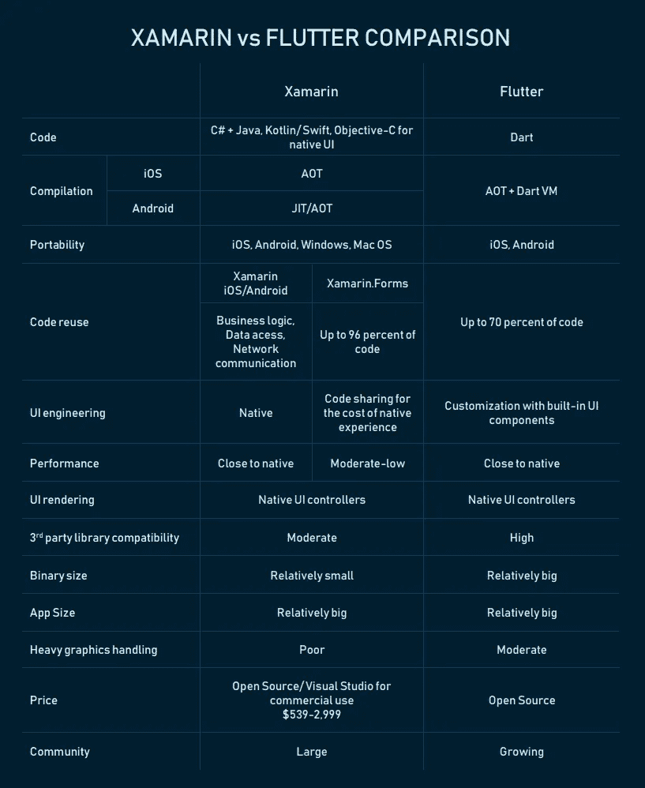
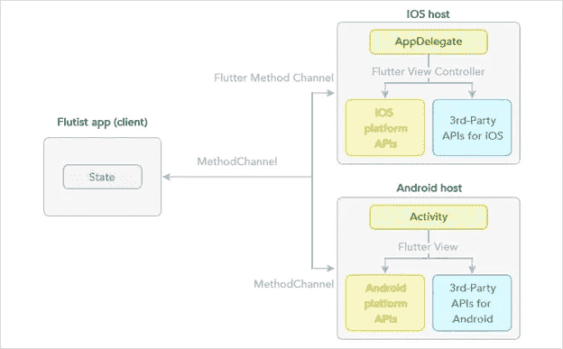
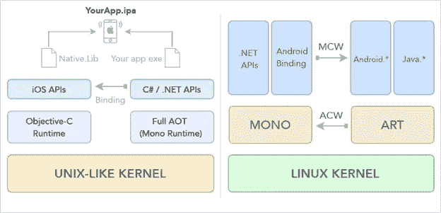

# Flutter 与 Xamarin 跨平台移动开发的比较

> 原文：<https://medium.com/hackernoon/flutter-vs-xamarin-cross-platform-mobile-development-compared-54f3c2b8ba2f>

*本文是与 Peerbits 应用开发公司合作撰写的*

在过去的十年中，移动行业经历了巨大的发展，尤其是在应用程序开发方面。据 [Statista 报道](https://www.statista.com/statistics/203734/global-smartphone-penetration-per-capita-since-2005/)，全球智能手机用户超过 20 亿，预计到 2022 年底，这一数字将超过 50 亿。在这些智能手机中，近 100%运行在三个流行的平台上:谷歌的 Android，苹果的 iOS 和微软开发的 Windows Mobile。有一段时间，移动应用程序开发人员依赖特定于平台的工具来开发原生应用程序，这些应用程序只能在单一平台上运行。例如，Kotlin 和 [Java](https://www.altexsoft.com/blog/engineering/pros-and-cons-of-java-programming/?utm_source=MediumCom&utm_medium=referral) 主要用于开发 Android 原生移动应用，而 iOS 开发者使用 [Objective-C 和最近的 Swift](https://www.altexsoft.com/blog/engineering/swift-vs-objective-c-out-with-the-old-in-with-the-new/?utm_source=MediumCom&utm_medium=referral) ，你可以在我们对这两种语言的比较中了解到。

# 原生移动应用开发的缺点

传统的移动应用程序开发缓慢且成本较高，因为企业必须为每个平台开发单独的应用程序，并且每个工具包都有不同的开发团队。今天，我们有跨平台的移动开发工具来帮助公司减少开发时间、维护成本，并接触到更多的用户。[跨平台移动开发](https://www.peerbits.com/cross-platform-application-frameworks.html)简单来说就是构建可以在多个平台上运行的移动应用。目前有几种跨平台框架可供开发人员使用，包括英特尔 XDK、Xamarin、Cordova 和 Flutter 等。在本文中，我们将通过比较两者的特性、优势和缺点来重点讨论两者——xa marin 和 Flutter，以帮助开发人员决定何时使用其中一个。你也可以查看我们对 Xamarin、React Native 和 Ionic 平台的比较。

# Xamarin 和颤振框架概述

Xamarin 可以说是微软运行的领先的开源跨平台开发技术之一。它使用 C#语言来设计 Android、iOS 和 Windows Mobile 的移动应用程序。Xamarin 允许开发人员访问原生 Android 和 iOS APIs，并通过 [Xamarin 测试云](https://testcloud.xamarin.com/)提供共享的 C#代码库以及跨设备的应用测试。Xamarin 早在 2011 年由 Mono 背后的开发人员创建，他们使用 CLI(公共语言基础设施)和公共语言规范，也称为[微软。网](https://www.altexsoft.com/blog/engineering/the-good-and-the-bad-of-net-framework-programming/?utm_source=MediumCom&utm_medium=referral)。微软在 2016 年收购了 Xamarin，后来将 Xamarin SDK 打造成开源平台，成为了 Xamarin Visual Studio IDE 不可或缺的一部分。为了充分发挥 Xamarin 的潜力，除了 C#之外，开发人员还需要了解一些 iOS 和 Android 知识。

[Flutter](https://www.altexsoft.com/blog/engineering/pros-and-cons-of-flutter-app-development/?utm_source=MediumCom&utm_medium=referral) 也是谷歌设计的开源免费跨平台工具，允许开发者为 Android 和 iOS 创建高性能的原生移动应用。该框架使用 Google 的 Dart 编程语言和 light C++引擎。与 Xamarin 类似，它提供了单一的代码库。该框架为 2D 渲染、模拟、手势和绘画提供了 API 和 SDK，并允许使用现有的 Swift、Objective C 和 Java 代码。它配有机器设计小工具，也是谷歌的产品。

# 颤振和 Xamarin 比较

尽管 Flutter 在移动开发方面相对较新，其测试版于 2018 年 1 月推出，但 Flutter 跨平台开发框架已经在移动开发者社区中引发了一些讨论。与 Xamarin 相比，不同的专家对这两个框架持有不同的观点。Visual Studio 杂志的大卫·拉梅尔(David Ramel)指出，这种比较可以追溯到 2015 年谷歌首次推出 Flutter 时，但在 2018 年 MWC 正式发布之后，这种比较加剧了。

目前，Xamarin 在开发人员中更受欢迎，因为所有 [Stack Overflow 2018](https://insights.stackoverflow.com/survey/2018) 调查受访者中有 7.2%的人表示他们使用 Xamarin，微软声称有 140 万名 Xamarin 工程师，而 Flutter 根本没有上榜。Flutter 社区还不够大。然而，一些工程师认为 Flutter 是 Xamarin 的一种新兴替代方案。

下面我们来看看这两个框架的特点和主要特性。虽然本文中的见解并不完全是结论性的，但是它们将为您提供一些关于这两个框架的有利观点。

*Xamarin vs Flutter comparison in a nutshell*

## 轻便

Flutter 面向 Android 和 iOS 开发，而 Xamarin 支持 Android、iOS 和 Windows 平台(即 Windows 10 [UWP]、Windows legacy [WPF]应用)，以及 MacOS 应用。更大的生态系统让 Xamarin 比 Flutter 更有优势。虽然今天大约有 98.5%的智能手机运行在 Android 或 iOS 上，但事实上 Flutter 应用程序不能移植到 Windows mobile 平台并不是一个大缺点，正如 [Statista 最近的调查](https://www.statista.com/statistics/203734/global-smartphone-penetration-per-capita-since-2005/)所声称的那样。但当你想为 Windows mobile 开发应用程序时，Xamarin 可能是万能的。

Flutter 与 32 位操作系统设备不兼容。因此，举例来说，如果你计划覆盖像 iPhone 5 这样的旧手机，Xamarin 将是一个更好的选择。

## 编程语言

Xamarin 使用的是流行的、被开发者广泛使用的 C#。如果你已经掌握了 C#和。NET，你可以直接使用 Xamarin。如果你利用 Xamarin.Forms，你可以在 Xamarin 中重用 96%的 C#代码

Flutter 使用 Dart 语言，这是一种相对较新且不受欢迎的语言。但是，如果您有 Java、JavaScript 和 C++等 OOP 语言的经验，学习 Dart 将不是问题，因为它使用相同的方法和范例。

## 社区支持

Xamarin 已经存在了一段时间，拥有一个庞大的支持者社区，他们经验丰富，愿意与其他开发人员分享他们的知识。在 Xamarin 论坛上，致力于互相帮助的开发人员分享他们的代码和经验。该平台还得到微软的支持，这在解决常见困难时是一大优势。微软为其所有的 Xamarin- and 提供了体面的最新文档。网络相关产品。

虽然 Flutter 得到了 Google 的支持，但它相对较新，目前缺乏社区支持。该平台还相当年轻，几个月前才发布测试版，这意味着开发人员还没有发现该框架的主要弱点和优势。

如果你正在计划一个长期的、复杂的项目，你应该选择 Xamarin，它的稳定性和问题是已知的。然而，随着 Flutter 社区的成长，在一年的时间里，它可能会变得足够成熟，足以帮助解决大多数出现的问题。

## 对本机操作系统的访问

Flutter 中的 Dart 代码使用 AoT(提前)编译被编译成 native，但仍然需要 Dart VM(虚拟机)。AoT 编译背后的原因是 iOS 平台不支持 JIT 或者动态编译。Flutter 还允许你构建支持特定平台代码的定制插件。

Flutter 可以通过包访问包括存储和传感器在内的所有平台服务和 API。您还可以使用 Flutter 库来实现一个平台通道，用于从 Dart 调用本机函数。

*Flutter iOS and Android Structure*

在 Xamarin 中，C#代码被编译成机器码，然后打包到. app 中。mono 代码生成器对 Xamarin 使用 JIT 编译。Android 应用程序和面向 iOS 应用程序的 AoT 编译，用于将中间机器代码(也称为托管代码)编译成本地平台代码。

Xamarin 使用。NET APIs 和特定于平台的库通过绑定来访问本机功能。

*Xamarin iOS and Android architecture*

## UI 设计

虽然 Xamarin 使用原生 UI 组件是一件好事，但这也是有代价的，因为平台会定期更新，这可能需要更长的时间让框架适应新版本。这也使得 Xamarin 只适合逻辑代码共享，而不适合 UI 代码重用。最重要的是，我们建议使用原生模块来处理繁重的图形，如游戏和动画。

Flutter 使用内置小部件，不使用原生 UI 组件。然后，小部件需要根据您构建 UI 的平台进行进一步定制。目前，Flutter 建议使用各种布局、基础部件和平台来创建图形，并支持 2D API、手势、效果、动画和其他功能。虽然 Flutter UI 特性仍在开发中，但它们有潜力发展成为一个强大的 UI 构建环境。此外，Flutter 还带有材料设计和 Cupertino 组件。

## 开发者体验

Flutter 中的热重新加载特性可以帮助开发人员构建用户界面、试验和添加不同的特性，并快速检测和修复错误，而不会丢失仿真器上的状态。开发人员还可以访问第三方 SDK 和库等原生特性，并重用现有的原生代码(Swift、Objective C、Java 和 Kotlin)。

Xamarin 的优势之一是，它允许开发人员通过微软 Xamarin Cloud 跨设备测试应用程序。但是，您必须支付订阅费才能使用该功能。Xamarin 还提供了实时重新加载功能，相当于 Flutter 中的热重新加载，可以帮助开发人员修改 XAML，并在不编译或部署应用程序的情况下“实时”看到结果。

Xamarin 的问题之一是与第三方库的集成，这似乎在 Flutter 中实现得更好。

## 开发者技能

Xamarin 允许共享大约 96%的 C#代码，但是如果您选择完全原生体验，您必须使用一些特定于平台的代码。因此，如果开发人员有 C#经验，并且能够处理 Java、Kotlin、Swift 和 Objective-C 等原生开发平台，Xamarin 就会大放异彩。

要在 Flutter 中开发应用程序，你需要了解 Dart，这可能需要你花时间来学习，但如果你熟悉 Java 和 C++，这应该不是问题。如果你是移动应用程序开发的初学者，没有 Android 或 iOS 应用程序开发的经验，你必须学习 Dart 来完成工作。

## 二进制和 APK 大小

根据 Capital One 的工程师 [Korhan Bicarn](https://www.linkedin.com/pulse/cross-platform-mobile-app-development-flutter-xamarin-korhan-bircan/) 去年的测试，Flutter 中的一个基本应用程序的二进制大小为 40.2 MB，而 Xamarin 的二进制大小为 25.1 MB。你可以在这里看到更详细的[结果](https://www.slideshare.net/KorhanBircan/crossplatform-app-development-with-flutter-xamarin-react-native)。自那以后，谷歌努力将基本 Flutter 应用程序的 APK 大小减少到 4.28 MB，而 Xamarin 的大小保持在 7 MB 左右。

## 内存、CPU 和 GPU 利用率

根据相同的比较，初始化应用程序的地址空间和动态链接在 Flutter 中花费了 1.05 秒。该应用程序在大约 220 毫秒内启动，速度为 58 FPS。在 Xamarin 中，应用程序的地址空间初始化和动态链接需要 3.2 秒。应用程序在大约 345 毫秒内启动，速度为 53 FPS。您还可以在我们的专题文章中了解更多关于 Xamarin 性能的信息。

# 结论

尽管开发人员普遍支持 Flutter 计划，但这并不一定意味着 Xamarin 已经过时。如果你是跨平台移动开发的新手，考虑 Flutter 是有意义的，因为这个平台很可能在不久的将来变得热门。

然而， [Xamarin](https://www.altexsoft.com/blog/mobile/pros-and-cons-of-xamarin-vs-native/?utm_source=MediumCom&utm_medium=referral) 目前在很多方面都更加成熟，包括社区、工具集、稳定性。一般来说，对于复杂和长期的项目，我们建议坚持使用 Xamarin，尤其是如果你有一个 C#和。NET 开发者，你就进入了微软的生态系统。

*原载于 AltexSoft Tech 博客**[***Flutter vs Xamarin 跨平台移动开发对比***](https://www.altexsoft.com/blog/engineering/flutter-vs-xamarin-cross-platform-mobile-development-compared/?utm_source=MediumCom&utm_medium=referral)*