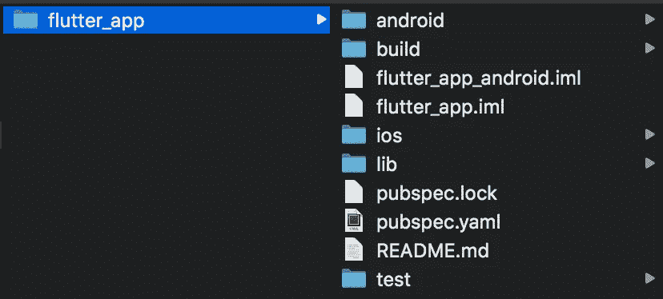
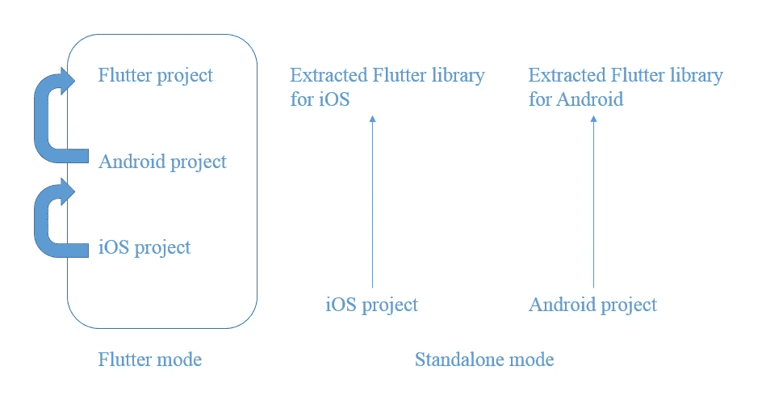
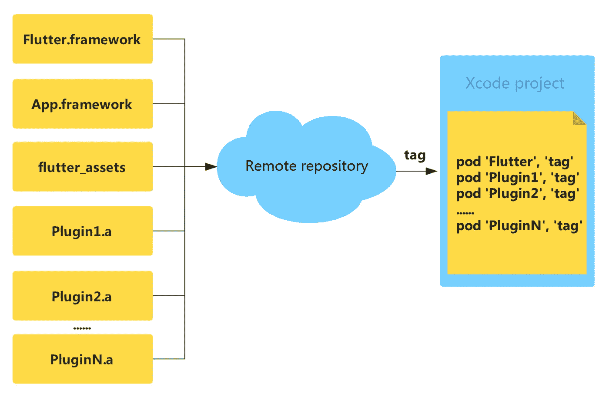
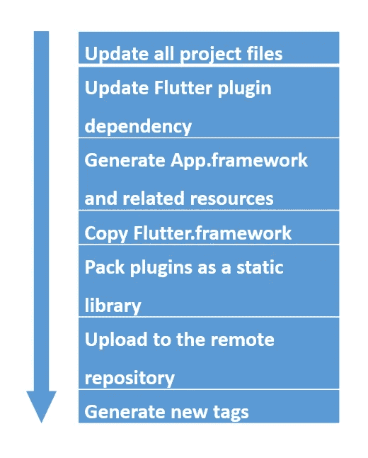

# 凌驾于其他之上:跨多个系统转变电子商务

> 原文：<https://medium.com/hackernoon/fluttering-above-the-rest-transforming-e-commerce-across-multiple-systems-b0b4e5a0a38>

*为高保真电子商务调整 iOS 和 Android 系统中的颤振依赖性*

*本文是阿里巴巴* [***利用旋舞***](/@alitech_2017/utilizing-flutter-best-practice-from-alibaba-236a53aa32c8) *系列的一部分。*

电子商务平台传统上分为 iOS 和 Android 系统，要求开发者设计和开发两个不同的系统。现在，由于 Flutter 技术，开发人员可以从单一代码库为 iOS 和 Android 创建高性能和高保真的应用程序。

This development, however, poses the problem of integrating the technology with existing and live projects. In this article, the technical team at Alibaba’s Xianyu (闲鱼, China’s emerging, second-hand market platform) presents a general engineering transformation plan for project practitioners hoping to address common concerns, and provides a reference for preparing to transform projects to Flutter.

# 仙宇的扑技

2018 年上半年，鲜宇技术团队在客户端开发统一中率先利用了 Flutter 技术，成功转型推出了复杂商品细节服务。在这个过程中，无缝桥接 Flutter 与初始 iOS 和 Android 项目之间的连接的优先级问题出现了，并且必须确保开发效率不受影响。

# 积分颤振

Flutter 有一个特殊的工程结构，由 Flutter 目录组成，其中包含了原生 iOS 和 Android 项目的目录。默认情况下，引入 Flutter 的本地项目不能独立于父目录构建和运行，因为它相反依赖于 Flutter 的相关库和资源。

*Typical Flutter directory structure*

对于原生项目，开发人员不太可能创建一个新的 Flutter 项目来重写整个项目。因此，颤振项目将包含现有的原生项目，这将引入以下问题:

**构建包**

引入 Flutter 后，原生项目与 Flutter 耦合，无法独立编译构建。在 Flutter 环境中，项目的构建从 Flutter 的构建命令开始，其执行过程包括本地项目的构建。开发人员必须配置 Flutter 运行时环境来完成整个过程。

**混合编译导致开发效率降低**

在过渡到 Flutter 的过程中，肯定有许多服务仍在原生环境中开发。项目结构的改变不允许在原生环境中进行开发。此外，对颤振工程结构的适应为纯本地开发创建了不必要的构建步骤，从而导致开发效率降低。

# 目标

针对上述问题，先宇技术团队提出以下改造目标，并努力将原生项目对 Flutter 相关文件的依赖降至最低，从而:

原生项目可以独立编译和调试，从而最大限度地减少对相关开发人员的干扰，使打包平台摆脱对 Flutter 环境和相关进程的依赖。

Flutter 环境中的原生项目(即 iOS 或 Android 子目录)可以依赖于相关的库和文件，实现各种类型的 Flutter 功能，如 dart 代码构造、调试、热重装等。这样才能保证颤振环境下开发的正确性。

# 颤振依赖性

为了实现上述目标，仙寓的技术团队为这两个目录整合了两种模式，组织了依赖关系，并引入了如下所述的依赖关系。

## 两种模式，两个目录

技术团队的解决方案是根据目录类型区分项目；独立目录环境中的本地项目被定义为独立模式，而 Flutter 目录中的本地项目被定义为 Flutter 模式。纯本机开发或平台打包被视为独立模式。在这种模式下，Flutter 对开发人员和打包平台保持透明，不影响构造和调试。Flutter 的代码是在 Flutter 模式下开发的，相关库的生成、编译、调试都遵循 Flutter 定义的过程。

*Different modes for each directory type*

## 组织依赖性

从上面的定义来看，转换的核心是提取独立模式，然后整理出独立模式对 Flutter 的依赖，并将其提取到第三方库、资源或源文件中。以 iOS 为例，通过读取 Flutter 构建的源代码，Xcode 项目对 Flutter 有如下依赖:

**.App.framework**

dart 写的应用源代码的相关文件。

**.Flutter.framework**

颤振发动机库文件。

**。pubs 插件目录和索引文件**

Flutter 的插件，包括各种系统和自定义频道。

**。扑 _ 资产**

Flutter 依赖的资源，比如字体，图片等等。

## 引入依赖性

在转换过程中，先宇科技团队尝试了两种策略来引入依赖:本地依赖和远程依赖。

**本地依赖**

第一种策略是用本地依赖修改 Flutter 构造过程，其中库文件、源代码和资源放在原生项目的子目录中以供参考。对于 iOS ,. flutter . framework 和相关插件被做成本地 pod 依赖，资源也被复制到本地存储库进行维护。

因此，独立模式获得了独立构建和执行的能力。对于纯本地开发人员，可以选择忽略 Flutter，因为它只是第二方库和资源的集合。

在颤振模式下，dart 源代码的构造过程不变，不影响编译和调试。同时，由于本地依赖性，颤振模式下的各种变更可以实时同步到原生项目的子目录中，这样一旦提交变更，单机模式也具有最新的颤振相关功能。

本地依赖性允许将相关颤动内容的改变方便地同步到独立模式，这是一个显著的优点。然而，主要的缺点在于 Flutter 的原始构造过程需要稍微复杂的修改，这将与随后的 Flutter 代码合并相冲突。原生项目和 Flutter 项目的内容仍然是耦合的，所以它们不是完全独立的。

**远程依赖**

第二个策略是用远程依赖修改 Flutter 构建过程，其中 Flutter 依赖的所有内容都放在一个单独的远程存储库中。在独立模式下，引用远程存储库中的相关资源、源代码和库文件，而在 Flutter 模式下，构建过程和引用方法不变。

远程依赖的优点是它不会大幅度修改 Flutter 自身的构造过程，有效地解决了本地耦合的问题。然而，这种策略也导致更麻烦的同步过程。此外，Flutter 内容的更改必须首先同步到远程存储库，然后同步到独立模式才能生效。

为了克服这些缺点，由于本地耦合解决方案的主要好处，仙寓技术团队最终决定采用远程依赖策略来引入依赖。

*Remote dependency model outline*

# 转换实现

实现转换包括有效地组织目录和实现远程依赖，如下所述。

## 目录组织

目录的组织方式对实现转换有着重要的影响。在 Flutter 模式下，父项目目录下的 iOS 和 android 子目录分别包含对应的原生项目。在代码管理方面，子项目可以使用 git 的子模块形式来确保目录之间的独立性。

## 远程依赖实现

在独立模式下，Flutter 的依赖内容指向远程存储库中的相应文件，而 Flutter 模式下的依赖方法不变。为了实现远程依赖，需要考虑以下问题:

**同步颤振变化到独立模式**

由于繁琐的变更同步是远程依赖的主要问题，所以 Xianyu 团队开发了一系列脚本工具来尽可能自动化这个过程。假设 Flutter 内容(可能是服务源代码、引擎库或某些资源文件)发生了变化，一旦在 Flutter 模式下完成了构建，脚本就会将所有生成的依赖文件提取到远程存储库中，提交并标记，然后根据标记生成新的远程依赖描述(例如，iOS 下的 podspec)。最后，Flutter 的依赖关系将在独立模式下修改为最新版本，以完成整个同步过程。

*Process synchronization*

**同步定时**

建议在评估和灰度期间，每次提交 Flutter 服务都会触发同步脚本的执行和应用程序的打包，并且在开发期间每天保持一次同步。

# 常见问题的解决方法

本节概述了转换实现的常见问题，并提供了先宇科技团队认为最有效的解决方案。

## iOS 项目名称问题

Flutter 要求默认使用 Runner.xcodeproj 作为 iOS 项目名，否则，构造会失败。可以通过修改 flutter 工具的代码来定制项目名称(代码可以在 flutter/packages/flutter_tools 找到，相关逻辑可以通过全局搜索 Runner.xcodeproj 查看)，但是合并代码时可能会出现未来的冲突。仙寓团队已经解决了这个问题，并将其项目名称改为 Runner。其他项目名称可根据自身实际情况确定。

## Pod 问题

构建颤振时，如果满足某些条件，可以自动执行 pod 安装。然而，在阿里巴巴的 taobaoenv 环境中，经常会出现错误。即使构建成功，pod 安装通常也需要很长时间才能完成执行。在执行之后，整个项目必须重新编译，这非常耗时。因此，仙域团队已经注释掉了 Flutter 对 pod 的处理，并让开发人员手动执行 pod 操作。

可能需要手动执行来切换分支和升级库版本，并且很可能重新更新 pod 是一个真正的需求。此外，当 Flutter 的构建选项在发布、调试和概要文件之间切换，并且它们引入的 Flutter.framework 有不同的来源时，可能需要手动执行。在这种情况下，可以特别注意 pod 的重新更新。

# 摘要

为了解决引入 Flutter 后的工程适配问题，先宇 tech 团队将 Flutter 的相关依赖提取出来，放在远程仓库上，供纯原生项目引用，从而保证了 Flutter 和纯原生开发的相互独立和并行执行。

该方案已在仙域多个版本中实现，并已导出回颤振团队，为其后续混合项目的组织计划提供方向和参考。同时，该计划还可以用来帮助团队将他们的工作转变为 Flutter。显然，不同的项目导致不同的计划，因此团队期待着交流更好的方法和意见。

(Original article by Kang Kai 康凯)

# 阿里巴巴科技

关于阿里巴巴最新技术的第一手深度资料→脸书: [**“阿里巴巴科技”**](http://www.facebook.com/AlibabaTechnology) 。推特: [**【阿里巴巴技术】**](https://twitter.com/AliTech2017) 。