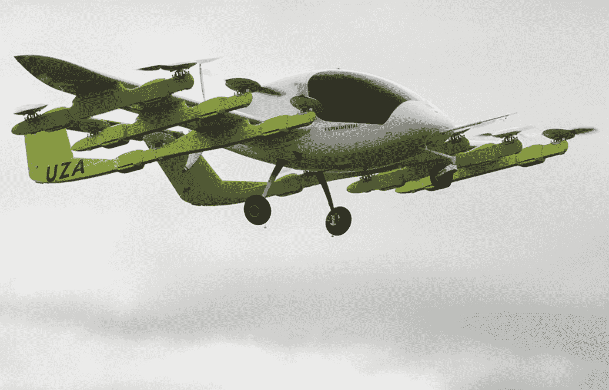
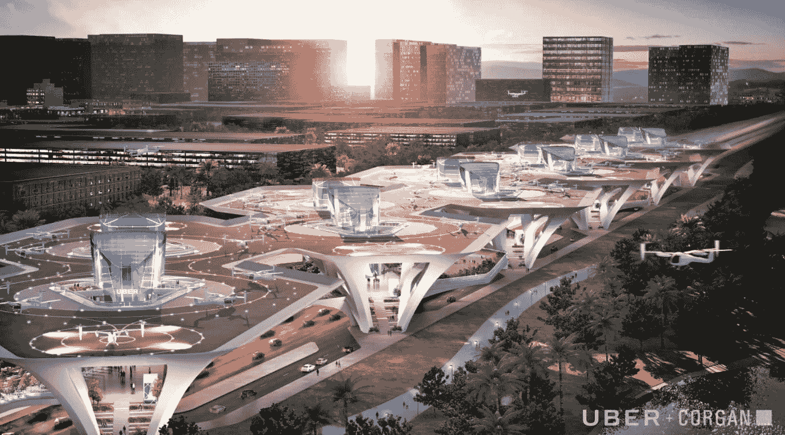
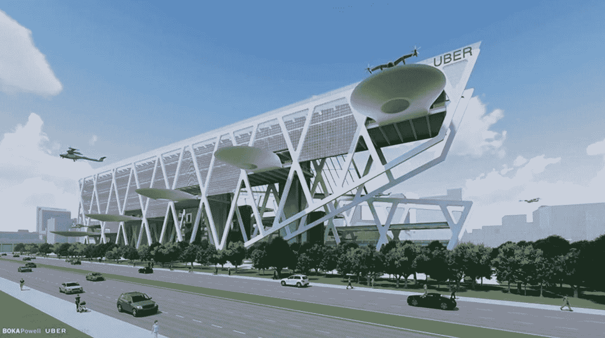

# 飞行汽车，飞向天空以避开交通

> 原文：<https://medium.com/hackernoon/flying-cars-taking-to-the-skies-to-avoid-traffic-3d0f7f6ce0a2>

它看起来像一架飞机。它肯定是一种飞行器，但从运输服务的角度来看，被命名为“飞行汽车”更像是一辆汽车。最简单的形式，“飞行汽车”实际上是更大尺寸的无人机。无人驾驶飞机依靠电池和电动机运行，电动机推动叶片产生升力并允许控制。因此，飞行汽车就像是更大尺寸的无人机，具有运输货物和乘客的服务能力。它是 MaaS 或移动即服务平台的一部分。想想你的 DJI 无人机，大得多，你可以在里面骑。

飞行汽车的特点如下:
-全电动、电池驱动、零排放或混合燃料/电动
-垂直起降，这意味着它们可以在任何地方垂直起飞和降落
-可以自动驾驶，没有飞行员或司机，GPS 导航
-为乘客节省时间，因为乘飞机旅行更快，没有交通堵塞

A flying car (Source: Cora [https://cora.aero/](https://cora.aero/))

飞行汽车由垂直提供升力的叶片旋翼组成，因此它们不像飞机需要跑道那样需要太多空间。一旦垂直，螺旋桨产生向前的升力，推动飞行汽车前进，这也称为推力。然后，飞行汽车可以像无人机或带飞行控制器的飞机一样机动。大多数计划都是自主控制的，尽管出于安全目的他们也可以有一个飞行员。它们也可以从基站远程控制。飞行汽车大部分将是电动电池驱动的车辆，尽管也有混合动力汽车，如由 [Terrafugia](https://www.terrafugia.com/tf-x/) 开发的飞行汽车 TF-X。

优步航空公司的飞行汽车概念是另一个在像洛杉矶这样拥挤的城市中解决交通问题的好主意，以出租车服务或 MaaS 的形式提供。当 Boring 公司正在为超高速挖掘隧道时，另一个避免交通堵塞的显而易见的方法是飞向天空。这是在 2018 年 Elevate 峰会期间宣布的。因此，这解决了飞行汽车将在哪里着陆以及如何驾驶的问题。伴随着飞行汽车而来的是“天空港”。Skyports 将为乘客提供起飞和目的地，然后他们可以连接到当地的中转路线继续他们的旅程。这将有利于那些需要快速获得位置并愿意为此支付额外费用的人。交通中损失的钱最好花在交通系统上，这样可以节省时间，从长远来看还能省钱。这不会像典型的优步之旅，有人接你，这是我所希望的，因为这比去机场更方便。

Concept of “Skyport” (Source: Uber)

优步正试图通过与美国宇航局合作来实现这一点，尽管他们可以与 Space X 合作，实际上让埃隆·马斯克来思考。飞行汽车的潜力和自动驾驶汽车一样大。这只是项目背后那些将使其成功的人的可信度。飞行汽车服务也计划成为自主、无人驾驶的交通工具。与美国宇航局合作将为优步做的是帮助他们开发飞行出租车的空中交通管理系统。

10 年后，他们可能会有一个机场，比如说在 405 公路附近的塞普尔韦达和圣莫尼卡。韦斯特伍德和贝弗利山附近的交通枢纽。这些地区的商业设施肯定也会增长，还会出现其他服务，如自动驾驶出租车、移动设备充电站、机器人信息指南、无人驾驶酒店和自主移动供应商。优步正在与美国宇航局合作实现这一目标，因此它们将受到严格的监管，就像自动驾驶汽车一样。它可能很快就会看起来更像科洛桑而不是西区，而“原力”将在天空中与你同在。

Skyports will be like todays transit stations for buses and trains. (Source: Uber)

飞行汽车的想法听起来可能像是直接出自《星球大战》或《杰森一家》的科幻小说。这比我们想象的要快得多。试运行将在主要城市开始，并扩大到城市间的旅行。飞行汽车并不意味着国际旅行，尽管未来更先进的飞行汽车制造出来后，这种情况可能会改变。飞行汽车并不完全是汽车，尽管它们可以短距离行驶。它们实际上是一种不需要跑道或机场就能供个人或公众使用的交通工具。目前还没有真正的飞行汽车可以“转变”成街道和道路使用的驾驶机器。

因此，面临的挑战是:

1.飞行路径确定
2。交通管理
3。降落港口或“机场”位置
4。定价结构
5。系统安全
6。车辆的安全性和可靠性

关于像这样的自动遥控车辆的另一个问题是防止黑客攻击。应该有网络安全标准来保护控制这些车辆的信号和网络访问。黑客们已经证明，在找到进入汽车内部操作系统的方法后，侵入汽车是多么容易。飞行汽车必须能够抵御物理和电子攻击，重点是电子部分。这是因为像这样的系统是高度计算机化的，因此存在被黑客攻击的风险。加强系统抵御入侵不仅需要防止不必要的访问，还需要防范恶意软件、拒绝服务攻击和启动远程控制访问的特洛伊木马。就像现代汽车中的 CAN(控制器局域网)一样，飞行汽车必须能够抵御针对其各种 ECU(电子控制单元)的网络攻击。

另一个挑战是与美国航天局一起解决的，关于飞行器飞行路线的管理。定价将取决于运营车辆的成本以及优步如何提供最佳的运营方式。然后下一步是监管机构确定安全和操作，然后我们可以看到飞行汽车起飞。

延伸阅读:

优步空中出租车
[https://www . engadget . com/2018/05/08/Uber-Air-Taxi-prototype-elevate/](https://www.engadget.com/2018/05/08/uber-air-taxi-prototype-elevate/)

美国消费者新闻与商业频道报道优步飞行汽车打车服务 [https://www . CNBC . com/2017/11/08/Uber-NASA-work-on-Flying-Taxi . html](https://www.cnbc.com/2017/11/08/uber-nasa-work-on-flying-taxis.html)