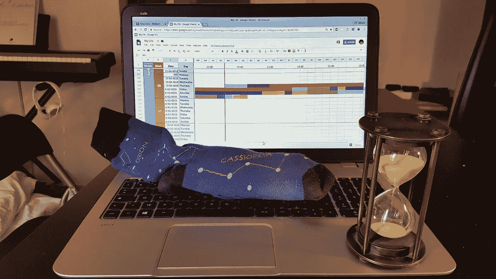
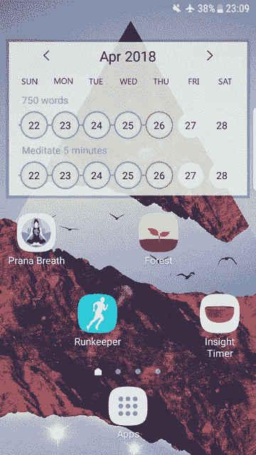
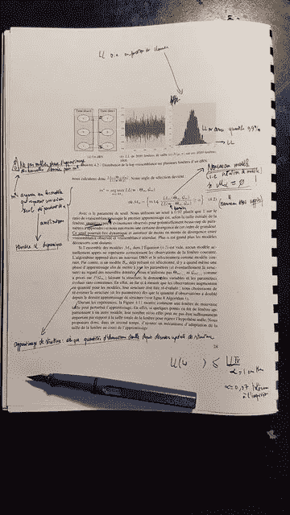
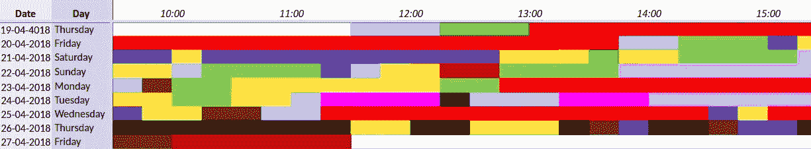

# 用复杂性和色彩聚焦黑客攻击

> 原文：<https://medium.com/hackernoon/focus-hacking-with-complexity-and-colors-f3073c725232>

我在一个下午读完了一整篇论文，这个星期只有 8 个小时毫无收获。令人惊讶的是，它始于一项涉及袜子和谷歌床单的技术的发现。

# 老虎机

首先，为了理解这些技术的复杂性，我们需要后退一步。我们的思维被叫做智能手机的小 [*老虎机*](https://www.cbsnews.com/news/brain-hacking-tech-insiders-60-minutes/) 劫持了。聪明的头脑夜以继日地工作，让你沉迷于手机。

## 增加摩擦力

有可能建立一个系统，让你很难只查看邮件。

我称之为*增加复杂性、*或*增加摩擦。*

1.  我只在主屏幕上放有效率的应用程序。
2.  我关闭了每个应用程序的所有通知。
3.  我几乎总是保持沉默。
4.  只要不在手机上，我就打开飞行模式。
5.  我没有互联网套餐，所以我无法连接到外面的互联网。

## 袜子技术

奇怪的是，那 5 招还不够*深度工作*。

上周要看一篇论文才能理解一个算法。

我设计了一种技术，可以让我整个下午都保持专注，从左到右阅读论文。

1.  确保你的手机处于静音和飞行模式，然后关机
2.  把你的手机放在袜子里
3.  将袜子插入另一只袜子
4.  把所有东西都放在袋子里
5.  把包放在你的厨房里
6.  完成你必须做的事情，因为你没有精力撤销第一步到第五步。

# 自我控制

但是即使有了这些非常复杂的技巧，没有毅力，我注定不会有所收获。

把手机放在袜子里很容易。

有足够的自制力戒掉 [*自毁*](https://www.youtube.com/watch?v=k1eYiq_V5cM) 则不然。

## 无形资源

让我对未来的自己产生共鸣的是，我的时间是比金钱更有价值的资源。

我开始意识到在 Reddit 上花一个小时比扔掉一张 20 美元的钞票更糟糕。

## 谷歌工作表黑客

但愿 Reddit 也充满了生产力黑客。

几天前，我偶然发现一个疯狂的家伙，他每 30 分钟就记录一次时间。

我决定更进一步，每 15 分钟做一次**。**

## 丰富我的生活

我有 15 种颜色适合不同的活动。相近的颜色有密切的关系。

*   浅绿色:锻炼/外出散步
*   深绿色:听音乐
*   红色:写代码
*   土耳其红:写文章
*   黑色:无效的黑洞

## 为什么有效

1.  **每项活动花费时间的详细统计数据**
2.  高分辨率 : 15 分钟是我花在一项活动上的最短时间
3.  色彩的连续性迫使我连续几个小时不间断地编码
4.  **全图**迫使我与未来的自己产生共鸣(无效的黑色细胞是可怕的，我尽一切努力避免它们)
5.  **客观性** : 不再有“我今天什么也没做”。是的，你看了这 *Westworld* [集](https://www.rollingstone.com/tv/recaps/westworld-season-premiere-recap-rewind-reboot-reload-w519284)，花了几个小时试图理解一切。但是，*还是*，你一整天有 6 个小时的生产时间。

 [## 我的生活

### 我在谷歌表单中的彩色生活](https://docs.google.com/spreadsheets/d/1p8sCKqsLc1rm8ZuAmCxZsr4pDvhqkPKUW-V3i_P1kOg/edit?usp=sharing)