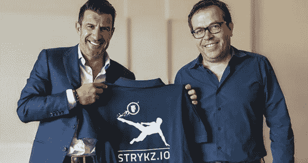
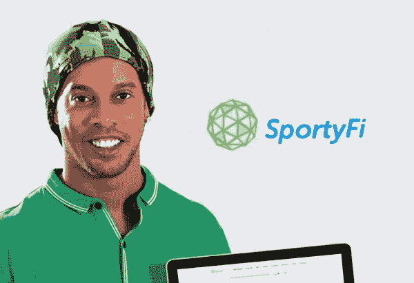
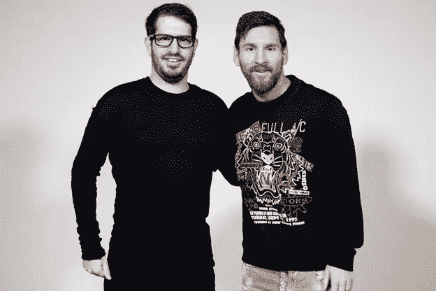
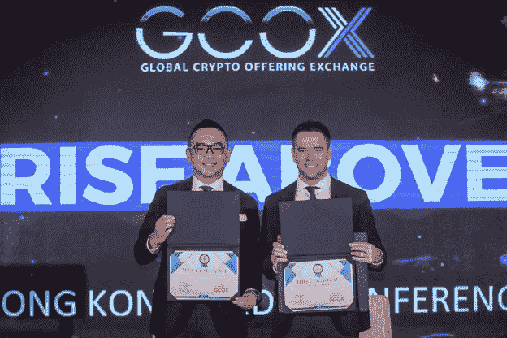

# 选择成为 ICO 足球大使的足球明星

> 原文：<https://medium.com/hackernoon/football-stars-who-chose-to-be-ico-football-ambassadors-c490fdc5f949>

随着最近区块链和加密货币项目的激增，专注于同一利基市场的公司之间的竞争变得激烈。因此，名人已经成为公司的秘密武器，公司可以负担得起，把市场对他们有利。

名人代言可以大大提升品牌的全球形象。在最近的过去，有几个足球明星正面 ICO 广告活动。在本帖中，我们将探索四位著名的足球明星，他们作为 ICO 大使派上了用场。

所以，让我们深入研究和探索:

## **1。** **路易斯·菲戈为** [**STRYKZ**](http://bit.ly/2KyFffb)

From Left to Right: Luis Figo, Dirk Weyel (Strykz CEO)

> “当我第一次听说足球明星时，我立刻喜欢上了这个主意。足球变得越来越由数据驱动，有关于比赛各个方面的详细统计数据——这就是 Stryking 的平台用来创造引人注目的球迷体验的东西。我很高兴支持 Stryking 的经验丰富的团队，并传播他们的平台，让球迷与他们支持的球队和球员互动。”

足球传奇人物路易斯·菲戈在同意代言 Stryking Entertainment 足球明星成为其首款硬币发行品牌大使后说道。

Luis Filipe Madeira Caeiro Figo 是葡萄牙世界级的足球老将，在足球领域取得了巨大的成就，包括赢得 2000 年金球奖和 2001 年国际足联世界足球先生。他还帮助他的球队赢得了梦寐以求的冠军，如欧洲冠军联赛，意大利冠军和杯赛，西班牙冠军和杯赛以及葡萄牙杯。

足球之星是 Stryking 自己的梦幻足球平台。用户必须从真实的玩家那里组装一个阵容，根据真实的比赛，他们会因此得到分数。与其他 ico 相比，足球明星平台已经上线，与德国最大的足球杂志 kicker 一起推出了 2017/18 赛季。

将向足球明星介绍 STRYKZ 令牌，用于鼓励足球明星社区的互动。用户将能够参与足球社区，玩挑战，并开始讨论，导致象征性的奖励。例如，用户每写一篇关于足球的文章都会得到奖励，并且会在社区中引发讨论。因此，奖励系统由用户在平台上的活跃程度和影响力来保证。该平台还旨在与其他愿意接受其特殊足球体验和产品的合作伙伴合作。

## **2。** **罗纳尔丁诺** [为 **SportyFi**](http://bit.ly/2IPf6D2)

Ronaldo de Assis Moreira

Ronaldhino 在 2017 年 12 月 8 日的推文中这样描述 SportyFi，因此证明 Ronaldhino 是 sporty fi 众多令人印象深刻的支持者和代言人之一。

> “好主意，好项目——一个连接年轻运动员和投资者的平台，帮助他们发挥体育潜力。代币销售现在正在进行，所以检查一下这个想法并支持它！”

罗纳尔多·德·阿西斯·莫雷拉更广为人知的名字是罗纳尔蒂诺，他是一名世界级的巴西足球运动员，也是巴萨的传奇人物。他曾两次获得国际足联世界足球先生和金球奖。他还帮助巴塞罗那赢得了欧洲冠军联赛，这是他们十四年来的第一次，西甲冠军和足球世界的许多其他成就。另一个支持这家公司的巴西足球传奇人物是罗伯托·卡洛斯。

SportyFi 目前被称为 [SportyCo](http://bit.ly/2IPf6D2) ，旨在创建一个平台，在这个平台上，你可以使用其加密货币投资于世界各地的运动员，无论是足球还是篮球。因此，它将投资者和运动员联系起来。你也可以通过这个平台，用资金支持来帮助一个表现出潜力的苦苦挣扎的运动员。

SportyFi 更名为 SportyCo 是为了打造更具个性的个性，以免与音乐流媒体平台 Spotify 混淆。

## **3。** **梅西为** [**锡林实验室**](http://bit.ly/2KKrid4)

From Left to Right: Moshe Hogeg (Founder & Co-CEO Sirin Labs), Lionel Messi

梅西在 2017 年 12 月 7 日的《脸书邮报》上写道:

> “我通常忙于尝试分散防御，在深入研究区块链和分散系统后，我很高兴加入 SIRIN LABS 作为大使，让区块链对他们即将到来的智能手机操作更加友好！看看 sirinlabs.com #以太坊#IOTA #Bancor。”

同一天，SIRIN LABS 的创始人兼首席执行官 Moshe Hogeg 证实了梅西的 facebook 帖子，他在 Twitter 账户上声明，

> "*梅西以@SIRINLABS 大使的身份加入区块链革命！疯狂的快乐时光我们很荣幸与他合作*。

莱昂内尔·梅西是一名阿根廷足球运动员，目前效力于巴塞罗那俱乐部。他在足球界令人印象深刻的成就包括创纪录的五个金球奖，其中四个是他连续获得的，另外五个是欧洲金鞋。梅西在他的整个职业生涯中一直为巴塞罗那效力，现在这是忠诚，赢得了 32 个奖杯，包括 4 个欧洲冠军联赛冠军，9 个西甲冠军和 6 个国王杯冠军。

[SIRIN LAB](http://bit.ly/2KKrid4) 以连接区块链经济和市场消费者的安全开源消费电子产品为傲。该公司已经设计了第一个支持区块链和网络保护的小工具，名为芬尼。这些设备，智能手机和 PC，旨在支持内部区块链应用，包括安全交换访问、加密钱包、加密通信和个人对个人的资源共享生态系统，用于 SRN 令牌支持的应用和支付。

## **4。** **欧文为** [**GCOX**](http://bit.ly/2u4MKPN)

From Left to Right: Dr Jeffrey Lin (CEO GCOX), Michael Owen

迈克尔欧文是又一位加入区块链行业的足球明星。在全球加密发行交易所(GCOX)，迈克尔·欧文是名人、私人投资者和 GCOX 顾问委员会成员。因此，他不仅是平台的代言人，还参与了平台的运作。

迈克尔·詹姆斯·欧文是英国前足球运动员，曾效力于利物浦、曼联、纽卡斯尔、斯托克城、皇家马德里，甚至英格兰国家队。2001 年，在为利物浦效力期间，该队赢得了足总杯、联盟杯和足球联赛杯三冠王。同年，欧文还获得了金球奖。

[全球加密产品交易所](http://bit.ly/2u4MKPN) (GCOX)是世界上第一个允许名人创建并列出他们自己的名人令牌的平台。粉丝将使用名人代币兑换商品、独家内容，并与他们喜爱的明星进行个性化互动。名人还可以选择将代币兑换成比特币或以太币，然后按照当前的市场汇率兑现。

GCOX 联合创始人兼首席执行官 Jeffery Lin 博士说:

> “GCOX 计划通过名人的参与，提高区块链技术和加密令牌的采用和接受度。凭借基于 GCOX 自己的 Acclaim 区块链构建的新社交平台，投资者和粉丝将有无与伦比的机会接触他们最喜爱的明星。名人也将有机会增加与粉丝的互动，进一步扩大他们的影响力和知名度。”

## **最后一句话**

在不断增长的区块链行业，名人被证明是游戏规则的改变者。考虑到在同一领域竞争顾客的公司数量，必须想出击败竞争对手的新途径。在这种情况下，有值得推荐的影响力的名人工作。

尽管一些名人工作起来并不便宜，但随着区块链在市场上的普及，他们的需求仍在增长。一些名人不仅仅被用作海报男孩和女孩。比如迈克尔欧文已经在投资区块链了。路易斯·菲戈在 [STRYKZ](http://bit.ly/2KyFffb) 也做得很好。

显然，区块链技术有着巨大的潜力，更多的发现正在路上，有望彻底改变行业，并像互联网一样引入一个开展业务的新时代。

*渴望了解更多关于 FundYourselfNow 的信息吗？在我们的*[*Telegram*](https://t.me/fundyourselfnow)*群上加入我们的众筹革命对话，或者在* [*Twitter 上关注我们。*](https://twitter.com/fundyourselfnow)